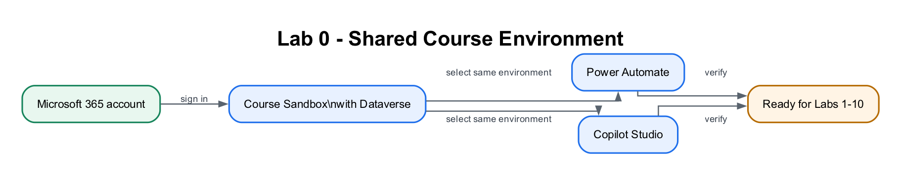

# Lab 0: Environment Setup — Create Your Copilot Studio & Power Automate Accounts

## Lab Title
Environment Setup — Create Your Microsoft 365, Power Automate, and Copilot Studio Accounts

## Lab Objectives
By the end of this lab, you will be able to:
1. Obtain a Microsoft 365 **work or school** account that can use the Power Platform
2. Create a dedicated Power Platform **Sandbox environment** (with Dataverse) for this course
3. Sign in to Power Automate and Copilot Studio and point **both** at the same environment
4. Confirm Outlook and Excel (OneDrive) are available for the later labs
5. Run a verification checklist so you start Lab 1 with zero surprises
6. Understand the difference between a work/school account and a personal account

## Prerequisites
- A web browser (Microsoft Edge or Google Chrome recommended)
- A mobile phone (used once for security verification)
- A credit card *(only if you create a new Business trial in Option B — it is **not** charged during the free month)*
- About 30–40 minutes

> **Tip — Which account should I use?**
> - **Option A — You already have a Microsoft 365 work/school account** (e.g. `name@company.com` provided by your organization). Try this first — you may already have everything you need. Skip Option B and go straight to **Step 1**.
> - **Option B — You do NOT have a work/school account** (you only have a personal `@outlook.com` / `@gmail.com`). Power Automate and Copilot Studio require a *work or school* account, so you'll create one via a free **Microsoft 365 Business trial**. Do **Option B** first, then continue from Step 1.

> **⚠️ Warning — Why not the Microsoft 365 Developer Program?** As of 2024, Microsoft restricted the free Developer Program E5 sandbox to people with an active **Visual Studio Enterprise or Professional subscription**. If you sign up without one you'll see *"You don't currently qualify for a Microsoft 365 Developer Program sandbox subscription."* — so we **do not** use that path in this course. Use **Option B** instead.

## Workflow Visual

The same work or school account and Course Sandbox environment connect every
Power Automate flow and Copilot Studio agent used later.

## Packaged Flow

No flow package applies to Lab 0 because this lab creates and verifies the
environment before any flow exists. The first importable flow is supplied in
Lab 1.

## Scenario
You have joined **ACME Pte Ltd's Digital Operations project team** as a junior
automation specialist. The production tenant contains customer and employee
data, so the project manager will not allow experiments there. Your first task
is to prepare a controlled **Course Sandbox** where flows, connectors, agent
knowledge and test records can be built safely.

| Workplace detail | Lab interpretation |
|---|---|
| Your role | Junior automation specialist |
| Stakeholders | Power Platform administrator, customer-operations manager and IT security |
| Operational risk | A learner accidentally sends test emails or writes data into a production system |
| Success measure | Power Automate and Copilot Studio use the same sandbox environment and all required connections can be verified |

**Real-world extension:** An organisation would also apply environment roles,
Data Loss Prevention policies, service accounts, naming standards and a
development → test → production deployment process.

---

## Step-by-Step Guide

### Option B (only if you have no work/school account): Create a free Microsoft 365 Business trial (~15 minutes)

This creates a brand-new *work* account such as `admin@yourname.onmicrosoft.com` with Microsoft 365 (Outlook, Excel, OneDrive, SharePoint) — exactly what Power Automate and Copilot Studio need. Skip this entirely if you already have a work/school account.

1. Open a browser and go to **<a href="https://www.microsoft.com/microsoft-365/business" target="_blank" rel="noopener">https://www.microsoft.com/microsoft-365/business</a>** (or search "Microsoft 365 Business Standard free trial").
2. Choose **Microsoft 365 Business Standard** and select **Try free for 1 month**.
3. Enter an email address to start. When prompted, choose **Set up account** / **Create a new account**.
4. Fill in your details (name, business name — you may use your own name, country, phone for verification).
5. Create your **sign-in details**: a username and a domain, giving you something like `admin@yourname.onmicrosoft.com`. **Write these down** — this is the account you'll use for the entire course.
6. Verify with the code sent to your phone.
7. Add a **payment method** (credit card). You are **not charged during the 1-month free trial**.
8. Wait 1–2 minutes for provisioning. You now have a Microsoft 365 work tenant.

> **Tip:** In a classroom, your trainer may provide a ready-made account. Ask before creating a trial so you don't duplicate accounts.

> **⚠️ Warning — Avoid surprise charges.** If you don't intend to keep the trial, set a calendar reminder and cancel **before the renewal date** in the **Microsoft 365 admin center → Billing → Your products**.

---

### Step 1: Sign in to the Microsoft 365 portal (~5 minutes)

1. Go to **<a href="https://www.office.com" target="_blank" rel="noopener">https://www.office.com</a>** (or **<a href="https://m365.cloud.microsoft" target="_blank" rel="noopener">https://m365.cloud.microsoft</a>**).
2. Select **Sign in** and enter your **work/school account** (Option A) or your new **Business trial account** (Option B), then your password.
3. If this is your first sign-in, you may be asked to set up multi-factor authentication (MFA). Follow the prompts using your mobile phone.
4. Once signed in, you should see the Microsoft 365 home page with app tiles (Outlook, Word, Excel, etc.).
5. Open **Outlook** (click the Outlook tile) and send yourself a quick test email to confirm it works — you'll rely on Outlook in Lab 1.
6. Open **Excel** and create a blank workbook to confirm it saves to **OneDrive** — you'll rely on this in Lab 2. You can discard the test workbook afterwards.

> **⚠️ Warning — No Outlook/Excel tiles?** Your account may not have a Microsoft 365 license. The *Send an email* action in Lab 1 fails with **"Unauthorized"** when the account has **no mailbox**. Ask your IT administrator to assign a license, or use the Business trial account from Option B (which always has a mailbox).

---

### Step 2: Create your "Course Sandbox" environment (~7 minutes)

An **environment** is a container that holds your flows, agents, and data. For this course we'll create a dedicated **Sandbox** environment with **Dataverse** turned on, so the Day 1 Copilot Studio agents and later HTTP labs have the required services.

1. Open a new tab and go to the **Power Platform admin center**: **<a href="https://admin.powerplatform.microsoft.com" target="_blank" rel="noopener">https://admin.powerplatform.microsoft.com</a>**.
2. Sign in with the **same account** from Step 1.
3. In the left menu, select **Manage → Environments**.
4. Select **+ New** (top of the page).
5. Fill in the **New environment** panel:
   - **Name:** `Course Sandbox`
   - **Type:** **Sandbox**
   - **Region:** your nearest region (e.g. Asia, Singapore)
   - **Add a Dataverse data store:** **Yes**  ← important
6. Select **Next**, accept the defaults (language English, currency your local currency) and set **Security group** to **None** (the field is required — *None* means open access), then select **Save**.
7. Wait 1–3 minutes. The environment appears in the list with status **Ready**. Refresh if needed.

> **Tip:** If your tenant blocks creating environments (some organizations restrict this), use the existing **default** environment instead — just remember to select that *same* environment in both Power Automate and Copilot Studio in the next steps.

---

### Step 3: Sign in to Power Automate and select the environment (~5 minutes)

Power Automate is where you build the automated workflows (called **flows**).

1. Open a new tab and go to **<a href="https://make.powerautomate.com" target="_blank" rel="noopener">https://make.powerautomate.com</a>**.
2. Sign in with the **same account**.
3. The first time, you may be asked to **select your country/region** — choose the correct one and select **Get started**.
4. You'll see the Power Automate home page with a left-hand menu: **Home, Create, Templates, Learn, My flows**, plus pinned items such as **Approvals** and a **More** menu (items like **Connections** live under **More**).
5. Look at the **top-right corner** — there is an **Environment selector**. Click it and choose **Course Sandbox** (the one you created in Step 2). All your flows will be built here.
6. Select **My flows** in the left menu — it will be empty for now. That's expected.

> **⚠️ Warning:** The environment selector is the single most common source of "where did my flow go?" confusion. If you build a flow in the wrong environment, it simply won't appear when you switch. Always confirm **Course Sandbox** is showing top-right before you build.

> **Tip — Free Power Automate:** A Power Automate use-rights plan is included with most Microsoft 365 licenses, which is enough for this course. If prompted, you can also start a **free 90-day trial** of Power Automate Premium.

---

### Step 4: Sign in to Copilot Studio and match the same environment (~5 minutes)

Copilot Studio is where you build the AI **agents** (used on Day 2).

1. Open a new tab and go to **<a href="https://copilotstudio.microsoft.com" target="_blank" rel="noopener">https://copilotstudio.microsoft.com</a>**.
2. Sign in with the **same account** again.
3. If prompted, select your **country/region** and select **Start free trial** (or **Try free**). This activates a **30-day Copilot Studio trial** at no cost (when it expires you can extend it once by another 30 days).
4. Wait for the workspace to load. In the new experience, the Copilot Studio
   home page shows **Agent** and **Workflow** creation choices.
5. If the classic home page opens, select **Try it now** or turn on
   **New experience** before continuing with the course labs.
6. Look at the **Environment selector** in the **top menu** and choose
   **Course Sandbox** — the **same** environment you selected in Power
   Automate.
7. Do **not** create an agent yet — you'll do that in a later lab. For now, just confirm the page loads in the correct environment.

> **⚠️ Warning — Both tools MUST use the same environment.** Your agents
> (Copilot Studio) and your flows (Power Automate) can only call each other when
> they live in the **same** environment. If Power Automate shows *Course
> Sandbox* but Copilot Studio shows *Default* (or vice-versa), they cannot
> connect. Use the environment selector in each product's top menu and choose
> **Course Sandbox**.

---

### Step 5: Verify your full setup (~5 minutes)

Run this quick checklist. Each item should already be true if the steps above succeeded.

| # | Check | Where |
|---|-------|-------|
| 1 | I can sign in and see app tiles | <a href="https://office.com" target="_blank" rel="noopener">https://office.com</a> |
| 2 | I can open Outlook and send myself an email | Outlook |
| 3 | I can open Excel and it saves to OneDrive | Excel / OneDrive |
| 4 | My **Course Sandbox** environment shows status **Ready** | <a href="https://admin.powerplatform.microsoft.com" target="_blank" rel="noopener">https://admin.powerplatform.microsoft.com</a> |
| 5 | Power Automate home page loads and **Course Sandbox** is selected | <a href="https://make.powerautomate.com" target="_blank" rel="noopener">https://make.powerautomate.com</a> |
| 6 | Copilot Studio loads, my trial is active, and **Course Sandbox** is selected | <a href="https://copilotstudio.microsoft.com" target="_blank" rel="noopener">https://copilotstudio.microsoft.com</a> |
| 7 | Power Automate and Copilot Studio show the **same** environment | Environment selector in each product's top menu |

If all seven are checked, your environment is ready.

---

## Checkpoint
> **Workplace evidence:** Capture the environment selectors in Power Automate and Copilot Studio plus the green connection status. In a real project, these screenshots form part of the deployment-readiness record.

You should now have:
- ✅ A working Microsoft 365 **work/school** account (Option A or B)
- ✅ A Power Platform **Sandbox** environment named **Course Sandbox** with **Dataverse = Yes**, status **Ready**
- ✅ Power Automate open with **Course Sandbox** selected top-right
- ✅ Copilot Studio open (trial active) with **Course Sandbox** selected top-right
- ✅ Outlook and Excel (OneDrive) confirmed working

## Troubleshooting

| Problem | Solution |
|---------|----------|
| "You can't sign in here with a personal account" | Power Platform needs a *work/school* account. Use **Option B** to create one via the Business trial. |
| "You don't currently qualify for a Microsoft 365 Developer Program sandbox subscription" | The Developer Program now requires a Visual Studio subscription. Use **Option B** (Business trial) instead. |
| **+ New** environment button is greyed out / missing | Your tenant restricts environment creation. Ask an admin, or use the **Default** environment and select it in both tools. |
| Environment created but stuck on **Preparing** | Wait 2–3 minutes and refresh the Environments list; provisioning Dataverse takes a moment. |
| Power Automate says "no environment" | Refresh, re-select your region, then pick **Course Sandbox** in the environment selector. |
| Copilot Studio "Start free trial" button missing | You may already have a license — just proceed. Otherwise sign out and back in. |
| Different environment shows in each tool | Click the environment selector (top-right) in **both** tools and choose **Course Sandbox**. |
| No Outlook/Excel tiles | Your account lacks a Microsoft 365 license (and possibly a mailbox) — ask IT or use the Business trial account (Option B). |

## Key Takeaways
- Power Automate and Copilot Studio both need a **work/school** account — personal accounts won't work.
- The **Microsoft 365 Developer Program** is no longer a free path; use a **Business trial** if you need an account.
- An **environment** is the container for your work; this course uses one named **Course Sandbox** (Sandbox type, Dataverse = Yes).
- The **#1 setup mistake** is having the two tools on **different environments** — always verify the environment selector matches in both.

## Duration
~30–40 minutes

## Next Steps
Read [Module 1: Workflow Automation Concepts](../Module%201%20-%20Workflow%20Automation%20Concepts.md) and [Module 2: Power Automate Cloud Flows](../Module%202%20-%20Introduction%20to%20Power%20Automate.md), then proceed to [Lab 1 — Form to Email Confirmation](../Lab%201%20-%20Forms%20Email%20Confirmation/index.md).
