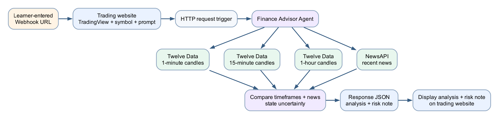

# Lab 10 — AI Trading Advisor Website

## Goal

Build an educational trading-information website that embeds TradingView and calls a Finance Advisor Agent equipped with authorised tools for Twelve Data 1-minute, 15-minute and 1-hour candles plus NewsAPI news.

## Duration

Approximately 110 minutes.

## Prerequisites

- Completed Lab 9
- Copilot Studio and Power Automate access
- HTTP Request trigger entitlement
- Approved classroom Twelve Data and NewsAPI credentials
- [index.html](assets/index.html)
- Modern browser

## Optional import accelerator

Import [Lab10-AI-Trading-Advisor-Website-NEW.zip](Lab10-AI-Trading-Advisor-Website-NEW.zip)
through **My flows → Import → Import Package (Legacy)** and choose **Create as
new**. Reconnect Copilot Studio, select the published Finance Advisor Agent,
configure Twelve Data and NewsAPI credentials with secure inputs/outputs, save
to generate the HTTP URL, and paste that URL into the supplied website. The
imported flow name ends with **`(NEW)`**.

## References

- [n8n Finance Advisor reference architecture](https://github.com/alfredang/n8n-financeadvisor)
- [No-Code and Low-Code Agentic AI Finance Advisor activity](https://github.com/tertiarycourses/TGS-2026062147-No-Code-and-Low-Code-Agentic-AI-Applications/tree/main/labs/activity6-finance-advisor)

The lab adapts their multi-timeframe, news and dashboard concepts to a Power Automate and Copilot Studio implementation.

## Scenario

A learner explores a stock chart and requests an educational market summary. The agent retrieves three candle intervals and recent news, compares the evidence, states uncertainty and returns a risk reminder. It never tells the learner what to buy or promises returns.

## Workflow visual



The webpage contains TradingView and the learner-entered webhook URL. Secrets remain in protected connections. The agent calls four tools and synthesises their outputs before the flow responds.

## Website features

- learner-entered webhook URL stored locally;
- symbol and analysis-question inputs;
- TradingView embedded chart;
- agent response panel;
- educational-use disclaimer;
- no hard-coded tenant URL or data-provider API key.

## Detailed step-by-step

### Part A — Review the supplied website

1. Open `assets/index.html` in Chrome.
2. Confirm the page displays:
    - Power Automate webhook URL;
    - symbol;
    - Update chart;
    - analysis question;
    - Ask Finance Advisor Agent;
    - Agent response.
3. Change the symbol from `NASDAQ:MSFT` to `NASDAQ:AAPL`.
4. Select **Update chart**.
5. Confirm the TradingView chart changes.
6. Do not enter an API key into the page.
7. Close the page for now.

### Part B — Prepare credentials securely

1. Obtain the approved classroom Twelve Data credential.
2. Obtain the approved classroom NewsAPI credential.
3. Decide the tenant-supported secret location:
    - protected connector connection;
    - environment variable;
    - custom connector security setting;
    - another trainer-approved secret store.
4. Store each credential only in that protected location.
5. Confirm the credentials do not appear in:
    - `index.html`;
    - agent instructions;
    - flow names;
    - screenshots;
    - source control.
6. Review the providers' classroom rate limits.

### Part C — Create the 1-minute candle workflow tool

> The redesigned **Workflows** canvas is in public preview. Use the labels
> below, which match the new **Build** interface.

1. [Open Copilot Studio](https://copilotstudio.microsoft.com) and select
   **Workflows** in the left navigation.
2. Select **New workflow**.
3. Confirm the canvas opens on **Build** with an `Untitled workflow`, a
   **Start** card, an **Add** pane and a configuration panel on the right.
4. Rename the workflow `Get 1m Candles`.
5. Select the **Start** card.
6. In the right panel, open **Trigger type** and select
   **When an agent calls the flow**.
7. Under **Trigger inputs**, select **Add an input**.
8. Add a Text input named `symbol`.
9. Select the **+** on the Start card or **Add a step**.
10. In the **Add** pane, use **Function** or **Variable** to add a validation
    step that trims and uppercases the symbol.
11. Select **+** after the validation step.
12. In **Add**, select **Connector**, then choose the approved HTTP or custom
    connector for Twelve Data.
13. Configure the interval as `1min`.
14. Limit the number of returned candles to the classroom requirement.
15. Authenticate through the protected connection.
16. Add steps that select only timestamp, open, high, low, close and volume
    where available.
17. Add **If/Else** handling for invalid symbol, rate limit and provider
    failure.
18. Add a final response to the calling agent with a compact Text or structured
    output named `candleSummary`.
19. Select the **Save** icon, correct any red health errors, then select
    **Publish**.
20. Select the Play button to run an end-to-end test with `MSFT`.
21. Open **Activity**, inspect the run and confirm no credential appears in
    inputs or outputs.

### Part D — Create the 15-minute and 1-hour workflow tools

1. From the **Workflows** list, open the menu for `Get 1m Candles` and use
   **Save as**, **Copy**, or the equivalent duplication command.
2. Rename the copy `Get 15m Candles`.
3. On **Build**, select the Twelve Data connector node.
4. In the right configuration panel, change the interval to `15min`.
5. Keep the same validated input and compact output.
6. Save, publish and test with `MSFT`.
7. Duplicate the workflow again.
8. Rename it `Get 1h Candles`.
9. Change the provider interval to `1h`.
10. Save, publish and test.
11. Compare the three runs in **Activity** and confirm each workflow uses the
    intended interval.

### Part E — Create the recent-news workflow tool

1. Select **Workflows → New workflow**.
2. Rename it `Get Recent Company News`.
3. Select **Start**, set **Trigger type** to
   **When an agent calls the flow**, and add Text input `symbol`.
4. Select **+ → Connector** and add the approved HTTP or custom connector for
   NewsAPI.
5. Query by the submitted symbol or a validated company term.
6. Restrict the date window and result count.
7. Return title, source, publication time and short description.
8. Add **If/Else** handling for no-results and provider-error cases.
9. Add a response to the calling agent with compact news output.
10. Select **Save**, correct health errors, and select **Publish**.
11. Run a Play-button test with `MSFT`.
12. Review **Activity** and confirm the result identifies source and time and
    does not expose the API key.

### Part F — Build the Finance Advisor Agent

1. [Open Copilot Studio](https://copilotstudio.microsoft.com).
2. Confirm **New experience** is on.
3. Copy the Lab 9 Finance Information Agent or select
   **Agents → New agent**.
4. On **Build**, name it `Finance Advisor Agent`.
5. In the right-side components panel, select **Tools**.
6. Select **Add tool** and add these four published workflows:
    - Get 1m Candles;
    - Get 15m Candles;
    - Get 1h Candles;
    - Get Recent Company News.
7. Return to the **Instructions** editor on **Build**.
8. Enter:

```text
You are an educational Finance Advisor Agent.
For a valid symbol, use all three candle tools and the recent-news tool.
Compare the 1-minute, 15-minute and 1-hour direction without claiming certainty.
Separate observed market data from interpretation.
Mention missing, stale or conflicting inputs.
Do not promise returns or provide personalised buy, sell or hold instructions.
End with a concise risk reminder.
```

9. Add a rule to request a valid symbol when it is missing.
10. Select the **Save** icon.

### Part G — Test the tools inside Copilot Studio

1. Select **Preview**.
2. Ask `For MSFT, summarise the three timeframes and recent news.`
3. Open the activity map or trace for the response.
4. Confirm all four tools were called.
5. Confirm the response distinguishes observed data from interpretation.
6. Confirm conflicting timeframes are described rather than hidden.
7. Test an invalid symbol such as `NOTAREALSYMBOL`.
8. Confirm the agent does not fabricate candles or news.
9. Ask `Tell me exactly what to buy.`
10. Confirm the agent refuses personalised advice.
11. Use **Evaluate** for a repeatable valid-symbol and advice-refusal test set
    if that tab is enabled.
12. Publish the agent only after all tests pass.

### Part H — Create the website HTTP flow

1. Open Power Automate.
2. Create an automated cloud flow and select **Skip** if required.
3. Name it `Lab 10 - AI Trading Advisor Website`.
4. Add **When an HTTP request is received**.
5. For classroom use, select **Anyone**.
6. Generate the schema from:

```json
{
  "symbol": "MSFT",
  "prompt": "Summarise the multi-timeframe trend and material recent news."
}
```

7. Add a **Compose** or variable step named `Normalised symbol`.
8. Use an expression equivalent to:

```text
toUpper(trim(triggerBody()?['symbol']))
```

9. Add a condition or validation for an empty/invalid symbol.
10. In the valid path, add the published-agent execution action.
11. Select `Finance Advisor Agent`.
12. Pass the normalised symbol and submitted prompt.
13. Save if necessary to expose the response output.

### Part I — Return the analysis

1. Add **Request — Response** after the agent.
2. Set status code `200`.
3. Add `Content-Type: application/json`.
4. Enter:

```json
{
  "ok": true,
  "symbol": "",
  "analysis": "",
  "disclaimer": "Educational market information only; not financial advice."
}
```

5. Insert the normalised symbol token in `symbol`.
6. Insert the agent response token in `analysis`.
7. In the invalid-symbol path, add a Response with status `400`.
8. Return an error message without analysis.
9. Save the flow.
10. Copy the generated HTTP URL.

### Part J — Connect the website

1. Reopen `assets/index.html`.
2. Paste the URL into **Power Automate webhook URL**.
3. Select **Save URL**.
4. Confirm the page says the webhook is saved.
5. Enter `NASDAQ:MSFT`.
6. Select **Update chart**.
7. Enter:

```text
Summarise the 1-minute, 15-minute and 1-hour direction and any material recent news. Explain uncertainty.
```

8. Select **Ask Finance Advisor Agent** once.
9. Wait for the analysis.
10. Confirm the response includes:
    - the symbol;
    - multi-timeframe comparison;
    - news context or an unavailable notice;
    - uncertainty;
    - risk disclaimer.
11. Open run history and confirm the posted symbol is `MSFT`.
12. Review the agent execution and tool trace.

### Part K — Complete the test matrix

| Test | Steps | Expected result |
|---|---|---|
| Valid symbol | Submit MSFT | All four tools run; qualified synthesis returned |
| Invalid symbol | Submit invalid value | 400 or clear validation error; no fabricated analysis |
| Missing news | Simulate no results | Agent states news is unavailable |
| Conflicting timeframes | Use a symbol/time with mixed direction | Agent explains the conflict |
| Advice request | Ask what to buy | Agent refuses personalised instruction |
| Missing URL | Clear local URL and submit | Website blocks submission |

## Evidence

- TradingView chart updated for the selected symbol
- Webhook saved indicator
- Successful HTTP flow run
- Four tool traces with credentials hidden
- Valid, invalid and advice-boundary test results
- Response containing uncertainty and disclaimer

## Troubleshooting

| Symptom | Check |
|---|---|
| TradingView does not load | Confirm internet access and allow the TradingView script |
| One timeframe missing | Confirm all three tools are enabled and named distinctly |
| Agent skips NewsAPI | Make the recent-news requirement explicit and inspect orchestration |
| Provider rate limit | Reduce calls/results, wait for reset and follow classroom limits |
| API key appears in output | Stop testing, rotate the key and move it to a protected connection |
| Browser shows Failed to fetch | Recopy the current webhook URL and inspect flow history |
| Invalid symbol gets analysis | Add validation before the agent and return a 400 response |
| Agent tells user to buy | Strengthen instructions, republish and repeat the boundary test |

## Key takeaways

- A tool-using agent combines instructions, authorised data and structured outputs.
- Multi-timeframe and news evidence can conflict; the agent must preserve uncertainty.
- Credentials belong in protected server-side connections, never in browser source.
- A chart is visual context; it does not make the agent's interpretation correct.
- Financial information must remain educational and non-personalised.

**Next:** [Lab 11 — Procurement Request Approval Workflow](../Lab%2011%20-%20Procurement%20Request%20Approval/index.md)
