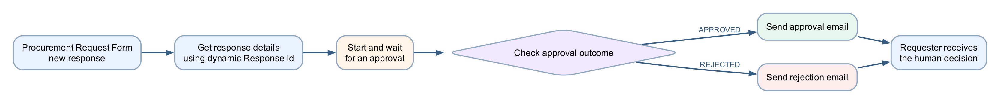

# Lab 11 — Procurement Request Approval Workflow

## Goal

Build a Microsoft Forms procurement-request workflow in the Copilot Studio
**Workflows** experience. The workflow retrieves the submitted form answers,
waits for a human approval decision, branches on the outcome and emails the
requester.

## Duration

Approximately 60 minutes.

## Status

Optional post-course extension. It is not part of the Version 6.0 two-day
timetable or WSQ assessment.

## Prerequisites

- Completed Labs 1 and 4
- Copilot Studio and Power Automate access in the same course environment
- Microsoft Forms, Approvals and Office 365 Outlook connections
- A mailbox-enabled classroom account
- A manager or trainer email address for approval testing

## Scenario

Staff currently send purchase requests by email, which makes requests difficult
to track and decisions inconsistent. In this lab, a staff member submits a
structured procurement request through Microsoft Forms. The workflow sends the
details to an authorised approver, waits for the decision and emails the
requester with the approved or rejected outcome.

The workflow automates routing and notification. A human remains responsible
for the procurement decision.

## Workflow visual



```text
Microsoft Forms submission
        ↓
Get response details
        ↓
Start and wait for an approval
        ↓
Check approval outcome
       ↙ ↘
 Approved  Rejected
    ↓         ↓
Send approval  Send rejection
email          email
```

## Supplied import accelerator

Import
[Lab11-Procurement-Request-Approval-NEW.zip](Lab11-Procurement-Request-Approval-NEW.zip)
through **Power Automate → My flows → Import → Import Package (Legacy)** and
choose **Create as new**. Reconnect Microsoft Forms, Approvals and Office 365
Outlook, select the classroom form and complete the answer mappings before
turning on the flow.

The imported flow name ends with **`(NEW)`**. The manual route below uses the
current Copilot Studio **Workflows → Build** canvas and matches the workflow
shown during class.

## Detailed step-by-step

### Part A — Create the procurement request form

1. Open [Microsoft Forms](https://forms.office.com).
2. Create a new form named `Procurement Request Form`.
3. Add these required questions:

| Question | Type |
|---|---|
| Requester name | Text |
| Requester email | Text |
| Item requested | Text |
| Quantity | Number |
| Estimated total cost (SGD) | Number |
| Business reason | Long text |

4. In **Settings**, restrict responses to the classroom organisation if that is
   the trainer-approved configuration.
5. Select **Collect responses** and submit one test response.
6. Open the **Responses** tab and confirm that the test response appears.

### Part B — Create the form-triggered workflow

1. Open [Copilot Studio](https://copilotstudio.microsoft.com).
2. Select the course environment.
3. Select **Workflows → New workflow**.
4. Confirm the designer opens on **Build** with a **Start** card and the
   **Add** pane.
5. Rename the workflow `Lab 11 - Procurement Request Approval Workflow`.
6. Select the **Start** card.
7. In the right configuration panel, select the Microsoft Forms trigger
   **When a new response is submitted**.
8. Select `Procurement Request Form` as the **Form Id**.
9. Select the **Save** icon.

> The workflow starts only when a new response is submitted after the trigger
> is saved and active. Existing responses do not create new runs.

### Part C — Retrieve the submitted answers

1. Select the **+** after the trigger.
2. In **Add**, select
   **Connector → Microsoft Forms → Get response details**.
3. For **Form Id**, select the same `Procurement Request Form`.
4. For **Response Id**, insert the dynamic **Response Id** from
   **When a new response is submitted**.
5. Save the workflow.

> Do not type a sample number into **Response Id**. It must be the dynamic value
> from the trigger so every run retrieves the matching submission.

### Part D — Start and wait for the approval

1. Select the **+** after **Get response details**.
2. In **Add**, select
   **Human review → Approvals → Start and wait for an approval**.
3. Configure:

| Field | Value |
|---|---|
| Approval type | Approve/Reject — First to respond |
| Title | `Procurement request: ` followed by **Item requested** |
| Assigned to | Trainer or authorised manager email |

4. Build the approval details using dynamic form answers:

```text
Requester: [Requester name]
Requester email: [Requester email]
Item: [Item requested]
Quantity: [Quantity]
Estimated total cost: SGD [Estimated total cost]
Business reason: [Business reason]
```

5. Keep notifications enabled.
6. Save the workflow.

The workflow pauses at this action until the approver selects **Approve** or
**Reject**, or until the approval expires or is cancelled.

### Part E — Check the approval outcome

1. Select the **+** after the approval action.
2. In **Add**, select **If/Else**.
3. Rename it `Check approval outcome`.
4. Configure the condition:

```text
Outcome is equal to Approve
```

5. Insert **Outcome** from **Start and wait for an approval** as dynamic
   content.
6. Confirm the action displays two outputs:
   - **Approved**;
   - **Rejected**.

### Part F — Send the approved email

1. On the **Approved** output, select **+**.
2. Select
   **Connector → Office 365 Outlook → Send an email (V2)**.
3. Configure:

```text
To: [Requester email]
Subject: Procurement request approved: [Item requested]

Hello [Requester name],

Your procurement request for [Quantity] × [Item requested] has been approved.

Approver comments: [Approval comments]
```

4. Insert the requester and item values from **Get response details**.
5. Insert the comments value from the approval action.

### Part G — Send the rejected email

1. On the **Rejected** output, select **+**.
2. Add **Office 365 Outlook → Send an email (V2)**.
3. Configure:

```text
To: [Requester email]
Subject: Procurement request not approved: [Item requested]

Hello [Requester name],

Your procurement request for [Quantity] × [Item requested] was not approved.

Approver comments: [Approval comments]
```

4. Insert dynamic content rather than typing field names as plain text.
5. Select **Save**, correct every health error and select **Publish**.

### Part H — Test the approved path

1. Submit a new form response:
   - Requester name: `Daniel`;
   - Requester email: your classroom mailbox;
   - Item: `Wireless mouse`;
   - Quantity: `10`;
   - Estimated total cost: `350`;
   - Business reason: `Equipment for new hires`.
2. Open **Activity** in the workflow.
3. Confirm one run reaches **Start and wait for an approval**.
4. Open the approval request and select **Approve**.
5. Enter a short approval comment.
6. Return to **Activity** and confirm the run completes through the Approved
   branch.
7. Confirm the approval email arrives at the requester address.

### Part I — Test the rejected path

1. Submit another new response with a different item.
2. Confirm a new workflow run and approval request are created.
3. Select **Reject** and enter a reason.
4. Confirm the run follows only the Rejected branch.
5. Confirm the rejection email contains the approver's comments.

### Part J — Review the complete trace

For both test runs, verify:

- the trigger and **Get response details** use the same Form Id;
- the dynamic Response Id belongs to that submission;
- only one approval is created per form response;
- the workflow remains waiting until the human responds;
- exactly one outcome branch runs;
- the requester receives the human decision, not a predicted decision;
- **Activity** shows the expected inputs, outputs and final status.

## Evidence

- Published procurement workflow on the Copilot Studio Build canvas
- One valid Microsoft Forms submission
- One approved run and approval email
- One rejected run and rejection email
- Run trace showing the matching Response Id
- Approval comments included in the appropriate notification

## Troubleshooting

| Symptom | Check |
|---|---|
| No workflow run appears | Submit a new response after publishing; verify the trigger uses the correct Form Id |
| Run remains Waiting | Open the Approvals hub or approval email and respond to the pending request |
| Get response details fails | Use the trigger's dynamic Response Id and the same Form Id in both Forms actions |
| Form answers are empty | Remap the email and approval fields from Get response details |
| Approval goes to the wrong person | Correct Assigned to and repeat with a new submission |
| Both emails appear incorrect | Confirm the If/Else compares Outcome with exactly `Approve` |
| Requester receives no email | Verify the submitted email, Outlook connection and run history |
| Approver comments are blank | Insert the comments output from Start and wait for an approval |

## Key takeaways

- A Forms trigger identifies a submission; **Get response details** retrieves
  its answers using the dynamic Response Id.
- **Start and wait for an approval** pauses the workflow for a real human
  decision.
- The If/Else step routes the approved and rejected outcomes deterministically.
- Notifications report the human outcome; the workflow does not make the
  procurement decision.
- Activity traces are the primary evidence for diagnosing trigger, mapping,
  approval and notification problems.
