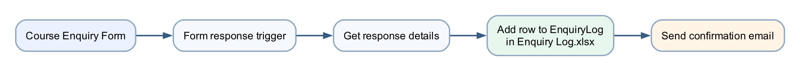

# Lab 2 — Log the Enquiry and Send Email

## Goal

Expand Lab 1 so every form submission is logged in `Enquiry Log.xlsx` before the confirmation email is sent.

## Duration

Approximately 45 minutes.

## Prerequisites

- Completed and tested Lab 1
- `Course Enquiry Form`
- [Enquiry Log.xlsx](assets/Enquiry%20Log.xlsx)
- OneDrive for Business or SharePoint access

## Optional import accelerator

Import [Lab2-Log-Enquiry-and-Send-Email-NEW.zip](Lab2-Log-Enquiry-and-Send-Email-NEW.zip)
through **My flows → Import → Import Package (Legacy)** and choose **Create as
new**. Reconnect Forms, Excel and Outlook; select the Course Enquiry Form,
`Enquiry Log.xlsx` and table `EnquiryLog`; then replace every
`MAP_*_AFTER_IMPORT` placeholder. The imported flow name ends with **`(NEW)`**.

## Scenario

The training team needs a shared enquiry register for follow-up and reporting. A confirmation should be sent only after Power Automate records the enquiry successfully.

## Workflow visual



Lab 2 reuses the Lab 1 trigger and email. The new Excel action is inserted between them.

## Workbook design

The supplied workbook contains table `EnquiryLog`:

| Timestamp | Name | Email | Tel | Message | Status | Source |
|---|---|---|---|---|---|---|

## Detailed step-by-step

### Part A — Upload and verify the workbook

1. Download or locate `Enquiry Log.xlsx` in this lab's `assets` folder.
2. Open OneDrive for Business or the course SharePoint document library.
3. Create a folder named `Power Automate Lab Data` if it does not exist.
4. Select **Upload → Files**.
5. Upload `Enquiry Log.xlsx`.
6. Open the uploaded workbook in Excel for the web.
7. Confirm the worksheet is named `Enquiries`.
8. Click any header cell.
9. Open **Table → Table Name** or the **Table Design** tab.
10. Confirm the table name is `EnquiryLog`.
11. Confirm all seven column headings are present.
12. Close the workbook tab.

### Part B — Copy the working Lab 1 flow

1. Open `https://make.powerautomate.com`.
2. Select **My flows**.
3. Find `Lab 1 - Form Email Confirmation`.
4. Select its **… More commands** menu.
5. Select **Save As**.
6. Enter `Lab 2 - Log Enquiry and Email`.
7. Select **Save**.
8. Open the copied flow.
9. Select **Edit**.
10. Confirm it still contains:
    - When a new response is submitted;
    - Get response details;
    - Send an email (V2).

### Part C — Insert Excel logging

1. Locate the connector line between **Get response details** and **Send an email (V2)**.
2. Select the **+** on that connector.
3. Select **Add an action**.
4. Search for `Add a row into a table`.
5. Choose **Excel Online (Business) — Add a row into a table**.
6. If prompted, sign in with the course Microsoft 365 account.
7. In **Location**, select the OneDrive or SharePoint location used in Part A.
8. If using SharePoint, choose the correct **Document Library**.
9. In **File**, browse to `Power Automate Lab Data/Enquiry Log.xlsx`.
10. In **Table**, select `EnquiryLog`.
11. Wait for the seven column fields to appear.

### Part D — Map the table columns

1. Click inside **Timestamp**.
2. Select the **Expression** or **fx** tab.
3. Enter:

```text
utcNow()
```

4. Select **Add** or **Update**.
5. Map **Name** to the form's **Name** token.
6. Map **Email** to the form's **Email** token.
7. Map **Tel** to the form's **Tel** token.
8. Map **Message** to the form's **Message** token.
9. In **Status**, enter `New`.
10. In **Source**, enter `Course Enquiry Form`.
11. Confirm every form answer comes from **Get response details**.
12. Confirm the Outlook action remains after Excel.
13. Open the Outlook action.
14. Update its body to include:

```text
Your enquiry has been logged and will be reviewed by our training team.
```

15. Select **Save**.

### Part E — Test two submissions

1. Open `Course Enquiry Form`.
2. Submit:
    - Name: `Aisha Lim`
    - Email: an address you can access
    - Tel: `62345678`
    - Message: `I would like the corporate course outline.`
3. Wait for the flow to complete.
4. Open its run history.
5. Confirm the Excel action completed before Outlook.
6. Open `Enquiry Log.xlsx` in Excel for the web.
7. Confirm a new row contains Aisha's complete details.
8. Confirm **Status** is `New`.
9. Confirm **Source** is `Course Enquiry Form`.
10. Confirm the email arrived.
11. Submit a second response with a different name and message.
12. Confirm a second row is appended and the first row remains unchanged.

## Checkpoint

- Two successful runs
- Two separate rows in `EnquiryLog`
- Two confirmation emails sent to the submitted addresses

## Troubleshooting

| Symptom | Check |
|---|---|
| Workbook not listed | It must be in OneDrive for Business or SharePoint, not only on the local computer |
| Table not listed | Select named table `EnquiryLog`; loose worksheet cells are not a table |
| Columns do not appear | Re-select the file and table, then wait for metadata to load |
| File locked | Close desktop Excel and retry |
| Wrong time format | `utcNow()` records UTC; apply workbook display formatting if required |
| Email sent but no row | Ensure Excel is before Outlook and inspect the Excel action's error |

## Key takeaways

- Lab 2 extends a verified flow rather than rebuilding it.
- A named Excel table provides a basic audit trail.
- Action order determines whether email is sent after successful logging.
- Test with multiple records to verify rows append correctly.

**Next:** [Lab 3 — Event Registration Branching](../Lab%203%20-%20Event%20Registration%20Branching/index.md)
