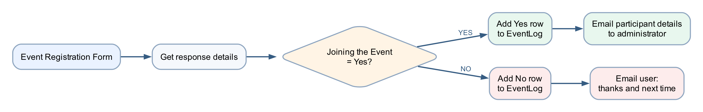

# Lab 3 — Event Registration Branching

## Goal

Use a Microsoft Forms choice and a Power Automate condition to log and notify people differently depending on whether they will join an event.

## Duration

Approximately 70 minutes.

## Prerequisites

- Microsoft Forms, Excel Online, Outlook and Power Automate access
- [Event Log.xlsx](assets/Event%20Log.xlsx)
- An administrator mailbox: `training1@tertiaryinfotech.onmicrosoft.com`

## Optional import accelerator

Import [Lab3-Event-Registration-Branching-NEW.zip](Lab3-Event-Registration-Branching-NEW.zip)
through **My flows → Import → Import Package (Legacy)** and choose **Create as
new**. Reconnect Forms, Excel and Outlook; select the Event Registration Form,
`Event Log.xlsx` and table `EventLog`; then map the four form answers and the
Yes/No condition. The imported flow name ends with **`(NEW)`**.

## Scenario

The events team needs participant details when a person is joining. When a person declines, the system should thank them and invite them to a future event. Both decisions must be logged.

## Workflow visual



The condition has two independent paths. Both paths write an audit row before sending their notification.

## Detailed step-by-step

### Part A — Create the event form

1. Open Microsoft Forms.
2. Select **New Form**.
3. Name it `Event Registration Form`.
4. Add a **Text** question named `Name`; turn **Required** on.
5. Add a **Text** question named `Email`; turn **Required** on.
6. Add a **Text** question named `Tel`; turn **Required** on.
7. Add a **Choice** question named `Joining the Event?`.
8. Set the first option to `Yes`.
9. Set the second option to `No`.
10. Remove any additional blank option.
11. Turn **Required** on.
12. Select **Preview** and confirm only Yes or No can be selected.

### Part B — Upload Event Log.xlsx

1. Open OneDrive for Business or the course SharePoint library.
2. Open `Power Automate Lab Data`.
3. Upload `Event Log.xlsx`.
4. Open it in Excel for the web.
5. Confirm the worksheet is `Registrations`.
6. Confirm the named table is `EventLog`.
7. Confirm the columns are Timestamp, Name, Email, Tel, JoiningEvent, NotificationSent and Notes.
8. Close the workbook.

### Part C — Create the flow and condition

1. Open Power Automate.
2. Select **Create → Automated cloud flow**.
3. Name it `Lab 3 - Event Registration Branching`.
4. Select **Microsoft Forms — When a new response is submitted**.
5. Select **Create**.
6. Set **Form Id** to `Event Registration Form`.
7. Add **Microsoft Forms — Get response details**.
8. Set the same Form Id.
9. Set **Response Id** to the trigger's Response Id token.
10. Select **+ → Add an action**.
11. Search for `Condition`.
12. Select **Control — Condition**.
13. In the left condition field, insert **Joining the Event?** from Get response details.
14. Set the operator to **is equal to**.
15. In the right field, enter `Yes`.
16. Confirm Power Automate displays **If yes** and **If no** branches.

### Part D — Configure the Yes branch

1. Under **If yes**, select **Add an action**.
2. Add **Excel Online (Business) — Add a row into a table**.
3. Select the workbook location and `Event Log.xlsx`.
4. Select table `EventLog`.
5. Map:
    - Timestamp: expression `utcNow()`
    - Name: form Name
    - Email: form Email
    - Tel: form Tel
    - JoiningEvent: `Yes`
    - NotificationSent: `Admin`
    - Notes: `Participant details sent to administrator`
6. Below Excel, add **Office 365 Outlook — Send an email (V2)**.
7. In **To**, enter `training1@tertiaryinfotech.onmicrosoft.com`.
8. In **Subject**, enter `New event participant - ` and insert the Name token.
9. In **Body**, add labels and tokens for Name, Email, Tel and Joining the Event.
10. Confirm the email contains no fixed sample participant details.

### Part E — Configure the No branch

1. Under **If no**, select **Add an action**.
2. Add **Excel Online (Business) — Add a row into a table**.
3. Select `Event Log.xlsx` and table `EventLog`.
4. Map the common form fields.
5. Enter:
    - JoiningEvent: `No`
    - NotificationSent: `User`
    - Notes: `Next-event message sent`
6. Below Excel, add **Send an email (V2)**.
7. Set **To** to the submitted **Email** token.
8. Set **Subject** to `Thank you for your response`.
9. Build the body:

```text
Hello [Name],

Thank you for letting us know. We are sorry you cannot join this event and look
forward to welcoming you next time.
```

10. Replace `[Name]` with the Name dynamic-content token.
11. Select **Save**.

### Part F — Test both branches

1. Submit the form with Name `Daniel Wong` and **Joining the Event? = Yes**.
2. Open the newest flow run.
3. Confirm **If yes** ran and **If no** was skipped.
4. Confirm EventLog contains a Yes row.
5. Confirm the administrator email contains Daniel's details.
6. Submit again with Name `Mei Chen` and **Joining the Event? = No**.
7. Confirm **If no** ran and **If yes** was skipped.
8. Confirm EventLog contains a No row.
9. Confirm Mei received the next-event email.
10. Compare the two rows and verify NotificationSent differs.

## Checkpoint

| Test | Expected Excel result | Expected email |
|---|---|---|
| Yes | JoiningEvent = Yes; NotificationSent = Admin | Participant details to administrator |
| No | JoiningEvent = No; NotificationSent = User | Thanks and next-time message to user |

## Troubleshooting

| Symptom | Check |
|---|---|
| Every response goes to No | Compare against exact value `Yes`; remove spaces or punctuation |
| Both emails sent | Ensure each email is inside the correct condition branch |
| Wrong recipient | Yes uses the administrator address; No uses the submitted Email token |
| Excel row incomplete | Map fields from Get response details, not from the trigger |
| Only one branch tested | Submit two separate responses with opposite choices |

## Key takeaways

- A condition creates mutually exclusive execution paths.
- Both business outcomes must be logged and tested.
- The branch controls the recipient, wording and audit values.

**Next:** [Lab 4 — Leave Application Approval](../Lab%204%20-%20Leave%20Approval/index.md)
