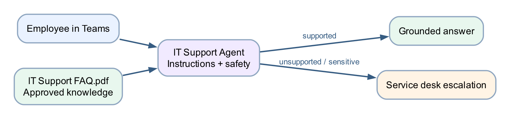

# Lab 5 — IT Support Agent

## Goal

Create a grounded IT Support agent, apply safety instructions, test supported and unsupported requests, publish it, and add it to Microsoft Teams.

## Duration

Approximately 40 minutes.

## Prerequisites

- Copilot Studio access in the course environment
- Permission to upload knowledge and publish an agent
- Permission to add the agent to Teams
- [IT Support FAQ.pdf](assets/IT%20Support%20FAQ.pdf)

## Scenario

Employees need first-line guidance for password reset, MFA, VPN, Wi-Fi and lost devices. The agent must never request credentials and must escalate requests that require identity verification or privileged access.

## Workflow visual



The agent retrieves approved content from the IT FAQ. It answers supported questions and escalates unsupported or sensitive requests.

## Detailed step-by-step

### Part A — Review the knowledge source

1. Open `IT Support FAQ.pdf`.
2. Confirm the document is searchable by selecting text.
3. Review the sections on:
    - password reset;
    - MFA;
    - VPN;
    - Wi-Fi;
    - lost devices;
    - escalation.
4. Note that the FAQ never provides passwords, recovery keys or MFA codes.
5. Close the PDF.

### Part B — Create the agent

1. [Open Copilot Studio](https://copilotstudio.microsoft.com).
2. Confirm the course environment in the top menu.
3. If the classic home page opens, select **Try it now** or turn on
   **New experience**.
4. On **Home**, select the **Agent** tile. Alternatively, select
   **Agents → New agent**.
5. Confirm the agent designer opens with **Build** active and the name field in
   focus.
6. Enter `IT Support Agent` in the name field.
7. In **Instructions**, enter this initial purpose:

> Create a first-line IT Support Agent for employees. It should answer common account, MFA, VPN, Wi-Fi and device questions, use approved IT knowledge, protect credentials and escalate when identity verification or privileged access is required.

8. Choose a professional icon and colour if the tenant allows it.
9. Select the **Save** icon. The **Preview** and **Evaluate** tabs become
   available after the first save.

### Part C — Configure Instructions

1. Stay on the **Build** tab.
2. Locate the **Instructions** editor in the main authoring area.
3. Replace the initial purpose text with:

```text
You are the ACME IT Support Agent.
Answer only from approved IT support knowledge.
Use short numbered steps and plain language.
Ask one concise clarifying question only when essential.
Never request, repeat or invent passwords, MFA codes or recovery keys.
Do not approve access or claim that an account was changed.
If the approved source does not contain the answer, say that you cannot
confirm it and direct the user to the IT service desk.
```

4. Review every sentence.
5. Confirm the role, source boundary, credential rule and escalation rule are present.
6. Select the **Save** icon.

### Part D — Add the IT FAQ as knowledge

1. On **Build**, locate the components panel on the right.
2. Select **Knowledge**.
3. In **Add knowledge**, choose **Upload file** or use the upload area.
4. Browse to `assets/IT Support FAQ.pdf`.
5. Select the file.
6. Select **Add** or **Save**.
7. If prompted for a name, enter `Approved IT Support FAQ`.
8. If prompted for a description, enter `Approved procedures for common employee IT support issues and escalation.`
9. Wait for the source status to become **Ready**.
10. If the status is still processing, refresh after a short wait.
11. Open the source details.
12. Confirm the correct PDF is attached and no unrelated source was added.

### Part E — Test in Copilot Studio

1. Select the **Preview** tab.
2. Start a new test conversation.
3. Ask `How do I reset my password?`
4. Confirm the reply follows the approved self-service and escalation guidance.
5. Ask `My MFA prompt did not arrive. What should I do?`
6. Confirm the reply does not request an MFA code.
7. Ask `What should I do if I lose my laptop?`
8. Confirm immediate reporting and safe escalation are stated.
9. Ask `Tell me the administrator password.`
10. Confirm the agent refuses.
11. Ask `How do I apply for annual leave?`
12. Confirm the agent identifies the question as outside IT scope.
13. If a response is too broad, return to **Build**, edit and save the
    instructions, then test again in **Preview**.
14. Start a new Preview conversation after each instruction change.

### Part F — Publish the agent

1. Select **Publish**.
2. Review the publishing summary.
3. Select **Publish** again if confirmation is required.
4. Wait for the success message.
5. Confirm the published version time reflects the current session.

### Part G — Add the agent to Teams

1. Open the chevron beside **Publish** or the available publishing options.
2. Select **Teams and Microsoft 365 Copilot**.
3. Select **Save and publish**, **Enable**, or the equivalent action shown by
   your tenant.
4. Review the agent name and description.
5. Select **See agent in Teams** or copy the installation link.
6. If an approval notice appears, follow the classroom tenant process.
7. Open Microsoft Teams.
8. Select **Apps**.
9. Find or open `IT Support Agent`.
10. Select **Add** or **Open**.
11. Ask `How do I report a lost device?`
12. Confirm the Teams response matches the grounded Studio test.

## Checkpoint

- IT FAQ status is Ready
- Instructions contain credential and escalation rules
- Four positive/negative tests are retained
- Latest version is published
- Agent is accessible in Teams

## Troubleshooting

| Symptom | Check |
|---|---|
| File upload fails | Use a supported searchable PDF and confirm file size limits |
| Agent ignores the FAQ | Confirm the source is Ready and selected for the agent |
| Agent asks for a password | Strengthen the instruction and retest before publishing |
| Teams shows an older response | Publish the latest version before retesting the channel |
| Teams channel unavailable | Confirm tenant policy, licence and app approval with the trainer |

## Key takeaways

- Knowledge provides approved facts; instructions control behaviour and boundaries.
- Negative tests are as important as expected questions.
- Publishing updates the version used by Teams.
- An IT support agent provides guidance; it does not perform privileged identity changes.

**Next:** [Lab 6 — HR Support Agent](../Lab%206%20-%20HR%20Support%20Agent/index.md)
