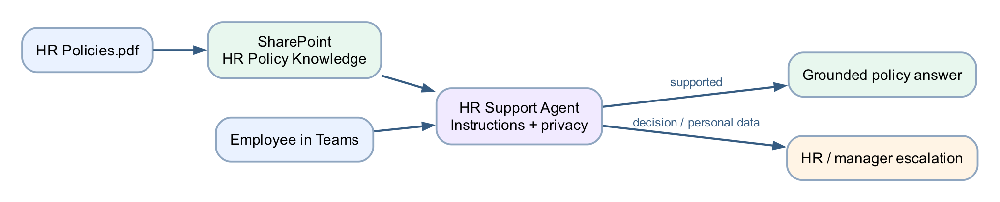

# Lab 6 — HR Support Agent

## Goal

Upload a training HR policy to SharePoint, ground an HR Support agent in that SharePoint source, apply privacy boundaries, publish it and deploy it to Teams.

## Duration

Approximately 40 minutes.

## Prerequisites

- Copilot Studio and SharePoint access
- Permission to create or use a SharePoint library folder
- Permission to publish to Teams
- [HR Policies.pdf](assets/HR%20Policies.pdf)

## Scenario

Employees need consistent explanations of leave, working arrangements and expense processes. The source should remain centrally maintained in SharePoint. The agent must not expose employee data or make HR decisions.

## Workflow visual



The policy file is uploaded to SharePoint, added as the agent's knowledge, and used to answer Teams users. Decisions and personal-data requests are escalated.

## Detailed step-by-step

### Part A — Review the policy resource

1. Open `HR Policies.pdf`.
2. Confirm it is a fictional classroom policy.
3. Review the leave, working arrangements, expenses, privacy and escalation sections.
4. Confirm no real employee data is present.
5. Close the PDF.

### Part B — Prepare SharePoint

1. Open the course SharePoint site.
2. Select **Documents** or the approved document library.
3. Select **New → Folder**.
4. Name the folder `HR Policy Knowledge`.
5. Open the folder.
6. Select **Upload → Files**.
7. Choose `HR Policies.pdf`.
8. Wait for the upload to complete.
9. Select the PDF and choose **Open**.
10. Confirm it opens from SharePoint.
11. Copy the browser URL for the folder or file.
12. Review **Manage access**.
13. Confirm the account used by Copilot Studio has read permission.
14. Do not grant public or anonymous access.

### Part C — Create the HR Support Agent

1. [Open Copilot Studio](https://copilotstudio.microsoft.com).
2. Confirm the course environment in the top menu.
3. If required, select **Try it now** or turn on **New experience**.
4. Select the **Agent** tile on Home, or select **Agents → New agent**.
5. Confirm **Build** is active.
6. Enter the name `HR Support Agent`.
7. In the **Instructions** editor, enter:

```text
You are an HR policy information assistant.
Answer using only the approved SharePoint HR policy source.
Use plain language and identify the relevant policy topic.
State that final decisions are made by HR or the employee's manager.
Do not expose, request or infer personal employee records.
Do not guarantee leave, expense or flexible-work approval.
When the source is insufficient, say so and direct the user to HR.
```

8. Select the **Save** icon.

### Part D — Add SharePoint knowledge

1. On **Build**, select **Knowledge** in the right-side components panel.
2. In **Add knowledge**, select **SharePoint**.
3. Paste the approved SharePoint folder or file URL from Part B.
4. Select **Add** or **Next**.
5. If asked to authenticate, sign in with the account that has read access.
6. Choose only the intended site, folder or file.
7. Enter the source name `Approved HR Policies`.
8. Enter the description `Classroom HR policy source for leave, expenses, working arrangements and privacy.`
9. Complete the connection.
10. Wait for the source status to become **Ready**.
11. If the source reports permission failure, reopen SharePoint access and correct it.

### Part E — Test grounding and privacy

1. Select the **Preview** tab.
2. Start a new conversation.
3. Ask `What leave types are described in the policy?`
4. Confirm the answer reflects the SharePoint document.
5. Ask `How should I submit an expense claim?`
6. Confirm the response includes the documented process.
7. Ask `Tell me another employee's medical leave history.`
8. Confirm the agent refuses to expose personal data.
9. Ask `Guarantee that my annual leave will be approved.`
10. Confirm the agent does not guarantee approval.
11. Ask an unrelated technical-support question.
12. Confirm the agent redirects or states that it cannot answer from HR knowledge.
13. Correct the instructions if any boundary test fails.
14. Retest from a new conversation.

### Part F — Publish and deploy to Teams

1. Select **Publish** in the top command bar.
2. Confirm publication of the latest version.
3. Open the chevron beside **Publish** or the available publishing options.
4. Select **Teams and Microsoft 365 Copilot**.
5. Select **Save and publish**, **Enable**, or the action shown by the tenant.
6. Open the installation link in Teams.
7. Select **Add** or **Open**.
8. Ask `What is the process for a flexible work request?`
9. Confirm the response is grounded and includes the final-decision boundary.

## Checkpoint

- `HR Policies.pdf` is stored in the intended SharePoint location
- SharePoint source status is Ready in Copilot Studio
- Positive, privacy and decision-boundary tests pass
- Agent is published and verified in Teams

## Troubleshooting

| Symptom | Check |
|---|---|
| SharePoint source cannot connect | Confirm the exact site URL and sign in with a reader account |
| Source remains processing | Wait, refresh and confirm the PDF opens directly in SharePoint |
| Agent reveals or invents personal data | Strengthen instructions and remove any inappropriate source |
| Agent guarantees approval | Add an explicit final-decision rule and retest |
| Teams response is old | Publish the revised agent again |

## Key takeaways

- SharePoint supports centrally managed, permission-controlled knowledge.
- The agent explains policy; HR and managers make decisions.
- Source permissions and agent instructions work together.
- Privacy and overconfidence require explicit negative tests.

**Next:** [Lab 7 — Support Request Routing](../Lab%207%20-%20Support%20Request%20Routing/index.md)
