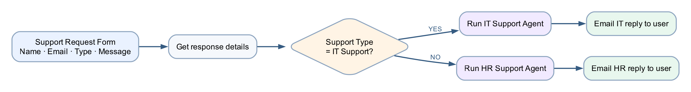

# Lab 7 — Support Request Routing

## Goal

Create a Forms-triggered cloud flow that routes the submitted message to the IT or HR agent and emails the selected agent's response to the requester.

## Duration

Approximately 30 minutes.

## Prerequisites

- Published `IT Support Agent`
- Published `HR Support Agent`
- Power Automate connection capable of running a published Copilot Studio agent
- Outlook and Microsoft Forms access

## Optional import accelerator

Import [Lab7-Support-Request-Routing-NEW.zip](Lab7-Support-Request-Routing-NEW.zip)
through **My flows → Import → Import Package (Legacy)** and choose **Create as
new**. Reconnect Forms, Copilot Studio and Outlook; select the Support Request
Form and the published IT/HR agents; then map Name, Email, Support Type and
Message. The imported flow name ends with **`(NEW)`**.

## Scenario

Employees use one support request form. The selected support type determines which specialised agent handles the message. The employee receives the resulting guidance by email.

## Workflow visual



The condition routes the same form to one specialised agent. Only the response from the selected branch is emailed.

## Detailed step-by-step

### Part A — Create the support form

1. Open Microsoft Forms.
2. Select **New Form**.
3. Name it `Support Request Form`.
4. Add a required **Text** question named `Name`.
5. Add a required **Text** question named `Email`.
6. Add a required **Choice** question named `Support Type`.
7. Add exactly two options:
    - `IT Support`
    - `HR Support`
8. Add a required **Text** question named `Message`.
9. Enable **Long answer**.
10. Preview the form.
11. Confirm Support Type permits one selection.

### Part B — Create the form-triggered flow

1. Open Power Automate.
2. Select **Create → Automated cloud flow**.
3. Name it `Lab 7 - Route Support Request`.
4. Select **Microsoft Forms — When a new response is submitted**.
5. Select **Create**.
6. Set **Form Id** to `Support Request Form`.
7. Add **Microsoft Forms — Get response details**.
8. Set the same Form Id.
9. Insert the trigger's Response Id token.
10. Add **Control — Condition**.
11. Insert the **Support Type** form answer in the left field.
12. Set **is equal to**.
13. Enter `IT Support` in the right field.

### Part C — Configure the IT branch

1. Under **If yes**, select **Add an action**.
2. Search for the Copilot Studio action.
3. Select the action shown by your tenant as **Run an agent**, **Execute agent and wait**, or the equivalent published-agent action.
4. Select `IT Support Agent`.
5. If a conversation field is available, create or pass a unique conversation identifier.
6. In the message/input field, build:

```text
User name: [Name]
Support request: [Message]
Provide a concise email-ready reply grounded in approved IT knowledge.
```

7. Replace Name and Message with dynamic-content tokens.
8. Below the agent action, add **Office 365 Outlook — Send an email (V2)**.
9. Set **To** to the submitted Email token.
10. Set **Subject** to `IT Support response`.
11. In **Body**, add `Hello ` and insert Name.
12. Add a blank line.
13. Insert the agent's response/output token.
14. Add `If the issue continues, contact the IT service desk.`

### Part D — Configure the HR branch

1. Under **If no**, add the same Copilot Studio agent action.
2. Select `HR Support Agent`.
3. Build the input:

```text
User name: [Name]
Support request: [Message]
Provide a concise email-ready reply grounded in approved HR policy knowledge.
```

4. Replace Name and Message with dynamic-content tokens.
5. Add **Send an email (V2)** below the agent.
6. Set **To** to the submitted Email token.
7. Set **Subject** to `HR Support response`.
8. Insert the HR agent response token into the body.
9. Add `Final decisions are made by HR or your manager.`
10. Select **Save**.

### Part E — Test IT routing

1. Submit the form:
    - Name: `Alex Lee`
    - Support Type: `IT Support`
    - Message: `My VPN will not connect.`
2. Open the newest flow run.
3. Confirm the Yes branch ran.
4. Confirm the HR branch was skipped.
5. Open the agent action's outputs.
6. Confirm the result is grounded in IT guidance.
7. Confirm the requester received one IT Support email.

### Part F — Test HR routing

1. Submit a second response:
    - Name: `Sara Goh`
    - Support Type: `HR Support`
    - Message: `How should I submit an expense claim?`
2. Confirm the No branch ran.
3. Confirm the IT branch was skipped.
4. Confirm the requester received one HR Support email.
5. Verify the final-decision sentence is present.

### Part G — Test safe fallback

1. Submit an IT request asking for an administrator password.
2. Confirm the agent refuses and the refusal is preserved in the email.
3. Submit an HR request asking for another employee's medical record.
4. Confirm the agent protects privacy.
5. Confirm each form submission created only one flow run and one email.

## Checkpoint

| Submission | Branch | Agent | Email subject |
|---|---|---|---|
| IT Support | If yes | IT Support Agent | IT Support response |
| HR Support | If no | HR Support Agent | HR Support response |

## Troubleshooting

| Symptom | Check |
|---|---|
| Agent not listed | Publish it and confirm it is in the same environment |
| Agent action has a different label | Use the current published-agent execution action exposed by the tenant |
| Response token unavailable | Save the agent action, reopen dynamic content and select its output |
| Both agents run | Ensure each action is inside its condition branch |
| Duplicate emails | Confirm one enabled flow watches the form and avoid repeated submissions |
| Unsafe response | Fix the agent instructions, publish again and retest |

## Key takeaways

- A condition routes work to specialised agents.
- Agent output becomes dynamic content in Outlook.
- The flow must preserve uncertainty, refusals and escalation language.
- Published agent versions and environment alignment are prerequisites.

**Next:** [Module 4: HTTP Requests and Webhooks](../Module%204%20-%20HTTP%20Requests%20and%20Webhooks.md)
