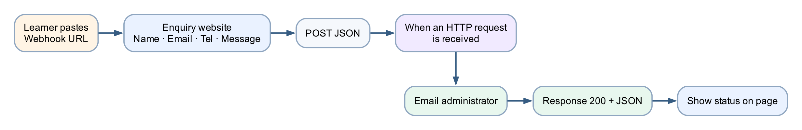

# Lab 8 — Website HTTP Enquiry

## Goal

Build an HTTP-triggered flow, obtain its generated webhook URL, paste that URL into the supplied enquiry webpage, and verify the complete browser-to-email-to-browser response cycle.

## Duration

Approximately 80 minutes.

## Prerequisites

- Power Automate premium HTTP Request trigger access in the course environment
- Outlook connection
- Chrome or Microsoft Edge
- [enquiry-form.html](assets/enquiry-form.html)
- [request-schema.json](assets/request-schema.json)

## Optional import accelerator

Import [Lab8-Website-HTTP-Enquiry-NEW.zip](Lab8-Website-HTTP-Enquiry-NEW.zip)
through **My flows → Import → Import Package (Legacy)** and choose **Create as
new**. Reconnect Outlook, save the flow to generate its HTTP URL, and paste that
URL into the supplied webpage. The imported flow name ends with **`(NEW)`**.

## Scenario

An external enquiry page must start a Power Automate flow without containing a hard-coded tenant endpoint. Each learner connects the page by pasting their own generated webhook URL.

## Workflow visual



The page posts JSON to the learner-entered URL. The flow emails the administrator and returns a JSON confirmation for the page to display.

## Request contract

```json
{
  "name": "Jane Tan",
  "email": "jane@example.com",
  "tel": "61234567",
  "message": "Please send course information."
}
```

## Detailed step-by-step

### Part A — Create the HTTP-triggered flow

1. Open `https://make.powerautomate.com`.
2. Confirm the course environment.
3. Select **Create**.
4. Select **Automated cloud flow**.
5. If the trigger selection dialog does not show the Request trigger, select **Skip**.
6. Rename the flow `Lab 8 - Website HTTP Enquiry`.
7. Select **Add a trigger**.
8. Search for `Request`.
9. Choose **Request — When an HTTP request is received**.
10. Open the trigger's **Parameters**.
11. In **Who can trigger the flow?**, select **Anyone** for this controlled classroom lab.
12. Locate **Request Body JSON Schema**.
13. Select **Use sample payload to generate schema**.
14. Paste the sample request contract shown above.
15. Select **Done**.
16. Confirm the generated schema contains name, email, tel and message.

### Part B — Add the administrator email

1. Select the **+** below the HTTP trigger.
2. Select **Add an action**.
3. Search for `Send an email`.
4. Choose **Office 365 Outlook — Send an email (V2)**.
5. Sign in with the course mailbox if required.
6. In **To**, enter `training1@tertiaryinfotech.onmicrosoft.com`.
7. In **Subject**, enter `Website enquiry from `.
8. Open **Dynamic content**.
9. Select `name` from the HTTP trigger.
10. In **Body**, add labelled lines for Name, Email, Tel and Message.
11. Insert the matching HTTP-trigger token after each label.
12. Confirm no fixed Jane Tan sample values remain.

### Part C — Add the HTTP response

1. Select the **+** below the email action.
2. Select **Add an action**.
3. Search for `Response`.
4. Choose **Request — Response**.
5. Set **Status Code** to `200`.
6. Expand **Advanced parameters** if required.
7. Add header:
    - Key: `Content-Type`
    - Value: `application/json`
8. In **Body**, enter:

```json
{
  "ok": true,
  "message": "Thank you. Your enquiry has been received."
}
```

9. Select **Save**.
10. Wait for the save to complete.

### Part D — Obtain the generated URL

1. Reopen the HTTP trigger card.
2. Locate **HTTP URL**.
3. If it still says `URL will be generated after save`, confirm:
    - the Response action exists;
    - no card shows a validation error;
    - the flow has a name;
    - Save completed successfully.
4. Save again if necessary.
5. Copy the complete generated URL using the copy icon.
6. Do not paste it into chat, screenshots or source control.

### Part E — Connect the supplied website

1. Open the lab `assets` folder.
2. Double-click `enquiry-form.html` or open it in Chrome.
3. Confirm the page displays a **Power Automate webhook URL** field.
4. Paste the copied URL into that field.
5. Select **Save URL in this browser**.
6. Confirm the status says the URL was saved locally.
7. Do not edit the HTML to insert the URL.

### Part F — Submit an enquiry

1. Enter:
    - Name: `Jane Tan`
    - Email: an address you can access
    - Tel: `61234567`
    - Message: `Please send the next course schedule.`
2. Select **Send enquiry** once.
3. Wait for the page status.
4. Confirm it displays `Thank you. Your enquiry has been received.`
5. Return to Power Automate.
6. Open the newest run.
7. Confirm the HTTP trigger received the four values.
8. Confirm the email action succeeded.
9. Confirm the Response action returned status 200.
10. Open the administrator mailbox.
11. Confirm exactly one email arrived with Jane's details.

### Part G — Negative test

1. Clear the saved URL using browser storage or open the page in a private window.
2. Attempt to submit without a URL.
3. Confirm the page blocks the request and explains that a valid HTTPS URL is required.
4. Reconnect the URL.
5. Enter an invalid email format.
6. Confirm the browser's field validation prevents submission.

## Checkpoint

- Flow contains HTTP trigger, Outlook email and Response
- URL was generated only after a valid save
- Website accepts the URL at runtime
- Page displays the response message
- Administrator receives one matching email

## Troubleshooting

| Symptom | Check |
|---|---|
| No URL generated | Add at least one action, resolve validation errors, save, then reopen the trigger |
| Website says URL required | Paste the complete HTTPS production URL and save it |
| Failed to fetch | Confirm flow is on, URL is current and the run history received a request |
| HTTP trigger shows no run | Inspect browser validation and verify the complete URL was pasted |
| Email values are blank | Use trigger-body dynamic tokens generated from the schema |
| Multiple emails | Check repeated clicks, duplicate enabled flows and automatic retries |

## Key takeaways

- A webhook is an HTTP endpoint intended to receive an event.
- The flow must contain a trigger and an action before the URL is generated.
- The webpage stores the URL locally instead of hard-coding it.
- A Response action gives deterministic browser feedback.

**Next:** [Lab 9 — Finance Agent Web Chat](../Lab%209%20-%20Finance%20Agent%20Web%20Chat/index.md)
