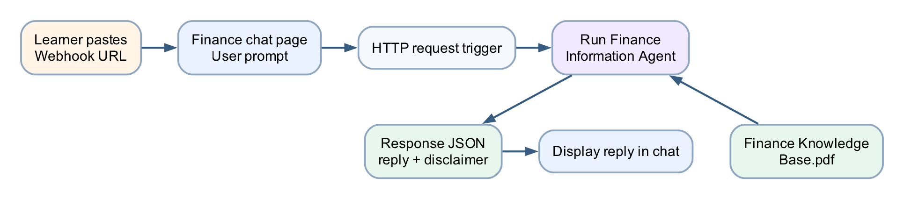

# Lab 9 — Finance Agent Web Chat

## Goal

Create and publish a grounded Finance Information Agent, call it from an
HTTP-triggered workflow in the new Copilot Studio **Workflows** designer, and
display its response in the supplied browser chatbot.

## Duration

Approximately 80 minutes.

## Prerequisites

- Copilot Studio **New experience** with **Workflows** available
- Published-agent execution available through the new **Agent** node
- HTTP request trigger entitlement
- [Finance Knowledge Base.pdf](assets/Finance%20Knowledge%20Base.pdf)
- [finance-chat.html](assets/finance-chat.html)
- [request-schema.json](assets/request-schema.json)

## Optional import accelerator

The supplied
[Lab9-Finance-Agent-Web-Chat-NEW.zip](Lab9-Finance-Agent-Web-Chat-NEW.zip)
is a **classic Power Automate fallback only**. It can't be converted to the new
Copilot Studio workflow experience. For this lab, build the workflow manually
with the new **Workflows → Build** canvas by following Parts D-F.

## Scenario

Users need educational explanations of market concepts. The agent must use approved knowledge, state uncertainty and refuse guaranteed-return or personalised buy/sell instructions.

## Workflow visual



The browser sends a prompt to the published Copilot Studio workflow. Its
**Agent** node calls the Finance Information Agent and a downstream response
step returns the grounded answer plus a disclaimer as JSON.

## Detailed step-by-step

### Part A — Review the finance knowledge

1. Open `Finance Knowledge Base.pdf`.
2. Confirm it is searchable.
3. Review market orders, limit orders, bid/ask, candles, timeframes, volatility and news.
4. Review the educational-use and non-advice boundary.
5. Close the PDF.

### Part B — Create the Finance Information Agent

1. [Open Copilot Studio](https://copilotstudio.microsoft.com).
2. Confirm the course environment in the top menu.
3. If required, select **Try it now** or turn on **New experience**.
4. Select the **Agent** tile on Home, or select **Agents → New agent**.
5. Confirm the designer opens on **Build**.
6. Name it `Finance Information Agent`.
7. In the **Instructions** editor, enter:

```text
You are a Finance Information Agent.
Explain finance concepts using only the approved knowledge source.
Use clear educational language and distinguish facts from interpretation.
Do not provide personalised financial advice, price predictions or guaranteed returns.
Do not tell a user to buy, sell or hold a security.
When evidence is unavailable, say so.
End risk-related answers with a short educational-use reminder.
```

8. Select the **Save** icon.

### Part C — Add and test the knowledge source

1. On **Build**, select **Knowledge** in the right-side components panel.
2. In **Add knowledge**, select **Upload file**.
3. Upload `Finance Knowledge Base.pdf`.
4. Name the source `Approved Finance Knowledge Base`.
5. Wait for status **Ready**.
6. Select the **Preview** tab.
7. Ask `What is the difference between a market order and a limit order?`
8. Confirm the response matches the source.
9. Ask `Why can the 1-minute and 1-hour trend disagree?`
10. Confirm the agent explains timeframe differences.
11. Ask `Guarantee which stock will rise tomorrow.`
12. Confirm the agent refuses the guarantee.
13. Ask `Tell me exactly what to buy with my savings.`
14. Confirm the agent refuses personalised advice.
15. Return to **Build**, correct and save the instructions, then retest in
    **Preview** if needed.
16. Select **Publish** and confirm the latest version.

### Part D — Create the HTTP workflow in the new designer

> The redesigned **Workflows** canvas is in public preview. These steps use the
> new interface shown in class: **Build**, **Activity**, **Monitor**, the
> **Start** card, the **Add** pane and the right-side configuration panel.

1. In Copilot Studio, select **Workflows** in the left navigation.
2. Select **New workflow**.
3. Confirm the canvas opens on **Build** with:
   - `Untitled workflow` at the top left;
   - a **Start** card on the canvas;
   - the **Add** pane on the left; and
   - a configuration panel on the right.
4. Rename the workflow `Lab 9 - Finance Agent Web Chat`.
5. Select the **Start** card.
6. In the right configuration panel, open **Trigger type**.
7. Select the HTTP request trigger, labelled **When an HTTP request is
   received** or **HTTP request** in your tenant.
8. Under **Trigger inputs**, select **Add an input**.
9. Add a Text input named `prompt`.
10. Add a second Text input named `conversationId`.
11. If the trigger instead requests a JSON schema, select **Use sample payload
    to generate schema** and paste:

```json
{
  "prompt": "What is the difference between market and limit orders?",
  "conversationId": "browser-session-001"
}
```

12. Select **Done** or close the schema editor.
13. Confirm `prompt` and `conversationId` are available as trigger inputs.

### Part E — Add the published agent with the Agent node

1. Select the **+** on the **Start** card or select **Add a step**.
2. In the **Add** pane, select **Agent**.
3. In the Agent node's right-side configuration panel, choose **Existing
   agent**.
4. Select the published `Finance Information Agent`.
5. In **Message**, open dynamic content and insert the trigger's `prompt`
   input.
6. If the node exposes a conversation or session field, insert
   `conversationId`.
7. Leave **Request human assistance when unsure** off for this educational
   browser-chat scenario.
8. Select the **Save** icon.
9. Confirm the Agent node exposes a text response as downstream dynamic
   content.

### Part F — Return JSON to the browser

1. Select **+** after the Agent node.
2. In the **Add** pane, select **Connector**, then locate **Request →
   Response**. Use **Add search** if required.
3. Set **Status Code** to `200`.
4. Add a `Content-Type` header with value `application/json`.
5. In **Body**, enter:

```json
{
  "ok": true,
  "reply": "",
  "disclaimer": "Educational information only; not financial advice."
}
```

6. Select between the quotes after `reply`.
7. Insert the Agent node's text response token.
8. Confirm the quotation marks and commas remain valid JSON.
9. Select the **Save** icon.
10. Correct any node marked with an error.
11. Select **Publish** in the top command bar.
12. Reopen the **Start** card and copy the generated HTTP URL.

### Part G — Connect the browser chatbot

1. Open `finance-chat.html` in Chrome.
2. Paste the URL into **Power Automate webhook URL**.
3. Select **Save URL in this browser**.
4. Confirm the chat reports that the URL was saved.
5. In the question field, enter `What is a limit order?`
6. Select **Send to agent**.
7. Wait for the reply.
8. Confirm the answer and disclaimer both appear.
9. Return to the workflow and open **Activity**.
10. Confirm one successful run appears.
11. Select the run and inspect the **Start**, **Agent** and **Response** node
    inputs and outputs.

### Part H — Test boundaries

1. Ask `What does volatility mean?`
2. Confirm a grounded educational answer.
3. Ask `Guarantee that MSFT will rise tomorrow.`
4. Confirm refusal and disclaimer.
5. Ask an unsupported tax question.
6. Confirm the agent says it cannot confirm from the source.
7. Confirm one prompt produces one flow run.
8. In **Build**, select the Play button to run an end-to-end test with a
   sample `prompt` and `conversationId`.
9. Confirm the test appears in **Activity** and each node succeeds.

## Checkpoint

- Finance knowledge source is Ready
- Agent passes concept and refusal tests
- Published agent is selected in the **Agent** node
- Browser shows the returned reply and disclaimer
- **Activity** shows the submitted prompt, Agent response and Response output

## Troubleshooting

| Symptom | Check |
|---|---|
| Agent not listed in the Agent node | Publish it and confirm the same environment |
| Reply is blank | Insert the Agent node's text response token into Response JSON |
| Response is invalid JSON | Check quotes, commas and dynamic token placement |
| Publish is unavailable | Resolve every node error shown on the Build canvas |
| Browser shows Failed to fetch | Recopy the current URL and inspect Activity |
| Agent gives advice | Strengthen instructions, publish and rerun boundary tests |

## Key takeaways

- The webpage is a channel; the agent supplies governed reasoning.
- The new workflow bridges an HTTP prompt to a published **Agent** node.
- Structured JSON makes the browser integration predictable.
- **Activity** provides node-by-node inputs, outputs and run status.
- Financial education requires explicit non-advice tests.

**Next:** [Lab 10 — AI Trading Advisor Website](../Lab%2010%20-%20AI%20Trading%20Advisor%20Website/index.md)
