# Lab 0 — Environment Setup

*Get into the Training Class environment that every later lab builds in*

## Goal

Sign in with a Microsoft 365 **work or school** account, get into the **Training Class** environment your trainer assigned (for example **Training Class 1**) using the environment picker in Copilot Studio, turn the **New experience** on, and confirm Outlook, Excel (OneDrive) and Teams are available — so you start Lab 1 with zero surprises.

> **In a classroom, you do not create an environment.** Your trainer has already provisioned a `Training Class N` Sandbox for your class. You simply switch into it (**Part C**). Working on your own without a trainer? **Part C-Alt** shows you how to create a personal Developer environment instead.

## Duration

Approximately 20 minutes (plus about 15 minutes if you need to create a Microsoft 365 Business trial first).

## Prerequisites

- A web browser (Microsoft Edge or Google Chrome recommended)
- A mobile phone (used once for security verification)
- A credit card *(only if you create a new Business trial in Part A — it is **not** charged during the free month)*
- In a classroom: the name of **your class environment** (`Training Class 1`, `Training Class 2` or `Training Class 3`) — your trainer tells you which one is yours
- The trainer's finished reference builds live in a **separate master reference environment**, not in yours. Every reference **workflow** there is named `Lab N - … (DO NOT DELETE)`; every reference **agent** likewise — agent names are capped at 30 characters by Copilot Studio, so the agent's base name is shortened to make the suffix fit. They are read-only for you: open them to compare, never edit or delete them

> **Which account should I use?**
> - **Option A — You already have a Microsoft 365 work/school account** (e.g. `name@company.com`). Try this first — you may already have everything you need. Skip Part A and go straight to **Part B**.
> - **Option B — You do NOT have a work/school account** (only a personal `@outlook.com` / `@gmail.com`). Copilot Studio requires a *work or school* account, so you create one via a free **Microsoft 365 Business trial** in **Part A**, then continue from Part B.
> - **In a classroom**, the trainer normally issues a ready-made account (`training1@…onmicrosoft.com` or similar) that already has access to your class environment. Ask before creating anything.

### Classroom credentials

In a classroom your trainer assigns you **two accounts** — one of each set — and gives you the passwords in class. Use the same pair for every lab; you do not create anything in Part A.

**1 · Microsoft 365 Premium** — sign in at <a href="https://m365.cloud.microsoft/" target="_blank" rel="noopener">https://m365.cloud.microsoft/</a> for Office 365 and Copilot 365 (6 learners share each account):

| Account | Assigned to |
|---|---|
| `training1-tertiary@outlook.com` | Learners 1–6 |
| `training2-tertiary@outlook.com` | Learners 7–12 |

**2 · Copilot Studio / Power Automate** — sign in at <a href="https://copilotstudio.microsoft.com" target="_blank" rel="noopener">https://copilotstudio.microsoft.com</a> in your class environment:

All accounts are on the `@tertiaryinfotech.onmicrosoft.com` domain:

| Account | Environment |
|---|---|
| `training1@tertiaryinfotech.onmicrosoft.com` | Training Class 1 |
| `training2@tertiaryinfotech.onmicrosoft.com` | Training Class 2 |

> **Passwords are issued by your trainer at the start of the class** — they are not printed in the courseware. Ask if you have not been given one.

> **Confirm your environment before you build anything.** The environment name shows bottom-left in Copilot Studio — it must read your assigned Training Class.

> **⚠️ Why not the Microsoft 365 Developer Program?** Since 2024 the free Developer Program E5 sandbox requires an active **Visual Studio Enterprise or Professional subscription**. Without one you see *"You don't currently qualify for a Microsoft 365 Developer Program sandbox subscription."* — so this course does **not** use that path. Use Option B instead.

## Scenario

You have joined **ACME Pte Ltd's Digital Operations project team** as a junior automation specialist. The production tenant contains customer and employee data, so the project manager will not allow experiments there. Your first task is to get into the controlled **Training Class** environment where workflows, connectors, agent knowledge and test records can be built safely.

| Workplace detail | Lab interpretation |
|---|---|
| Your role | Junior automation specialist |
| Stakeholders | Power Platform administrator, customer-operations manager and IT security |
| Operational risk | A learner accidentally sends test emails or writes data into a production system |
| Success measure | Copilot Studio opens in your assigned Training Class environment, in the new experience, and every Microsoft 365 app the labs use is reachable |

**Real-world extension:** an organisation would also apply environment roles, Data Loss Prevention policies, service accounts, naming standards and a development → test → production deployment process.

## What the trainer has prepared for you

The labs read from, and write to, a small set of shared Microsoft 365 assets that the trainer has already created in the course tenant. You do not build these — you only need to know where they are and what they are called, because the workflow and agent steps in Labs 1–16 refer to them by these exact names.

**SharePoint site `Tertiary Infotech - WSQ Courses`** — `https://tertiaryinfotech.sharepoint.com/sites/WSQCourses`, library **Documents**. Six lab folders hold the knowledge files that the agents of Labs 5–8, 13 and 15 are grounded in:

| Folder | Files | Used by |
|---|---|---|
| `Lab 5 - HR Policies` | HR Policies.pdf, hr-policy.md, benefits-summary.md | Lab 5 HR agent |
| `Lab 6 - Procurement Knowledge` | procurement-policy.md, vendors.csv | Lab 6 Procurement agent |
| `Lab 7 - Course Brochures` | 20 .txt brochures (BAK-101…110, CUL-201…210) | Lab 7 Sales agent |
| `Lab 8 - IT Knowledge` | service-catalogue.md, known-issues.csv, asset-register.csv | Lab 8 IT Support agent |
| `Lab 13 - Investment FAQ` | Investment-Advisory-FAQ.pdf | Lab 13 HTTP chatbot |
| `Lab 15 - Course Brochures` | the same 20 .txt brochures | Lab 15 RAG workflow |

When a lab asks you to paste a folder URL as agent knowledge, use the **%20-encoded** form, e.g. `https://tertiaryinfotech.sharepoint.com/sites/WSQCourses/Shared%20Documents/Lab%2015%20-%20Course%20Brochures` — the **Add** button only enables for that form.

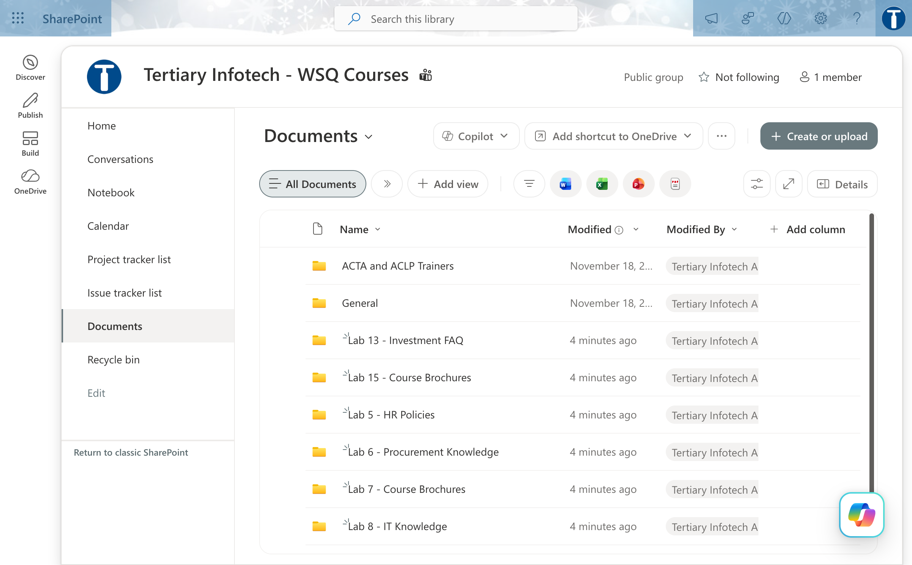

*Figure 0.1 — SharePoint site Tertiary Infotech - WSQ Courses: the Documents library with the six Lab folders*

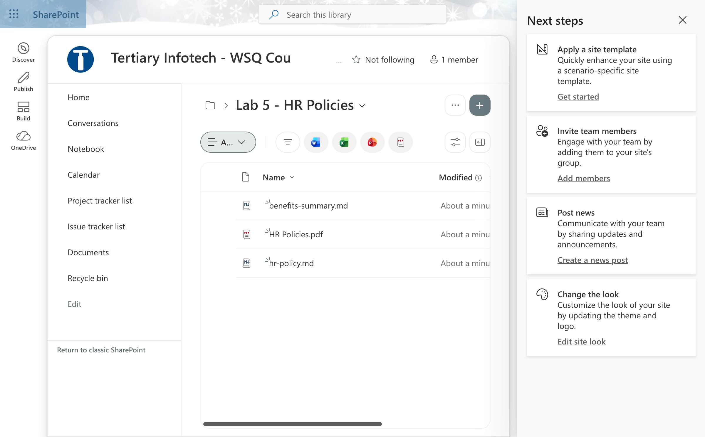

*Figure 0.2 — Lab 5 - HR Policies folder: benefits-summary.md, HR Policies.pdf and hr-policy.md*

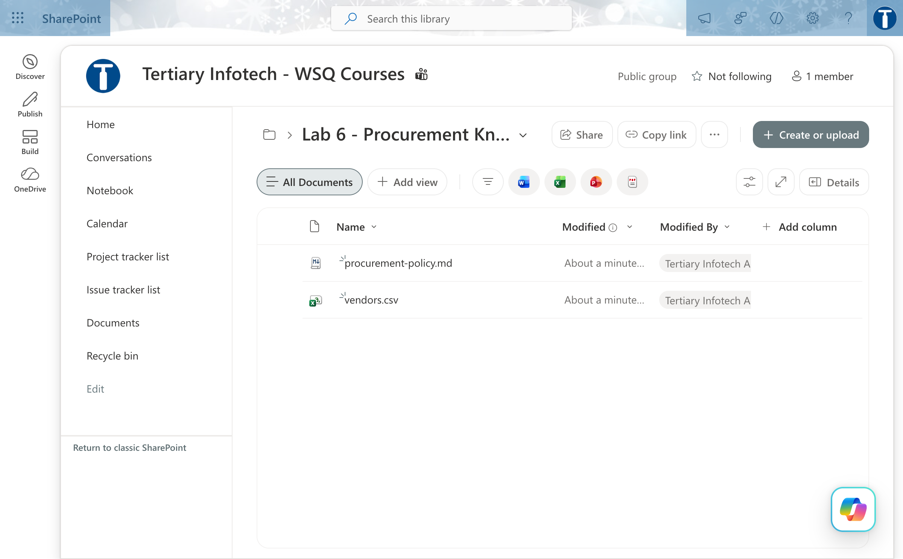

*Figure 0.3 — Lab 6 - Procurement Knowledge folder: procurement-policy.md and vendors.csv*

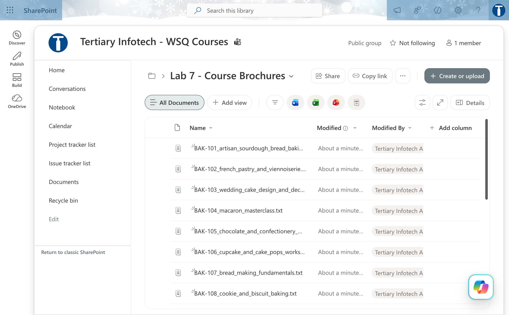

*Figure 0.4 — Lab 7 - Course Brochures folder: the 20 .txt brochures BAK-101…110 and CUL-201…210*

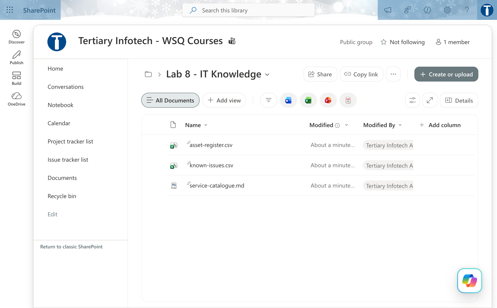

*Figure 0.5 — Lab 8 - IT Knowledge folder: service-catalogue.md, known-issues.csv and asset-register.csv*

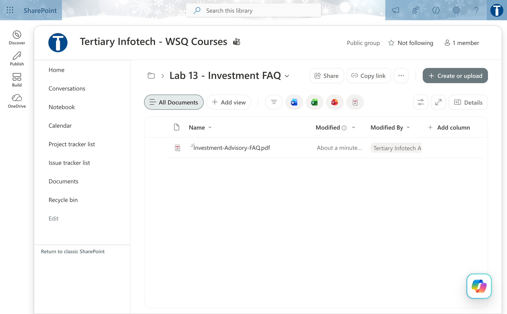

*Figure 0.6 — Lab 13 - Investment FAQ folder: Investment-Advisory-FAQ.pdf*


*Figure 0.7 — Lab 15 - Course Brochures folder: the same 20 .txt brochures used for the RAG workflow*

**SharePoint lists** (same site) — used by the Lab 12 application-approval workflow:

| List | Columns | Seeded rows |
|---|---|---|
| `Lab 12 - Customers` | Title (= FullName), NRIC, Email, Phone, DateOfBirth, Employment, Income (number), Decision (choice APPROVED / REJECTED / DUPLICATE / REVIEW) | 5 customers (TAN WEI MING S8412345D, NURUL AISYAH BINTE RAHMAN S9078234B, RAJESH KUMAR S7623451A, CHLOE LIM HUI LING T0145678C, GOH BEE CHOO S6534129E) |
| `Lab 12 - Onboarding Log` | Title (= application reference), NRIC, Decision (text), Reason (multi-line), SubmittedAt (text) | 4 applications APP-2025-0001…0004 |

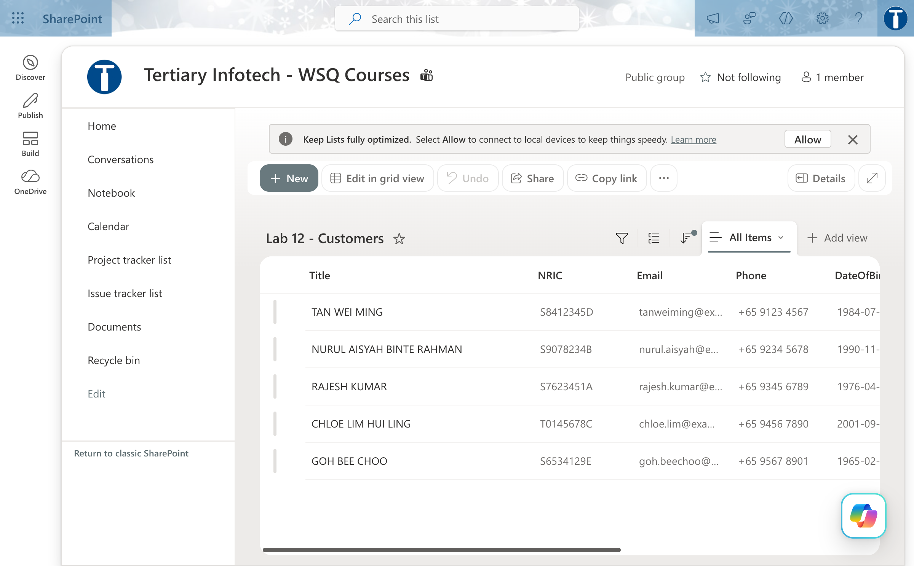

*Figure 0.8 — Lab 12 - Customers list: Title, NRIC, Email, Phone, DateOfBirth… with the five seeded customers*


*Figure 0.9 — Lab 12 - Onboarding Log list: Title, NRIC, Decision, Reason, SubmittedAt with the four seeded applications*

**OneDrive for Business folder `Power Automate Lab Data`** (on the trainer's account) — the Excel workbooks that the Excel Online (Business) connector writes to. Each has one named table:

| Workbook | Table(s) | Used by |
|---|---|---|
| `Lab 2 - Enquiry Log.xlsx` | EnquiryLog | Lab 2 |
| `Lab 3 - Leave Register.xlsx` | LeaveRegister | Lab 3 |
| `Lab 6 - Requisition Log.xlsx` | RequisitionLog | Lab 6 |
| `Lab 14 - Handover Queue.xlsx` | Drafts (Reference, Timestamp, Client, Enquiry, Draft, Urgency, Flags, Escalate, Status, ApprovedBy) and HandoverQueue (Reference, Timestamp, Client, Enquiry, Reason, Owner) | Lab 14 |

When you build on your own account, create the same `Power Automate Lab Data` folder in **your** OneDrive and upload the workbook from the lab's `assets` folder — the connector's File picker only shows the drive of the account that made the connection.


*Figure 0.10 — OneDrive for Business, My files → Power Automate Lab Data: the Lab 2, 3, 6 and 14 workbooks*

**Microsoft Forms** (`https://forms.cloud.microsoft`) — two forms feed the form-triggered workflows:

| Form | Questions | Settings | Used by |
|---|---|---|---|
| `Lab 1 - Course Enquiry Form` | Name, Email, Tel, Message (all Required; Message is Long answer) | — | Labs 1 and 2 |
| `Lab 3 - Leave Application Form` | Name, Leave from date, Leave end date, Leave Type (Annual / Medical / Compassionate / Unpaid), Reason for leave | *Only people in Tertiary Infotech can respond* ON, *Record name* ON, *One response per person* OFF | Lab 3 |

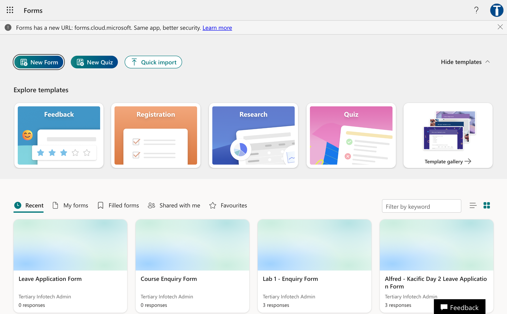

*Figure 0.11 — Microsoft Forms portal (forms.cloud.microsoft): New Form button and the recent forms tiles*


*Figure 0.12 — Lab 1 - Course Enquiry Form: Name, Email, Tel (and Message) — all Required*


*Figure 0.13 — Lab 3 - Leave Application Form: Name, Leave from date, Leave end date, Leave Type, Reason for leave*


*Figure 0.14 — Lab 3 - Leave Application Form → Settings: Only people in Tertiary Infotech Pte Ltd can respond, Record name ON, One response per person OFF*

**Teams** — team `Tertiary Infotech - WSQ Courses`, channel `General`. It is the only team in the tenant; the Lab 10 workflow posts there and the Lab 14 Human review card arrives in the Teams **Workflows** bot chat.

## One tool, not two

Every hands-on build in this course — the form-triggered flows of Labs 1–3, the email classifier of Lab 4, the agents of Labs 5–9 and 11, the HTTP and RAG workflows of Labs 12–16, and the publishing lab 17 — is made in **one place**: the Copilot Studio **workflow and agent designer** at `copilotstudio.microsoft.com`, in the **New experience**. Power Automate is the connector engine that runs underneath those workflows (Module 1 explains it), but you will **not** open `make.powerautomate.com` in this course.

## Workflow visual

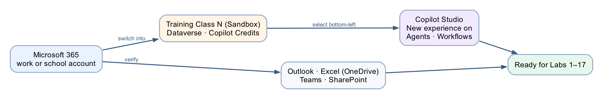

One account, one environment, one designer. The same **Training Class** environment sits behind every workflow and agent you build in Labs 1–17.

## Expected result

```text
One work/school account
→ your class environment, e.g. "Training Class 1" (Sandbox, Dataverse = Yes, status Ready)
→ Copilot Studio showing "Training Class 1" bottom-left, New experience on
→ left navigation reads Home · Agents · Workflows
→ Outlook sends, Excel saves to OneDrive, Teams opens
```

## Detailed step-by-step

### Part A — (Option B only) Create a free Microsoft 365 Business trial (~15 minutes)

Skip this part entirely if you already have a work/school account.

This creates a brand-new *work* account such as `admin@yourname.onmicrosoft.com` with Microsoft 365 (Outlook, Excel, OneDrive, SharePoint, Teams) — exactly what Copilot Studio needs.

1. Open a browser and go to <a href="https://www.microsoft.com/microsoft-365/business" target="_blank" rel="noopener">https://www.microsoft.com/microsoft-365/business</a> (or search "Microsoft 365 Business Standard free trial").
2. Choose **Microsoft 365 Business Standard** and select **Try free for 1 month**.
3. Enter an email address to start. When prompted, choose **Set up account** / **Create a new account**.
4. Fill in your details (name, business name — you may use your own name — country, phone for verification).
5. Create your **sign-in details**: a username and a domain, giving you something like `admin@yourname.onmicrosoft.com`. **Write these down** — this is the account you use for the entire course.
6. Verify with the code sent to your phone.
7. Add a **payment method** (credit card). You are **not charged during the 1-month free trial**.
8. Wait 1–2 minutes for provisioning. You now have a Microsoft 365 work tenant.

> **⚠️ Avoid surprise charges.** If you do not intend to keep the trial, set a calendar reminder and cancel **before the renewal date** in the **Microsoft 365 admin center → Billing → Your products**.

### Part B — Sign in to Microsoft 365 and confirm Outlook, Excel and Teams (~5 minutes)

1. Go to <a href="https://www.office.com" target="_blank" rel="noopener">https://www.office.com</a> (or <a href="https://m365.cloud.microsoft" target="_blank" rel="noopener">https://m365.cloud.microsoft</a>).
2. Select **Sign in** and enter your **work/school account** (Option A) or your new **Business trial account** (Option B), then your password.
3. If this is your first sign-in, you may be asked to set up multi-factor authentication (MFA). Follow the prompts using your mobile phone.
4. Once signed in, you should see the Microsoft 365 home page with app tiles (Outlook, Word, Excel, Teams, etc.).
5. Open **Outlook** (click the Outlook tile) and send yourself a quick test email to confirm it works — Labs 1 and 4 rely on Outlook.
6. Open **Excel**, create a blank workbook, and confirm it saves to **OneDrive** — Lab 2 relies on this. You can delete the test workbook afterwards.
7. Open **Teams** once so it finishes its first-run setup — Labs 3, 4, 5, 10 and 14 deliver messages and approval cards there.

> **⚠️ No Outlook/Excel tiles?** Your account may not have a Microsoft 365 licence. The *Send an email* action in Lab 1 fails with **"Unauthorized"** when the account has **no mailbox**. Ask your IT administrator to assign a licence, or use the Business trial account from Part A (which always has a mailbox).

### Part C — Get into your Training Class environment (~2 minutes)

An **environment** is a container that holds your workflows, agents, connections and data. In a
classroom you do **not** create one: your trainer has already provisioned a **Sandbox** environment
for your class, named `Training Class 1`, `Training Class 2` or `Training Class 3`. Everything you
build in Labs 1–17 goes there.

1. You will select it with the **environment picker** in Copilot Studio — the item at the
   **bottom-left** of the page. That is Part D, step 5.
2. If you already have Copilot Studio open, click that bottom-left item now and choose the
   **Training Class** environment your trainer assigned to you.

> **Ask your trainer which class environment is yours** before you build anything. If three classes
> share the tenant, building in another class's environment mixes your work with theirs.

**Three environments exist in this tenant. You work in exactly one of them.**

| Environment | Type | What it is for |
|---|---|---|
| `Training Class 1` / `2` / `3` | Sandbox | **Yours.** One per class — where you build every lab |
| `TGS-2022017524-Business Process Automation…` | Sandbox | The **master reference environment**: the trainer's finished `Lab N - … (DO NOT DELETE)` workflows and agents. Read-only for you — open to compare, never to edit |
| `Copilot Studio Training (Developer)` | Developer | The original build environment, now **retired from classroom use** |

**Why a Sandbox for the class, and not a Developer or Trial environment?**

| | Developer | **Sandbox** — what this course uses | Trial |
|---|---|---|---|
| Who can access it | **One user only** | **Everyone in the class** | Users you assign |
| Lifespan | Persistent | **Persistent** | **Self-deletes after 30 days** |
| Reset between classes | No | **Yes — one click** | No |

A Developer environment is single-user by design, so a class cannot share one. A Trial environment
deletes itself after 30 days, taking the class's work with it. Only a **Sandbox** is both
multi-user and **resettable**, which is what lets your trainer wipe it clean for the next cohort.
That also makes your class environment **disposable on purpose**: nothing you do in it can damage
the reference builds everyone compares against, because those live somewhere else entirely.

> **Copilot Credits still matter.** From Lab 4 onwards, every workflow containing an Agent or
> Classify node consumes **Copilot Credits** on each run. An environment with none allocated fails
> with `InsufficientMcsCredits` — an environment capacity error, not a workflow error. Your trainer
> allocates credits to the class environment before class. A Copilot Studio *licence* does not fix
> it: licences are per-user, credits are per-environment.

### Part C-Alt — (Self-study only) Create your own Developer environment (~7 minutes)

**Skip this entirely if you are in a classroom** — use the Training Class environment from Part C.

Studying on your own, with no trainer and no class environment? Create a personal **Developer**
environment instead. It is free, and single-user is fine when the only user is you.

1. Open a new tab and go to the **Power Platform admin center**: <a href="https://admin.powerplatform.microsoft.com" target="_blank" rel="noopener">https://admin.powerplatform.microsoft.com</a>.
2. Sign in with the **same account** from Part B.
3. In the left menu, select **Manage → Environments**.
4. Select **+ New** (top of the page).
5. Fill in the **New environment** panel:
   - **Name:** `Copilot Studio Training` (any name works — remember what you chose)
   - **Type:** **Developer**
   - **Region:** your nearest region (e.g. Asia, Singapore)
   - **Add a Dataverse data store:** **Yes**  ← important
6. Select **Next**, accept the defaults (language English, currency your local currency), then select **Save**.
7. Wait 1–3 minutes. The environment appears in the list with status **Ready**. Refresh if needed.

Wherever a later lab says "your **Training Class** environment", read it as "the environment you
created here". You will not have the `(DO NOT DELETE)` reference builds to compare against — the
Learner Guide screenshots serve that purpose instead.

> **Tip:** if your tenant blocks creating environments (some organisations restrict this), use the existing **default** environment instead — and select that *same* environment in Copilot Studio in Part D. Check that it has Copilot Credits.

> **Copilot Credits — read before you press Preview.** If a reply says *"You need credits to continue … Error code: EnforcementUsageCredits"*, nothing is wrong with your build: the environment has no Copilot Credits. The trainer allocates them in the Power Platform admin center → **Licensing → Copilot Studio → Manage Copilot Credits** before Preview and Agent-node runs work. Publishing works without credits.

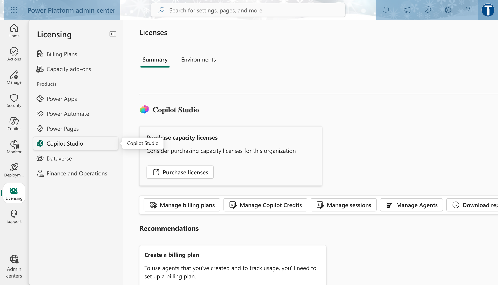

*Figure 0.15 — Power Platform admin center → Licensing → Copilot Studio: the Manage Copilot Credits button (trainer only)*

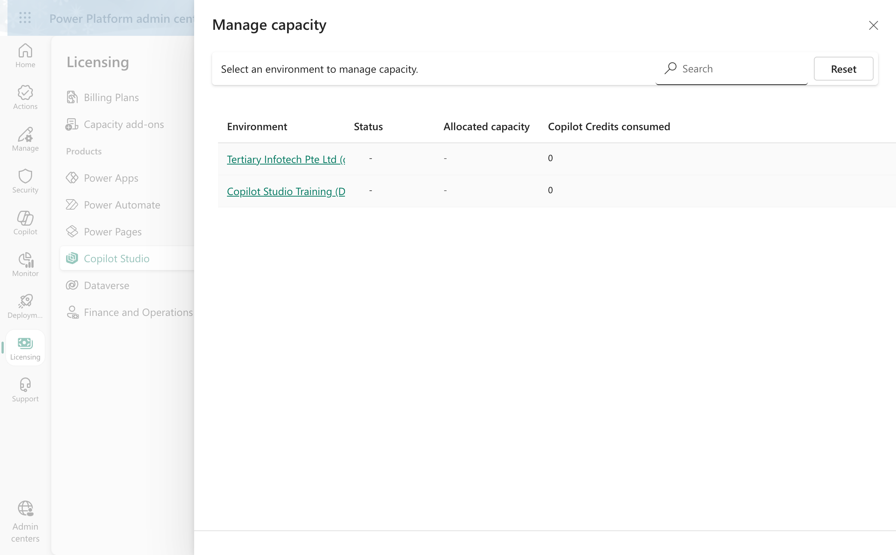

*Figure 0.16 — Manage Copilot Credits → Manage capacity: an environment with no allocated capacity — the state that produces the EnforcementUsageCredits message. The trainer allocates credits to each Training Class environment before class*

### Part D — Open Copilot Studio, choose the environment, turn on the New experience (~5 minutes)

Copilot Studio is where you build **everything** in this course: the workflows of Labs 1–4 and 10–16, and the agents of Labs 5–9, 11 and 17.

1. Open a new tab and go to <a href="https://copilotstudio.microsoft.com" target="_blank" rel="noopener">https://copilotstudio.microsoft.com</a>.
2. Sign in with the **same account** again.
3. If prompted, select your **country/region** and select **Start free trial** (or **Try free**). This activates a **30-day Copilot Studio trial** at no cost (when it expires you can extend it once by another 30 days).
4. Wait for the workspace to load.
5. **Choose the environment.** The environment name is shown **bottom-left** of the page. It must read the **Training Class** environment your trainer assigned to you — for example `Training Class 1`. If it shows anything else, click that bottom-left item — it is the environment switcher — and choose your class environment from the list. *(Self-study: choose the environment you created in Part C-Alt.)*
6. **Turn on the New experience.** Look **top-right** on the Agents or Workflows list page for the **New experience** toggle and switch it **on**. In the new experience the left navigation reads **Home · Agents · Workflows**; the Agents page has a **New agent** button top right, and the Workflows page a **New workflow** button. Every lab in this course is written for the new experience — the classic designer has different panels and the click-by-click steps will not match.
7. Select **Workflows** in the left navigation and look at the list. **Your class environment starts empty** — that is correct, and it is where your own builds will appear from Lab 1 onwards.

   To see the trainer's reference builds, switch the picker to the **master reference environment** (`TGS-2022017524-Business Process Automation with Power Automate and Copilot Studio Agents`). Its Workflows list holds `Lab 1 - Trigger and Actions (DO NOT DELETE)`, `Lab 2 - Log to Excel (DO NOT DELETE)`, `Lab 10 - Calling Agent from Workflow (DO NOT DELETE)` and so on, with columns **Name · Status · Owner · Last modified · Enabled**. Open them to compare with your own build later — they are read-only for you. **Never edit, disable or delete them.** Then switch back to your class environment before you build.

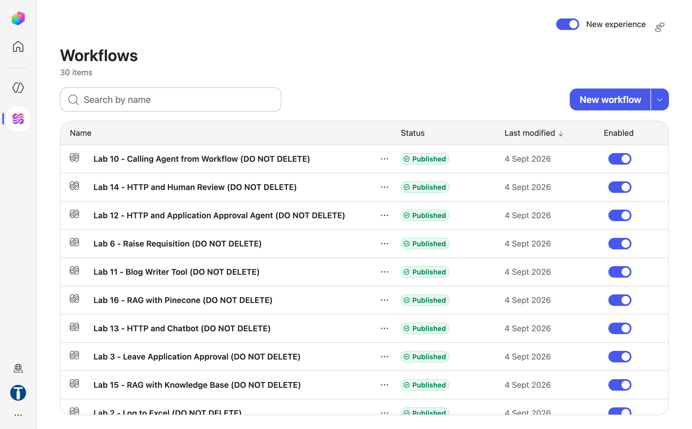

*Figure 0.17 — Workflows list in the master reference environment (New experience on): the trainer's `Lab N - … (DO NOT DELETE)` workflows, Status Published, Enabled on. Your own class environment starts empty*

8. Select **Agents** in the left navigation. In the **master reference environment** the trainer's reference agents sit alongside the workflows — `Lab 5 - HR (DO NOT DELETE)`, `Lab 6 - Proc (DO NOT DELETE)`, `Lab 7 - Sales (DO NOT DELETE)`, `Lab 8 - IT (DO NOT DELETE)`, `Lab 9 - Res (DO NOT DELETE)`, `Lab 9 - Blog (DO NOT DELETE)`, `Lab 9 - Review (DO NOT DELETE)`, `Lab 9 - Mgr (DO NOT DELETE)` and `Lab 11 - Blog (DO NOT DELETE)`. Agents use a shortened base name because Copilot Studio rejects agent names longer than 30 characters; workflows have no such cap, so they keep the full title. Same rule: open to compare, never edit or delete — and build your own agents in your class environment.

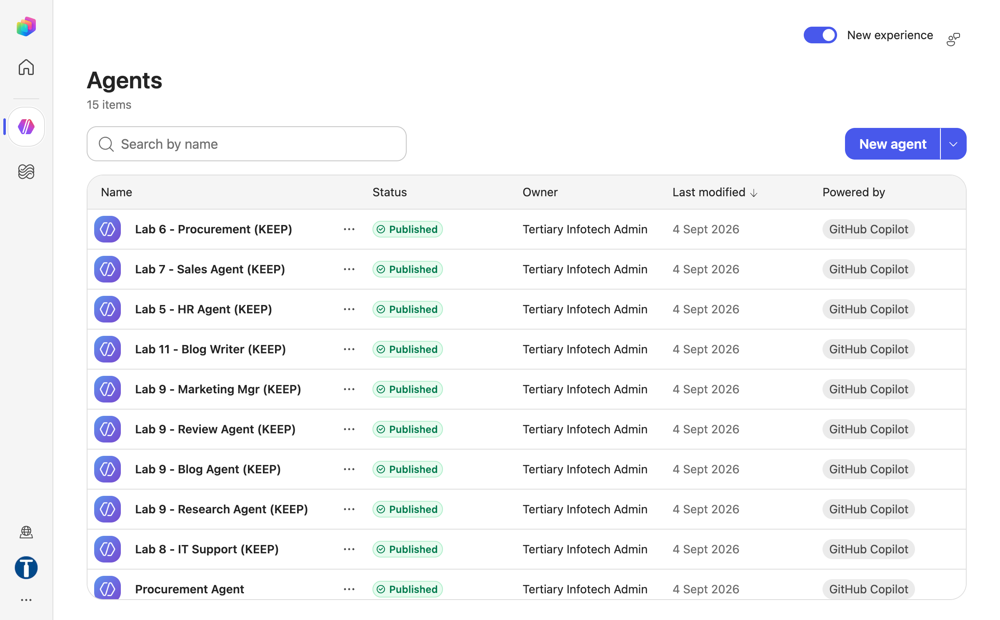

*Figure 0.18 — Agents list in the master reference environment (New experience on): the trainer's `Lab N - … (DO NOT DELETE)` reference agents, Status Published*

9. Do **not** create a workflow or agent yet — you do that in Lab 1. For now, just confirm the page loads in the correct environment with the new experience on.

> **⚠️ The environment picker is the single most common source of "where did my workflow go?"** If you build in the wrong environment, your work simply does not appear when you switch. Always confirm your **Training Class** environment is showing bottom-left before you build.

### Part E — Verify your full setup (~3 minutes)

Run this checklist. Each item should already be true if the parts above succeeded.

| # | Check | Where |
|---|-------|-------|
| 1 | I can sign in and see app tiles | <a href="https://office.com" target="_blank" rel="noopener">https://office.com</a> |
| 2 | I can open Outlook and send myself an email | Outlook |
| 3 | I can open Excel and it saves to OneDrive | Excel / OneDrive |
| 4 | Teams opens and shows my account | Teams |
| 5 | I know which **Training Class** environment is mine, and it appears in the picker | Copilot Studio (self-study: Power Platform admin center) |
| 6 | Copilot Studio loads, the trial is active, my **Training Class** environment shows bottom-left | <a href="https://copilotstudio.microsoft.com" target="_blank" rel="noopener">https://copilotstudio.microsoft.com</a> |
| 7 | **New experience** is on: the left navigation reads Home · Agents · Workflows | Copilot Studio |

If all seven are checked, your environment is ready.

## Checkpoint

> **Workplace evidence:** capture your class environment name bottom-left in Copilot Studio, and the Workflows and Agents lists in the master reference environment showing the trainer's reference builds. In a real project, these screenshots form part of the deployment-readiness record.

You should now have:

- ✅ A working Microsoft 365 **work/school** account (Option A or B)
- ✅ Access to the **Training Class** Sandbox environment your trainer assigned (self-study: your own Developer environment), with **Dataverse = Yes**, status **Ready**
- ✅ Copilot Studio open (trial active) with your **Training Class** environment bottom-left and the **New experience** toggle on
- ✅ You know that the `(DO NOT DELETE)` reference builds live in the **separate master reference environment** and are read-only
- ✅ Outlook, Excel (OneDrive) and Teams confirmed working

## Troubleshooting

| Problem | Solution |
|---------|----------|
| "You can't sign in here with a personal account" | Copilot Studio needs a *work/school* account. Use **Part A** to create one via the Business trial. |
| "You don't currently qualify for a Microsoft 365 Developer Program sandbox subscription" | The Developer Program now requires a Visual Studio subscription. Use **Part A** (Business trial) instead. |
| **+ New** environment button is greyed out / missing (self-study only) | Your tenant restricts environment creation. Ask an admin, or use the **Default** environment and select it in Copilot Studio. In a classroom you do not need this button — your environment already exists. |
| Environment created but stuck on **Preparing** | Wait 2–3 minutes and refresh the Environments list; provisioning Dataverse takes a moment. |
| Copilot Studio "Start free trial" button missing | You may already have a licence — just proceed. Otherwise sign out and back in. |
| Copilot Studio shows the classic designer (no **Build / Preview / Evaluate / Monitor** tabs when you open an agent; no Home · Agents · Workflows navigation) | The **New experience** toggle (top right of the list page) is off. Turn it on. |
| Bottom-left shows *Default* or another environment | Click it and choose your **Training Class** environment (ask your trainer which is yours). |
| No Outlook/Excel tiles | Your account lacks a Microsoft 365 licence (and possibly a mailbox) — ask IT or use the Business trial account (Part A). |
| *"You need credits to continue … Error code: EnforcementUsageCredits"* in Preview or on an Agent-node run (from Lab 4 on) | The environment has 0 Copilot Credits. Trainer: Power Platform admin center → **Licensing → Copilot Studio → Manage Copilot Credits** → allocate to the **Training Class** environment. Building, saving and publishing still work meanwhile. |

## Key takeaways

- Copilot Studio needs a **work/school** account — personal accounts will not work.
- The **Microsoft 365 Developer Program** is no longer a free path; use a **Business trial** if you need an account.
- An **environment** is the container for your work. In class you build in a **Training Class Sandbox** provisioned for your cohort — Sandbox because it is the only type that is both multi-user and **resettable** between classes (Developer is single-user; Trial self-deletes after 30 days). It carries the **Copilot Credits** the Agent and Classify nodes consume.
- Everything is built in one designer — Copilot Studio in the **New experience**. Power Automate runs the connectors underneath; you never open it directly.
- The trainer's reference builds live in a **separate master reference environment** and are read-only for you: open them to compare, then build your own copies in your class environment. Both workflows and agents are named `… (DO NOT DELETE)`, with agent base names shortened to fit the 30-character agent-name cap.
- The shared SharePoint folders, lists, OneDrive workbooks and Forms listed under *What the trainer has prepared for you* are the data every later lab reads and writes — use their exact names.

---

**Next:** read [Module 1 — Business Process Automation and Power Automate](../Module%201%20-%20Business%20Process%20Automation%20and%20Power%20Automate.md), then go to [Lab 1 — Trigger and Actions](../Lab%201%20-%20Trigger%20and%20Actions/index.md).
