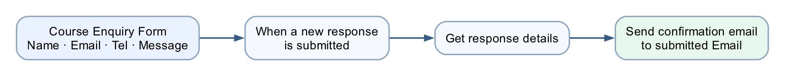

# Lab 1 — Trigger and Actions

*Form to email confirmation*

## Goal

Create and verify an **automated cloud flow** that starts when a learner submits a Microsoft Form and sends a personalised confirmation to the email address entered in the form.

## Duration

Approximately 40 minutes.

## Prerequisites

- Completed Lab 0
- Signed in to Microsoft Forms, Power Automate and Outlook with the course account
- Correct Power Platform environment selected
- A mailbox-enabled Microsoft 365 account

## Optional import accelerator

Import [Lab1-Form-to-Email-Confirmation-NEW.zip](Lab1-Form-to-Email-Confirmation-NEW.zip)
through **My flows → Import → Import Package (Legacy)** and choose **Create as
new**. Reconnect Microsoft Forms and Outlook, select the Course Enquiry Form,
then replace every `MAP_*_AFTER_IMPORT` placeholder with the matching dynamic
answer before saving. The imported flow name ends with **`(NEW)`**.

## Scenario

A training administrator needs every website-style course enquiry to receive an immediate acknowledgement. The requester, not the flow owner, must receive the message.

## Form design

Create a form named `Course Enquiry Form` with four **Required** questions:

| Question | Type | Setting |
|---|---|---|
| Name | Text | Required |
| Email | Text | Required |
| Tel | Text | Required |
| Message | Text | Required; Long answer enabled |

## Workflow visual



The form submission starts the flow. **Get response details** retrieves the four answers, and Outlook sends the confirmation to the submitted email address.

## Expected result

```text
One form submission
→ one successful Power Automate run
→ one personalised email to the submitted address
```

## Detailed step-by-step

### Part A — Create the Microsoft Form

1. Open `https://forms.office.com`.
2. Confirm the profile icon shows your course account.
3. Select **New Form**.
4. Select **Untitled form** and enter `Course Enquiry Form`.
5. In the description, enter `Submit your contact details and course enquiry.`
6. Select **Add new**.
7. Choose **Text**.
8. Enter `Name`.
9. Turn **Required** on.
10. Select **Add new → Text**.
11. Enter `Email`.
12. Turn **Required** on.
13. Select **Add new → Text**.
14. Enter `Tel`.
15. Turn **Required** on.
16. Select **Add new → Text**.
17. Enter `Message`.
18. Turn **Required** on.
19. Select the question's **… More settings for question** menu.
20. Turn **Long answer** on.
21. Select **Collect responses** and confirm the form is available to the intended classroom users.
22. Close the collection panel without submitting yet.

### Part B — Create the automated cloud flow

1. Open `https://make.powerautomate.com`.
2. Check the environment selector in the top-right corner.
3. Select the same course environment used in Lab 0.
4. In the left navigation, select **Create**.
5. Select **Automated cloud flow**.
6. In **Flow name**, enter `Lab 1 - Form Email Confirmation`.
7. In **Choose your flow's trigger**, search for `Microsoft Forms`.
8. Select **When a new response is submitted**.
9. Select **Create**.
10. Open the trigger card if it is collapsed.
11. In **Form Id**, select `Course Enquiry Form`.
12. Select the **+** below the trigger.
13. Select **Add an action**.
14. Search for `Get response details`.
15. Choose **Microsoft Forms — Get response details**.
16. In **Form Id**, select `Course Enquiry Form`.
17. Click inside **Response Id**.
18. Open **Dynamic content**.
19. Under the trigger, select **Response Id**.
20. Confirm the field displays a dynamic-content token, not typed words.

### Part C — Configure the confirmation email

1. Select the **+** below **Get response details**.
2. Select **Add an action**.
3. Search for `Send an email`.
4. Choose **Office 365 Outlook — Send an email (V2)**.
5. If prompted, select **Sign in** and connect the mailbox-enabled course account.
6. Click inside **To**.
7. From **Dynamic content**, select the form answer **Email**.
8. In **Subject**, enter:

```text
Thank you for your enquiry
```

9. Click inside **Body**.
10. Enter `Hello `.
11. Insert the **Name** dynamic-content token.
12. Continue the body with:

```text
,

Thank you for your enquiry. We received the following message:
```

13. On the next line, insert the **Message** token.
14. Add:

```text

We will contact you shortly.
```

15. Check that **To**, **Name** and **Message** are coloured tokens.
16. Select **Save**.
17. Wait for the saved confirmation.

### Part D — Submit and test

1. Return to `Course Enquiry Form`.
2. Select **Preview**.
3. Complete the form with:
    - Name: `Jane Tan`
    - Email: an address you can access
    - Tel: `61234567`
    - Message: `Please send me the next course schedule.`
4. Select **Submit** once.
5. Return to Power Automate.
6. Open **My flows → Lab 1 - Form Email Confirmation**.
7. Open the newest item in **28-day run history**.
8. Confirm the trigger, Get response details and email action each show a green check.
9. Open the email action.
10. Verify its **Inputs** show the submitted address.
11. Open Outlook for that address.
12. Confirm exactly one email arrived.
13. Confirm the greeting says `Hello Jane Tan`.
14. Confirm the submitted message is reproduced correctly.

## Checkpoint

Retain:

- the completed form Preview;
- the successful flow run;
- the email showing the correct recipient, name and message.

## Troubleshooting

| Symptom | Check |
|---|---|
| No run starts | The trigger's Form Id must match the form you submitted |
| Blank answers | Response Id must be the trigger's dynamic token; both Form Id values must match |
| Email goes to the maker | Use the form's `Email` answer in **To**, not a fixed address |
| `Name` appears literally | Delete typed text and insert the dynamic-content token |
| Outlook action is unauthorised | Reconnect with a mailbox-enabled Microsoft 365 account |
| Repeated emails | Confirm only one enabled flow watches this form and submit only once |

## Key takeaways

- A form submission is an event, so this is an **automated cloud flow**.
- The Forms trigger supplies a Response Id; Get response details supplies the answers.
- Dynamic content connects submitted data to the email action.
- Run history and the received email are both required evidence.

---

**Next:** [Lab 2 — Log the Enquiry to Excel](../Lab%202%20-%20Log%20to%20Excel/index.md)
