# Lab 1 — Trigger and Actions

*Form to email confirmation*

## Goal

Build and publish a Copilot Studio **workflow** named `Lab 1 - Trigger and Actions` that starts when a learner submits a Microsoft Form and sends a personalised confirmation to the email address entered in the form.

## Duration

Approximately 30 minutes.

## Prerequisites

- Completed Lab 0 — Copilot Studio open, the **Training Class** environment your trainer assigned (for example **Training Class 1**) showing bottom-left, **New experience** on
- Signed in to Microsoft Forms (`https://forms.cloud.microsoft`) and Outlook with the same course account
- The trainer's form `Lab 1 - Course Enquiry Form` already exists in the tenant — you may use it directly or create your own copy (Part A)
- A mailbox-enabled Microsoft 365 account
- A finished reference copy named `Lab 1 - Trigger and Actions (DO NOT DELETE)` exists in the master reference environment `TGS-2022017524-Business Process Automation with Power Automate and Copilot Studio Agents` (a Sandbox environment, read-only for learners). Open it to compare with your own build; never edit or delete it — you build your own copy in your **Training Class** environment

## Scenario

A training administrator needs every website-style course enquiry to receive an immediate acknowledgement. The requester, not the workflow owner, must receive the message.

## Form design

The trainer has already created a form named `Lab 1 - Course Enquiry Form` in the course tenant with four **Required** questions. You can use the trainer's form directly, or build your own copy from the one-page rebuild sheet in [assets/Lab 1 - Course Enquiry Form.md](assets/Lab%201%20-%20Course%20Enquiry%20Form.md) — the workflow steps are identical either way.

| Question | Type | Setting |
|---|---|---|
| Name | Text | Required |
| Email | Text | Required |
| Tel | Text | Required |
| Message | Text | Required; Long answer enabled |

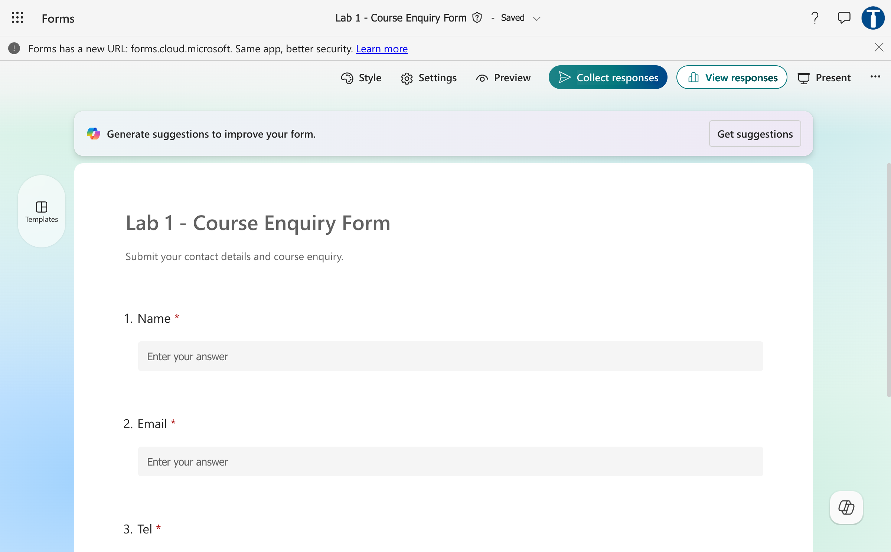

*Figure 1.1 — The trainer's Lab 1 - Course Enquiry Form: Name, Email, Tel (and Message) all Required*

## Workflow visual


The form submission triggers the workflow at the **Start** node. **Get response details** retrieves the four answers, and Outlook sends the confirmation to the submitted email address.

## Expected result

```text
One form submission
→ one run of "Lab 1 - Trigger and Actions" in the Activity tab, every node green
→ one personalised email to the submitted address
```

## The designer you are about to use

Every lab in this course is built in the Copilot Studio **workflow designer** (new experience). Its parts, so the steps below make sense:

| Part | Where | What it does |
|---|---|---|
| Workflow name | Top bar — `Untitled workflow`, next to a **Draft** / **Published** pill | Click it, type the name, press Enter |
| Tabs **Build \| Activity \| Monitor** | Top bar, centre | Build is the canvas; **Activity** lists every run with per-node **Run Details** |
| **Save** icon, **Run** (▷), `…`, **Publish** | Top bar, right | Save keeps a draft; **Publish** is what makes a trigger live |
| **Start** node | Already on the canvas | Holds the **trigger**. Its panel has **Connection**, a **Trigger type** dropdown (*Manual* by default; also *Connector*, *When an agent calls the workflow*, *HTTP request*) and then the trigger's own fields (e.g. **Form ID**) |
| **Add** panel | Left side | Node types: **Agent, Classify, Copilot, Human review, Connector, Function, Variable, If/Else, Loop, Note** |
| **+** below a node | On the canvas | Opens the **Add** dialog: a **Search** box and two tabs, **Featured** (Favorites: Variable, Connectors, Function; Actions: Agent, Classify, Copilot, Human review, If/Else, Switch, Loop…) and **Connectors** (Forms, Outlook, Excel, Teams…) |
| Node panel | Right side | **Configure** tab with the node's fields; **Run node** / **Run Details** for test output |
| ⚡ dynamic content | Icon beside any field | Inserts a token from an earlier node — never type an expression by hand. `</>` beside it is the expression editor |

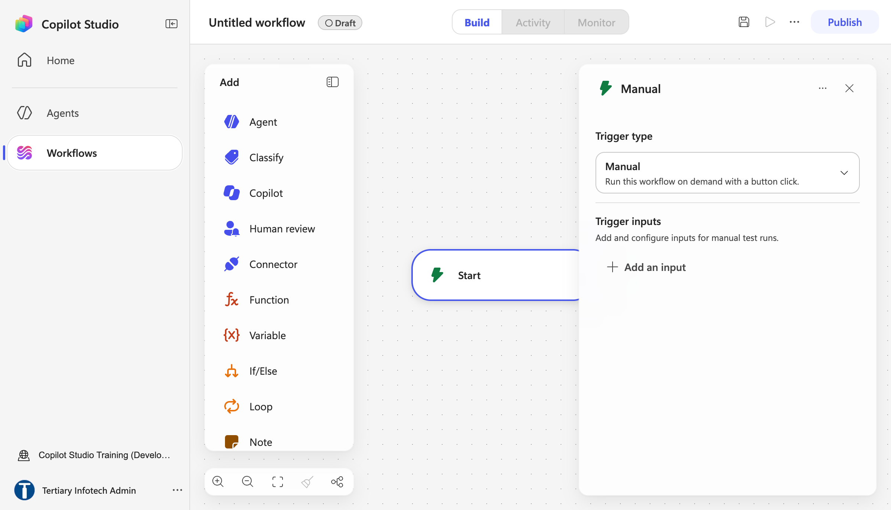

*Figure 1.2 — A new workflow: the Add panel (left), the Start node, and its panel with Trigger type = Manual and Add an input (right)*

## Detailed step-by-step

### Part A — Open (or create) the Microsoft Form

**Using the trainer's form (fastest):**

1. Open `https://forms.cloud.microsoft` (the old `forms.office.com` address redirects there).
2. Confirm the profile icon (top right) shows your course account.
3. Under **Recent** or **Shared with me**, open `Lab 1 - Course Enquiry Form` and confirm it has the four questions in the table above. Go to Part B.

**Creating your own copy (optional, ~5 minutes):**

1. On the Forms home page select **New Form**.
2. Select **Untitled form** and enter `Lab 1 - Course Enquiry Form` (in a shared classroom tenant add your initials, e.g. `Lab 1 - Course Enquiry Form - JT`, so you can tell it apart in the Form ID dropdown later).
3. In the description, enter `Submit your contact details and course enquiry.`
4. Select **Add new** → **Text**, enter `Name`, and turn **Required** on (the toggle at the bottom right of the question card).
5. **Add new → Text**, enter `Email`, **Required** on.
6. **Add new → Text**, enter `Tel`, **Required** on.
7. **Add new → Text**, enter `Message`, then turn on both toggles at the bottom of the card: **Long answer** and **Required**.
8. Select **Settings** (top right) and, under **Who can fill in this form**, choose **Anyone can respond** so learners can submit without switching accounts (the trainer's form uses the tenant-only setting).
9. Select **Collect responses** once to confirm the form is live, then close the panel without submitting yet.

### Part B — Create the workflow and its trigger

1. Open `https://copilotstudio.microsoft.com`.
2. Confirm your **Training Class** environment is showing bottom-left.
3. In the left navigation, select **Workflows**.
4. Select **New workflow** (top right). The designer opens with the **Add** panel on the left, a **Start** node on the canvas and the Start node's panel on the right (Figure 1.2).
5. Click the workflow name at the top (`Untitled workflow`), type exactly `Lab 1 - Trigger and Actions`, and press **Enter**.
6. In the Start panel, open the **Trigger type** dropdown (it reads *Manual — Run this workflow on demand with a button click*) and choose **Connector** (*Trigger from an external service*).
7. A **Select a trigger** dialog opens listing connectors (Office 365 Outlook, Microsoft Teams, SharePoint, OneDrive, Excel Online (Business)…). In its **Search** box type `Microsoft Forms`.
8. Under **Microsoft Forms**, select the trigger **When a new response is submitted**.

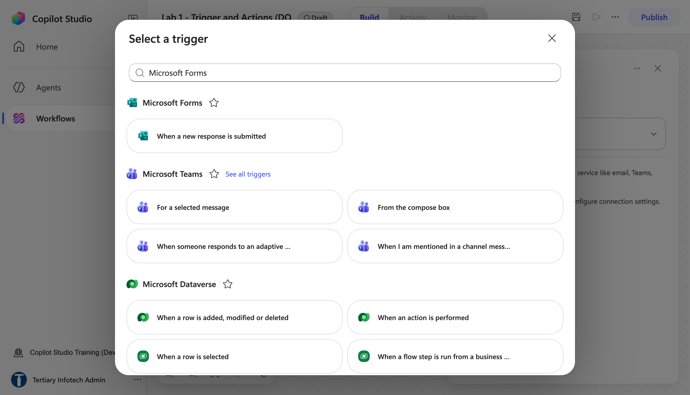

*Figure 1.3 — Select a trigger: search `Microsoft Forms` → When a new response is submitted*

9. The Start node is renamed *When a new response is submitted* and shows a **Needs setup** badge. Its panel now has three parts: **Connection**, **Trigger type** (= Connector) and **Form ID**.
10. Look at the **Connection** row. It must show your account with a **green tick**. If it does not, open the row's dropdown, select **Create new connection** and sign in with the course account — the tick appears when the connection is made.
11. In **Form ID** (*Pick a form.*), open the dropdown and select `Lab 1 - Course Enquiry Form` (or your own copy). The *Needs setup* badge disappears.

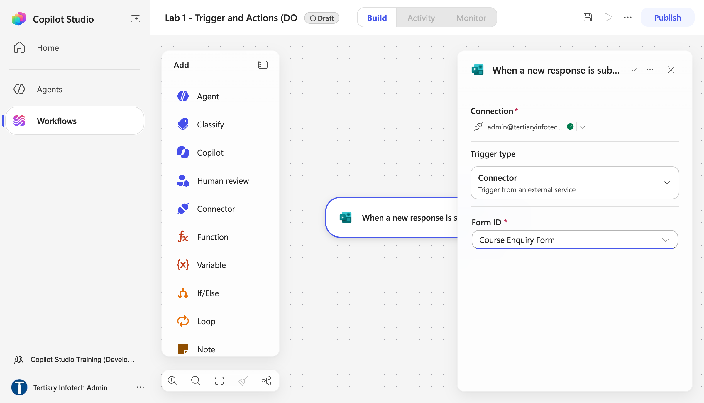

*Figure 1.4 — Start node configured: Connection ✓, Trigger type = Connector, Form ID = the Course Enquiry Form (trainer's reference copy shown)*

12. Select the **Save** icon (top right).

### Part C — Add Get response details

1. Hover below the Start node and select the **+** that appears. The **Add** dialog opens with a **Search** box and two tabs, **Featured** and **Connectors**.

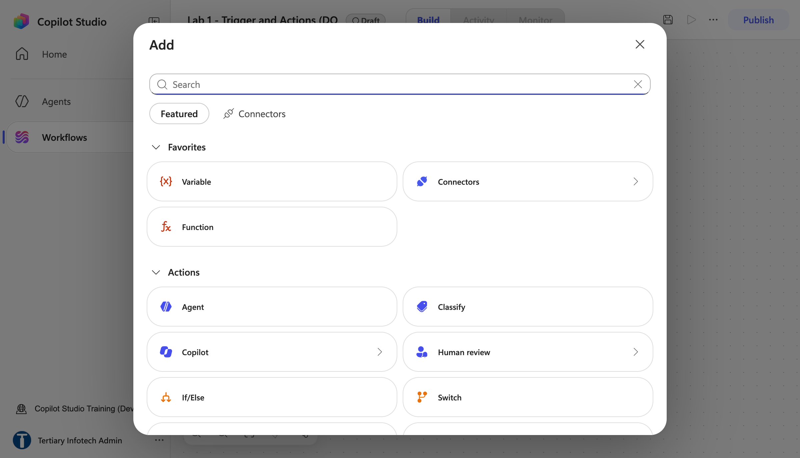

*Figure 1.5 — The Add dialog opened from +: Search, Featured (Favorites and Actions) and the Connectors tab*

2. Type `Get response details` in the Search box (or open the **Connectors** tab and search `Microsoft Forms`). Under **Microsoft Forms**, select the action **Get response details**.

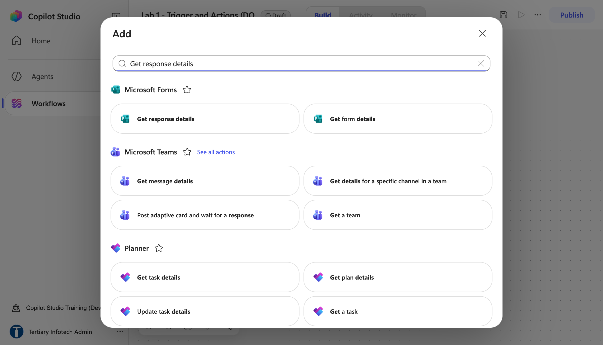

*Figure 1.6 — Search `Get response details`: the Microsoft Forms action Get response details (and Get form details)*

3. The node appears after the Start node and its panel opens on the **Configure** tab. Confirm **Connection** shows the green tick.
4. In **Form ID**, select `Lab 1 - Course Enquiry Form` again — the same form as the trigger.
5. Click inside **Response ID**. The designer suggests a **Response Id** chip directly under the field — click it. (Alternatively select the **⚡** icon above the field: the dynamic-content panel lists the outputs of every node before this one; under *When a new response is submitted*, choose **Response Id**.)
6. Confirm the field now shows a coloured **Response Id** token, not typed words.

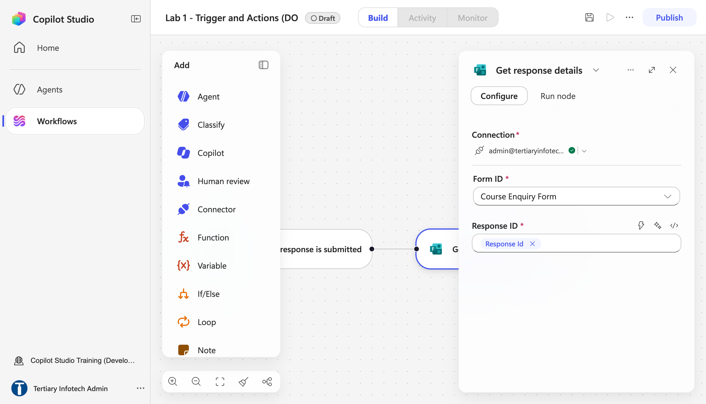

*Figure 1.7 — Get response details: Form ID = the form, Response ID = the trigger's Response Id token*

7. Select **Save**.

### Part D — Configure the confirmation email

1. Select the **+** below **Get response details**.
2. In the **Add** dialog search `Send an email` (or open **Connectors** → `Office 365 Outlook`). Select the Office 365 Outlook action **Send an email** (the connector's *Send an email (V2)*). The node opens with **Connection**, **To**, **Subject** and **Body**; the Body is a rich-text editor with ⚡ in its toolbar.
3. If the connection row has no green tick, open its dropdown, select **Create new connection** and sign in with the mailbox-enabled course account.
4. Select the **⚡** icon at the right of the **To** label. The **Search dynamic content** panel opens with a **Get response details (6)** group listing Tel, Name, Message, Email and Responders' Email.
5. Choose **Email** (the form answer). The To field shows an **Email** token. Do **not** type an address or an expression here — a typed expression in this field fails at run time with a trailing-newline error; a ⚡ token does not.

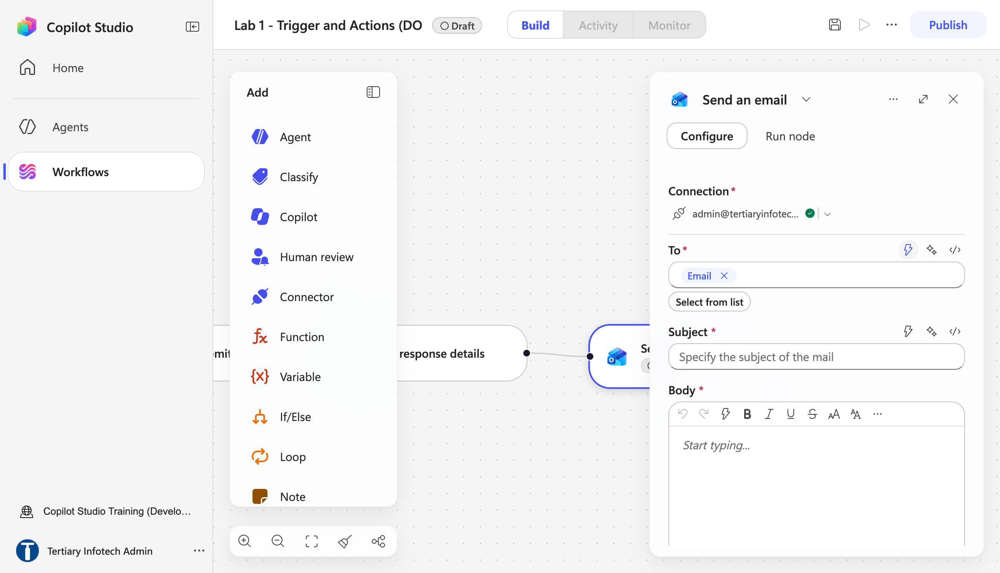

*Figure 1.8 — Send an email: To = the Get response details → Email token (inserted with ⚡, not typed)*

6. In **Subject**, enter:

```text
Thank you for your enquiry
```

7. Click inside **Body**.
8. Enter `Hello ` (with a trailing space).
9. Select **⚡** in the Body toolbar and insert the **Name** token.
10. Continue the body with:

```text
,

Thank you for your enquiry. We received the following message:
```

11. On the next line, insert the **Message** token with **⚡**.
12. Add:

```text

We will contact you shortly.
```

13. Check that **To**, **Name** and **Message** are coloured tokens. The canvas now shows three nodes in a row: *When a new response is submitted → Get response details → Send an email*.

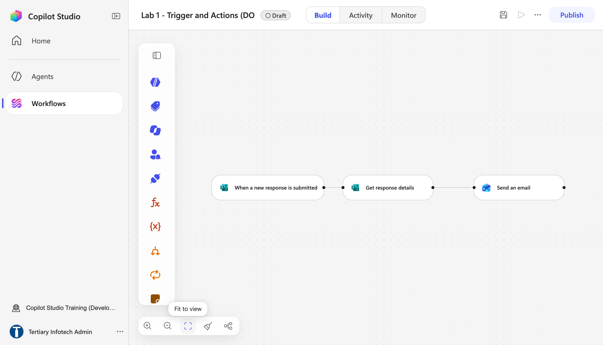

*Figure 1.9 — The finished canvas: When a new response is submitted → Get response details → Send an email (Draft)*

14. Select **Save**.
15. Select **Publish** (top right) and confirm. The pill beside the workflow name changes from **Draft** to **Published**. A workflow only listens for its trigger once it is **published** — a saved draft never fires.

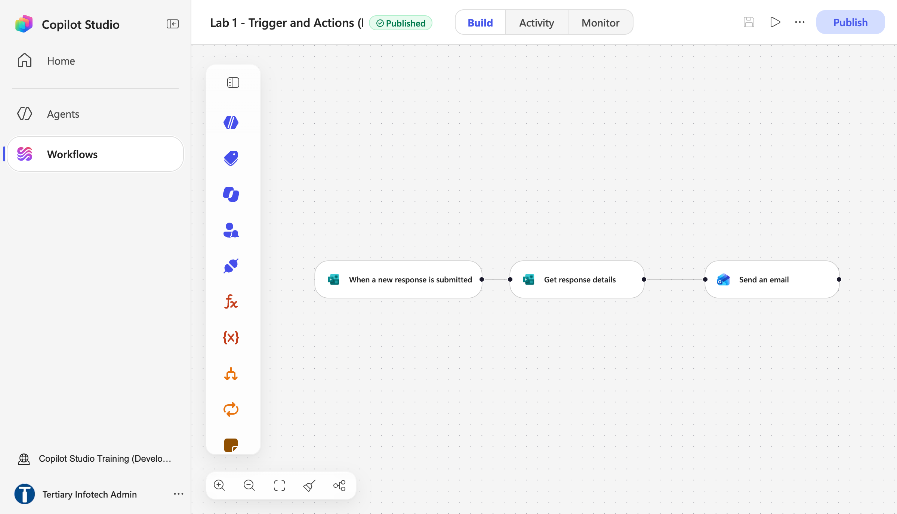

*Figure 1.10 — After Publish: the pill next to the name reads Published (trainer's reference copy `Lab 1 - Trigger and Actions (DO NOT DELETE)`)*

16. Return to the **Workflows** list. `Lab 1 - Trigger and Actions` shows **Status = Published** and the **Enabled** toggle on.

### Part E — Submit and test

1. Return to `Lab 1 - Course Enquiry Form` in Microsoft Forms.
2. Select **Preview** (or **Collect responses** → open the link).
3. Complete the form with:
    - Name: `Jane Tan`
    - Email: an address you can access
    - Tel: `61234567`
    - Message: `Please send me the next course schedule.`
4. Select **Submit** once. Forms shows *Your response was submitted.*
5. Return to Copilot Studio, open `Lab 1 - Trigger and Actions`, and select the **Activity** tab. The Activity panel lists each run with a green tick and its duration (about **1 s** for this workflow); a new run appears within a minute — use the refresh icon if needed.

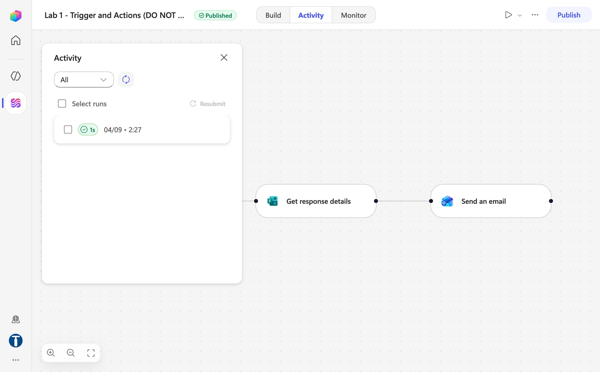

*Figure 1.11 — Activity tab: the run from the form submission, succeeded in 1 s (trainer's reference copy)*

6. Click the run. The canvas shows the trigger, **Get response details** and **Send an email** each with a green tick.
7. Select the **Send an email** node and open its **Run Details** tab.
8. Under **Inputs**, verify **To** shows the submitted address.
9. Open Outlook for that address.
10. Confirm exactly one email arrived with the subject *Thank you for your enquiry*.
11. Confirm the greeting says `Hello Jane Tan`.
12. Confirm the submitted message is reproduced correctly.

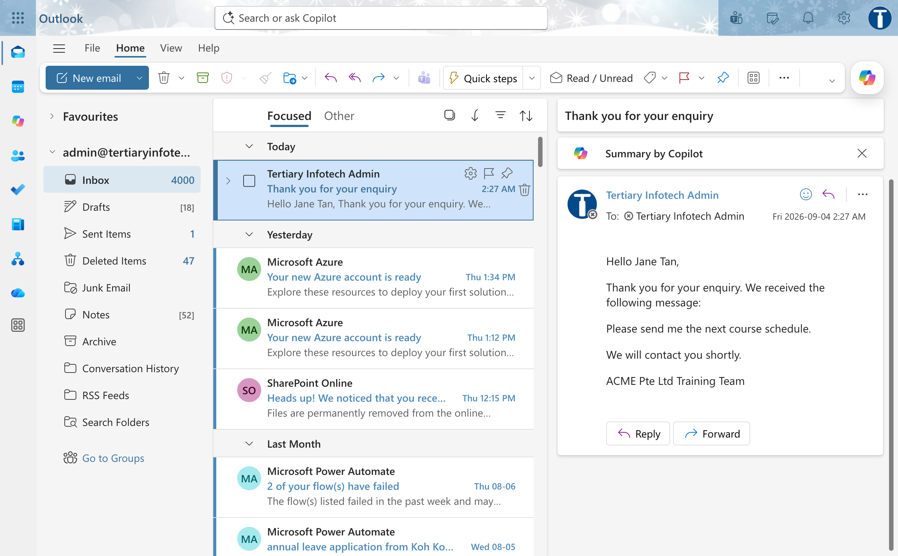

*Figure 1.12 — The confirmation email in Outlook: Hello Jane Tan, the submitted message, We will contact you shortly*

13. Open the trainer's `Lab 1 - Trigger and Actions (DO NOT DELETE)` and compare its three nodes with yours. Close it without changing anything.

## Checkpoint

Retain:

- the completed form Preview;
- the successful run of `Lab 1 - Trigger and Actions` in the Activity tab;
- the email showing the correct recipient, name and message.

## Troubleshooting

| Symptom | Check |
|---|---|
| No run appears in Activity | The workflow is not **Published**, or is disabled in the Workflows list, or the trigger's Form ID does not match the form you submitted |
| Blank answers, or the run fails at *Get response details* with **BadRequest** and `response_id = null` in Run Details | Response ID must be the trigger's ⚡ **Response Id** token; both Form ID values must match |
| Email goes to the maker | Use the form's `Email` answer in **To**, not a fixed address |
| `Name` appears literally | Delete the typed text and insert the ⚡ token |
| Send an email fails with `…\n` in the error | An expression was typed into **To**. Delete it and insert the **Email** token with ⚡ |
| Outlook action is unauthorised | Reconnect with a mailbox-enabled Microsoft 365 account |
| Repeated emails | Confirm only one enabled workflow watches this form and submit only once |
| The workflow is missing from the Workflows list | Check the environment bottom-left — it was probably built in a different environment |
| Edits have no effect | You changed the draft but did not **Publish** again — the trigger runs the published version |

## Key takeaways

- A form submission is an **event**; the **Start** node's connector trigger is what turns that event into a run.
- The Forms trigger supplies a Response Id; **Get response details** supplies the answers.
- Dynamic content connects submitted data to the email action — inserted with the ⚡ picker, never typed.
- **Publish** is what makes a trigger live; the **Activity** tab and the received email are both required evidence.
- Name your workflow exactly as the lab is titled (`Lab 1 - Trigger and Actions`) — every later workflow and agent follows the same rule, and the trainer's `(DO NOT DELETE)` copy is there to compare against.

---

**Next:** [Lab 2 — Log to Excel](../Lab%202%20-%20Log%20to%20Excel/index.md)
