# Lab 10 — Calling Agent from Workflow

*A blog-writer workflow: topic in, Teams post out*

## Goal

Build a Copilot Studio workflow named `Lab 10 - Calling Agent from Workflow` that collects a blog topic at the Start node, has **M365 Copilot** draft the blog post, and posts the draft to the **General** channel of the `Tertiary Infotech - WSQ Courses` team in Microsoft Teams.

## Duration

Approximately 25 minutes.

## Prerequisites

- Copilot Studio access in the course environment (**Training Class** environment showing bottom-left), with Copilot Credits — workflows consume credits on every run
- **New experience** on (the left navigation reads Home · Agents · Workflows)
- Microsoft Teams access, and membership of the `Tertiary Infotech - WSQ Courses` team — the only team in the course tenant
- Permission to post messages to that team's **General** channel
- A finished reference copy named `Lab 10 - Calling Agent from Workflow (DO NOT DELETE)` exists in the master reference environment `TGS-2022017524-Business Process Automation with Power Automate and Copilot Studio Agents` (a Sandbox environment, read-only for learners; workflow names have no length cap; only agent names are capped at 30 characters). Compare against it; never edit or delete it — you build your own copy in your **Training Class** environment

## Scenario

The Learning & Development team wants a one-step way to turn an idea into a shareable draft. Anyone runs the workflow and types a topic; the model writes a short blog post; the draft lands in the `Tertiary Infotech - WSQ Courses` team's General channel where colleagues can read and comment. Unlike Labs 5–9, nobody converses with an agent here — the **workflow calls the model** at a fixed step, then acts on the result deterministically.

## Workflow visual

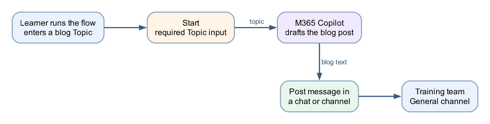

Three nodes: **Start** (with a Topic input) → **Copilot** (the M365 Copilot node, renamed *Draft the blog post*) → **Post message in a chat or channel** (Tertiary Infotech - WSQ Courses · General).

## Expected result

```text
Run "Lab 10 - Calling Agent from Workflow" with Topic = "How AI agents are changing business process automation"
→ one run in Activity (about a minute — the trainer's run took 1 m 9 s)
→ one post by the Flow bot in Teams → Tertiary Infotech - WSQ Courses → General, on that topic
```

## Detailed step-by-step

### Part A — Create the workflow

1. Open `https://copilotstudio.microsoft.com`.
2. Confirm your **Training Class** environment is showing bottom-left. Workflows consume Copilot Credits, and the Default environment may have none.
3. In the left navigation, select **Workflows**.
4. Select **New workflow** (top right; ignore its dropdown arrow).
5. The workflow designer opens with a **Start** node already on the canvas.
6. Rename the workflow: select the name at the top left, type exactly `Lab 10 - Calling Agent from Workflow`, and confirm.
7. Select **Save** so the workflow exists before you configure it.

### Part B — Configure the Start node with a Topic input

1. Select the **Start** node to open its configuration panel.
2. **Trigger type** is a dropdown; leave it at **Manual** (*Run this workflow on demand with a button click*) — the classroom workflow is run by a person, not by an event.
3. Under **Trigger inputs** (*Add and configure inputs for manual test runs*), select **Add an input**.
4. In *Choose the type of user input*, choose **Text**.

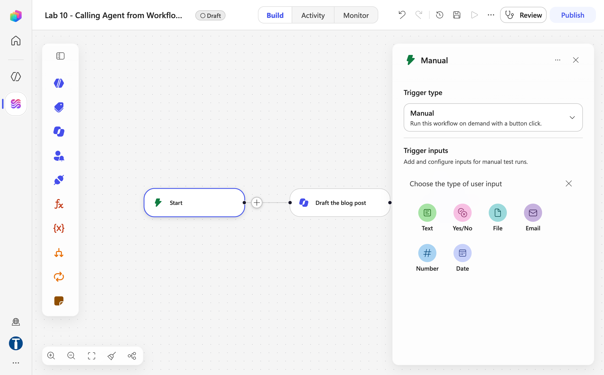

*Figure 10.1 — The Start node panel: Trigger type Manual, then Add an input opens Choose the type of user input (Text, Yes/No, File, Email, Number, Date) — trainer's reference copy*

5. A new input row appears with the placeholder name `Text`. Click the name and replace it with `Topic`.

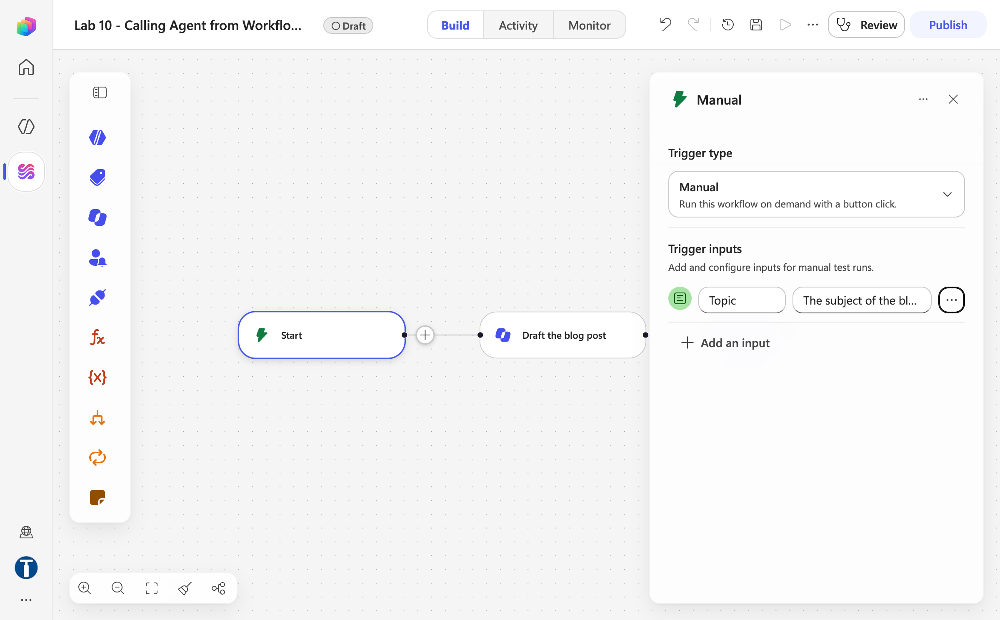

*Figure 10.2 — The new input row under Trigger inputs, still carrying its default name Text, before it is renamed Topic*

6. In the row's description field, enter `The subject of the blog post`.

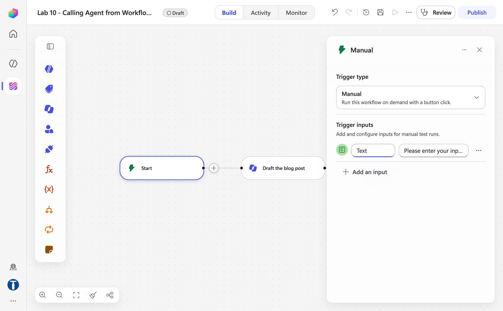

*Figure 10.3 — The Topic text input with its description The subject of the blog post*

7. Leave the input required (no default value — every run should state its topic).
8. Select **Save**.

### Part C — Add the Copilot node to draft the blog

1. On the canvas, select **+** on the connector after **Start**. The **Add** dialog opens with a Search box and two tabs, **Featured | Connectors**.
2. On **Featured**, under *Actions*, select **Copilot** — this is the M365 Copilot node (the left **Add** panel lists the same item). Be precise — selecting an item *creates* a node, and an accidental extra node must be deleted (undo does not remove it).
3. Select the new **Copilot** node to open its configuration, and click its title to rename it `Draft the blog post` — the name is what the ⚡ picker shows later.
4. If a **Connection** field is shown, confirm it is signed in as your course account.
5. In the node's single **Message** field, **type** the following as plain text, leaving a gap where the topic goes:

```text
Write a short, engaging blog post of about 300 words on the topic below. Give it a title line, a two-sentence introduction, three short paragraphs with one key point each, and a one-sentence conclusion. Write in plain professional English for a general business audience.

Topic:
```

6. Place the cursor after `Topic:` and insert the **Topic** input using the **⚡ dynamic content picker** — select the lightning-bolt icon and pick **Topic** from the Start node's outputs. A coloured token appears.

| Slot in the prompt | Insert with ⚡ |
|---|---|
| after `Topic:` | Start → **Topic** |

   - **Never paste an expression** such as `@{...}` into this editor. It is a rich-text editor and silently mangles pasted references; the workflow then runs green while the model receives an empty topic.
7. The node has one output, **Response** — plain text, which is what the next node needs.
8. Select **Save**.

### Part D — Post the draft to the General channel

1. Select **+** on the connector after the **Draft the blog post** node.
2. In the **Add** dialog, switch to the **Connectors** tab, search `Microsoft Teams` and pick the action **Post message in a chat or channel**.
3. Select the new node to open its configuration (**Configure** tab).
4. The **Connection** field shows your course account with a green tick; if it does not, create the Microsoft Teams connection with your course account.
5. Set **Post as** to `Flow bot` (posting as `User` requires the workflow to act as you; the bot makes the automation visible as automation).
6. Set **Post in** to `Channel`.

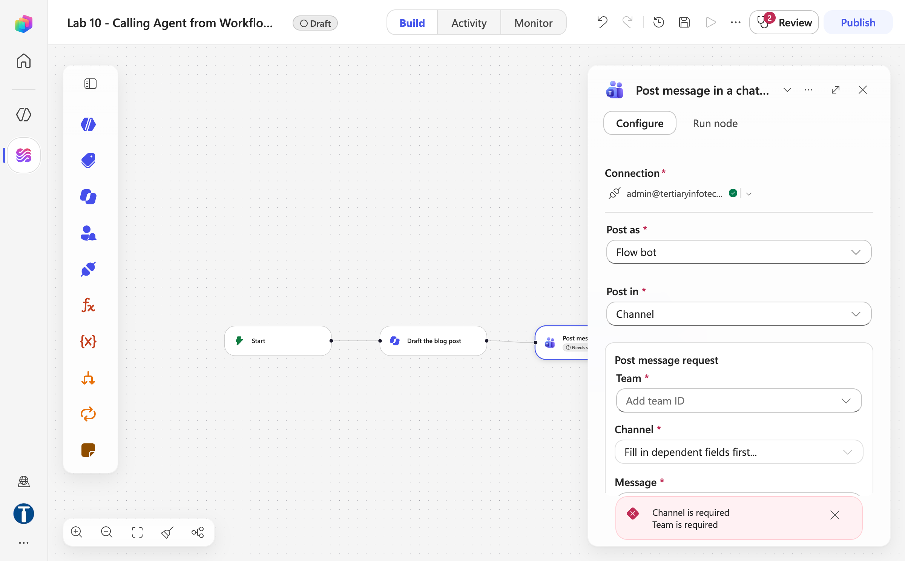

*Figure 10.4 — Post message in a chat or channel: Connection with the green tick, Post as Flow bot, Post in Channel*

7. Under *Post message request*, set **Team** to `Tertiary Infotech - WSQ Courses` — pick it from the dropdown; it is the only team in the tenant, and you must not type a name the dropdown has not offered.

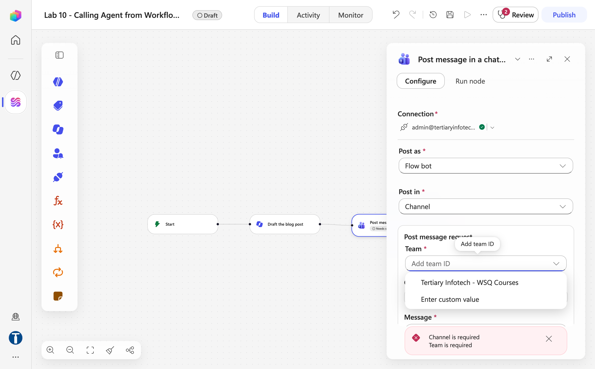

*Figure 10.5 — The Team dropdown offering Tertiary Infotech - WSQ Courses — the only team in the course tenant*

8. Set **Channel** to `General`.
9. Click into the **Message** field and insert the Draft the blog post node's **Response** output with the **⚡ dynamic content picker** — again, pick the token; do not type an expression.

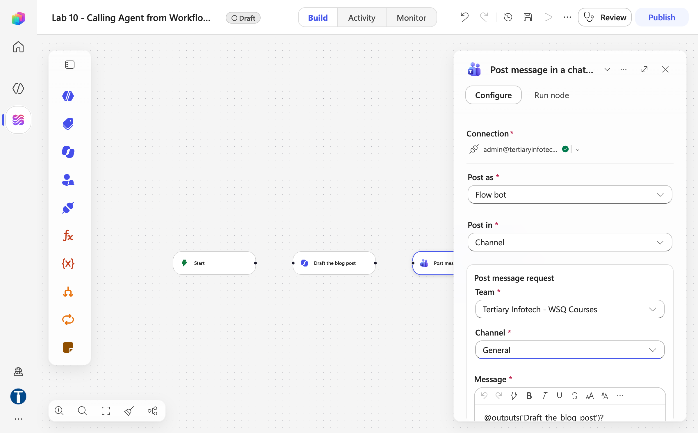

*Figure 10.6 — Team Tertiary Infotech - WSQ Courses, Channel General, and the Message field carrying the Draft the blog post Response output*

10. Select **Save**.
11. Do not drag nodes to rearrange them afterwards — **moving a node clears its configuration** and the unconfigured node is then skipped silently at run time. If a node is ever moved, reopen it and refill every field.


*Figure 10.7 — The finished canvas: Start → Draft the blog post → Post message in a chat or channel — trainer's reference copy `Lab 10 - Calling Agent from Workflow (DO NOT DELETE)`*

### Part E — Publish, test and verify in Teams

1. Select **Publish**. The runnable workflow is the **published** version — saving a draft is not enough. The pill beside the name changes from **Draft** to **Published** and a banner reads *Your flow is ready to go. We recommend you test it.* Any server-side validation problem appears under the **Review** badge instead.

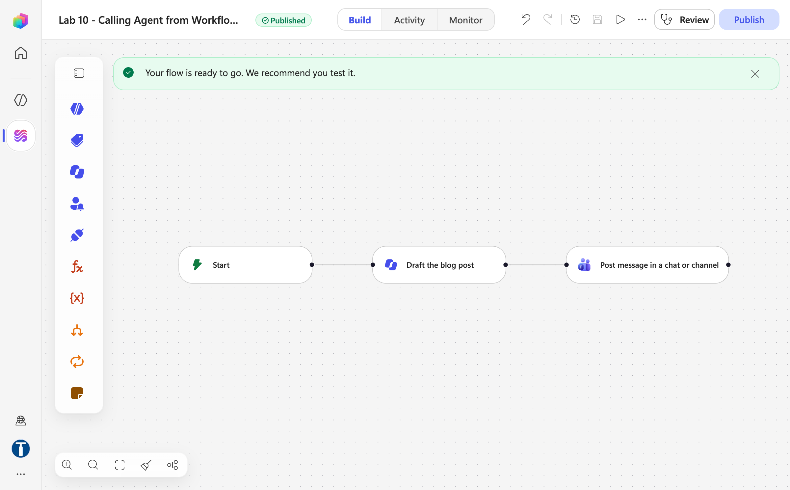

*Figure 10.8 — After Publish: the Published pill and the banner Your flow is ready to go. We recommend you test it.*

2. Run the workflow: select **Run** (the ▷ icon in the top bar). The *Enter manual trigger inputs* dialog asks for **Topic** (with your description under it); enter `How AI agents are changing business process automation` and select **Run**.

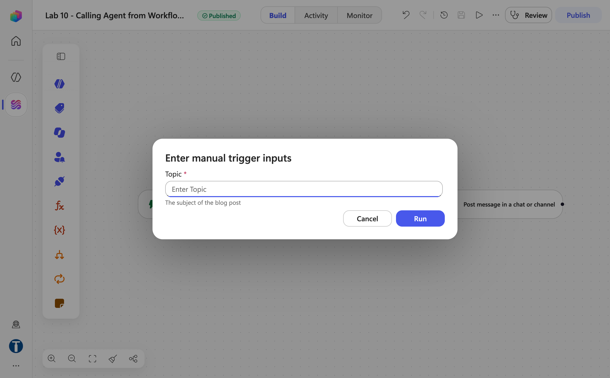

*Figure 10.9 — Run → the Enter manual trigger inputs dialog with the required Topic field and its description*

3. A banner says *Your flow was triggered successfully* and the **Activity** tab opens with the run marked **Running**. A run with one model call takes about a minute — the trainer's took 1 m 9 s (Copilot 1 m 3 s, Teams 5.5 s).

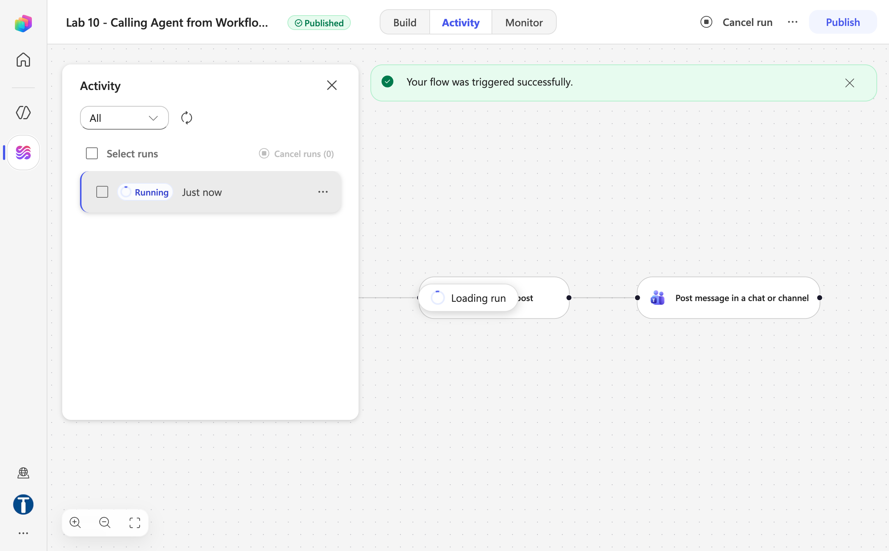

*Figure 10.10 — Your flow was triggered successfully: the Activity panel shows the run as Running while the Copilot node loads*

4. Open Microsoft Teams → **Tertiary Infotech - WSQ Courses** team → **General** channel.
5. Confirm the blog post appears, posted by the Flow bot (the *Workflows* app), with a title, introduction, three paragraphs and a conclusion.

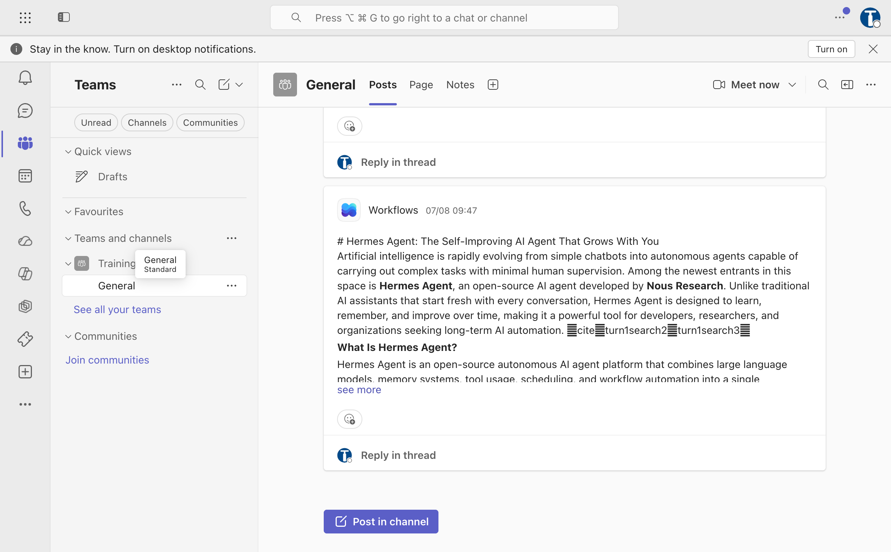

*Figure 10.11 — The Flow bot's post carrying the blog draft in the General channel in Microsoft Teams (a trainer's earlier run)*

6. Confirm the post is actually about the topic you typed. If it is generic or empty, the Topic token did not reach the model — reopen the M365 Copilot node and re-insert the token with the ⚡ picker.
7. Run the workflow again with a second topic, e.g. `Five tips for running effective hybrid meetings`, and confirm a second, different post arrives.
8. In Copilot Studio, open the workflow's **Activity** tab and review the run: each run is listed with its duration and time, and every node on the canvas shows its own timing. Select the **Draft the blog post** node and read its **Outputs** to see exactly what the model produced. This is the habit that matters — when a workflow misbehaves, read the upstream node's outputs before theorising.

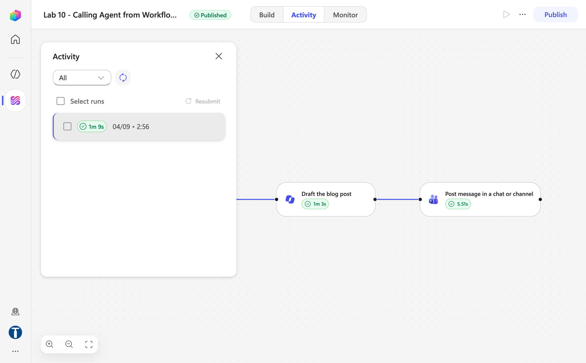

*Figure 10.12 — The Activity tab after the run: 1 m 9 s succeeded, Draft the blog post 1 m 3 s and Post message in a chat or channel 5.51 s*

## Checkpoint

- The workflow `Lab 10 - Calling Agent from Workflow` has exactly three configured nodes: Start (with a required `Topic` text input) → Copilot (*Draft the blog post*) → Post message in a chat or channel
- The Topic token and the blog-text token were both inserted with the ⚡ picker, not typed
- A test run posts a topic-specific blog draft to the General channel of `Tertiary Infotech - WSQ Courses`
- A second run with a different topic produces a different post
- The Activity tab shows the model's actual output under the Draft the blog post node

## Troubleshooting

| Symptom | Check |
|---|---|
| Run fails with `InsufficientMcsCredits` | You are in the wrong environment — switch to your **Training Class** environment; a licence does not fix this, credits are per-environment |
| Post appears but the blog ignores the topic, or is empty | The Topic reference was pasted or typed, not picked — reopen the Draft the blog post node, delete the reference, re-insert with the ⚡ picker |
| Teams node cannot find the `Tertiary Infotech - WSQ Courses` team | You are not a member of the team, or the connection is signed into a different account — join the team, or fix the connection. There is no "Training" team in this tenant |
| The Copilot node fails with *"You need credits to continue … Error code: EnforcementUsageCredits"* | The environment has **0 Copilot Credits** — the build is fine. The trainer allocates credits in the Power Platform admin center → **Licensing → Copilot Studio → Manage Copilot Credits**; Publishing works without credits, runs do not |
| A node shows "Needs setup" | It was moved or duplicated — reopen it and refill every field, including the connection |
| Message field rejects your typed expression | Expected — this field wants a ⚡ picker token, not a typed expression |
| Run uses an old version of the workflow | The published version is stale — publish again and confirm the pill reads **Published** with no **Review** badge |
| Nothing arrives in Teams but the run is green | Open the run in Activity and check each node's Inputs/Outputs — an unconfigured node is skipped silently |

## Key takeaways

- A workflow **calls the model as one step in a deterministic sequence** — the workflow decides when the model runs and what happens to its output, which is the opposite of a chat agent deciding for itself.
- The Start node's inputs are the workflow's contract: one required `Topic` field is what turns a private automation into a reusable team tool.
- Dynamic content must be inserted with the ⚡ picker. Typed or pasted expressions in these editors fail silently — the workflow stays green while the model receives nothing.
- The Teams post is the *action* half of the pattern: model output is only useful once the workflow delivers it where people already work.

---

**Next:** [Lab 11 — Calling Workflow from Agent](../Lab%2011%20-%20Calling%20Workflow%20from%20Agent/index.md)
