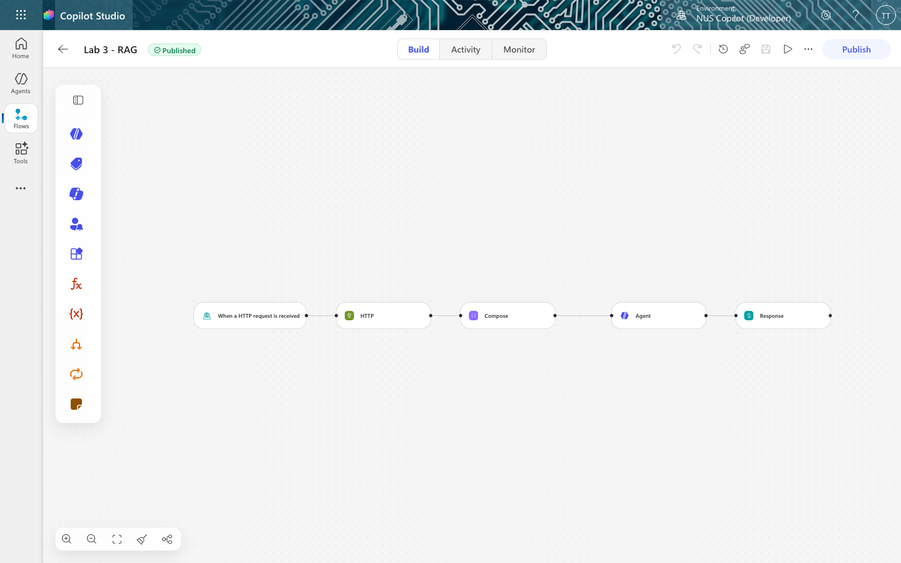
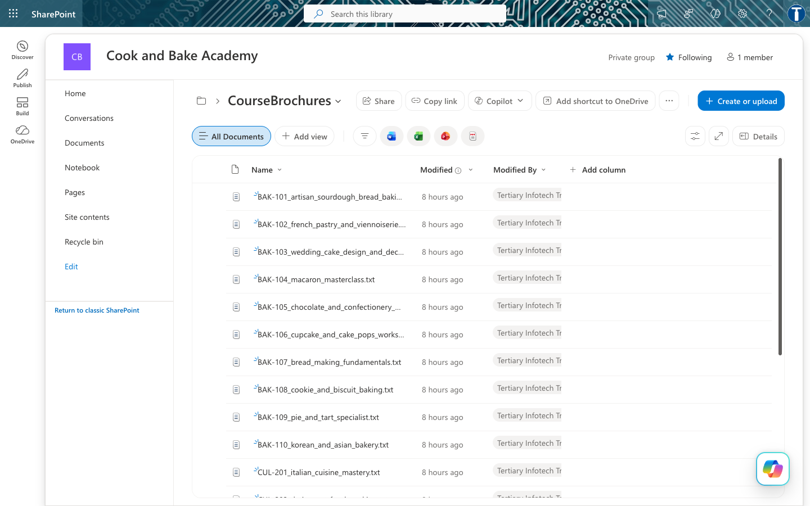
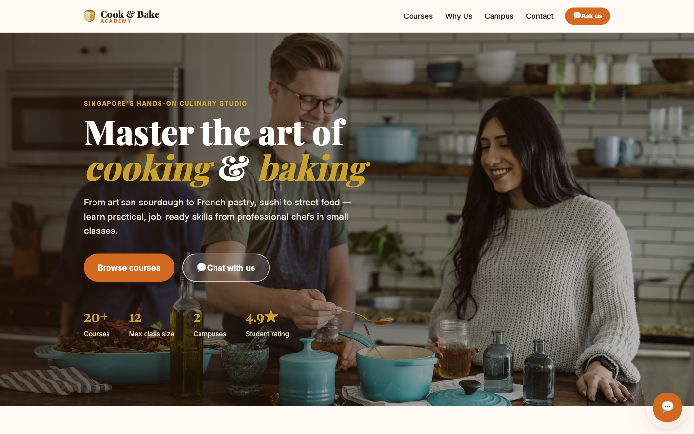

# Lab 10 — RAG with Pinecone

*Customer Care FAQ Chatbot with RAG — Copilot Studio + Pinecone*

**Module:** Module 5 — Retrieval Augmented Generation
**Duration:** 40 minutes
**You will use:** Microsoft Copilot Studio · Power Automate · SharePoint · Pinecone

**What you end up with:** a cooking-school website whose chat widget answers questions about
20 courses — fees, durations, levels, campuses — grounded entirely in the school's own brochures,
and which says *"we don't run that"* rather than inventing a course.


---

## Workflow visual


Ingestion happens once: the brochures are embedded and stored in Pinecone. On every question the
flow queries the index for the three nearest brochures, Compose pastes them into the prompt, and the
Agent answers from those alone.

---

## Scenario

**Cook & Bake Academy** (fictitious) runs 20 courses across two Singapore campuses. Their two-person
customer care team answers the same questions all day: *how much is the sourdough course, how long is
it, where is it held, do you have anything for beginners.*

Every answer is already written down. It is in the course brochures. The problem is not that nobody
knows the answer — it is that a human must find the right brochure, read it, and retype the relevant
sentence, forty times a day.

Worse, when the team is busy they answer from memory, and memory drifts. Last month someone quoted a
fee that was six months out of date.

---

## The design question

You could paste all 20 brochures into the agent's instructions. For 20 short brochures that would
even work. Then the academy adds 40 more courses, the instructions exceed what the model can read, it
starts ignoring the middle, and every question costs you the price of 60 brochures in tokens.

**RAG** — Retrieval Augmented Generation — turns the problem around. Instead of giving the model
everything and hoping it finds the answer, you **retrieve** only the two or three brochures that
resemble the question, and give it only those.

```
   ┌────────── ingestion — done once ───────────┐
   │  20 brochures → embed → stored as vectors  │
   └──────────────────────┬─────────────────────┘
                          │
  "how much is the        ▼          ┌──────────────┐
   sourdough course?" ───────────────▶│ search finds │
                                      │ the 3 nearest│
                                      │  brochures   │
   "BAK-101 costs S$680…" ◀───────────└──────────────┘
```

The agent never sees 17 of the 20 brochures. It sees the ones that matter, and answers from those.

### What "similar" means

An **embedding** turns a piece of text into a list of numbers — a vector — positioned so that text
about similar things lands close together. "How much is the sourdough course?" lands near the
sourdough brochure and far from the sushi one, **even though the two share no words**.

That last point is the whole reason to prefer vector search over keyword search. A customer who
misspells *viennoiserie*, or asks for "french pastry classes" when the brochure says
*Viennoiserie*, still finds BAK-102.

---

## What you are building

**One flow, five nodes.** Everything happens on one canvas.



```
When a HTTP     →   HTTP        →   Compose      →   Agent      →  Response
request is          POST to         builds the       answers        returns
received            Pinecone        prompt           from the       { reply }
(the question)      (retrieval)     (question +      brochures
                                     brochures)
```

| Node | What it does |
|---|---|
| **Trigger** | Receives the customer's question from the website |
| **HTTP** | Searches Pinecone, gets back the 3 most similar brochures |
| **Compose** | Glues the question and the brochures into one prompt |
| **Agent** | Reads that prompt and writes the answer |
| **Response** | Sends the answer back to the browser |

> **Plus one ingestion step, run once.** Task 1 loads the brochures into Pinecone with a short
> script. That is the *ingestion* half of RAG — it happens once, not per question. The five nodes
> above are the *retrieval* half, and they run on every message.
>
> store twice — once for writing, once for reading. Here it lives inside the Pinecone index, so the
> flow sends plain text and never touches a vector. Task 1d explains what that buys and costs.

---

## Prerequisites

- A Microsoft 365 account with **Copilot Studio** and **Power Automate** (premium — the HTTP action
  is a premium connector).
- A **Pinecone** account — the free tier is enough. Get an API key at
  [app.pinecone.io](https://app.pinecone.io) → *API keys*. It starts `pcsk_`.
- Python 3 (only for the one-off ingestion script — no libraries needed).

---

## Task 0 — Put the brochures somewhere real (10 min)

The brochures must live somewhere the academy actually maintains. We use SharePoint.

### 0a — Create a new site

1. Go to **https://YOURTENANT.sharepoint.com** → **Create site** → **Team site**
2. **Site name:** `Cook and Bake Academy`

> **Do not reuse another lab's site.** The knowledge and search connectors index at folder level.
> Point a course assistant at a library that also holds banking policies and it will answer a
> sourdough question out of a KYC document — a confident, wrong answer that is miserable to debug.

### 0b — Create the folder and upload

**Documents → + New → Folder** → `CourseBrochures`, then **Upload → Files** and select all 20 `.txt`
files from [`brochures/`](brochures/).



Confirm the library shows **20 items**.

> Open one — say [`BAK-101_artisan_sourdough_bread_baking.txt`](brochures/BAK-101_artisan_sourdough_bread_baking.txt)
> — and read it. Everything the chatbot will ever say is in files like this one. It has no other
> knowledge.

**SharePoint is the source of truth. Pinecone is the search copy.** That distinction matters: when a
fee changes, it changes in SharePoint, and the chatbot keeps quoting the old one until you re-run
Task 1.

---

## Task 1 — Ingest the brochures into Pinecone (20 min)

This is the **ingestion** half of RAG. It runs **once**. After it, the brochures exist in Pinecone as
vectors, and the flow you build in Tasks 2–6 only ever reads them.

### 1a — Get your Pinecone API key

[app.pinecone.io](https://app.pinecone.io) → **API keys** → copy the key (starts `pcsk_`).

```bash
export PINECONE_API_KEY=pcsk_your_key_here
```

### 1b — Run the ingestion script

```bash
cd labs/Lab 10 - RAG with Pinecone
python3 ingest_brochures.py
```

Read [`ingest_brochures.py`](ingest_brochures.py) before or after running it — it is deliberately
short and commented, and it is the only place in this lab where the embedding decisions are visible.

Expected output:

```
STEP 1  Create the index (integrated embedding)
  creating 'cookbake-brochures' with integrated embedding …
    dimension : 1024      <- chosen by the model, not by you
    embedding : llama-text-embed-v2
    metric    : cosine
  host: cookbake-brochures-XXXXXX.svc.aped-4627-b74a.pinecone.io

STEP 2  Upload the brochures as TEXT
  20 brochures, longest 2740 characters (~685 tokens — well under the model's 2048 limit)
  uploaded — HTTP 201

STEP 3  Verify
  vectors in index: {'(default)': 20}

  three test searches:

    Q: How much is the sourdough course?
       0.528  BAK-101   Course Fee    : SGD $680 …
       0.354  BAK-107   Course Fee    : SGD $480 …

    Q: Do you offer a Vietnamese pho cooking course?
       0.458  CUL-202   Course Fee    : SGD $540 …
       0.451  CUL-208   Course Fee    : SGD $540 …

Done. Paste this URL into your flow's HTTP node:

  https://cookbake-brochures-XXXXXX.svc.aped-4627-b74a.pinecone.io/records/namespaces/__default__/search
```

**Copy that last URL.** You need it in Task 3.

### 1c — What the script actually did

**Step 1 — created an index with an *integrated* embedding model:**

```json
POST https://api.pinecone.io/indexes/create-for-model
{
  "name": "cookbake-brochures",
  "cloud": "aws",
  "region": "us-east-1",
  "embed": {
    "model": "llama-text-embed-v2",
    "field_map": { "text": "chunk_text" }
  }
}
```

| Field | Meaning |
|---|---|
| `model` | **`llama-text-embed-v2`** — hosted by Pinecone. Produces **1024** numbers per text. |
| `field_map` | **The embedding configuration.** It says: *embed whatever arrives in the field called `chunk_text`.* |

The response reports `"dimension": 1024`. **You never chose that** — it is a property of the model.
Ask for a different model and you get a different dimension.

> **`field_map` is the single most misconfigurable thing here.** Name your field `text` or `content`
> on upload while `field_map` says `chunk_text`, and Pinecone stores the record with **no vector and
> no error**. Retrieval then returns nothing, forever, and nothing in the logs says why.

**Step 2 — uploaded the brochures as text**, one record per brochure, in NDJSON:

```
POST https://{HOST}/records/namespaces/__default__/upsert
Content-Type: application/x-ndjson

{"_id":"BAK-101","chunk_text":"…whole brochure…","source":"BAK-101_….txt","course_code":"BAK-101"}
{"_id":"BAK-102","chunk_text":"…","source":"…","course_code":"BAK-102"}
```

NDJSON is **one JSON object per line** — no wrapping array, no commas between lines. `chunk_text` is
embedded; every other field becomes filterable metadata you can return with a hit.

**Each brochure is one record, whole and unsplit.** That is the chunking decision — see
[Appendix A](#appendix-a--what-the-hosted-embedding-hid-from-you) for why it matters more than
anything else you will set today.

### 1d — You never computed an embedding. Neither will your flow.


On many vector-database platforms you attach an embedding model **twice** — once when writing and
once when querying — and if the two ever differ, retrieval degrades silently: no error, just worse
answers. Pinecone's *integrated inference* removes that whole class of fault:

| | With an integrated-inference index |
|---|---|
| Ingestion | Upload **text** — Pinecone embeds it for you |
| Query | Send **text** — Pinecone embeds it with the same model |
| Model choice | Pinecone's: `llama-text-embed-v2`, 1024 dimensions |
| Passage vs query | Handled by the index |
| Can the two mismatch? | **No** — there is only one model |


Here the model lives **inside the index**, so there is nothing to mismatch. The index config even
records the two modes for you:

```json
"write_parameters": { "input_type": "passage" },
"read_parameters":  { "input_type": "query" }
```

**What you bought:** a whole class of silent failure, removed.
**What you paid:** you cannot change the model, tune the dimension, or use a domain-specific
embedding without rebuilding the index from scratch.

---

## Task 2 — Create the flow (5 min)

1. Go to **copilotstudio.microsoft.com** → **Flows** → **New flow**
2. Trigger: **When a HTTP request is received**
3. Name it **`Lab 3 - RAG`**

### Trigger settings

| Field | Value |
|---|---|
| Who can trigger | **Anyone (no authentication)** — the browser posts anonymously |
| Relative path | **leave blank** — a value here breaks Publish |

**Request Body JSON Schema:**

```json
{
  "type": "object",
  "properties": {
    "message":   { "type": "string" },
    "history":   { "type": "string" },
    "sessionId": { "type": "string" },
    "source":    { "type": "string" }
  },
  "required": ["message"]
}
```

Only `message` is required — the customer's question. There is no contact gate here; Module 4 collected
name, phone and email because it was talking about someone's money. A course fee is public
information, and **the gate was a compliance control, not a chatbot feature**.

---

## Task 3 — The HTTP node: retrieval (15 min)

Click the **+** below the trigger → **HTTP**. This node *is* the retrieval half of RAG.


| Field | Value |
|---|---|
| **Method** | `POST` |
| **URI** | `https://cookbake-brochures-XXXXXX.svc.aped-4627-b74a.pinecone.io/records/namespaces/__default__/search` |

> **`Method` is a separate dropdown.** Do not type `POST` into the URI box — that produces a
> malformed URL and a confusing failure.

> **`__default__` is literal.** Pinecone's default namespace is `""` in its statistics output but
> must be written `__default__` in the records API path. Leaving it blank breaks the URL.

Click **Show all** under *Advanced parameters* to reveal Headers and Body.

**Headers** — three:

| Key | Value |
|---|---|
| `Api-Key` | your Pinecone API key (starts `pcsk_`) |
| `Content-Type` | `application/json` |
| `X-Pinecone-Api-Version` | `2025-04` |

> **Paste the key itself, not the words `PINECONE_API_KEY`.** Power Automate cannot read a `.env`
> file. Pasting the variable *name* sends that literal string to Pinecone and you get
> **Unauthorized**.
>
> **The key goes in Headers, not in Authentication.** That section is for built-in schemes
> (Basic, OAuth) and will not send a plain `Api-Key` header.
>
> Header names truncate on screen. If you get a 4xx, check `X-Pinecone-Api-Version` still has its
> leading `X`.

**Body:**

```json
{"query":{"inputs":{"text":"@{triggerBody()?['message']}"},"top_k":3},"fields":["course_code","chunk_text"]}
```

Insert the `message` reference with the **⚡ dynamic content picker** rather than typing it.

### What just happened

You sent Pinecone *plain text* — the customer's question — and got back the 3 nearest brochures.
**You never computed an embedding.** The index was created with a hosted embedding model
(`llama-text-embed-v2`), so Pinecone embeds the question server-side, searches, and returns matches.

`top_k: 3` is the number of brochures retrieved. Three is enough to answer a comparison question
("which is cheaper, macarons or cookies?") without stuffing the prompt.

---

## Task 4 — The Compose node: build the prompt (10 min)

Click the **+** below HTTP → **Function** → **Data Operations** → **Compose**.

Click the **`</>`** expression icon and enter:

```
concat('Customer question: ', triggerBody()?['message'], '

Course brochures:
', string(body('HTTP')))
```

This glues the question and the retrieved brochures into a single block of text.

> **Why `string()`?** The HTTP response is a JSON object. `string()` converts it to text and escapes
> the quotes and newlines inside the brochures. Without it, the prompt breaks.

### Why a separate node at all?

Because the Agent node has **no input field** — only Instructions. Compose is where the per-question
data gets assembled, and it has a second benefit: its output is visible in the run history, so when
something goes wrong you can see exactly what the agent was given.

---

## Task 5 — The Agent node: generation (20 min)

Click the **+** below Compose → **Agent**.

### 5a — Instructions: paste the rules

```
You are the customer care assistant for Cook & Bake Academy, a cooking and bakery school in Singapore.

Answer the customer's question using only the course brochures provided below. They are the only knowledge you have.

If the brochures do not answer the question, say "I don't have that in our course information" and offer the team on +65 6888 1234 or enrol@cookbakeacademy.sg.

Never invent a fee, a date, a duration, a course code, an instructor name or a discount. If a number is not in a brochure, you do not know it.

If we do not run a course, say so plainly, then list the two or three closest courses we do run.

Always give the course code (for example BAK-101) next to the course title. Quote fees in Singapore dollars exactly as written.

Be warm and brief — two to four short sentences. Never mention brochures, searching, or that you are reading documents.

COURSE BROCHURES AND CUSTOMER QUESTION:
```

### 5b — Add the Compose reference with the ⚡ picker  ← *the step that breaks everything*

Put the cursor **at the very end**, after `COURSE BROCHURES AND CUSTOMER QUESTION:`, then:

1. Click the **⚡** icon in the toolbar above the Instructions box
2. Find **Compose** in the dynamic content list
3. Click **Outputs**

A blue **chip** appears. That chip is the entire connection between retrieval and generation.

> ### ⚠️ Read this before you type anything into Instructions
>
> **The Instructions box is a rich-text editor, and it mangles pasted expressions.**
>
> Paste `@{outputs('Compose')}` as text and the editor stores it as plain characters, or escapes the
> underscores in a node name (`Normalise_Enquiry` → `Normalise\_Enquiry`). Either way the reference
> points at nothing.
>
> **And a reference to nothing resolves to empty rather than erroring.** The node stays green, the
> run succeeds, and the agent silently receives no brochures and no question. You will chase this
> for an hour.
>
> The symptom: the agent replies *"It looks like the course brochures weren't included in your
> message"* — it is telling you exactly what is wrong, in the one place nobody looks (the Agent
> node's **Run Details → Outputs**).
>
> **Always insert references with the ⚡ picker. Never paste them.**

### 5c — Settings

| Setting | Value |
|---|---|
| Web search | **Off** |
| Request human assistance | **Off** |
| Output | **Text response** |

> **There is no *Use general knowledge* toggle here, and no temperature control.** Those belong to a
> Copilot Studio *agent*, not to a workflow *Agent node*. In this flow, grounding rests entirely on
> the instruction wording — which is strictly weaker than a platform switch. Worth knowing before
> you promise a customer the bot cannot go off-script.

---

## Task 6 — The Response node (5 min)

Click the **+** below Agent → **Response**.

| Field | Value |
|---|---|
| Status Code | `200` |
| Body | `{ "reply": "` ⚡*Agent Response*`" }` |

For the value inside the quotes, use the **⚡ picker** → **Agent** → **Agent Response**.

> **The output is called `Agent Response`, not `text`.** Guessing `body/text` here yields an empty
> string with no error — the flow returns `{"reply": ""}` and looks broken for reasons that have
> nothing to do with your RAG.

---

## Task 7 — Publish and test (10 min)

Click **Publish** — not just Save. **The HTTP endpoint serves the published version.**

Check **⋯ → Version history**: `LIVE` and `CURRENT DRAFT` should be the same version number.

Then click the trigger node and copy the **HTTP POST URL**.

### Test it from the command line first

```bash
curl -X POST "<YOUR HTTP POST URL>" \
  -H "Content-Type: application/json" \
  -d '{"message":"How much is the sourdough course?"}'
```

Expect roughly a 15-second round trip and an answer naming **BAK-101** and **SGD $680**.

### Then connect the website

**Just double-click [`website/index.html`](website/index.html).**

Verified against a live tenant: this gateway returns `access-control-allow-origin: *` and passes
CORS preflight even from `Origin: null` — which is what `file://` sends. No local web server, no
SharePoint hosting, no browser flags.

```bash
# only if localStorage misbehaves on file:// and Lab configuration keeps forgetting the URL
cd website && python3 -m http.server 8033
```

Scroll to **Lab configuration**, paste your HTTP POST URL, click 💬 and ask a question.



> **This page has no offline fallback.** If the flow is unreachable or returns nothing, you get an
> error — never a fake answer. See [`website/README.md`](website/README.md) for why that matters.

---

## Test it — including trying to make it lie

Run all ten questions from [`sample-questions.csv`](sample-questions.csv). The first six check that
retrieval works. **The last four are the ones that matter.**

| # | Question | A good answer |
|---|---|---|
| TC1 | How much is the sourdough course? | Quotes BAK-101 and the brochure's exact fee |
| TC2 | How long is the French Pastry course? | Quotes BAK-102 and its duration |
| TC3 | Where are your campuses located? | Both campuses, with addresses |
| TC4 | Do you have cooking courses for beginners? | Two or three specific courses, not all twenty |
| TC5 | What is CUL-203 about? | Japanese Sushi & Sashimi, with curriculum |
| TC6 | Which is cheaper — macarons or cookies? | Both fees, and which is cheaper |
| **TC7** | Do you offer a Vietnamese pho cooking course? | **"We don't run that"** + the closest courses we do run |
| **TC8** | Who teaches the macaron masterclass? | **"That's not in our course information"** |
| **TC9** | Can I get the 40% alumni discount on sushi? | **Does not confirm a discount that no brochure mentions** |
| TC10 | Recommend a restaurant in Chinatown | Politely declines, steers back to courses |

TC7, TC8 and TC9 each plant something false or absent and invite the model to agree. **Any confident
answer to these is a failure**, however fluent.

Here is TC7 passing — it refuses the course we do not run, then offers two we do, with real fees:


TC9 is the nastiest: the question *presupposes* the discount exists, and a model that wants to be
helpful will confirm it.

If your agent invents an instructor for TC8, **do not fix it by adding instructors to the
brochures.** Fix the instruction — then ask what *else* it might invent that you have not thought
to test.

---

## Compare it with Lab 9

Everything above is **Lab 10**. If you have not built
[Lab 9](../Lab 9 - RAG with Knowledge Base/) yet, build it now — the comparison is the
real lesson of Module 5.

3a deletes the entire retrieval half. Attach the SharePoint folder to the Agent node's **Knowledge**
and Copilot Studio does the chunking, embedding, indexing and retrieval for you:

```
Lab 10:   Trigger →  HTTP  →  Compose  →  Agent  →  Response      5 nodes
Lab 9:   Trigger →                        Agent  →  Response      3 nodes
```

Same question, same grounded answer, same website — no Pinecone index, no ingestion script, no API
key, no embedding model.

| | Lab 9 — built-in | Lab 10 — external |
|---|---|---|
| Nodes | 3 | 5 |
| Ingestion | Upload to SharePoint | A Python script, run once |
| Embedding model | Hidden | `llama-text-embed-v2`, 1024 |
| Chunking | Hidden | One brochure = one record, **your call** |
| `top_k` | Hidden | 3, **your call** |
| Citation markers | Leak into the reply | None |
| A changed fee | Edit, wait for re-crawl | Edit, **re-ingest** |
| When it answers badly | Rewrite the prompt and hope | Four levers to pull |

**That last row is the whole debrief.** Neither is the right answer in general — the right answer
depends on whether whoever maintains this will ever need those levers, which is a staffing question,
not a technical one.

> **The trap, if you build 3a by copying 3b:** the Instructions come across verbatim, including
> *"using only the course brochures provided below"* — and in 3a nothing is provided below. The
> agent is told its only permitted source is empty, so it returns **nothing at all**, not even a
> refusal. The run is green and takes 25 seconds.

---

## Debrief

1. **The agent said "I don't have that" for TC8.** Is that a good answer or a bad one? The customer
   wanted a name. What would it have cost you if the bot had guessed?

2. **`top_k` is 3.** Three brochures go into every prompt. What happens if you set it to 1? To 20?
   Which failure is more dangerous — retrieving too little, or too much?

3. **Change a fee** in one brochure, re-ingest, and ask TC1 again. The answer changes. No prompt was
   edited and no model retrained. **Who at Cook & Bake Academy now owns the chatbot's accuracy** —
   the engineer, or the person who maintains the brochures?

4. **Compare with Module 4.** There, the agent's knowledge was a SharePoint list looked up by an exact
   NRIC match. Here it is a set of documents searched *by meaning*. When would you choose one over
   the other? (Hint: what happens when a customer misspells "viennoiserie"?)

5. **You never chose an embedding model or a dimension** — Pinecone's hosted model did it for you.
   Under what circumstances would that stop being acceptable? (See Appendix A.)

---

## Troubleshooting

| Symptom | Cause and fix |
|---|---|
| **`{"reply": ""}` — empty answer, run succeeds** | The Instructions reference to Compose did not resolve. Check the Agent's **Run Details → Outputs** — if it says "the brochures weren't included", re-insert the chip with the ⚡ picker. |
| The reply is empty but the Agent's Outputs show a real answer | The Response node is reading the wrong field. It must be **Agent Response**, not `text`. |
| **Unauthorized** on the HTTP node | The `Api-Key` header holds the variable *name* instead of the key, or the key is truncated. It must start `pcsk_`. |
| **401 that appears suddenly** after it worked | The Pinecone index was deleted. Check `GET https://api.pinecone.io/indexes` — a missing index gives 401, not 404. |
| The agent answers with a fee that is in no brochure | Retrieval returned nothing useful, or the grounding line was weakened. Check the Compose output in the run history. |
| The website shows *"The request to your flow failed"* | The flow is not **Published**, or the URL was truncated on copy (it must end with `sig=...`). |
| `Failed to fetch` in the browser, but the run succeeded | **Not CORS on this gateway** — it returns `access-control-allow-origin: *` and passes preflight even from `file://`. Check the URL kept its `sig=`, and that the flow is **Published**. |
| Answers are correct but very slow | Normal — expect 13–20s. The Agent node calls a model; it is not instant like a database lookup. |
| Changed a brochure, answer did not change | The vectors are a *copy* made at ingestion. Editing the SharePoint file changes nothing until the brochure is re-ingested. |

---

## Appendix A — What the hosted embedding hid from you

You built a working RAG chatbot without meeting an embedding model, a dimension, a chunk size, or a
similarity metric. Pinecone chose all four. That is a genuine feature — and a genuine cost, because
you cannot tune what you cannot see.

| Choice | What was chosen for you | What it would mean to own it |
|---|---|---|
| **Embedding model** | `llama-text-embed-v2` | Pick one, and use the *same* one for ingestion and query |
| **Dimension** | 1024 | Must equal the index's dimension exactly |
| **Chunking** | One brochure = one record | Chunk size and overlap |
| **Results returned** | `top_k: 3` (you did choose this) | How much context to spend per question |

### The one rule you cannot break

```
ingestion embedding model  ==  query embedding model  ==  the index's dimension
```

Break the first equality and search returns nonsense — the numbers no longer mean the same thing.
Break the second and Pinecone rejects the query with an error naming two numbers.

you ever move this lab to a bring-your-own-embedding index, that number must match everywhere, and
Gemini needs `taskType: RETRIEVAL_DOCUMENT` when ingesting and `RETRIEVAL_QUERY` when searching.
Both return 3072 numbers, so getting that wrong throws **no error at all** — retrieval just quietly
gets worse.

### Chunking is the biggest lever, and nobody thinks about it

Each brochure is about 2,700 characters.

- **Chunk at 1,000 characters** → each brochure becomes about 3 chunks. The chunk containing the
  word *"sourdough"* is not the chunk containing *"S$680"*. Search finds the first, the agent never
  sees the fee, and it tells your customer — honestly and uselessly — that it does not know the
  price. **No error is raised.** The index just holds ~60 records instead of 20.
- **Keep the brochure whole** → one search returns the code, the fee, the duration and the campus,
  together.

> **The rule:** a chunk should be the smallest piece of text that still answers a question on its
> own. For a course brochure, that is the whole brochure. For a 400-page manual, it is not.

### Discussion

1. **Which of these faults fails loudly, and which fails silently?** Rank them by how long each
   would survive undetected in production: wrong chunk size · wrong index name · wrong embedding
   dimension · a reference that resolves to empty.
2. **Name the thing you actually bought** by using a hosted embedding model, in one sentence, and
   the price you paid for it.

---

## Files

| File | Purpose |
|---|---|
| `ingest_brochures.py` | **Task 1** — creates the index and loads the brochures. Run once. |
| `BUILD-SHEET.md` | This build (**Lab 10 — Pinecone**), as a terse reference sheet |
| `../Lab 9 - RAG with Knowledge Base/BUILD-SHEET.md` | **Lab 9** — the same chatbot on a SharePoint Knowledge source: 3 nodes, no ingestion, nothing to tune |
| `agent/instructions.md` | The agent's Instructions — **two versions**, one per lab |
| `brochures/` | The 20 course brochures |
| `sample-questions.csv` | Ten test questions, including three hallucination probes |
| `website/` | The Cook & Bake Academy site with the chat widget |
| `screenshots/` | Screenshots used in this guide and the slide deck |

---

**Next:** [Back to the lab index](../README.md) — you have completed all ten labs.
