# Lab 11 — Calling Workflow from Agent

*A blog-writer agent that calls a workflow as its tool*

## Goal

Build a workflow named `Lab 11 - Blog Writer Tool` whose trigger is **When an agent calls the workflow**, have the Copilot node draft the blog post inside the workflow, and return the draft with **Respond to the agent**. Then build an agent named `Lab 11 - Blog Writer Agent` and attach the published workflow under **Tools +**, so the agent — not a person — runs the workflow.

## Duration

Approximately 25 minutes.

## Prerequisites

- Lab 10 completed (you know the workflow designer, the ⚡ picker and the Copilot node)
- Lab 6 completed (you have attached a workflow as a tool once already)
- The **Training Class** environment your trainer assigned (for example **Training Class 1**) showing bottom-left, **New experience** on, Copilot Credits available
- Finished reference copies exist in the master reference environment `TGS-2022017524-Business Process Automation with Power Automate and Copilot Studio Agents` (a Sandbox environment, read-only for learners): the agent `Lab 11 - Blog (DO NOT DELETE)` (agent names are capped at 30 characters) and the workflow `Lab 11 - Blog Writer Tool (DO NOT DELETE)`. Compare against them; never edit or delete them — you build your own copies in your **Training Class** environment

## Scenario

Lab 10 ended with a person running the workflow and typing a topic. The Learning & Development team now wants the same blog writer available in conversation: a colleague chats with an agent, mentions a topic, and the agent hands the topic to the workflow, which drafts the post and returns it. The direction of control is the mirror image of Lab 10 — there the **workflow called the model** at a fixed step; here the **agent decides to call the workflow**, and the workflow is the deterministic part it cannot improvise around.

## Workflow visual

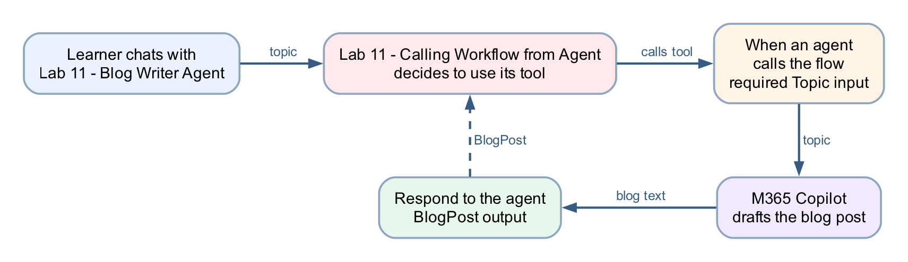

Three nodes in the workflow: **When an agent calls the flow** (the trigger, with a Topic input) → **Copilot** (renamed *Draft the blog post*) → **Respond to the agent** (a BlogPost output). The loop back to the agent is the point of the lab: the workflow's inputs and outputs are the **contract** the agent programs against.

## Expected result

```text
Workflow "Lab 11 - Blog Writer Tool" published
→ agent "Lab 11 - Blog Writer Agent" with the workflow under Tools
→ Preview: "Write a blog post about …" → the agent calls the tool → a blog post comes back
→ Workflows → Lab 11 - Blog Writer Tool → Activity shows a matching run
→ "I need a blog post." → the agent asks for the topic first
```

## Detailed step-by-step

### Part A — Create the workflow

1. Open `https://copilotstudio.microsoft.com`.
2. Confirm your **Training Class** environment is showing bottom-left. The agent and the workflow must live in the **same environment**, or the workflow will never appear in the agent's tool list.
3. In the left navigation, select **Workflows**.
4. Select **New workflow**.
5. Rename the workflow: select the name at the top left, type exactly `Lab 11 - Blog Writer Tool`, and confirm.
6. Select **Save**.

### Part B — Configure the trigger: When an agent calls the workflow

1. Select the **Start** node (the first node on the canvas) to open its configuration panel.
2. Open the **Trigger type** dropdown and choose **When an agent calls the workflow** (the node then shows on the canvas as *When an agent calls the flow*). This trigger is what makes the workflow *callable as a tool* — a workflow with a Manual trigger (Lab 10) does not appear in an agent's tool list.
3. Under the trigger's inputs, select **Add an input**.
4. Choose **Text**.
5. Replace the default name with `Topic`.
6. In the description, enter `The subject of the blog post`. Do not skip the description — the **agent reads it** to work out which part of the conversation belongs in this input. A blank description leaves the model guessing.
7. Leave the input required, with no default value.


*Figure 11.1 — The trigger panel: Trigger type When an agent calls the workflow, with the Text input Topic and its description — trainer's reference copy `Lab 11 - Blog Writer Tool (DO NOT DELETE)`*

8. Select **Save**.

### Part C — Add the Copilot node to draft the blog

1. On the canvas, select **+** on the connector after the trigger. The **Add** dialog opens with a Search box and two tabs, **Featured | Connectors**.
2. On **Featured**, under *Actions*, select **Copilot** — the M365 Copilot node. Be precise — selecting an item *creates* a node, and an accidental extra node must be deleted (undo does not remove it).
3. Select the new **Copilot** node to open its configuration, and click its title to rename it `Draft the blog post`.
4. If a **Connection** field is shown, confirm it is signed in as your course account.
5. In the node's single **Message** field, **type** the following as plain text, leaving a gap where the topic goes:

```text
Write a short, engaging blog post of about 300 words on the topic below. Give it a title line, a two-sentence introduction, three short paragraphs with one key point each, and a one-sentence conclusion. Write in plain professional English for a general business audience.

Topic:
```

6. Place the cursor after `Topic:` and insert the **Topic** trigger input using the **⚡ dynamic content picker** — select the lightning-bolt icon and pick **Topic** from the trigger's outputs.

| Slot in the prompt | Insert with ⚡ |
|---|---|
| after `Topic:` | When an agent calls the flow → **Topic** |

   - **Never paste an expression** such as `@{...}` into this editor. It is a rich-text editor and silently mangles pasted references; the workflow then runs green while the model receives an empty topic.
7. The node's output is **Response** — plain text, which is what the response node needs.
8. Select **Save**.

### Part D — Return the draft with Respond to the agent

1. Select **+** on the connector after the **Draft the blog post** node. The **Add** dialog opens on its **Featured** tab: *Favorites* (Variable, Connectors, Function) and *Actions* (Agent, Classify, Copilot, Human review, If/Else, …).

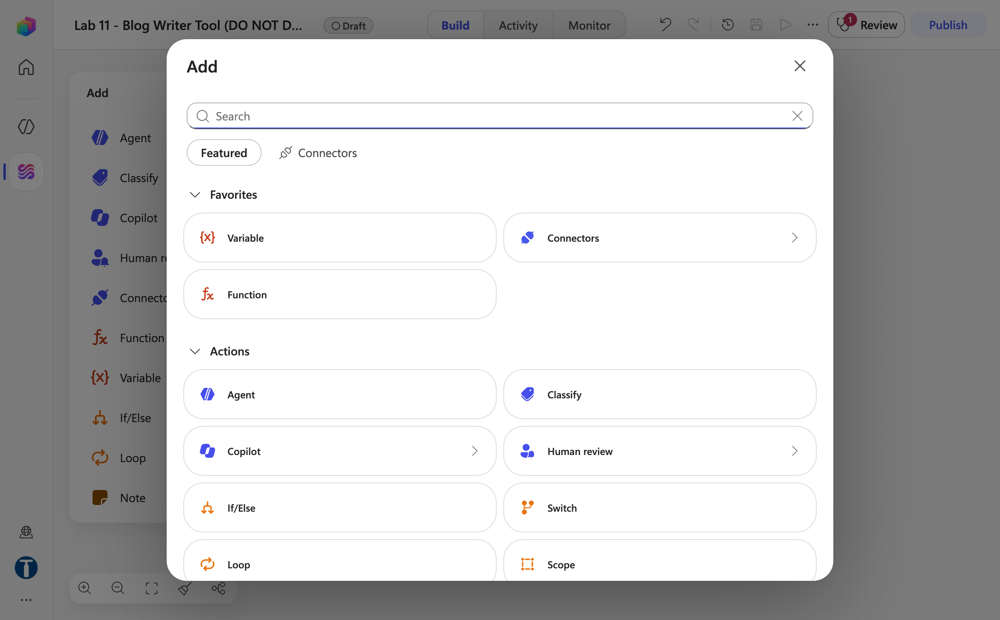

*Figure 11.2 — The + Add dialog after the Copilot node: Search box, Featured | Connectors tabs, Favorites and Actions*

2. Under *Actions*, select **Agent** → **Respond to the agent**. **Do not** type `Respond` into the Search box and pick the *Skills → Respond to the agent* result that comes back — that is a different connector action. It opens a *Connect to Skills* panel that demands a Skills connection, the connection fails with *Connection error*, and the node stays **Needs setup**. If you added it by mistake, delete it with its 🗑 icon.

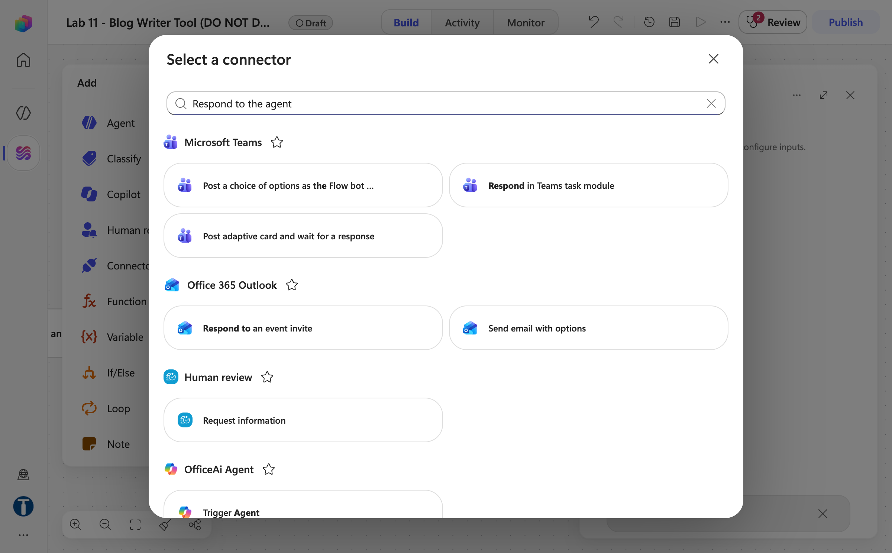

*Figure 11.3 — Do not pick this one: the Search result Skills → Respond to the agent, which needs a Skills connection and stays Needs setup*

3. Select the new node to open its configuration — the panel reads *Respond to the calling agent with typed outputs* with an **Outputs** section.

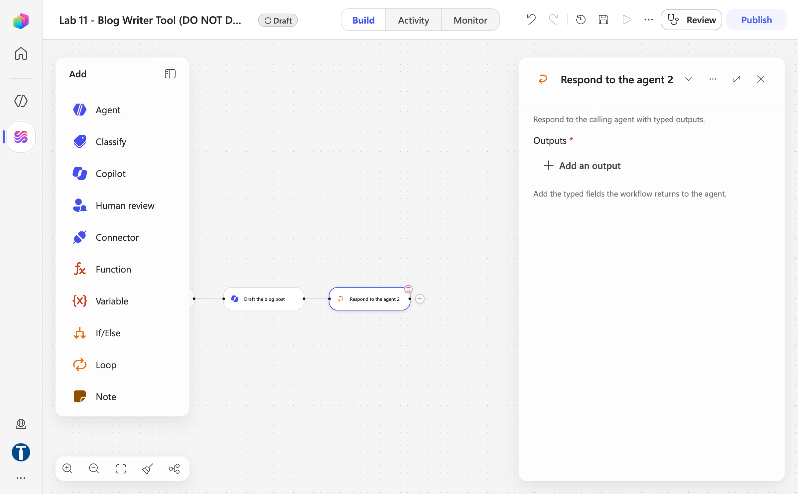

*Figure 11.4 — The correct Respond to the agent node: Outputs with Add an output (the trainer's node is titled Respond to the agent 2 because the wrong node was added first and deleted)*

4. Select **Add an output**.
5. In *Choose the type of output* (Text, Number, Yes/No, Date, Email, File), choose **Text**.

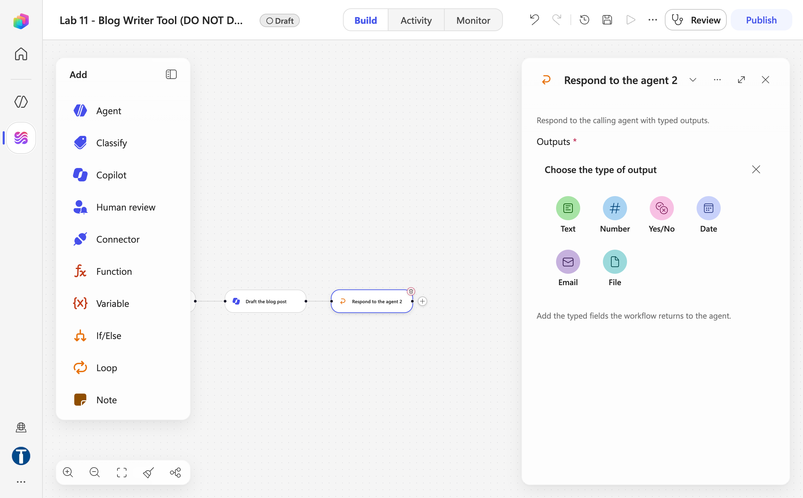

*Figure 11.5 — Add an output → Choose the type of output: Text, Number, Yes/No, Date, Email, File*

6. Replace the default name `Text` with `BlogPost`.
7. Click the **⚡** beside the value field and, under **Draft the blog post**, pick **Response** (*The response from the Copilot agent*) — pick the token; do not type an expression.

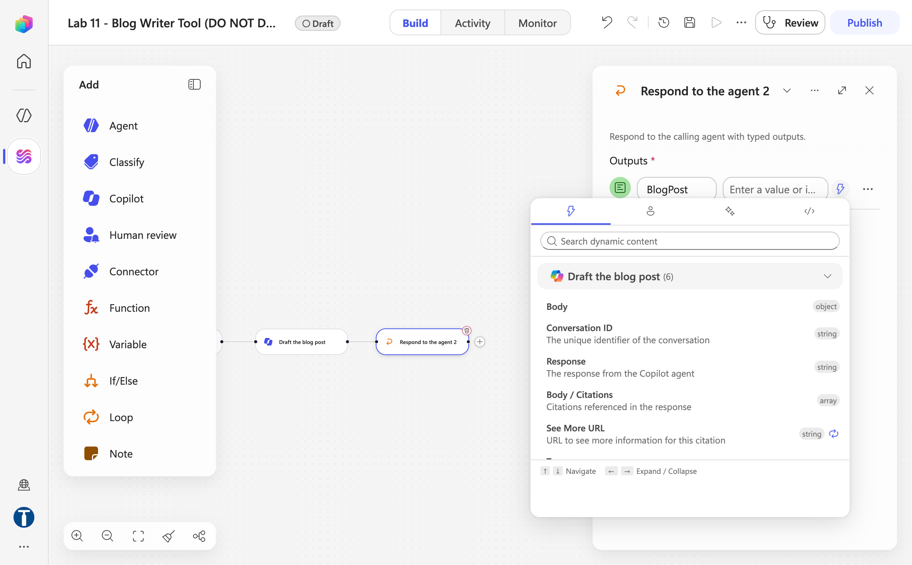

*Figure 11.6 — The ⚡ dynamic content picker on the BlogPost value: Draft the blog post → Response*


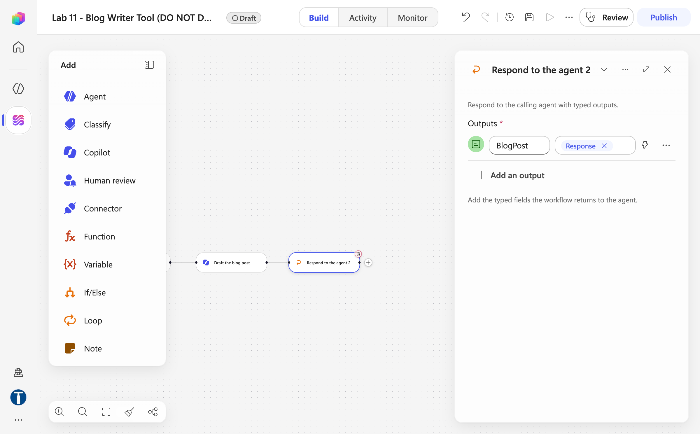

*Figure 11.7 — The Respond to the agent node finished: output BlogPost carrying the Response token*

8. Select **Save**. A banner confirms *Your workflow has been saved. After publishing, it'll be ready to test or run.*
9. Do not drag nodes to rearrange them afterwards — **moving a node clears its configuration** and the unconfigured node is then skipped silently at run time.

### Part E — Publish the workflow

1. Select **Publish**. A tool must be the **published** version — an agent cannot call a draft, and after any later edit the workflow must be published again before the agent sees the change.
2. Confirm the pill beside the name now reads **Published** and the banner says *Your flow is ready to go. We recommend you test it.* Server-side validation problems appear under the **Review** badge instead.

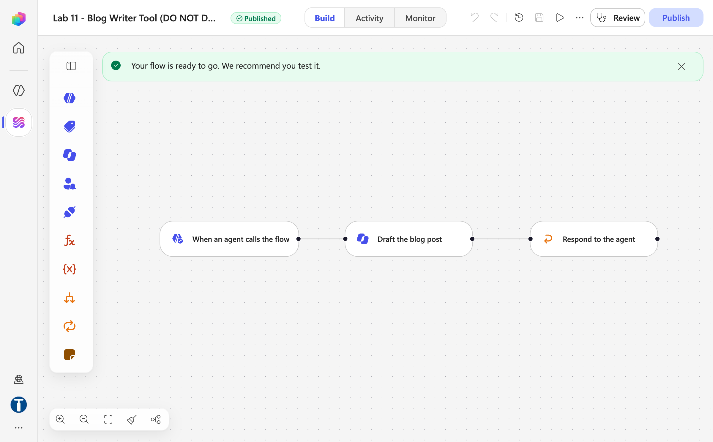

*Figure 11.8 — The published workflow: Published pill, three nodes When an agent calls the flow → Draft the blog post → Respond to the agent — trainer's reference copy*

### Part F — Create the agent

1. In the left navigation, select **Agents**, then **New agent**.
2. In the centre column, click `Untitled Agent`, type exactly `Lab 11 - Blog Writer Agent`, and press **Enter**. Agent names must be 30 characters or fewer — Copilot Studio rejects longer names (this one is 26).
3. Click into the **Instructions** box (the large text box directly under the agent name in the centre of the Build tab) and paste:

```text
You help colleagues create blog posts for the Learning & Development team. When someone asks for a blog post, identify the topic from the conversation — ask for it if it is not stated. Always use the Lab 11 - Blog Writer Tool to write the post; never write the post yourself. Return the tool's blog post to the user unchanged, and offer to run it again with a revised topic if they want changes.
```

   The *"never write the post yourself"* line is load-bearing. The model is perfectly capable of drafting a blog post without the tool, and if the instruction leaves it a choice, it will sometimes take it — the reply looks right and the workflow never ran.


*Figure 11.9 — The agent's name and pasted instructions, with the empty Tools rail and the default Search all websites chip — trainer's reference copy `Lab 11 - Blog (DO NOT DELETE)`*

4. Leave the **Model** dropdown at its default.
5. Click **Save** — the agent only gets its id on the first Save.
6. In the right panel under **Knowledge**, click **×** on the **Search all websites** chip — this agent's only source should be its tool. (Removing it before the first Save is silently reverted.) Click **Save** again.

### Part G — Attach the workflow as a tool

1. In the right panel, find **Tools** (caption *"Connect the agent to external systems and actions"*) and select its **+**. The **Add a tool** dialog opens with tabs **Featured / Model Context Protocol (MCP) / Connectors / Workflows**.
2. Select the **Workflows** tab. *Only workflows that use the "When an agent calls the workflow" trigger are shown*, and only the **published** ones in the **same environment** are selectable — an unpublished one is greyed **Not published**, and clicking it only shows *This workflow hasn't been published, so it can't be added yet.* If `Lab 11 - Blog Writer Tool` is missing or greyed, check those things in that order: trigger, published, environment.

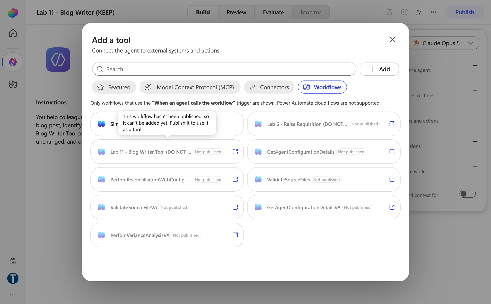

*Figure 11.10 — Tools + → Add a tool → Workflows before the workflow was published: Lab 11 - Blog Writer Tool greyed Not published, with the tooltip explaining why*


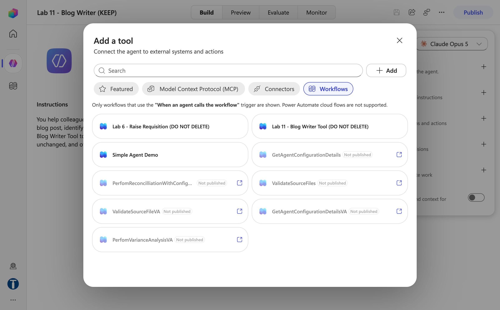

*Figure 11.11 — The same Workflows tab after publishing: Lab 11 - Blog Writer Tool (DO NOT DELETE) selectable*

3. Click `Lab 11 - Blog Writer Tool`. It is added immediately — there is no confirmation step — and a chip with its name appears under **Tools**.
4. Click the chip to open the **Workflow details** panel (sections **Details**, **Inputs**, **Outputs**). On **Details**, set the **Description** — the orchestrator picks tools by their descriptions, so this sentence is part of the contract, not documentation:

```text
Writes a blog post on a given topic. Use whenever the user wants a blog post drafted. Collect the Topic from the conversation before calling.
```

   *Authentication mode* is read-only: *This workflow uses the end user's credentials.*

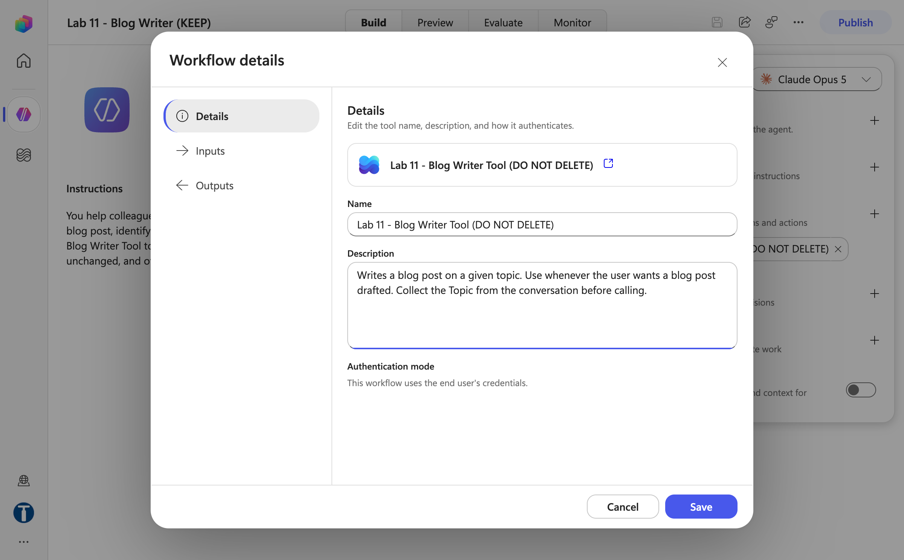

*Figure 11.12 — Workflow details → Details: the tool's Name, the Description typed in, and the read-only Authentication mode*

5. Open **Inputs**. The `Topic` input shows the description you gave it in the workflow, and *How is this filled?* is set to **AI** (the default) — leave it there; **Value** would pin a fixed topic instead of letting the agent fill it from the conversation.

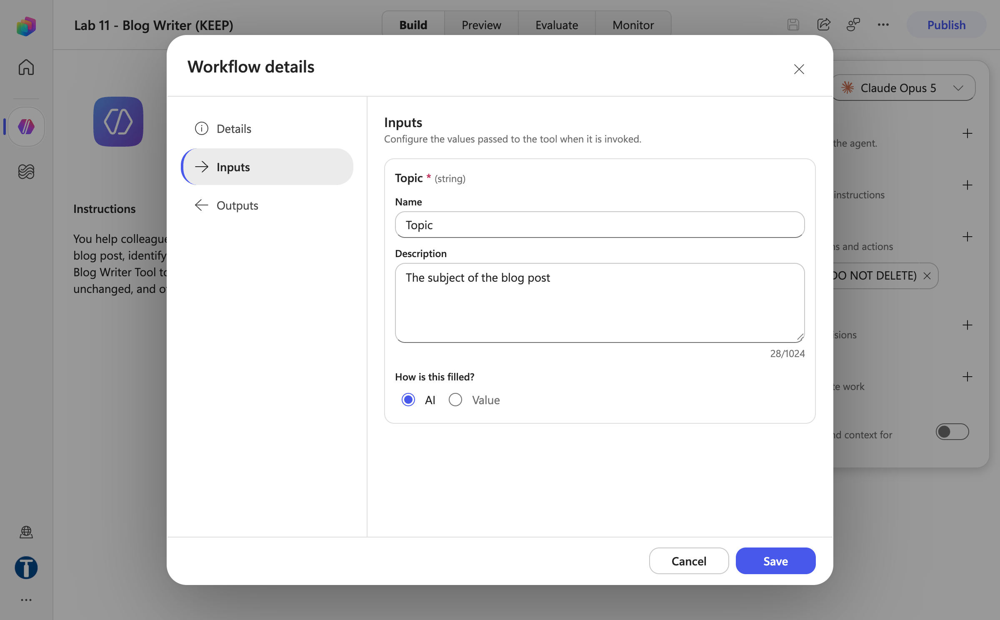

*Figure 11.13 — Workflow details → Inputs: Topic with its description and How is this filled? = AI*

6. Select **Save** on the panel, then **Save** the agent, then **Publish** the agent. Agents serve their published version to channels; the Preview tab tracks your latest saved changes.

### Part H — Test end to end

1. Select the **Preview** tab.
2. Type: `Write a blog post about how AI agents are changing business process automation.` If the reply is *"You need credits to continue … Error code: EnforcementUsageCredits"*, nothing is wrong with your build — the environment has no Copilot Credits; ask the trainer (see Troubleshooting) and continue once credits are allocated.

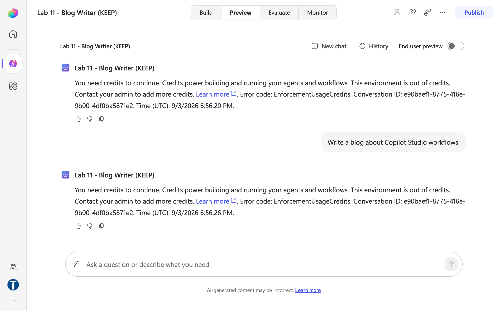

*Figure 11.14 — Preview on the reference agent while the environment was out of credits: the EnforcementUsageCredits reply — the build is correct, the model call is blocked*

3. Watch the activity indicators — the agent should show it is calling **Lab 11 - Blog Writer Tool**. A tool call adds a model hop and a workflow run, so expect about a minute (the Copilot node alone took 1 m 3 s in Lab 10).
4. Confirm the reply is a blog post with a title, introduction, three paragraphs and a conclusion, on your topic.
5. **Verify the workflow actually ran** — this is the checkpoint that matters. In **Workflows → Lab 11 - Blog Writer Tool → Activity**, confirm a new run exists with today's timestamp. A fluent blog post with **no run in Activity** means the model wrote it itself and ignored the tool — tighten the *always use the tool* instruction and test again.
6. In that run, select the **Draft the blog post** node and read its **Outputs** to see what the model produced inside the workflow, and the **Respond to the agent** node to see what went back.
7. Test the missing-topic path: start a new conversation and type `I need a blog post.` The agent should **ask for the topic**, then call the workflow once you answer.
8. Run one more topic, e.g. `Five tips for running effective hybrid meetings`, and confirm a second run appears in Activity.

## Checkpoint

- The workflow `Lab 11 - Blog Writer Tool` has exactly three configured nodes: **When an agent calls the flow** (required `Topic` text input, with a description) → **Copilot** (*Draft the blog post*) → **Respond to the agent** (a `BlogPost` text output, from the **Agent** action — not the Skills connector)
- The Topic token and the blog-text token were both inserted with the ⚡ picker, not typed
- The workflow is **published**, and it appears in the agent's **Tools** list with a description
- A test chat produces a topic-specific blog post **and** a matching run in the workflow's Activity
- Asked for a blog post with no topic, the agent asks for the topic before calling the workflow

## Troubleshooting

| Symptom | Check |
|---|---|
| The workflow is missing or greyed **Not published** under **Tools + → Workflows** | It is not published, it is in a different environment, or its trigger is not **When an agent calls the workflow** — check in that order |
| **Respond to the agent** shows **Needs setup** / *Connection error* / *Connect to Skills* | You picked the Skills connector's action from the Search results. Delete it and add **+ → Featured → Actions → Agent → Respond to the agent** |
| The agent replies with a blog post but Activity shows no run | The model wrote it itself — make the instruction explicit: *Always use the Lab 11 - Blog Writer Tool; never write the post yourself* |
| The blog ignores the topic, or is generic | The Topic reference inside the Draft the blog post node was pasted or typed, not picked — reopen it, delete the reference, re-insert with the ⚡ picker |
| The agent calls the tool but the reply is empty | Open the run in Activity and read the **Respond to the agent** node — its `BlogPost` output was probably not set with the ⚡ picker |
| The agent never asks for a topic and invents one | The trigger input has no description, so the model fills the slot however it can — add `The subject of the blog post` to the Topic input and republish the workflow |
| Run fails with `InsufficientMcsCredits` | Wrong environment — switch to your **Training Class** environment; credits are per-environment |
| Preview replies *"You need credits to continue … Error code: EnforcementUsageCredits"* | The environment has **0 Copilot Credits** — the build is fine. The trainer allocates credits in the Power Platform admin center → **Licensing → Copilot Studio → Manage Copilot Credits**; Save and Publish work without credits, Preview and tool calls do not |
| A node shows "Needs setup" | It was moved or duplicated — reopen it and refill every field, including the connection |
| The agent runs an old version of the workflow | The published version is stale — publish the workflow again and confirm the pill reads **Published** with no **Review** badge |

## Key takeaways

- **Labs 10 and 11 are the two directions of the same boundary.** In Lab 10 the workflow called the model at a fixed step; here the agent decides *when* to call the workflow — but everything inside the workflow still runs deterministically, every time.
- **The trigger's inputs and the response's outputs are the tool's contract.** The agent fills `Topic` from the conversation, guided by the input's name and description, and receives exactly `BlogPost` back — nothing else crosses the boundary.
- **A tool call is a decision the model makes**, and instructions are the only lever over that decision. The *"never write the post yourself"* line, the tool's description, and the Activity check that proves the workflow ran are all part of making a probabilistic caller behave.
- **Verify with the run history, not the reply.** A fluent answer proves nothing about what executed; a run in Activity does.

---

**Next:** read [Module 4 — Agent Flows, HTTP and the Boundary of Agency](../Module%204%20-%20Agent%20Flows%2C%20HTTP%20and%20the%20Boundary%20of%20Agency.md), then go to [Lab 12 — HTTP and Application Approval Agent](../Lab%2012%20-%20HTTP%20and%20Application%20Approval%20Agent/index.md).
