# Lab 12 — HTTP and Application Approval Agent

*Marina Trust Bank customer onboarding*

## Goal

Build a Copilot Studio workflow named `Lab 12 - HTTP and Application Approval Agent` that a public web form posts to over HTTP: the workflow checks the applicant against the SharePoint list `Lab 12 - Customers`, asks an **Agent node** to apply six ordered eligibility rules and return **structured output**, returns the decision to the website, logs it to the SharePoint list `Lab 12 - Onboarding Log`, and emails the decision letter to the trainer — in eight to twenty seconds, with no human involved.

## Duration

Approximately 45 minutes (SharePoint check 5 · workflow 30 · test 10).

## Prerequisites

- Completed Lab 11 (you know the workflow designer, the ⚡ picker, *Respond*/*Response* nodes and Version history)
- Read [Module 4 — Agent Flows, HTTP and the Boundary of Agency](../Module%204%20-%20Agent%20Flows%2C%20HTTP%20and%20the%20Boundary%20of%20Agency.md)
- A Microsoft 365 account with **SharePoint** and **Outlook**; the trainer has already created the two lists `Lab 12 - Customers` and `Lab 12 - Onboarding Log` on the course site **Tertiary Infotech - WSQ Courses**
- Your **Training Class** environment — the environment must have **Copilot Credits** (see the trap below)
- This lab's folder: `customers.csv`, `test-applications.csv`, `website/`
- A finished reference copy named `Lab 12 - HTTP and Application Approval Agent (DO NOT DELETE)` exists in the master reference environment `TGS-2022017524-Business Process Automation with Power Automate and Copilot Studio Agents` (a Sandbox environment, read-only for learners). Compare against it; never edit or delete it — you build your own copy in your **Training Class** environment

> ### The Copilot Credits trap
>
> Workflows with an Agent node consume **Copilot Credits** on every run. Many Default environments have none allocated, and the Agent node fails with *"You need credits to continue … Error code: EnforcementUsageCredits"* (older builds showed `{"error":{"code":"InsufficientMcsCredits", …}}`) — the decision then falls back to `ERROR`. Publishing still works without credits; only the model call is blocked. This is an environment capacity issue, not a workflow problem — which is exactly why Lab 0 built a Developer environment. Assigning a Copilot Studio *licence* to your user does **not** fix it: licences are per-user, credits are per-environment.

## Scenario

**Marina Trust Bank** (fictitious) takes new-account applications on paper. Staff key them into a spreadsheet by hand. Applications sit in a queue for days, the same customer ends up with two records under slightly different spellings, and eligibility rules printed in a binder get applied differently by different officers.

**What you build:** a public web form that posts to a workflow. The workflow checks the applicant against the bank's customer register, asks an AI agent to apply six ordered eligibility rules, returns the decision to the website, writes an audit row to the onboarding log, and emails the decision letter (to the trainer's inbox in class).

## Workflow visual

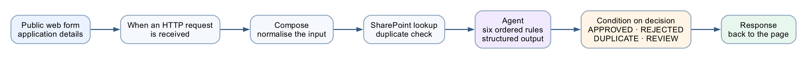

Seven nodes. A public web form posts to the HTTP trigger; SharePoint *Get items* checks `Lab 12 - Customers` for a duplicate, a Compose node assembles the normalised application, the Agent node applies the six ordered rules and returns structured output, the Response goes back to the page, SharePoint *Create item* logs the decision in `Lab 12 - Onboarding Log`, and Outlook emails the decision letter.

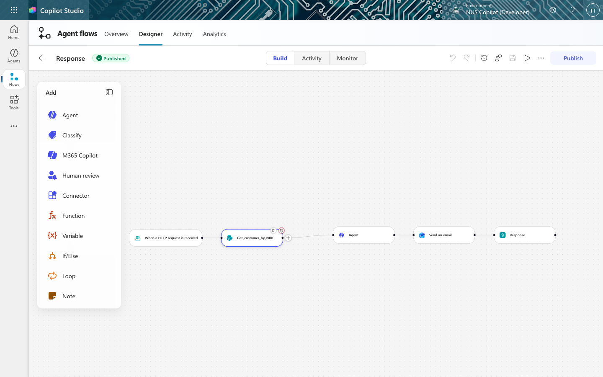

## Expected result

```text
Website form → POST JSON → "Lab 12 - HTTP and Application Approval Agent"
→ Get customer by NRIC (SharePoint Get items)  → Application (Compose)  → Agent (structured output)
→ Response { applicationId, decision, reason, riskFlags } back to the page in 8–20 s
→ Log decision (SharePoint Create item in Lab 12 - Onboarding Log)
→ Send an email (V2) — the decision letter, to the trainer's inbox
→ TC1 APPROVED · TC2 DUPLICATE · TC5 (lowercase NRIC) DUPLICATE · TC6 REVIEW+PEP · TC7 REJECTED+MINOR
```

## The boundary of agency

| The AI decides — *what to do* | The workflow does — *what must always happen* |
|---|---|
| Which of six ordered rules applies | Normalise the identifier (`toUpper(trim(…))`) |
| Whether the case needs a human (`REVIEW`) | Check the register for a duplicate |
| How to phrase the reason | Compute the age — the model is handed a number, never asked to do date arithmetic |
| What risk flags to raise | Return the response, send the email |

There are **four decisions, not two** — `APPROVED`, `REJECTED`, `DUPLICATE` and `REVIEW` — because a politically exposed person is not a rejection; it is a case for a human.

## Detailed step-by-step

### Part A — Check the SharePoint lists

SharePoint is tenant-level, not tied to a Power Platform environment. The trainer has already created both lists on the course site **Tertiary Infotech - WSQ Courses** (`https://tertiaryinfotech.sharepoint.com/sites/WSQCourses`), so in class you only check them. The steps below also tell you how to rebuild them in your own tenant.

**A1 — Open the site**

1. Go to `https://tertiaryinfotech.sharepoint.com/sites/WSQCourses` → **Site contents**. Both lists are there. (Own tenant: **+ Create site** → **Team site** → template **Standard team** → any name → **Finish**, then **New → List → Blank list** for each list below.)

**A2 — The `Lab 12 - Customers` list**

2. Open `Lab 12 - Customers`. These are its columns. **If you rebuild it, type the names exactly as shown** — SharePoint fixes the internal name at creation, and renaming later leaves the internal name stale, which silently breaks the workflow bindings.

| Column name | Type | Holds |
|---|---|---|
| Title | Single line of text (built-in) | the customer's **full name** |
| NRIC | Single line of text | `S8412345D` … |
| Email | Single line of text | |
| Phone | Single line of text | `+65 9123 4567` |
| DateOfBirth | Single line of text | `1984-07-02` |
| Employment | Single line of text | Employed · Student · Retired … |
| Income | Number | annual income, SGD |
| Decision | Choice | APPROVED · REJECTED · DUPLICATE · REVIEW |

> `Title` already exists and **cannot be removed** — on this list it carries the full name. An empty Title makes any later *Create item* fail with an unhelpful error, so never leave it blank on a row.

**A3 — The `Lab 12 - Onboarding Log` list** (written by the workflow's *Log decision* node in Part G)

3. Open `Lab 12 - Onboarding Log`:

| Column name | Type | Holds |
|---|---|---|
| Title | Single line of text (built-in) | the **application reference** (`APP-2025-0001`, `APP-20260904103045` …) |
| NRIC | Single line of text | |
| Decision | Single line of text | APPROVED · REJECTED · DUPLICATE · REVIEW |
| Reason | Multiple lines of text | the agent's reason sentence |
| SubmittedAt | Single line of text | ISO timestamp from `utcNow()` |

Four seeded rows (`APP-2025-0001` … `0004`) show what a logged decision looks like.

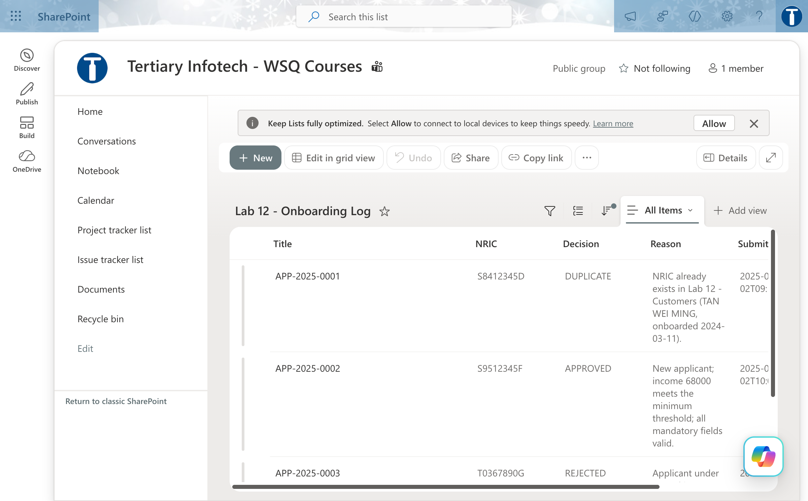

*Figure 12.1 — The Lab 12 - Onboarding Log list with its Title, NRIC, Decision, Reason and SubmittedAt columns and four seeded rows*

**A4 — Check the data**

4. Open `Lab 12 - Customers` → the view dropdown (**All Items**). If a column you expect is missing, **Edit current view** → tick it → **OK** — newly created columns are not in the default view, and a list can look empty even though the data is there.
5. Confirm the list shows **5 items** and `Title` is populated on every row. The five customers come from `customers.csv` (the CSV's *Full Name* is the list's **Title**, *Date of Birth* is **DateOfBirth**, *Annual Income* is **Income**):

```csv
NRIC,Full Name,Date of Birth,Email,Account Type,Annual Income,Onboarded On
S8412345D,TAN WEI MING,1984-07-02,tanweiming@example.com,Savings,72000,2024-03-11
S9078234B,NURUL AISYAH BINTE RAHMAN,1990-11-15,nurul.aisyah@example.com,Current,95000,2024-07-02
S7623451A,RAJESH KUMAR,1976-04-08,rajesh.kumar@example.com,Fixed Deposit,120000,2025-01-19
T0145678C,CHLOE LIM HUI LING,2001-09-23,chloe.lim@example.com,Student Account,0,2025-05-28
S6534129E,GOH BEE CHOO,1965-02-11,goh.beechoo@example.com,Savings,18000,2023-11-04
```

(Own tenant: **Edit in grid view** → paste the five rows, putting the full name in **Title**.)

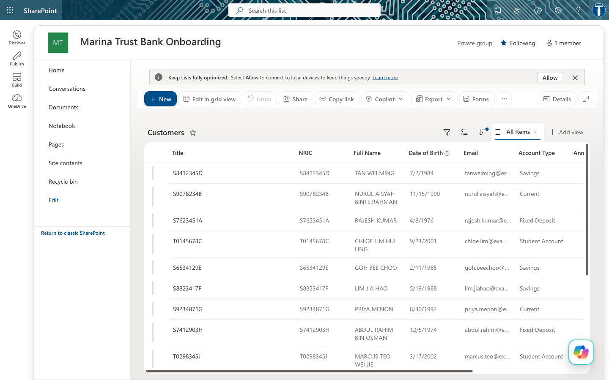


*Figure 12.2 — The Lab 12 - Customers list on the Tertiary Infotech - WSQ Courses site — Title holds the full name, then NRIC, Email, Phone, DateOfBirth*

### Part B — Create the workflow and the HTTP trigger

1. Copilot Studio → confirm your **Training Class** environment is showing bottom-left → **Workflows** → **New workflow**.
2. Rename it exactly `Lab 12 - HTTP and Application Approval Agent`. Save.
3. Click the **Start** node → **Trigger type** dropdown → **When a HTTP request is received**.
4. Set the trigger fields:

| Field | Value |
|---|---|
| Allowed HTTP method | `POST` |
| Who can trigger the flow? | **Anyone (no authentication)** |
| Relative path | **leave blank** |

> **Two things that will stop you.** *Relative path must be empty* — typing a path causes Publish to fail with *"…'inputs.relativePath'… is not valid"*. And choose **Anyone**, not *Any user in my tenant* — with the tenant option a plain browser POST returns 401 and learners think the workflow is broken. The URL is the only credential — regenerate or delete the workflow after class.

5. In **Request Body JSON Schema**, paste exactly:

```json
{
  "type": "object",
  "properties": {
    "fullName": { "type": "string" },
    "nric": { "type": "string" },
    "dateOfBirth": { "type": "string" },
    "nationality": { "type": "string" },
    "residencyStatus": { "type": "string" },
    "email": { "type": "string" },
    "mobile": { "type": "string" },
    "address": { "type": "string" },
    "postalCode": { "type": "string" },
    "accountType": { "type": "string" },
    "employmentStatus": { "type": "string" },
    "occupation": { "type": "string" },
    "employer": { "type": "string" },
    "annualIncome": { "type": "number" },
    "sourceOfFunds": { "type": "string" },
    "purposeOfAccount": { "type": "string" },
    "initialDeposit": { "type": "number" },
    "pep": { "type": "boolean" },
    "foreignTaxResident": { "type": "boolean" }
  },
  "required": ["fullName", "nric", "dateOfBirth", "accountType",
               "employmentStatus", "annualIncome", "initialDeposit"]
}
```

> The trigger validates this schema strictly: `annualIncome` and `initialDeposit` must arrive as JSON numbers, `pep` and `foreignTaxResident` as booleans. HTML form controls always produce strings, so `website/script.js` casts them before sending — otherwise every submission fails with `TriggerInputSchemaMismatch`.

6. Save. **The HTTP POST URL appears only after you save** (and is served only after you Publish), at the bottom of this panel.

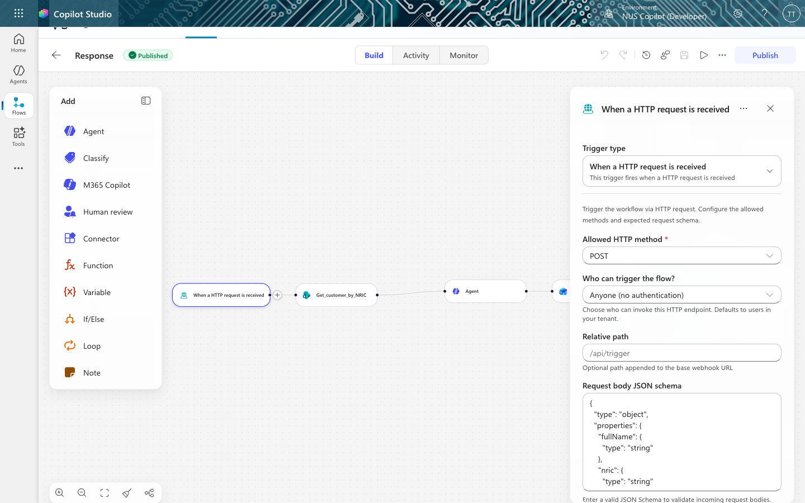

### Part C — The duplicate check: `Get_customer_by_NRIC`

1. Select **+** after the trigger → **Add** dialog → **Connectors** tab → search `SharePoint` → **Get items**.
2. Click the node title and rename it `Get customer by NRIC` (expressions refer to it as `Get_customer_by_NRIC` — the designer swaps spaces for underscores in the internal name).
3. Fill in:

| Field | Value |
|---|---|
| Site Address | pick `Tertiary Infotech - WSQ Courses` from the dropdown — **not** a typed URL |
| List Name | `Lab 12 - Customers` |
| Filter Query | see below |
| Top Count | `1` |

4. **Filter Query** — type the literal text `NRIC eq '`, then click the **`</>`** / **fx** expression option and enter `toUpper(trim(triggerBody()?['nric']))`, then type the closing `'`. The finished field reads `NRIC eq '` + a `toUpper` chip + `'`. At run time it becomes `NRIC eq 'S8412345D'`.

> **Do not use `concat()` here.** `concat('NRIC eq ''', toUpper(trim(triggerBody()?['nric'])), '''')` validates in the editor and fails at run time with *"Creating query failed"*. And `toUpper(trim(...))` is not decoration: without it an applicant who types `s8412345d` does not match `S8412345D`, and the duplicate check silently passes — a green run with the wrong answer.

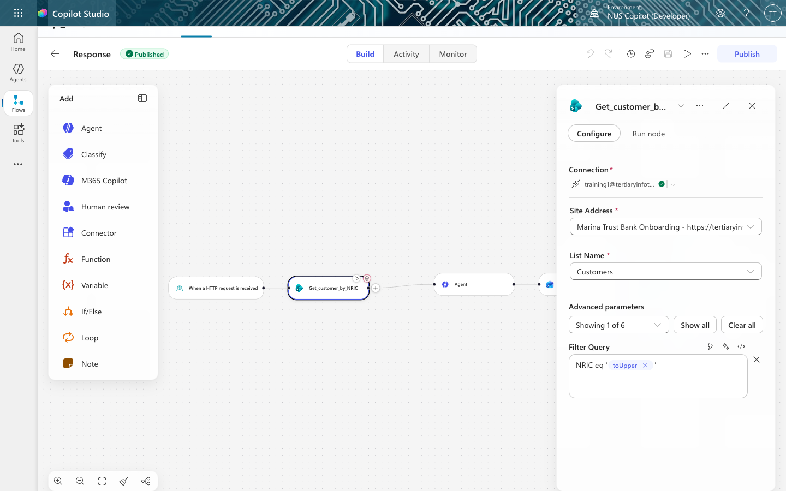

### Part D — Assemble the application in a Compose node

The Agent node's Instructions box is a **rich-text editor** that mangles pasted expressions and escapes underscores in node names. So the per-application data is built here, in a Compose node, where expressions are plain text — and the Agent node receives it as a single ⚡ chip.

1. Select **+** after `Get customer by NRIC` → **Function** → **Compose** (Data Operations). The panel has a single field, **Inputs**.
2. Rename it `Application` (one word, no underscore).
3. In **Inputs**, paste exactly this block (this editor accepts pasted expressions):

```text
Application ID: APP-@{formatDateTime(utcNow(),'yyyyMMddHHmmss')}
Existing customer found: @{greater(length(body('Get_customer_by_NRIC')?['value']), 0)}
Full Name: @{toUpper(trim(triggerBody()?['fullName']))}
NRIC: @{toUpper(trim(triggerBody()?['nric']))}
Date of Birth: @{triggerBody()?['dateOfBirth']}
Age: @{div(sub(ticks(utcNow()), ticks(triggerBody()?['dateOfBirth'])), 315360000000000)}
Nationality: @{triggerBody()?['nationality']}
Residency Status: @{triggerBody()?['residencyStatus']}
Email: @{toLower(trim(triggerBody()?['email']))}
Account Type: @{triggerBody()?['accountType']}
Employment Status: @{triggerBody()?['employmentStatus']}
Occupation: @{triggerBody()?['occupation']}
Annual Income (SGD): @{triggerBody()?['annualIncome']}
Source of Funds: @{triggerBody()?['sourceOfFunds']}
Initial Deposit (SGD): @{triggerBody()?['initialDeposit']}
PEP: @{triggerBody()?['pep']}
Tax Resident Outside Singapore: @{triggerBody()?['foreignTaxResident']}
```

4. Check that each `@{…}` renders as a chip, not as literal text. Save.


*Figure 12.3 — The Compose node panel — one Inputs field; downstream nodes read it as the node's Outputs*

Three expressions in that block do real work:

| Expression | Why |
|---|---|
| `greater(length(body('Get_customer_by_NRIC')?['value']), 0)` | Turns the SharePoint lookup into true/false for rule 1 — the model is told the answer; it never queries anything itself |
| `div(sub(ticks(utcNow()), ticks(…dateOfBirth)), 315360000000000)` | Age in whole years. The model cannot be trusted to do date arithmetic |
| `toUpper(trim(...))` on NRIC and name | Normalisation, so messy input still matches |

### Part E — The Agent node

1. Select **+** after `Application` → **Agent**. The panel shows **Connection** (green tick once created), **Agent** = *New agent for this workflow*, and **Instructions** with the model dropdown beside it (default **Claude Opus 5**).
2. **Knowledge** — leave empty. The rules are in the instructions and the facts arrive in the Compose chip.
3. Click into **Instructions** and paste the prose below — everything down to and including the heading `## Application to process`:

```text
You are the Customer Onboarding Assistant for a Singapore retail bank (Marina Trust Bank). You process new account applications and must follow the bank's onboarding rules exactly, in the order given.

## Definitions
- "Gainfully employed" means Employment Status is one of: Employed, Self-Employed, Contract, Part-Time.
- Every other status (Student, National Service, Homemaker, Retired, Unemployed) is NOT gainfully employed.
- "High-risk source of funds" means Source of Funds is one of: Gift or Inheritance, Cryptocurrency Proceeds, Other.

## Onboarding rules - evaluate in this order and STOP at the first rule that fires

STEP 1 - DUPLICATE CHECK (always first)
The application below includes a field "Existing customer found". This is the result of a live lookup against the bank's Customers register.
If it is true, the applicant is an existing customer:
decision = "DUPLICATE", riskFlags = []. Stop.

STEP 2 - AGE
If Age is below 18:
decision = "REJECTED", riskFlags = ["MINOR"]. Stop.

STEP 3 - KYC / AML SCREENING
Raise a flag for each of these that is true:
- PEP is true -> flag "PEP"
- Tax Resident Outside Singapore is true -> flag "CRS_FATCA"
- Source of Funds is high-risk -> flag "SOURCE_OF_FUNDS"
If one or more flags were raised:
decision = "REVIEW", riskFlags = the flags raised. Stop.

STEP 4 - ACCOUNT ELIGIBILITY
Apply only the rule for the account type actually requested:
- Savings - no income or employment requirement.
- Joint Savings - no income or employment requirement.
- Student Account - Employment Status must be exactly "Student".
- Current - applicant must be gainfully employed.
- Fixed Deposit - Annual Income must be at least SGD 30,000.
- Multi-Currency - Annual Income at least SGD 60,000 AND gainfully employed.
If the applicant fails this rule:
decision = "REJECTED", riskFlags = []. Name the exact criterion not met and suggest a Savings account instead. Stop.

STEP 5 - MINIMUM INITIAL DEPOSIT
Savings SGD 500 | Joint Savings SGD 1,000 | Student Account SGD 0 | Current SGD 3,000 | Fixed Deposit SGD 10,000 | Multi-Currency SGD 5,000
If Initial Deposit is below the minimum for the requested account type:
decision = "REJECTED", riskFlags = []. State the minimum for that account type and invite them to reapply. Stop.

STEP 6 - APPROVAL
decision = "APPROVED", riskFlags = [].

## Constraints
- Never invent an NRIC, email address, income figure or deposit amount.
- Judge the applicant only against the rule for the account type they asked for. Never approve them into a different account type.
- 'reason' is one or two plain-English sentences stating the decision and the exact reason for it. Write as a Singapore bank writes: courteous, factual. No exclamation marks, no marketing language, no emoji.
- Never put the NRIC in the reason text.

## Output
Return ONLY a JSON object with exactly these keys: applicationId, decision, reason, riskFlags
'decision' is one of "APPROVED", "REJECTED", "DUPLICATE", "REVIEW".
'riskFlags' is an array of strings (empty when none).

## Application to process
```

4. Put the cursor at the very end, after `## Application to process`, press Enter, then click the **⚡** icon in the Instructions toolbar, find **Application** (the Compose node) and click **Outputs**. A blue chip appears. Then type on a new line: `Process this application now and return the decision JSON.`

| Slot in the Instructions | Insert with ⚡ |
|---|---|
| the line after `## Application to process` | Application → **Outputs** |

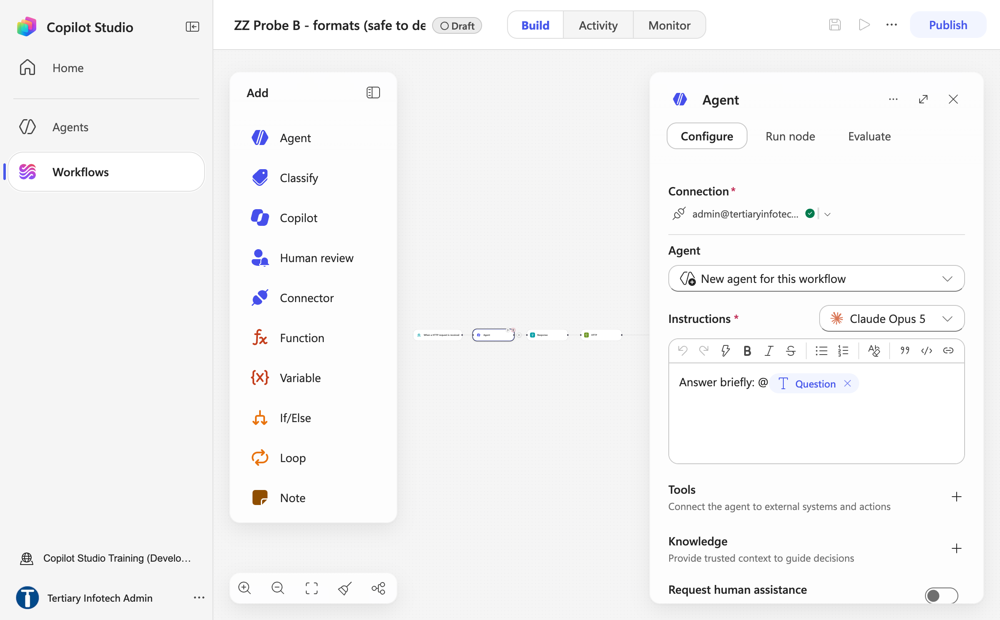

*Figure 12.4 — The Agent node panel — Connection, New agent for this workflow, the model dropdown and an Instructions chip inserted with the ⚡ picker*

> **Never paste `@{…}` into this box.** It escapes underscores (`Get_customer_by_NRIC` → `Get\_customer\_by\_NRIC`), and a reference to a node that does not exist resolves to **empty rather than erroring** — the run goes green and the agent assesses a blank application. If a reply says *"no application was included"*, this is why.

5. Set **Output** (the last field in the panel) to **Custom structured output** and paste this JSON Schema:

```json
{
  "type": "object",
  "properties": {
    "applicationId": { "type": "string", "description": "The application reference, e.g. APP-20260801103045" },
    "decision": { "type": "string", "enum": ["APPROVED", "REJECTED", "DUPLICATE", "REVIEW"], "description": "The onboarding decision" },
    "reason": { "type": "string", "description": "One or two sentences stating the decision and the exact reason" },
    "riskFlags": { "type": "array", "items": { "type": "string" }, "description": "Risk flags raised, empty when none" }
  },
  "required": ["applicationId", "decision", "reason", "riskFlags"]
}
```

The `enum` on `decision` is what stops the model inventing values like `PENDING`. Structured output also removes any need for a Parse JSON node — downstream nodes read `body('Agent')?['structuredOutput/decision']` (slash-separated, not nested brackets).

6. Leave **Web search** and **Request human assistance** off. Save.

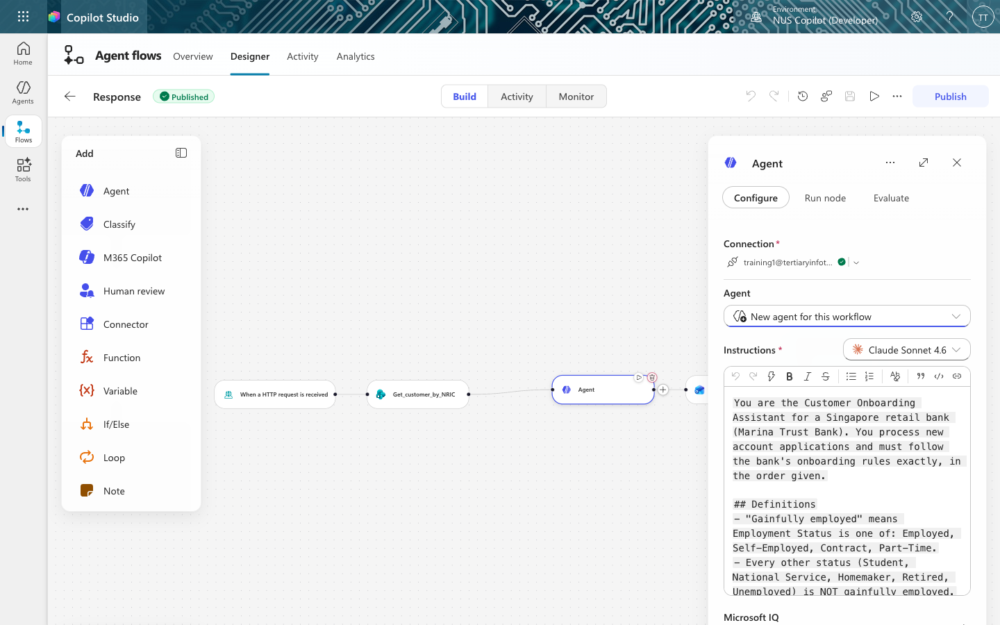

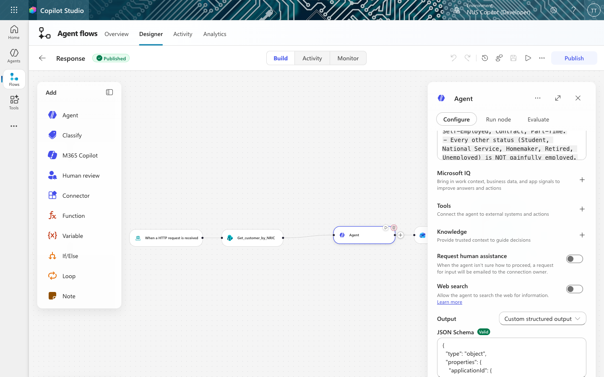

### Part F — The Response node

1. Select **+** after the Agent → **Add** dialog → **Connectors** tab → search `Response` → **Response** (category *Request*).

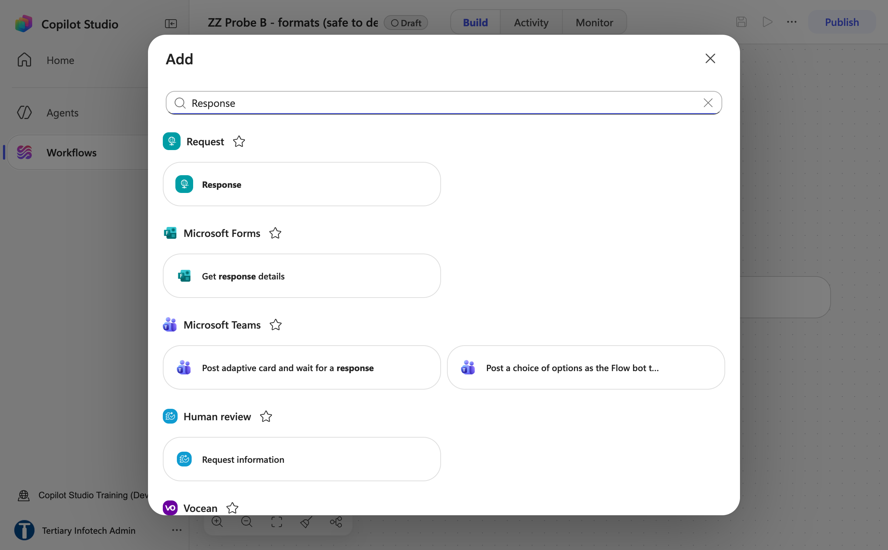

*Figure 12.5 — The Add dialog with Response typed in Search — pick Response under Request, not Get response details or the Teams actions*

2. Only **Status code** is visible at first. Under **Advanced parameters** click **Show all** — **Headers** and **Body** appear. Fill in:

| Field | Value |
|---|---|
| Status code | `200` |
| Headers | key `Content-Type` · value `application/json` |
| Body | `@{body('Agent')?['structuredOutput']}` — paste it in one go; the Body editor auto-closes `{` if you type character by character |


*Figure 12.6 — The Response node after Show all — Status code 200, the Headers key/value pair and the Body field*

3. Save. The Response sits **before** the email on purpose: the applicant sees the decision the moment the agent has made it, and a later mail failure cannot take down the user-facing response.

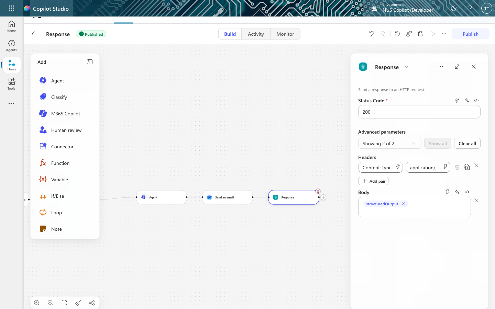

### Part G — Log the decision: Create item in `Lab 12 - Onboarding Log`

Every decision is logged whatever the outcome — the audit row is written by the workflow from the agent's structured output, and it sits right after the Response so a later mail failure cannot lose it.

1. Select **+** after Response → **Connectors** → search `SharePoint` → **Create item**. Rename the node `Log decision`.
2. Fill in:

| Field | Value |
|---|---|
| Site Address | `Tertiary Infotech - WSQ Courses` (dropdown) |
| List Name | `Lab 12 - Onboarding Log` |
| Title | ⚡ *Agent → applicationId* |
| NRIC | `</>` expression `toUpper(trim(triggerBody()?['nric']))` |
| Decision | ⚡ *Agent → decision* |
| Reason | ⚡ *Agent → reason* |
| SubmittedAt | `</>` expression `utcNow()` |

> **Title must be bound.** It is the built-in required column — leave it empty and the Create item fails with an unhelpful error on exactly the applications you most need logged. `Decision` is a text column on this list, so `REVIEW` and any other value the agent returns is accepted.

3. Save.

### Part H — Send an email (V2)

1. Select **+** after Response → **Connector** → **Office 365 Outlook** → **Send an email (V2)**.
2. **To** — in class, type the **trainer's email address** as a literal, so every decision letter lands in one inbox and no invented applicant gets mail. (In production you would click the **⚡** dynamic content button and choose *When a HTTP request is received → Email*, which shows a blue **Email** chip.)

> **The single most important thing on this page: do not type an expression into To.** Every typed form — `@{triggerBody()?['email']}`, `@{toLower(trim(…))}`, `@triggerOutputs()?['body/email']` — fails at run time with `OpenApiOperationParameterTypeConversionFailed … '"applicant@example.com\n"'`. The `\n` is not in your data; *typing an expression into that control is what creates it*. A ⚡ picker token does not. A literal typed address works — which is what the classroom build does.

3. **Subject** — type `Your Marina Trust Bank application - ` then insert ⚡ *Agent → applicationId*. Deliberately no decision word: "REJECTED" in a subject line is not how a bank writes to a customer.
4. **Body** — switch to code view (`</>`) and paste:

```html
<div>Dear @{triggerBody()?['fullName']},</div>
<div>&nbsp;</div>
<div>Thank you for your application to Marina Trust Bank.</div>
<div>&nbsp;</div>
<div>@{body('Agent')?['structuredOutput/reason']}</div>
<div>&nbsp;</div>
<div>Your application reference is @{body('Agent')?['structuredOutput/applicationId']}. Please quote this in any correspondence.</div>
<div>&nbsp;</div>
<div>Yours sincerely,<br>Customer Onboarding<br>Marina Trust Bank</div>
<div>&nbsp;</div>
<div style="color:#888;font-size:12px">Training lab — Marina Trust Bank is a fictitious institution created for a training course. This is not a real bank and no real account has been opened.</div>
```

> **No NRIC. No risk flags. No income.** Those belong in the audit log, not in a customer's inbox. Sending an applicant their own `PEP` flag would be a data-handling failure, not a style problem. *Subject* accepts pasted expressions (plain text); *Body* is rich text and needs code view.

5. Save.

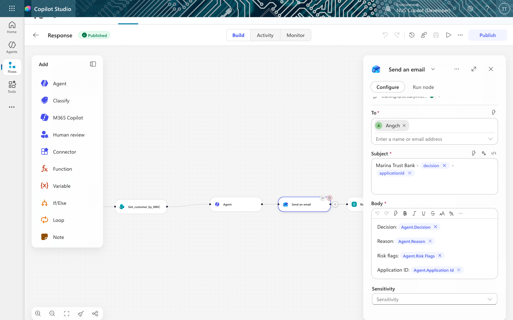

### Part I — Publish, connect the website, test

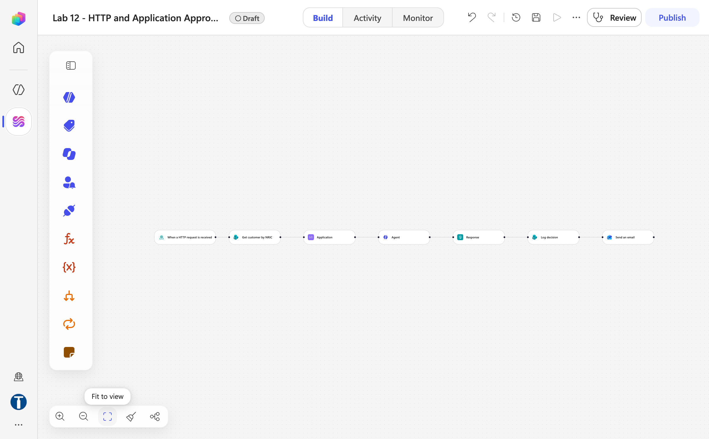

*Figure 12.7 — The finished canvas — trigger → Get customer by NRIC → Application → Agent → Response → Log decision → Send an email (trainer's reference copy, Lab 12 - HTTP and Application Approval Agent (DO NOT DELETE))*

1. Select **Publish** — saving is not enough; the endpoint serves the **published** version. Open **⋯ → Version history** and confirm `LIVE` = `CURRENT DRAFT`.
2. Click the trigger node and copy the **HTTP POST URL** (it must end with `sig=…`).

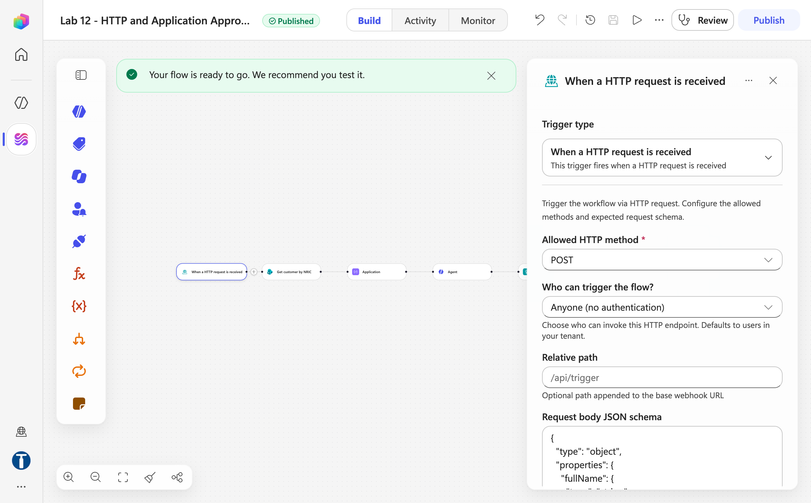

*Figure 12.8 — After Publish — the Published pill, the green "Your flow is ready to go" banner and the trigger panel with POST, Anyone (no authentication) and a blank Relative path*

3. Open `website/index.html`. On this gateway you can **double-click the file** — the endpoint returns `access-control-allow-origin: *` and passes CORS preflight even from `file://`. If the *Lab configuration* panel keeps forgetting the URL on `file://`, serve it instead: `cd website && python3 -m http.server 8900` → `http://localhost:8900`.
4. Paste the URL into **Lab configuration → HTTP POST URL**. The status line turns green when the URL is well-formed — that does not mean the workflow is published.

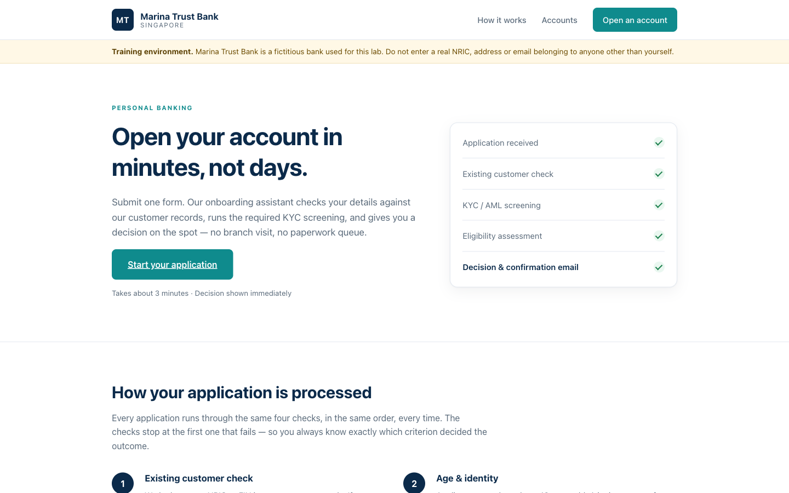

5. Use the **Trainer demo data** dropdown to run the cases below. Expect **8–20 seconds** per submission — a SharePoint lookup and a model call are both network round-trips (the trainer's reference run took 8 s, of which the Agent node was 6.8 s).

| Case | Input | Expected | Rule |
|---|---|---|---|
| TC1 | New applicant, Savings, SGD 1,000 | **APPROVED** | 6 |
| TC2 | `S8412345D` | **DUPLICATE** | 1 |
| TC5 | `s8412345d` lowercase | **DUPLICATE** | 1 + normalisation |
| TC6 | PEP = Yes | **REVIEW** + `PEP` | 3 |
| TC7 | Date of birth 2010 | **REJECTED** + `MINOR` | 2 |
| TC4 | Current account, Unemployed | **REJECTED** | 4 |
| TC8 | Savings, SGD 200 | **REJECTED** | 5 |
| TC3 | Fixed Deposit, income SGD 20,000 | **REJECTED** | 4 |
| TC10 | Under 18 **and** PEP | **REJECTED** + `MINOR` — proves the rules are ordered | 2 |

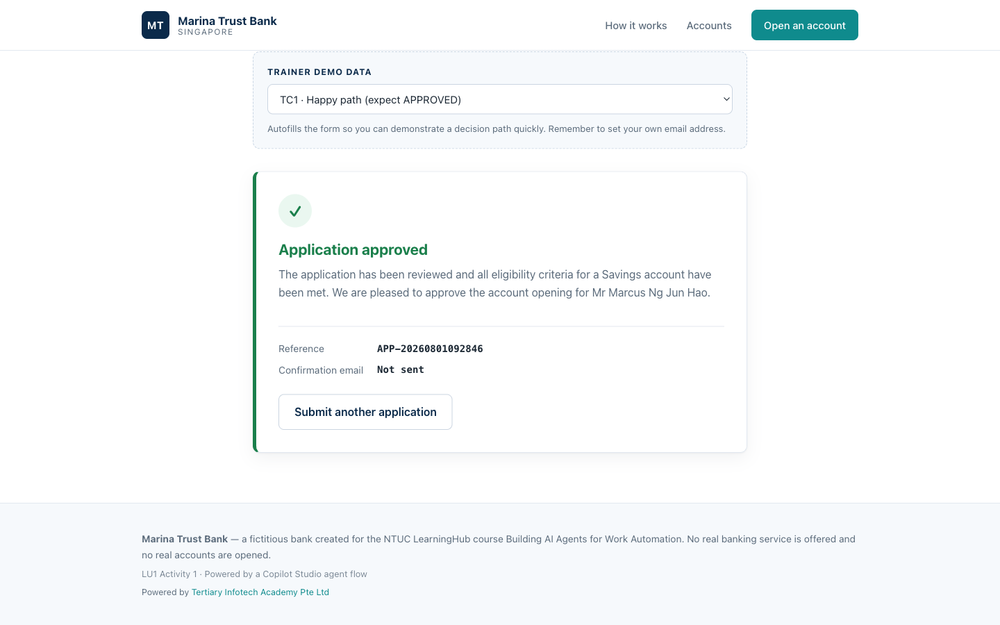

6. After each case, open the workflow's **Activity** tab and click the run: **Succeeded**, all seven nodes green with their timings. A `200` from the endpoint only proves the Response node ran — the Log decision and email after it can fail invisibly. Then open `Lab 12 - Onboarding Log`: a new row with your application reference should be there, and the trainer's inbox has the letter.

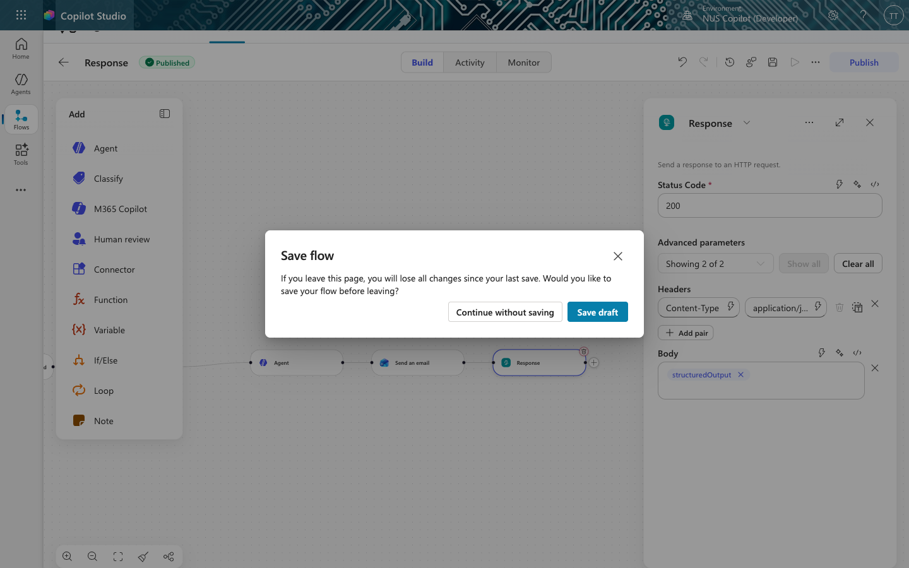

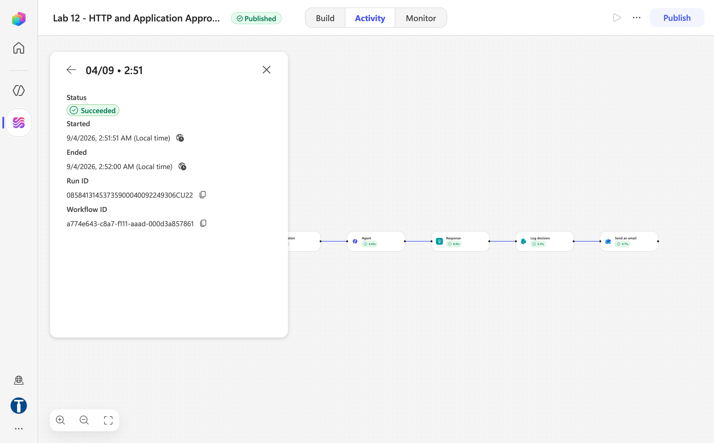

*Figure 12.9 — Activity → the run opened: Status Succeeded, and every node on the canvas green with its timing — Agent 6.83 s, Response 0.01 s, Log decision 0.31 s, Send an email 0.71 s*

### Part J (optional) — Extend it

- **Create item in `Lab 12 - Customers`** on an `APPROVED` branch (If/Else on ⚡ *Agent → decision* Equals `APPROVED`), binding **Title** to the full name, **NRIC** to the normalised NRIC and **Decision** to `APPROVED`. Then resubmitting the same NRIC returns `DUPLICATE` the second time — compelling to demonstrate live. Delete your test rows afterwards so the next learner's TC1 still approves.

## Checkpoint

- Site `Tertiary Infotech - WSQ Courses` with `Lab 12 - Customers` (5 items, Title = full name) and `Lab 12 - Onboarding Log` (Title = application reference)
- Workflow `Lab 12 - HTTP and Application Approval Agent`, **published**, seven nodes: trigger → `Get customer by NRIC` → `Application` → Agent (custom structured output) → Response → `Log decision` → Send an email (V2)
- The Agent's Instructions end with the ⚡ **Application → Outputs** chip; the Response Body and Headers were set under **Show all**
- TC1, TC2, TC5, TC6, TC7 and TC10 return the expected decisions from the website, each with a green run in Activity, a new row in `Lab 12 - Onboarding Log` and a letter in the trainer's inbox

## Troubleshooting

| Symptom | Cause | Fix |
|---|---|---|
| *"You need credits to continue … EnforcementUsageCredits"* — decision comes back `ERROR` | The environment has **0 Copilot Credits**; nothing is wrong with your build | Trainer: Power Platform admin center → **Licensing → Copilot Studio → Manage Copilot Credits** → allocate to your **Training Class** environment. Publishing works without credits |
| `InsufficientMcsCredits` (older message) | Same cause | Same fix |
| `TriggerInputSchemaMismatch` | Form sent strings where the schema wants number/boolean | Cast in the website before POSTing (`script.js` already does) |
| Publish fails on `relativePath` | A static path was typed in Relative path | Clear the field |
| Agent replies "no application was included" | The Compose chip is missing or a pasted reference was escaped | Re-insert ⚡ **Application → Outputs**; never paste `@{…}` into Instructions |
| Empty response body | Response node has no Body, or workflow not published | **Show all** → set Body, then **Publish** |
| `Log decision` fails, `Title` required | Title not bound on the Create item | Bind Title to ⚡ *Agent → applicationId* |
| Edits have no effect | Draft not published | ⋯ → Version history; publish the draft |
| `Creating query failed` | `concat()` form in Filter Query | Use `NRIC eq '` + token + `'` |
| Duplicate check never fires | Missing `toUpper`, or the expression is dead text | Check the expression renders as a chip |
| Website shows "could not read the decision" | Response returns something other than the decision object | Set Body to the agent's `structuredOutput` |
| `OpenApiOperationParameterTypeConversionFailed` on the email | A typed expression in **To** | Use the ⚡ picker to insert the Email token |
| Node shows "Needs setup" after being moved | Moving a node clears its configuration | Reconfigure every field, and the Connection |
| A run returns HTTP 200 but no log row or email | The Response returned before a later node failed | Judge success from **Activity**, not the HTTP status |

## Key takeaways

- **The boundary of agency:** the AI decides *what to do*; the workflow does *what must always happen*. The record is built from the Compose node, never from the model's answer, so an invented value has no route into the data.
- **Structured output** with an `enum` turns the model's answer into fields the workflow can branch on — and removes Parse JSON.
- **Normalise inside the lookup** (`toUpper(trim(…))`), where it is structural, not in the prompt, where it is probabilistic.
- **Four decisions, not two.** `REVIEW` exists because some cases are for a human.
- **Two controls that look like data problems and are not:** the rich-text Instructions box (build the block in Compose, insert one chip) and the Outlook **To** field (⚡ picker, never a typed expression).

---

**Next:** [Lab 13 — HTTP and Chatbot](../Lab%2013%20-%20HTTP%20and%20Chatbot/index.md)
