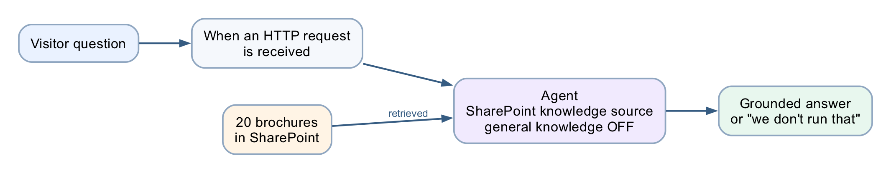
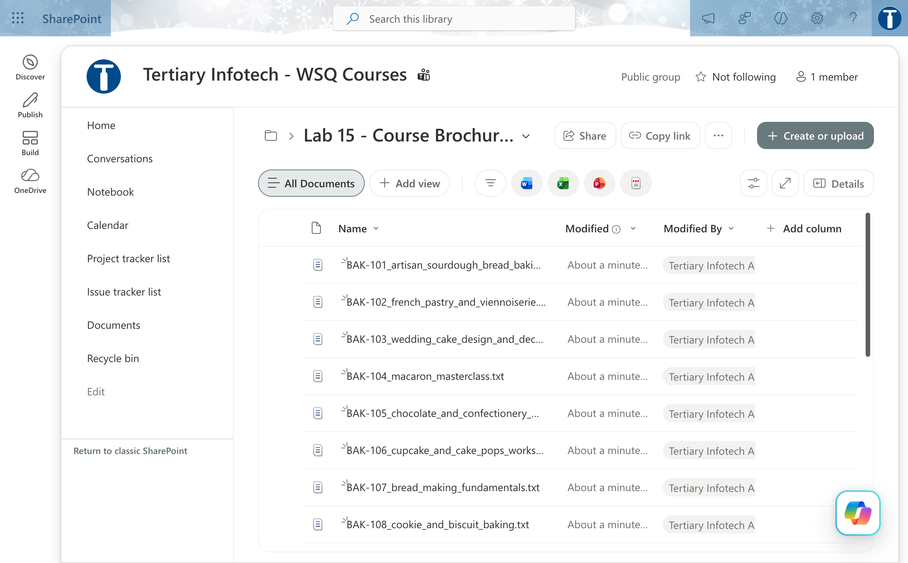
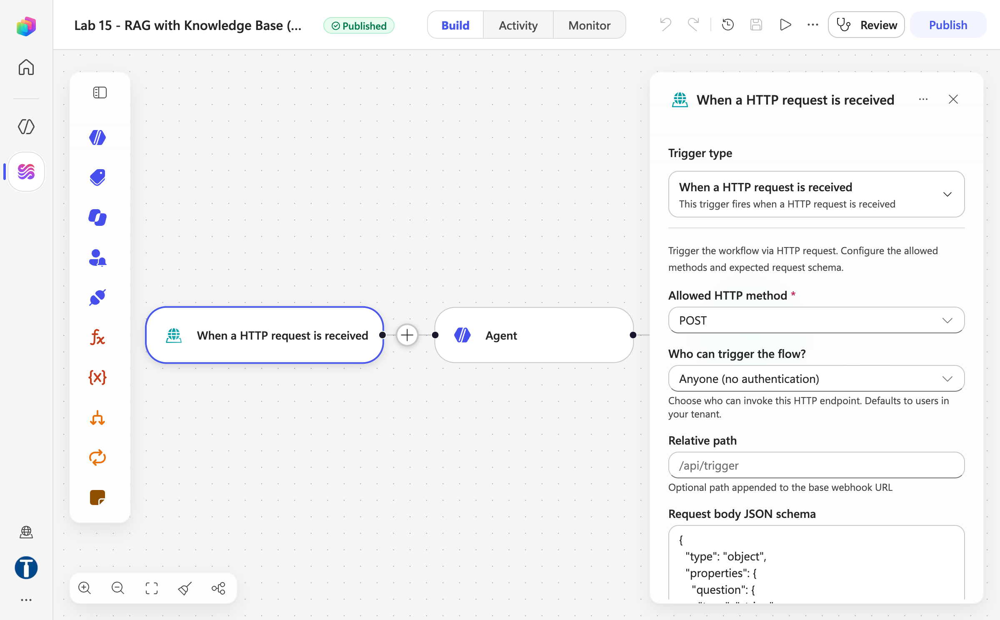
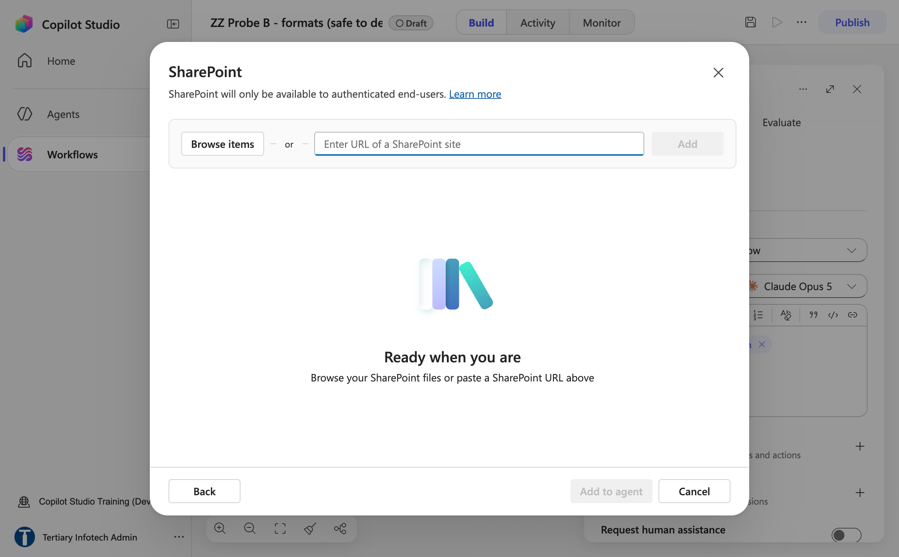
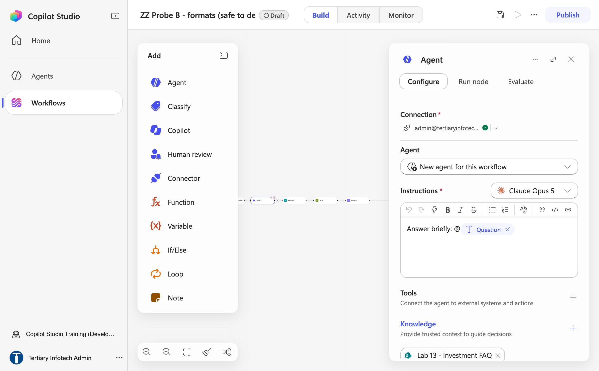
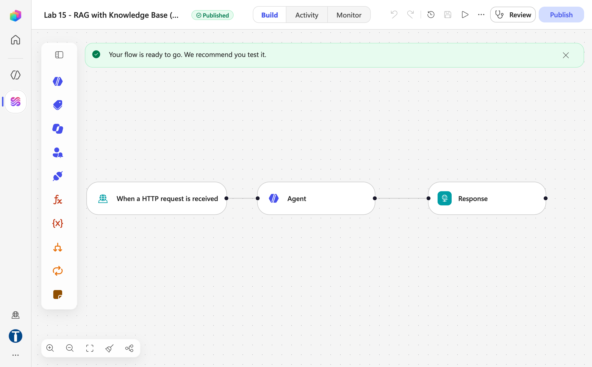
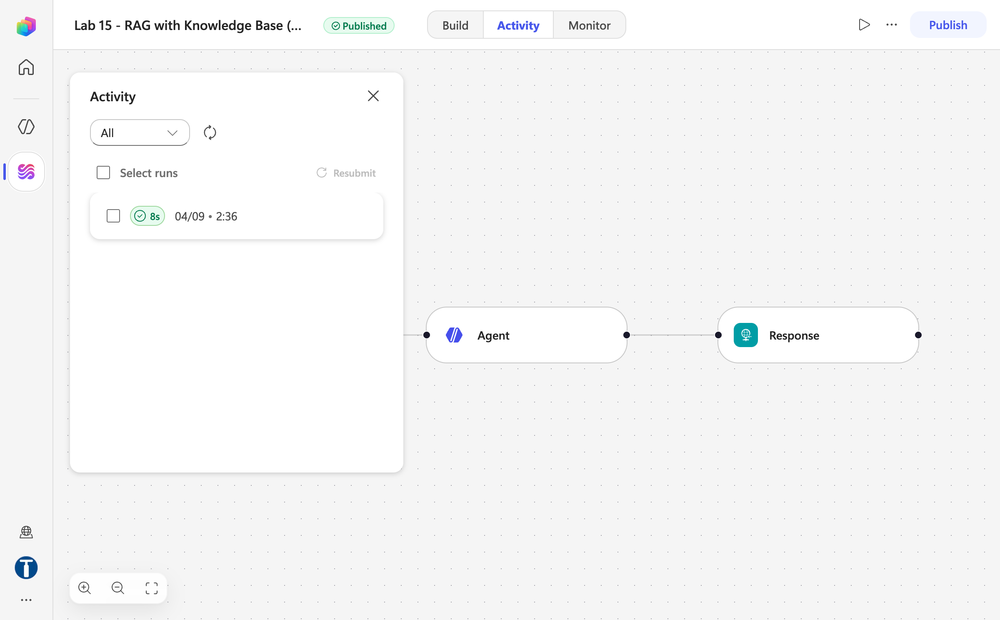

# Lab 15 — RAG with Knowledge Base

*Cook & Bake Academy customer care — RAG as a product setting*

## Goal

Build a three-node Copilot Studio workflow named `Lab 15 - RAG with Knowledge Base` — HTTP trigger → **Agent** with a SharePoint folder `Lab 15 - Course Brochures` attached as **Knowledge** → Response — that answers a cooking school's customer questions from 20 course brochures, refuses to invent fees, and does it with **no ingestion, no embedding model and no vector store** you can see.

## Duration

Approximately 30 minutes (SharePoint 8 · workflow 12 · test 10).

## Prerequisites

- Completed Lab 13 (an Agent node with a SharePoint knowledge source behind an HTTP trigger)
- Read [Module 5 — Retrieval Augmented Generation](../Module%205%20-%20Retrieval%20Augmented%20Generation.md)
- The SharePoint site **Tertiary Infotech - WSQ Courses** (https://tertiaryinfotech.sharepoint.com/sites/WSQCourses) — the trainer has already uploaded the 20 brochures to its `Lab 15 - Course Brochures` folder; your **Training Class** environment with Copilot Credits
- This lab's folder: `brochures/` (20 `.txt` files), `website/`, `sample-questions.csv`
- A finished reference copy named `Lab 15 - RAG with Knowledge Base (DO NOT DELETE)` exists in the environment. Compare against it; never edit or delete it — you build your own copy in your **Training Class** environment

## Scenario

**Cook & Bake Academy** (fictitious) runs 20 courses across two Singapore campuses. Its two-person customer care team answers the same questions all day: *how much is the sourdough course, how long is it, where is it held, do you have anything for beginners.* Every answer is already written down, in the brochures. The problem is not that nobody knows the answer — it is that a human must find the right brochure, read it, and retype the relevant sentence, forty times a day. When the team is busy they answer from memory, and memory drifts.

Lab 7 gave a Copilot Studio *agent* these brochures. This lab puts them behind a *workflow* with an HTTP trigger, so a public website can ask — and it is the first half of a pair: Lab 16 rebuilds the same chatbot on Pinecone, where every hidden decision becomes yours.

## Workflow visual



Three nodes and no ingestion. The brochures sit in SharePoint as a knowledge source attached to the Agent node, which retrieves from them at run time.

## Expected result

```text
Website widget → POST { message } → "Lab 15 - RAG with Knowledge Base"
→ Agent (Knowledge = Lab 15 - Course Brochures) → Response { reply }
→ "How much is the sourdough course?" → BAK-101 and its exact fee, HTTP 200 in ~8–25 s
→ "Do you offer a Vietnamese pho course?" → "we don't run that" + the closest courses
→ "Can I get the 40% alumni discount?" → the premise refused
```

## In Copilot Studio, RAG is not a node

There is no ingestion workflow, no embedding model, no vector store, no chunk size and no `top_k`. Retrieval happens *inside* the Agent node the moment you attach a knowledge source. You point it at a SharePoint folder, and the product does the chunking, embedding, indexing and searching for you.

```text
Lab 16:   Trigger → HTTP → Compose → Agent → Response     5 nodes
Lab 15:   Trigger →                  Agent → Response     3 nodes
```

That convenience is genuinely valuable — and it has a price. Build this one first, get a working chatbot, then build Lab 16 and discover what it hid from you.

## Detailed step-by-step

### Part A — Put the brochures somewhere real

1. Open the SharePoint site **Tertiary Infotech - WSQ Courses** → **Documents** → folder `Lab 15 - Course Brochures`. The trainer has already uploaded the 20 `.txt` brochures there.
2. If you are working in your own tenant instead: **+ Create or upload → Folder** → name it exactly `Lab 15 - Course Brochures` → open it → **Upload → Files** → all 20 `.txt` files from this lab's `brochures/` folder.
3. Confirm the folder shows **20 items** (BAK-101 … BAK-110, CUL-201 … CUL-210).
4. Copy the **folder** URL in its **%20-encoded** form — for the course tenant it is exactly `https://tertiaryinfotech.sharepoint.com/sites/WSQCourses/Shared%20Documents/Lab%2015%20-%20Course%20Brochures`. Keep the `%20`s: the knowledge dialog in Part C only accepts the encoded URL.



*Figure 15.1 — The `Lab 15 - Course Brochures` folder in the Documents library of Tertiary Infotech - WSQ Courses, with the 20 .txt brochures*


> **Point at the folder, not the library root.** A library root pulls in every document on the site — Lab 12's banking documents included — and the agent will answer a sourdough question out of a KYC policy. Keep it separate from Lab 7's `Lab 7 - Course Brochures` too, so each lab can be rebuilt on its own.

### Part B — Create the workflow and the trigger

1. **Workflows** → **New workflow** → click `Untitled workflow` in the top bar and rename exactly `Lab 15 - RAG with Knowledge Base`. Save (the disk icon).
2. Select the **Start** node → **Trigger type** dropdown → **When a HTTP request is received**. Set **Allowed HTTP method** `POST`; **Who can trigger the flow?** *Anyone (no authentication)*; **Relative path** blank.
3. **Request body JSON schema**:

```json
{
  "type": "object",
  "properties": {
    "message":   { "type": "string" },
    "history":   { "type": "string" },
    "sessionId": { "type": "string" },
    "source":    { "type": "string" }
  },
  "required": ["message"]
}
```

Only `message` is required. There is no contact gate here: Lab 13 collected name, phone and email because it was talking about someone's money. A course fee is public information — the gate was a compliance control, not a chatbot feature. Save.



*Figure 15.2 — The trigger panel with Allowed HTTP method POST, Anyone (no authentication) and the Request body JSON schema (trainer's reference copy; its schema names the field `question` — yours uses `message`)*

### Part C — The Agent node (this single node is the lab)

1. `+` below the trigger → **Agent** (it is the first entry on the **Featured** tab of the Add dialog). In the panel: **Connection** (green tick once connected), **Agent** = *New agent for this workflow*, and the model dropdown beside **Instructions** (default Claude Opus 5).
2. Scroll the panel to **Knowledge → +**. The **Add knowledge** dialog opens with two Featured tiles — **Public websites** and **SharePoint**. Choose **SharePoint**. **Do not choose Public websites.**


*Figure 15.3 — Agent node → Knowledge + → the Add knowledge dialog: choose SharePoint, not Public websites*

3. In the **SharePoint** dialog, paste the folder URL from Part A into **Enter URL of a SharePoint site** (the **SharePoint link** field). The **Add** button only enables for the **%20-encoded** URL — a URL with plain spaces leaves it greyed. Click **Add**: the folder appears as a row with **Link**, **Name** (`Lab 15 - Course Brochures`) and **Description**. Click **Add to agent**.



*Figure 15.4 — The SharePoint knowledge dialog: paste the folder URL into the SharePoint link field (Add stays greyed until a valid encoded URL is present)*


*Figure 15.5 — Add enables only once the %20-encoded folder URL is pasted (shown here with the Lab 13 folder in the probe workflow; paste the Lab 15 URL)*

4. The knowledge chip now sits under **Knowledge** in the Agent panel. **Wait for indexing to finish.** A knowledge source that is still indexing returns nothing, and the agent looks broken when it is merely empty. This one failure mode accounts for most of the time lost on this lab.



*Figure 15.6 — The Agent panel after Add to agent: the SharePoint folder sits as a chip under Knowledge and the Instructions end with a ⚡ token chip (probe workflow; yours reads `Lab 15 - Course Brochures`)*
5. Click into **Instructions** and paste this prose — it ends with `Customer question:` and nothing after it, deliberately:

```text
You are the customer care assistant for Cook & Bake Academy, a cooking and bakery school in Singapore.

Search your knowledge source for the Cook & Bake Academy course brochures and answer from what you find there. They are the only knowledge you have.

If the brochures do not answer the question, say "I don't have that in our course information" and offer the team on +65 6888 1234 or enrol@cookbakeacademy.sg.

Never invent a fee, a date, a duration, a course code, an instructor name or a discount. If a number is not in a brochure, you do not know it.

If we do not run a course, say so plainly, then list the two or three closest courses we do run.

Always give the course code (for example BAK-101) next to the course title. Quote fees in Singapore dollars exactly as written.

Be warm and brief — two to four short sentences. Never mention brochures, searching, or that you are reading documents.

Never include citation markers, reference numbers or source tags in your reply.

Customer question:
```

6. Put the cursor at the very end, after `Customer question:`, click the **⚡** icon in the Instructions toolbar, find **When a HTTP request is received** and click **message**. A blue **Message** chip appears — the only thing carrying the customer's question into the prompt.

| Slot | Insert with ⚡ |
|---|---|
| after `Customer question:` | When a HTTP request is received → **message** |

> **The line that matters is "Search your knowledge source … and answer from what you find there."** Lab 16's instruction says the brochures are *"provided below"* — correct there, because a Compose node injects them. Here nothing is below. Leave Lab 16's wording in place and the agent is told its only permitted source is empty, so it produces **nothing at all** — not even the refusal sentence — and the run stays green. An empty string, rather than a refusal, means the instruction premise is wrong.

> **The citation line is not optional.** A knowledge source appends `[doc:turn1doc11]`- and `[1]`-style markers the model did not write, and can return the whole answer twice. *"Never mention brochures"* does not suppress them; only the explicit line does. Neither defect occurs in Lab 16, where retrieved text arrives as plain Compose output.

7. Settings: **Web search** Off (on, the agent pulls course fees off the open web); **Request human assistance** Off; **Output** **Text response**. There is no *Use general knowledge* toggle and no temperature on a workflow Agent node — grounding rests on the instruction wording.
8. Save.

### Part D — The Response node

1. `+` below the Agent → **Connectors** tab → search `Response` → **Response** (category *Request*). Only **Status code** is visible at first — leave it `200`. Under **Advanced parameters** select **Show all** to reveal **Headers** and **Body**. Headers: key `Content-Type`, value `application/json`. **Body** = `{ "reply": "` + ⚡ **Agent → Agent Response** + `" }` — type or paste the JSON in one go, because the Body editor auto-closes `{` while you type character by character. Use the picker for the output: typing `body/text` yields an empty string and no error — indistinguishable from the instruction fault above.


*Figure 15.7 — The Response node: Status code 200, then Show all reveals Headers (Content-Type: application/json) and Body*

2. Save, then **Publish**. The pill next to the workflow name turns from **Draft** to **Published** and a green banner reads *Your flow is ready to go. We recommend you test it.* The **HTTP POST URL** now shows in the Start node's panel.



*Figure 15.8 — The published three-node workflow: HTTP trigger → Agent → Response (trainer's reference copy)*

### Part E — Test it, then try to make it lie

1. Copy the **HTTP POST URL** from the trigger and test from a terminal first:

```bash
curl -X POST "<YOUR HTTP POST URL>" -H "Content-Type: application/json" \
  -d '{"message":"How much is the sourdough course?"}'
```

Expect somewhere between **8 and 25 seconds** — the trainer's reference run returned **HTTP 200** with `{"reply": …}` in about 8.6 s; SharePoint retrieval plus generation can be a longer round trip than a Pinecone query — and an answer naming **BAK-101** and its fee. Open the **Activity** tab: the run is listed with its duration, and clicking a node shows its Inputs and Outputs.



*Figure 15.9 — Activity tab: the trainer's reference run succeeded in 8 s*

2. **Double-click `website/index.html`** — this gateway returns `access-control-allow-origin: *` and passes CORS preflight from `file://`, so no local server is needed. Paste the URL into **Lab configuration** and ask the questions in `sample-questions.csv`.


3. TC1–TC6 check retrieval. **TC7–TC9 are the ones that matter** — each plants something false or absent and invites the model to agree:

| Case | Ask | What good looks like |
|---|---|---|
| TC7 | "Do you offer a Vietnamese pho course?" | Says plainly the academy does not run one, then names the two or three closest courses it does |
| TC8 | "Who teaches the macaron class?" | *"I don't have that in our course information"* — no instructor is named in any brochure |
| TC9 | "Can I get the 40% alumni discount?" | Refuses the premise. The discount does not exist |


TC9 is the nastiest: the question *presupposes* the discount exists, and a model that wants to be helpful will confirm it. Any confident answer is a failure, however fluent.

4. Open the trainer's `Lab 15 - RAG with Knowledge Base (DO NOT DELETE)` and compare the three nodes. Close without changing anything.

## Checkpoint

- SharePoint folder `Lab 15 - Course Brochures` with 20 items
- Workflow `Lab 15 - RAG with Knowledge Base`, **published**, three nodes; the Agent's Instructions end with the ⚡ **message** chip and the knowledge chip reads Ready
- The website answers TC1 with BAK-101's exact fee and refuses TC7–TC9

## Debrief

1. **You never chose an embedding model, a dimension, a chunk size or how many documents come back.** Name one situation in which you would need to.
2. **The agent returned an empty string once** (or will). How would you tell *still indexing* from *wrong folder* from *wrong instruction*? What could you actually inspect?
3. **Change a fee** in one brochure and ask again. How long until the answer changes — and who controls that?
4. **Compare Lab 12.** There the agent looked a customer up by an exact NRIC match. Here it searches documents *by meaning*. When would you choose one over the other?
5. **Now build Lab 16**, and come back to this table:

| | Lab 15 — built-in | Lab 16 — external |
|---|---|---|
| Nodes | 3 | 5 |
| Ingestion | Upload to SharePoint | A Python script, run once |
| Embedding model | Hidden | `llama-text-embed-v2`, 1024 |
| Chunking | Hidden | One brochure = one record, **your call** |
| `top_k` | Hidden | 3, **your call** |
| Citation markers | Leak into the reply | None |
| A changed fee | Edit, wait for re-crawl | Edit, **re-ingest** |
| When it answers badly | Rewrite the prompt and hope | Four levers to pull |

**That last row is the whole debrief.** Neither is the right answer in general — the right answer depends on whether whoever maintains this will ever need those levers, which is a staffing question, not a technical one.

## Troubleshooting

| Symptom | Cause | Fix |
|---|---|---|
| `{"reply": ""}`, run succeeds | Instruction says "provided below" with nothing below, or a stale reference from a copied flow | Clear Instructions, paste the block above, re-insert the ⚡ chip |
| Empty reply, run green | Knowledge source still indexing | Wait, then retest |
| Empty reply, but the Agent's Outputs show a real answer | Response reads the wrong field | Must be **Agent Response**, via the picker |
| Every answer is "I don't have that…" | Still indexing, or the folder URL points somewhere with no brochures | Check the folder shows 20 items |
| Replies appear twice, with `[1]` / `[doc:…]` | Missing the citation-marker line | Add it |
| It answers about banking | The knowledge points at a shared library root | Repoint at `Lab 15 - Course Brochures` |
| Answers from the open web | Web search left On | Turn it Off |
| *"You need credits to continue … Error code: EnforcementUsageCredits"* in the reply | The environment has no Copilot Credits — nothing is wrong with your build | Trainer: Power Platform admin center → **Licensing → Copilot Studio → Manage Copilot Credits**; publishing still works without credits |
| `Failed to fetch`, run succeeded | Not CORS on this gateway | Check the URL kept its `sig=`, and the flow is Published |
| Website shows an error | Flow unreachable or returning nothing — the page has **no offline fallback**, by design | Fix the flow; never hide a dead pipeline behind a fake answer |
| 8–25 s per answer | Normal | Retrieval plus a model call |

## Key takeaways

- **RAG as a setting:** attach a folder, wait for Ready, and the Agent node retrieves — three nodes, no ingestion, nothing to tune.
- **The instruction must say *search*, not *below*.** An empty string instead of a refusal is an instruction-premise fault, not a knowledge fault.
- **Citation markers are added by the grounding layer**, not the model; only an explicit line suppresses them.
- **Probe for invention.** A grounded agent still invents; TC7–TC9 exist to catch it, and a fluent wrong answer raises no error.
- **What you cannot see, you cannot tune** — which is Lab 16's whole point.

---

**Next:** [Lab 16 — RAG with Pinecone](../Lab%2016%20-%20RAG%20with%20Pinecone/index.md)
