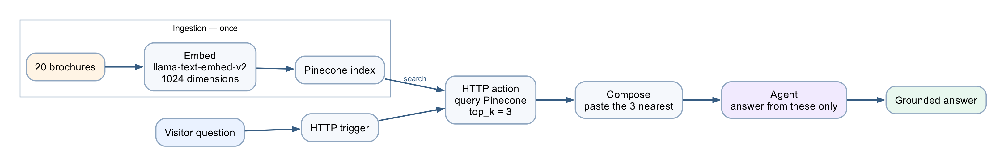
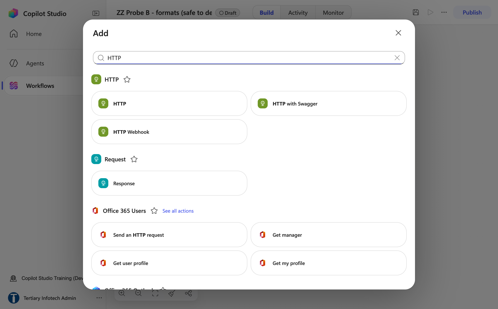
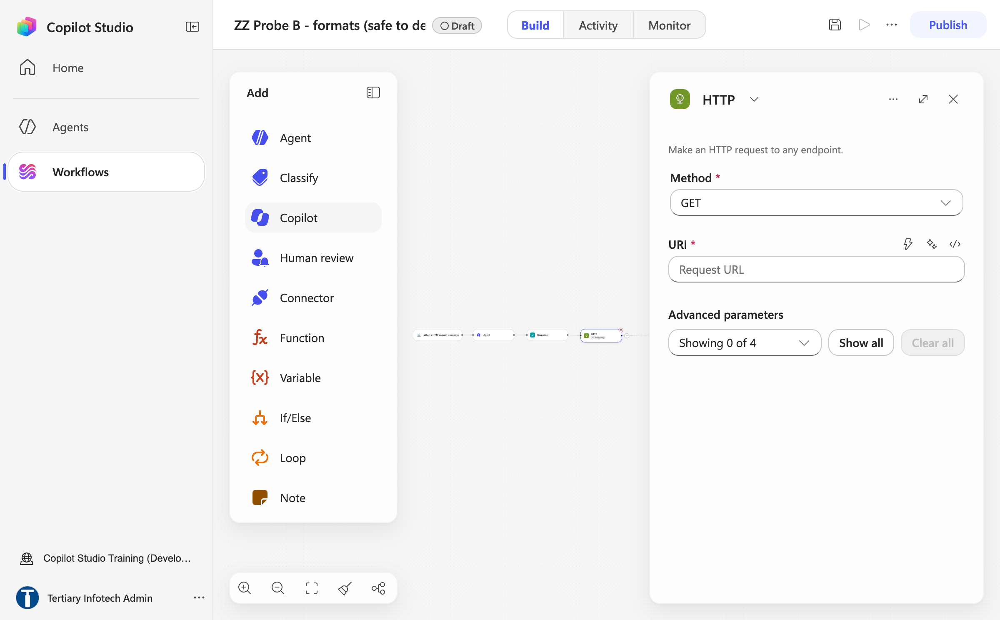
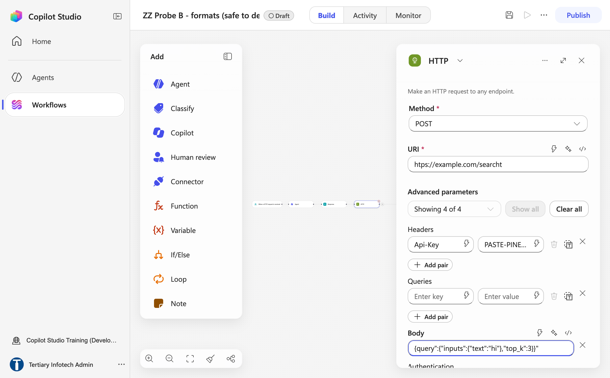
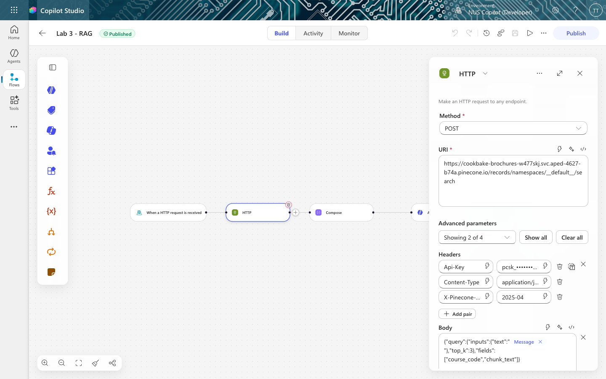
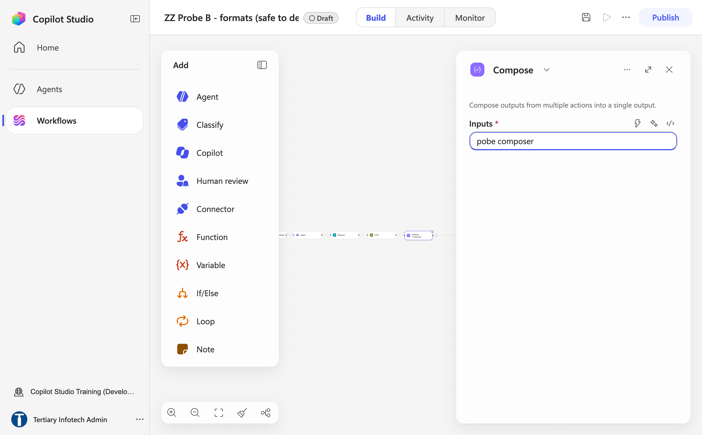
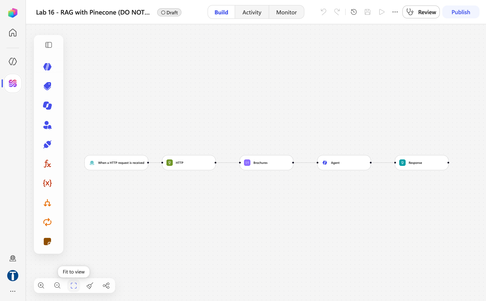
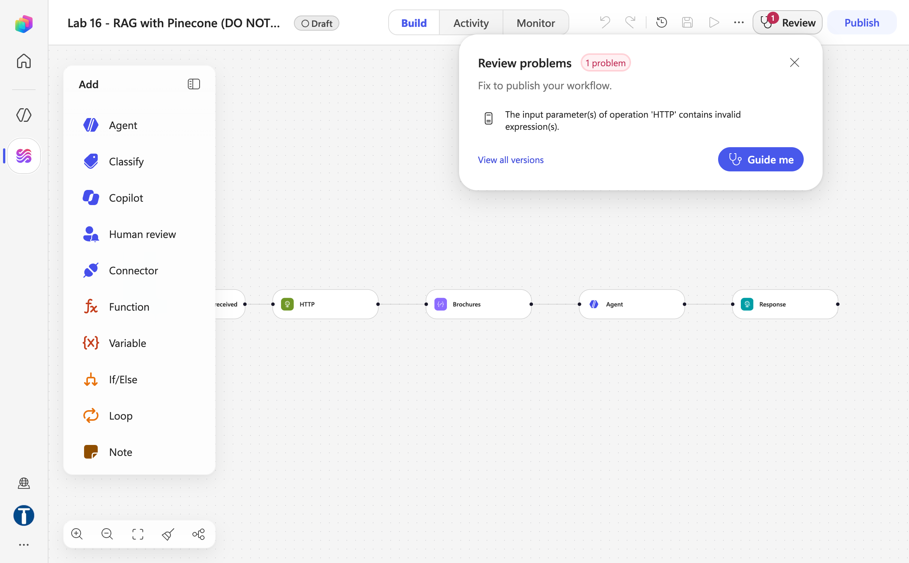
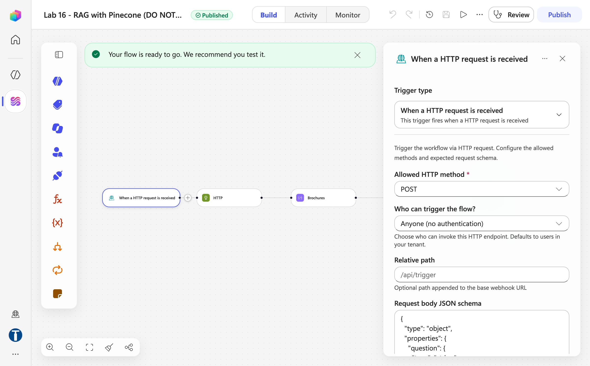
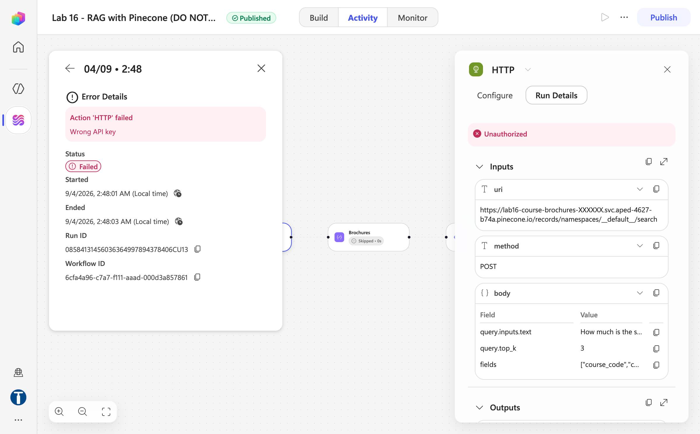

# Lab 16 — RAG with Pinecone

*The same chatbot, with the levers back*

## Goal

Rebuild Lab 15's Cook & Bake Academy chatbot as a five-node Copilot Studio workflow named `Lab 16 - RAG with Pinecone` — HTTP trigger → **HTTP** query to a Pinecone index named `lab16-course-brochures` → **Compose** that glues the question and the three retrieved brochures into one prompt → **Agent** → Response — after loading the 20 brochures into Pinecone once with a short Python script. Every decision the knowledge source hid in Lab 15 — embedding model, dimension, chunking, `top_k` — is now visible and yours.

## Duration

Approximately 30 minutes (ingestion 10 · workflow 15 · test 5).

## Prerequisites

- Completed Lab 15 — this lab is its comparison
- A **Pinecone** account (free tier) and an API key from [app.pinecone.io](https://app.pinecone.io) → *API keys* (it starts `pcsk_`)
- Python 3 on your machine (only for the one-off ingestion script — no libraries needed)
- This lab's folder: `ingest_brochures.py`, `brochures/`, `website/`, `sample-questions.csv`
- A finished reference copy named `Lab 16 - RAG with Pinecone (DO NOT DELETE)` exists in the environment. Compare against it; never edit or delete it — you build your own copy in your **Training Class** environment. It carries a **placeholder** Pinecone key and index host (`lab16-course-brochures-XXXXXX…`), so its own runs fail at the HTTP node with *401 Wrong API key* — every learner pastes their own key and host into their own copy

## Scenario

Same academy, same 20 brochures, same customers asking the same questions. Last month someone quoted a fee that was six months out of date — and in Lab 15 you could not have told them *why* the chatbot retrieved the wrong brochure, because nothing about retrieval was visible. This lab makes it visible: the brochures are embedded and stored in a vector index you created, the workflow queries that index for the three nearest brochures on every question, and the agent answers from those alone.

## Workflow visual



Ingestion happens once: the brochures are embedded and stored in Pinecone. On every question the workflow queries the index for the three nearest brochures, Compose pastes them into the prompt, and the Agent answers from those alone.


## Expected result

```text
python3 ingest_brochures.py → index "lab16-course-brochures", 20 records, 1024-dim
Website → POST { message } → "Lab 16 - RAG with Pinecone"
→ HTTP (Pinecone search, top_k 3) → Compose → Agent → Response { reply }
→ "How much is the sourdough course?" → BAK-101, SGD $680, in ~15 s
→ TC7–TC9 refused, exactly as in Lab 15 — but now you can see which brochures came back
```

## What "similar" means

An **embedding** turns a piece of text into a list of numbers — a vector — positioned so that text about similar things lands close together. "How much is the sourdough course?" lands near the sourdough brochure and far from the sushi one, **even though the two share no words**. That is the whole reason to prefer vector search over keyword search: a customer who misspells *viennoiserie*, or asks for "french pastry classes" when the brochure says *Viennoiserie*, still finds BAK-102.

| Node | What it does |
|---|---|
| **Trigger** | Receives the customer's question from the website |
| **HTTP** | Searches Pinecone, gets back the 3 most similar brochures — the *retrieval* half of RAG |
| **Compose** | Glues the question and the brochures into one prompt |
| **Agent** | Reads that prompt and writes the answer — the *generation* half |
| **Response** | Sends the answer back to the browser |

Plus one **ingestion** step, run once, before any of that.

## Detailed step-by-step

### Part A — Ingest the brochures into Pinecone (once)

1. In [app.pinecone.io](https://app.pinecone.io) → **API keys** → copy the key (starts `pcsk_`).
2. In a terminal:

```bash
export PINECONE_API_KEY=pcsk_your_key_here
cd "labs/Lab 16 - RAG with Pinecone"
python3 ingest_brochures.py
```

3. Read `ingest_brochures.py` before or after running it — it is deliberately short and commented, and it is the only place in this lab where the embedding decisions are visible. Expected output:

```text
STEP 1  Create the index (integrated embedding)
  creating 'lab16-course-brochures' with integrated embedding …
    dimension : 1024      <- chosen by the model, not by you
    embedding : llama-text-embed-v2
    metric    : cosine
  host: lab16-course-brochures-XXXXXX.svc.aped-4627-b74a.pinecone.io

STEP 2  Upload the brochures as TEXT
  20 brochures, longest 2740 characters (~685 tokens — well under the model's 2048 limit)
  uploaded — HTTP 201

STEP 3  Verify
  vectors in index: {'(default)': 20}
    Q: How much is the sourdough course?
       0.528  BAK-101   Course Fee    : SGD $680 …

Done. Paste this URL into your flow's HTTP node:
  https://lab16-course-brochures-XXXXXX.svc.aped-4627-b74a.pinecone.io/records/namespaces/__default__/search
```

4. **Copy that last URL.** You need it in Part C.

**What the script did.** It created an index with an *integrated* embedding model — `POST https://api.pinecone.io/indexes/create-for-model` with `"embed": {"model": "llama-text-embed-v2", "field_map": {"text": "chunk_text"}}` — then uploaded the brochures as text, one record per brochure, in NDJSON (one JSON object per line, no wrapping array). `field_map` **is** the embedding configuration: whatever arrives in `chunk_text` gets embedded server-side. Name the field anything else and Pinecone stores the record with **no vector and no error** — retrieval then returns nothing, forever.

**Each brochure is one record, whole and unsplit.** That is the chunking decision, and it matters more than anything else you set today (see the appendix).

**You never computed an embedding, and neither will your workflow.** The model lives inside the index, so the same model embeds both the brochures and every question — a whole class of silent mismatch removed. What you paid: you cannot change the model or the dimension without rebuilding the index.

### Part B — Create the workflow and the trigger

1. **Workflows** → **New workflow** → rename exactly `Lab 16 - RAG with Pinecone`. Save.
2. **Start** → **When a HTTP request is received**: *Anyone (no authentication)*; Relative path blank.
3. **Request Body JSON Schema** — the same four fields as Lab 15 (`message` required; `history`, `sessionId`, `source` optional). Save.

### Part C — The HTTP node: retrieval

1. `+` below the trigger → in the **Add** dialog open the **Connectors** tab and search `HTTP` → pick **HTTP** (not *HTTP with Swagger* or *HTTP Webhook*).



*Figure 16.1 — + → Connectors → search `HTTP`: choose the plain HTTP action*

| Field | Value |
|---|---|
| **Method** | `POST` — **a separate dropdown**; do not type it into the URI |
| **URI** | the search URL printed by the script: `https://lab16-course-brochures-XXXXXX.svc.aped-4627-b74a.pinecone.io/records/namespaces/__default__/search` |

`__default__` is literal — Pinecone's default namespace is `""` in statistics but must be written `__default__` in the records API path.



*Figure 16.2 — The HTTP node: Method dropdown, URI, and Advanced parameters (Showing 0 of 4) with Show all*

2. Select **Show all** under *Advanced parameters* to reveal **Headers**, **Queries**, **Body** and **Authentication**. **Headers** — three:

| Key | Value |
|---|---|
| `Api-Key` | your Pinecone API key (starts `pcsk_`) — the key itself, not the words `PINECONE_API_KEY` |
| `Content-Type` | `application/json` |
| `X-Pinecone-Api-Version` | `2025-04` |

The key goes in **Headers**, not in *Authentication* (that section is for built-in schemes). Header names truncate on screen — if you get a 4xx, check `X-Pinecone-Api-Version` kept its leading `X`.

3. **Body** — type the JSON and insert the message with the ⚡ picker where shown:

```json
{"query":{"inputs":{"text":"<⚡ trigger → message>"},"top_k":3},"fields":["course_code","chunk_text"]}
```

4. Save.



*Figure 16.3 — The HTTP node after Show all: Method POST, the `Api-Key` header (paste your `pcsk_` key as its value) and the Body JSON (probe workflow — the real URI is your index host `/records/namespaces/__default__/search`)*



`top_k: 3` is the number of brochures retrieved. Three is enough to answer a comparison question ("which is cheaper, macarons or cookies?") without stuffing the prompt. **You chose that.** You could not in Lab 15.

### Part D — The Compose node: build the prompt

1. `+` below HTTP → **Function** → **Compose** (Data Operations). The node has a single field, **Inputs**. Click the node name in the panel header and rename it **`Brochures`** — the trainer's copy uses that name, and it is what you will look for in the ⚡ picker.
2. Click the **`</>`** expression icon beside **Inputs** and enter:

```text
concat('Customer question: ', triggerBody()?['message'], '

Course brochures:
', string(body('HTTP')))
```

3. Save. `string()` converts the HTTP JSON response to text and escapes the quotes and newlines inside the brochures; without it the prompt breaks. Compose exists because the Agent node has **no input field** — and because its output is visible in the run history, which is how you debug an empty answer.



*Figure 16.4 — The Compose node has one field, Inputs; use the `</>` icon to enter the expression (probe workflow, before renaming to Brochures)*

### Part E — The Agent node: generation

1. `+` below Compose → **Agent**. Create the connection; choose a model.
2. **Knowledge — leave empty.** Retrieval already happened. Paste into **Instructions**:

```text
You are the customer care assistant for Cook & Bake Academy, a cooking and bakery school in Singapore.

Answer the customer's question using only the course brochures provided below. They are the only knowledge you have.

If the brochures do not answer the question, say "I don't have that in our course information" and offer the team on +65 6888 1234 or enrol@cookbakeacademy.sg.

Never invent a fee, a date, a duration, a course code, an instructor name or a discount. If a number is not in a brochure, you do not know it.

If we do not run a course, say so plainly, then list the two or three closest courses we do run.

Always give the course code (for example BAK-101) next to the course title. Quote fees in Singapore dollars exactly as written.

Be warm and brief — two to four short sentences. Never mention brochures, searching, or that you are reading documents.

COURSE BROCHURES AND CUSTOMER QUESTION:
```

3. Put the cursor at the very end, after `COURSE BROCHURES AND CUSTOMER QUESTION:`, click **⚡**, find **Brochures** (your Compose node) and click **Outputs**. A blue chip appears — the entire connection between retrieval and generation.

| Slot | Insert with ⚡ |
|---|---|
| after `COURSE BROCHURES AND CUSTOMER QUESTION:` | Brochures (Compose) → **Outputs** |

> **Never paste `@{outputs('Brochures')}` as text.** The Instructions box stores pasted expressions as plain characters, or escapes underscores in node names. A reference to nothing resolves to empty rather than erroring: the node stays green, the run succeeds, and the agent silently receives no brochures and no question. The symptom is a reply like *"It looks like the course brochures weren't included in your message"* — check **Agent → Run details → Outputs**.

4. Settings: **Web search** Off; **Request human assistance** Off; **Output** **Text response**. Save.

### Part F — The Response node, publish, test

1. `+` below the Agent → **Connectors** tab → search `Response` → **Response** (category *Request*). Status code `200`; under **Advanced parameters → Show all** add the header `Content-Type` = `application/json` and the **Body** `{ "reply": "` + ⚡ **Agent → Agent Response** + `" }` (type the JSON in one go — the editor auto-closes braces). The output is called *Agent Response*, not `text`; guessing `body/text` yields an empty string with no error.


*Figure 16.5 — The Response node: Status code 200, then Show all for Headers and Body*



*Figure 16.6 — All five nodes in place: HTTP trigger → HTTP → Brochures (Compose) → Agent → Response (trainer's reference copy)*

2. Save, then **Publish**. If the server-side validator finds a problem it shows a badge on the **Review** button — open it to read *Review problems* (for example *The input parameter(s) of operation 'HTTP' contains invalid expression(s)* — a Body or header that lost its expression). Fix, save, publish again. When it goes through, the pill reads **Published** and the banner says *Your flow is ready to go*. Copy the **HTTP POST URL** from the Start node's panel (it must end with `sig=…`).



*Figure 16.7 — A Review badge on Publish: the validator rejected an invalid expression in the HTTP node — fix it before the workflow will publish*



*Figure 16.8 — Published: the HTTP trigger panel (POST, Anyone, JSON schema) and the ready-to-go banner (trainer's reference copy)*
3. Test from the terminal:

```bash
curl -X POST "<YOUR HTTP POST URL>" -H "Content-Type: application/json" \
  -d '{"message":"How much is the sourdough course?"}'
```

Expect roughly 15 seconds and an answer naming **BAK-101** and **SGD $680**.

4. **Double-click `website/index.html`** (CORS is open on this gateway), paste the URL into **Lab configuration**, click 💬, and run all ten questions from `sample-questions.csv`:

| # | Question | A good answer |
|---|---|---|
| TC1 | How much is the sourdough course? | BAK-101 and the brochure's exact fee |
| TC2 | How long is the French Pastry course? | BAK-102 and its duration |
| TC3 | Where are your campuses located? | Both campuses, with addresses |
| TC4 | Do you have cooking courses for beginners? | Two or three specific courses, not all twenty |
| TC5 | What is CUL-203 about? | Japanese Sushi & Sashimi, with curriculum |
| TC6 | Which is cheaper — macarons or cookies? | Both fees, and which is cheaper |
| **TC7** | Do you offer a Vietnamese pho cooking course? | **"We don't run that"** + the closest courses |
| **TC8** | Who teaches the macaron masterclass? | **"That's not in our course information"** |
| **TC9** | Can I get the 40% alumni discount on sushi? | **Does not confirm** a discount no brochure mentions |
| TC10 | Recommend a restaurant in Chinatown | Politely declines, steers back to courses |


5. Now open **Activity** → the TC7 run → the **Brochures** node → **Run details → Outputs**. You can see exactly which three brochures came back for "pho" (Thai, Indian, vegetarian, probably) — the thing Lab 15 could never show you. That visibility is what you bought.
6. Open the trainer's `Lab 16 - RAG with Pinecone (DO NOT DELETE)` and compare the five nodes. Its **Activity** tab shows a run that **failed at the HTTP node — `Unauthorized` / *Wrong API key*** — because the reference copy deliberately carries a placeholder key and host. Open that run's HTTP node → **Run Details → Inputs**: the `uri`, `method` `POST` and the `body` fields (`query.inputs.text`, `query.top_k` 3, `fields`) are exactly the request shape you built; only the key differs. Close without changing anything.



*Figure 16.9 — Activity on the trainer's reference copy: the HTTP node fails with Unauthorized / Wrong API key (placeholder key), while Run Details → Inputs confirms the request shape*

## Checkpoint

- Pinecone index `lab16-course-brochures` with 20 vectors, created by the script
- Workflow `Lab 16 - RAG with Pinecone`, **published**, five nodes; the HTTP node's `Api-Key` header holds the real key; the Agent's Instructions end with the ⚡ **Brochures → Outputs** chip
- TC1 answers with BAK-101's exact fee in ~15 s; TC7–TC9 refused; the Brochures (Compose) Outputs in Activity show the retrieved brochures

## Debrief

1. **The agent said "I don't have that" for TC8.** Good answer or bad? What would it have cost if the bot had guessed?
2. **`top_k` is 3.** What happens at 1? At 20? Which failure is more dangerous — retrieving too little, or too much?
3. **Change a fee** in one brochure, re-run the script, ask TC1 again. No prompt was edited and no model retrained. **Who now owns the chatbot's accuracy** — the engineer, or the person who maintains the brochures?
4. **Compare Lab 12** — an exact NRIC match — with documents searched *by meaning*. When would you choose each? (What happens when a customer misspells "viennoiserie"?)
5. **You never chose an embedding model or a dimension.** Under what circumstances would that stop being acceptable?

## Appendix — what the hosted embedding hid from you

| Choice | What was chosen for you | What it would mean to own it |
|---|---|---|
| **Embedding model** | `llama-text-embed-v2` | Pick one, and use the *same* one for ingestion and query |
| **Dimension** | 1024 | Must equal the index's dimension exactly |
| **Chunking** | One brochure = one record | Chunk size and overlap |
| **Results returned** | `top_k: 3` (you did choose this) | How much context to spend per question |

**The one rule you cannot break:** ingestion embedding model = query embedding model = the index's dimension. Break the first and search returns nonsense with no error; break the second and Pinecone rejects the query naming two numbers.

**Chunking is the biggest lever, and nobody thinks about it.** Each brochure is about 2,700 characters. Chunk at 1,000 and the chunk containing *"sourdough"* is not the chunk containing *"S$680"* — search finds the first, the agent never sees the fee, and it tells your customer, honestly and uselessly, that it does not know the price. **No error is raised.** The rule: a chunk should be the smallest piece of text that still answers a question on its own. For a course brochure, that is the whole brochure. For a 400-page manual, it is not.

## Troubleshooting

| Symptom | Cause and fix |
|---|---|
| `{"reply": ""}`, run succeeds | The Compose chip did not resolve. Check Agent → Run details → Outputs; re-insert the chip with ⚡ |
| Empty reply, but the Agent's Outputs show a real answer | Response reads the wrong field — must be **Agent Response** |
| Publish refused with a **Review** badge | *The input parameter(s) of operation 'HTTP' contains invalid expression(s)* — a header or Body lost its ⚡ chip or expression. Re-insert it and publish again |
| **Unauthorized** / *Wrong API key* on the HTTP node | `Api-Key` holds the variable *name*, the trainer's placeholder, or a truncated key. It must be your own key, starting `pcsk_`, and the URI must be *your* index host |
| **401 that appears suddenly** after it worked | The index was deleted. `GET https://api.pinecone.io/indexes` — a missing index gives 401, not 404 |
| A 4xx from Pinecone | A header name lost a character on screen; re-check `X-Pinecone-Api-Version` |
| A fee that is in no brochure | Retrieval returned nothing useful, or the grounding line was weakened. Read the Compose output in Activity |
| *"The request to your flow failed"* on the website | Not **Published**, or the URL lost its `sig=` |
| `Failed to fetch`, run succeeded | **Not CORS on this gateway.** Check `sig=` and Published |
| Changed a brochure, answer unchanged | Vectors are a *copy* made at ingestion. Re-run the script |
| Retrieval returns nothing, forever, no error | The upload used a field other than `chunk_text` — nothing was embedded. Delete and recreate the index |
| *"You need credits to continue … Error code: EnforcementUsageCredits"* in the reply | The environment has no Copilot Credits — nothing is wrong with your build. Trainer: Power Platform admin center → **Licensing → Copilot Studio → Manage Copilot Credits**; publishing still works without credits |
| Answers correct but slow | Normal — 13–20 s; the Agent node calls a model |

## Key takeaways

- **RAG is two halves:** ingestion once (chunk → embed → store), retrieval on every question (embed → nearest `top_k` → into the prompt).
- **`field_map` is the embedding configuration**, and getting it wrong fails silently.
- **Chunking is the biggest lever**, and the right chunk is the smallest text that still answers a question alone.
- **Compose is your window.** Its Outputs in Activity show exactly what the agent was given — the thing the built-in knowledge source never shows.
- **Neither lab is the right answer.** Which is right depends on whether the person maintaining it will ever need the levers — a staffing question, not a technical one.

---

**Next:** [Lab 17 — Publish to Teams, Microsoft 365 Copilot and the Web](../Lab%2017%20-%20Publish%20to%20Teams%2C%20Microsoft%20365%20Copilot%20and%20the%20Web/index.md)
