# Lab 17 — Publish to Teams, Microsoft 365 Copilot and the Web

*Channels + — where a published agent meets its users*

## Goal

Take the agents you built and put them where people already work: **Publish** `Lab 5 - HR Agent`, add the **Teams + Microsoft 365** channel under **Channels +** and chat with it in Teams and in Microsoft 365 Copilot; then put the public-facing `Lab 7 - Sales Agent` on a **demo website** and understand why the HR agent must never go there. The going-further kit puts the HR agent on an intranet page with the signed-in identity intact.

## Duration

Approximately 25 minutes.

## Prerequisites

- `Lab 5 - HR Agent` built, tested in Preview and **Published** (Lab 5)
- `Lab 7 - Sales Agent` built and Published (Lab 7)
- Microsoft Teams working for the course account (Lab 0); a Microsoft 365 Copilot licence on the account is needed for Part D only
- The **Training Class** environment your trainer assigned (for example **Training Class 1**) showing bottom-left and **New experience** on
- Finished reference copies named `Lab 5 - HR (DO NOT DELETE)` (Teams + Microsoft 365 channel, still on *Authenticate with Microsoft*) and `Lab 7 - Sales (DO NOT DELETE)` (*No authentication*, Demo website channel) exist in the environment. Compare against them; never edit or delete them — you build your own copies in your **Training Class** environment. Agent names are capped at 30 characters, which is why the reference agents use a shortened base name so the full ` (DO NOT DELETE)` suffix still fits

## Scenario

Keppel Ridge's HR agent works beautifully in the Preview tab — for the person who built it. Staff will never open Copilot Studio. They live in Teams and, increasingly, in Microsoft 365 Copilot. Cook & Bake Academy's course adviser has the opposite problem: its users are members of the public who have no Microsoft account at all, so it needs to sit on a web page. Same designer, same **Channels +** panel, three very different doors.

| Workplace detail | Lab interpretation |
|---|---|
| Your role | Automation specialist releasing agents to their users |
| Stakeholders | HR (owns the HR agent), the Enrolment Office (owns the sales agent), the Microsoft 365 admin (approves Teams apps) |
| Operational risk | The HR agent is made public to get an embed code, and every rule about identity stops working |
| Success measure | The HR agent answers in Teams as the signed-in user; the Sales agent answers on a web page to anyone; nobody made the HR agent anonymous |

## Workflow visual

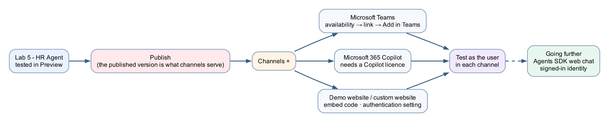

Publish first — a channel added to an unpublished agent will not work, and the error you get later says nothing about publishing. Then **Channels +** for each door, and a test *in* each door, as the user would see it.

## Expected result

```text
Lab 5 - HR Agent → Channels + → Teams + Microsoft 365 → Add channel → Publish → View in Teams → Add
→ "How many days of annual leave do I get in my first year?" answered in a Teams personal chat
→ the same channel's Use and share → View in Copilot → the agent listed under Agents in Copilot Chat
Lab 7 - Sales Agent → … → Settings → Safety & access → No authentication → Save → Publish
→ the Demo website channel appears by itself → a public page answering "How much is the macaron class?"
→ and the HR agent deliberately NOT switched to No authentication
```

## A channel is a door, not a brain

| Channel | Who the user is | What it needs | Right for |
|---|---|---|---|
| **Preview tab** | You, the maker; the *draft* | Nothing | Building |
| **Microsoft Teams** | The signed-in colleague; the *published* version | Publish; the Availability choice in the Teams + Microsoft 365 channel; admin approval only for *Submit to org catalog* | HR, IT Support, Procurement — anything that reads a person's own record |
| **Microsoft 365 Copilot** | The signed-in colleague, inside Copilot Chat | The same Teams + Microsoft 365 channel; a Microsoft 365 Copilot licence on the user | The same agents, for people who live in Copilot |
| **Demo website / embed** | **Anonymous** — anyone with the URL | Publish; **Settings → Safety & access → Authentication = No authentication** | Public agents only: the Sales agent |
| **Agents SDK web chat** (going further) | The signed-in Entra user, on a page you own | An app registration; a few settings | An HR agent on an intranet page |

Nothing about the agent changes between channels — same instructions, same knowledge, same refusals. What changes is **who the user is** and **which version is served**.

## Detailed step-by-step

### Part A — Publish, and check what is live

1. Open `Lab 5 - HR Agent` from **Agents**.
2. Select the blue **Publish** button (top right). The **Publish** dialog shows **Last published** (date and time) and the list of **Channels** the published version will serve. Select **Publish agent** — *Publishing…* takes 20–45 seconds.
3. The **Last published** line in that dialog is how you check what is live: if it is older than your last edit, the channels below serve an older build than the one you tested. (The `…` menu in the top bar holds *Settings*, *Keyboard shortcuts*, *Download* and *Delete agent* — there is no version-history entry.)
4. **Re-publish after every later change** — instructions, knowledge, skills, tools, connected agents, settings. Channels serve the *published* version, so an untested edit and an unpublished fix look identical from a chat window.

### Part B — Microsoft Teams

1. On the **Build** tab, look at the **right rail** for **Channels** — caption *"Define where users can interact with the agent."* Select its **+**.
2. The **Add a channel** dialog reads *Channels available with your current authentication settings* and offers three tiles: **Teams + Microsoft 365**, **Demo website** and **App**. On the HR agent the **Demo website** tile is greyed — hover it and it says *Requires "No authentication"* — which is exactly right for an agent that must know who is asking. Choose **Teams + Microsoft 365**.

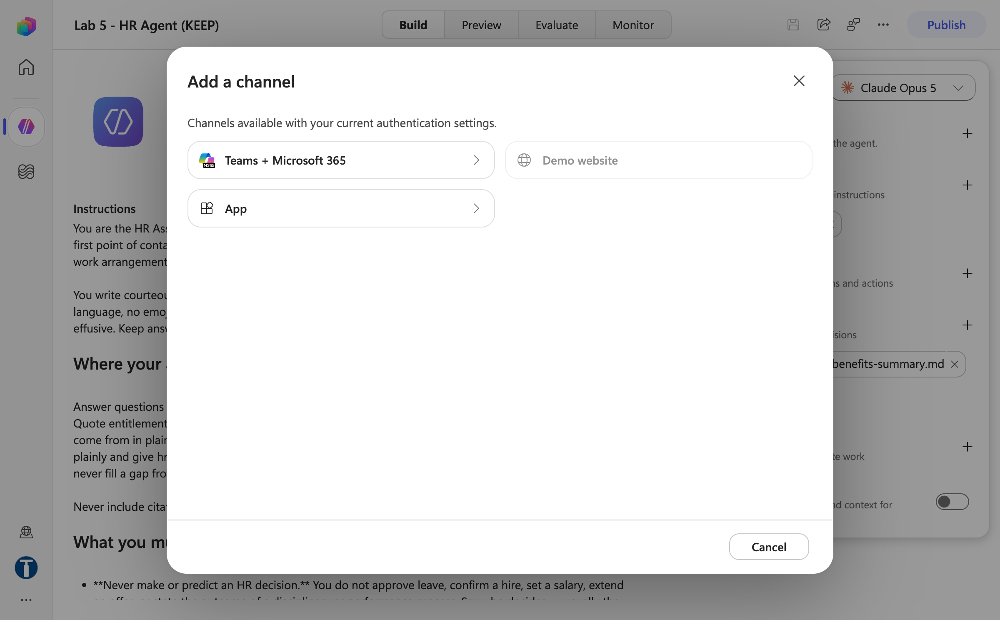

*Figure 17.1 — Channels + → Add a channel: Teams + Microsoft 365, Demo website (greyed — Requires "No authentication") and App (trainer's reference copy)*

3. The **Microsoft 365 and Microsoft Teams** panel has four tabs on the left. **Availability**: choose where the agent appears — **Microsoft 365 Copilot and Microsoft Teams** (keep this), *Microsoft 365 Copilot only* or *Microsoft Teams only*. The panel warns that *this setting can't be changed after publishing*.

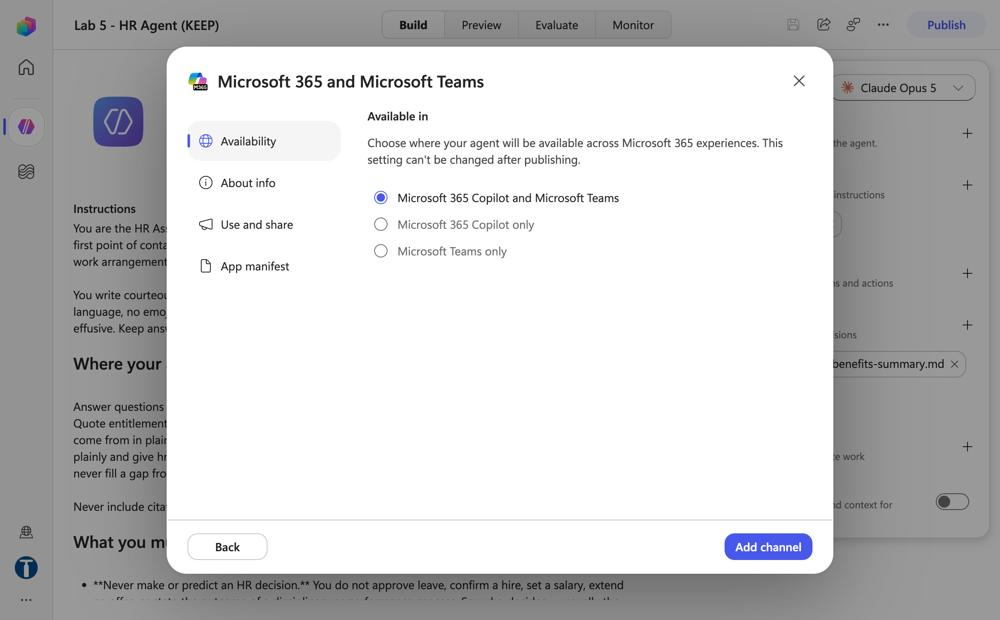

*Figure 17.2 — Availability: Microsoft 365 Copilot and Microsoft Teams — it cannot be changed after publishing*

4. **About info** holds the short and long description, the developer name, the website and the Microsoft 365 Copilot disclaimer toggle — the defaults are fine for class. **Use and share** has **View in Teams** and **View in Copilot** under *Try your agent* and **Submit to org catalog** under *Share your agent* — the org-catalog submission is the admin-approval path and will not complete inside the session; note it as the production route. **App manifest** offers **Download .zip** for a manual upload to the Teams store. Select **Add channel**.

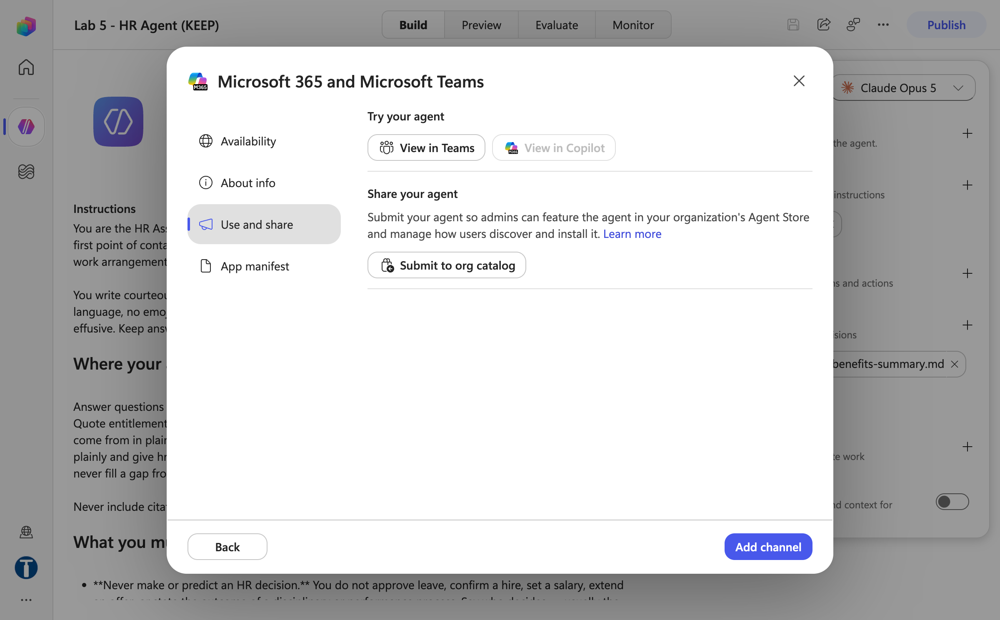

*Figure 17.3 — Use and share: View in Teams, View in Copilot and Submit to org catalog (the only step that needs an admin)*

5. Adding the channel is immediate for the maker — a **Teams + Microsoft 365 ×** chip appears under **Channels** in the right rail. Nothing was submitted to an admin.

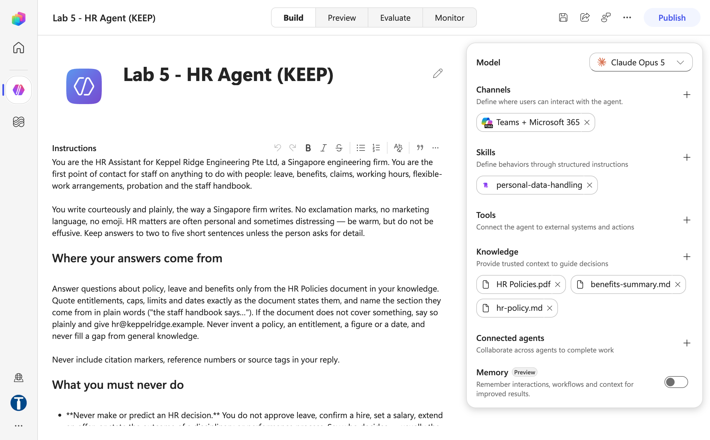

*Figure 17.4 — The Teams + Microsoft 365 chip under Channels, added immediately without admin approval (trainer's reference copy)*

6. **Publish** again — the Publish dialog now lists *Teams + Microsoft 365* under Channels. After *Publishing…* the confirmation reads **Your agent published successfully — Your agent is now available on the configured channels**, with a **View in Teams + Microsoft 365** link (and a **Share** button). Select the link; Teams opens and offers to **Add** the agent. Select **Add**. The agent appears in the Teams left rail and under **Chat**, like a colleague.

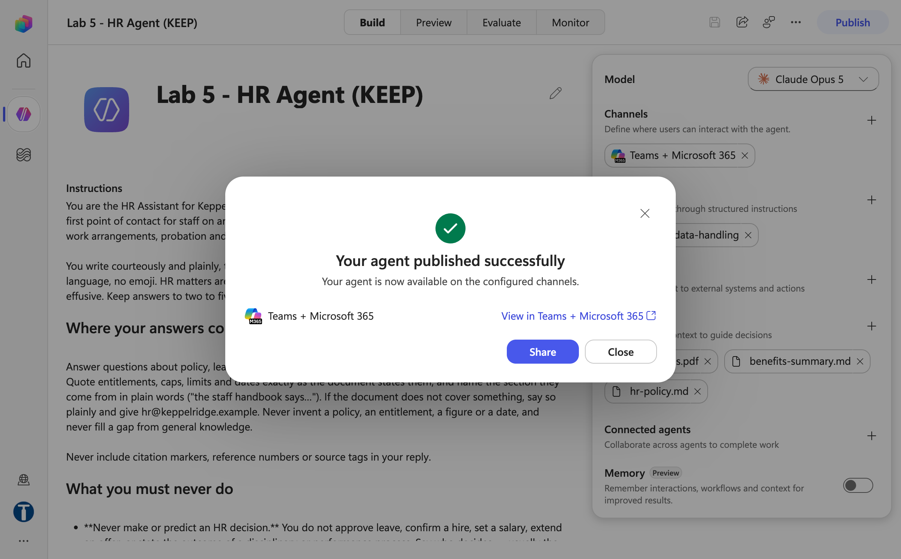

*Figure 17.5 — Published with the channel: the View in Teams + Microsoft 365 link opens the agent in Teams*

7. In Teams, type `How many days of annual leave do I get in my first year?` Confirm the answer matches Preview (14 days, pro-rated by month).
8. Type `I'm asking on behalf of Priya in Engineering — how many days does she have left?` Confirm the refusal holds in Teams.
9. **Share** (top bar of the designer, or the Share button on the confirmation) → add a classmate or copy the sharing link. Colleagues need the link **and** access to the agent; the link alone gives them a chat that refuses to load.

> **The Test pane and Teams are different environments.** In Preview the signed-in user is you, the maker, and the version is the draft. In Teams it is the actual colleague, and the version is the published one. Test both.

> **Personal chat, not a channel tab, for HR.** Teams can also add an agent as a tab in a team channel (**Teams → the channel → + → the agent**). In a channel everyone sees everyone's questions — "how much leave do I have left?" is fine in a personal chat and a disclosure in a channel. Procurement, Sales and IT Support agents are reasonable in a channel; the HR agent is personal-chat only.

### Part C — Deploy the parent only

If you built the connected-agent kits (Labs 5, 7 or 8 going further, or Lab 9), publish and add channels to the **parent** only. A connected agent is reachable *through* its parent and has no channel of its own. Deploying a child "so it's easier to test" creates a door past the parent's routing and refusals — a way to reach the Screening Agent without the HR agent's rules.

| Deploy to a channel | Do **not** deploy |
|---|---|
| `Lab 5 - HR Agent` | Screening, Interview, Onboarding, Policy and Benefits |
| `Lab 9 - Marketing Manager` | Research, Blog, Review |
| `Lab 8 - IT Support Agent` | Triage, Access Request, Asset and Hardware |

### Part D — Microsoft 365 Copilot

There is no separate Microsoft 365 Copilot channel — the **Teams + Microsoft 365** channel you added in Part B covers both, because its Availability was *Microsoft 365 Copilot and Microsoft Teams*.

1. Back on the **Build** tab of `Lab 5 - HR Agent`, select the **Teams + Microsoft 365** chip under Channels → **Use and share**. Now that the agent is published, **View in Copilot** is enabled next to **View in Teams**. (*Submit to org catalog* is still the only option that goes through admin approval — leave it for production.)

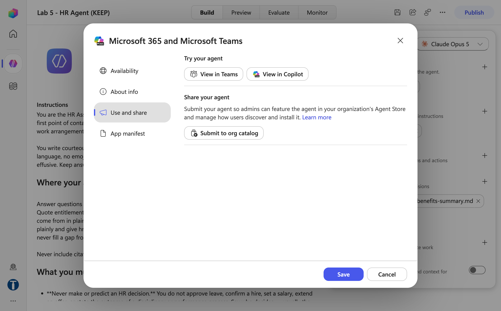

*Figure 17.6 — After publishing, Use and share offers View in Copilot as well as View in Teams*

2. Select **View in Copilot** (or open `https://m365.cloud.microsoft/chat` as the course account). Under **Agents**, find `Lab 5 - HR Agent` and start a chat.
3. Ask test 1 again. If the agent is not listed, the account has no Microsoft 365 Copilot licence — the channel is added, but the door needs a licence on the *user's* side. Note it and move on; the trainer can demonstrate it.

### Part E — A public agent on a demo website

Use the **Sales** agent for this part. It talks to the public, holds no personal data, and refuses everything a public agent should refuse.

1. Open `Lab 7 - Sales Agent` and confirm it is **Published**.
2. There is no gear icon. Open **`…` More options** (top bar, right of the Share icon) → **Settings**. The **Agent settings** dialog has four sections — **Agent details** (schema name, solution, language — read-only), **AI & behavior** (Allow other agents to connect; Moderation level), **Safety & access** and **Greeting & prompts** — and a banner: *Changes to settings take effect after you save and publish the agent.*

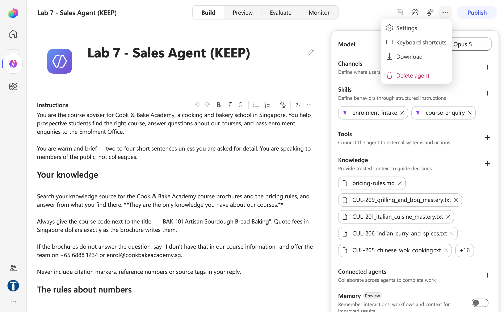

*Figure 17.7 — Settings lives under … More options (Settings / Keyboard shortcuts / Download / Delete agent) — there is no gear icon (trainer's reference copy)*

3. Select **Safety & access**. The **Authentication** dropdown reads **Authenticate with Microsoft** (the default). Open it and choose **No authentication** — for a public web page anyone with the URL can chat. The **Done** button stays disabled: changes apply immediately. Close the dialog with **✕**, then **Save** the agent and **Publish** again.

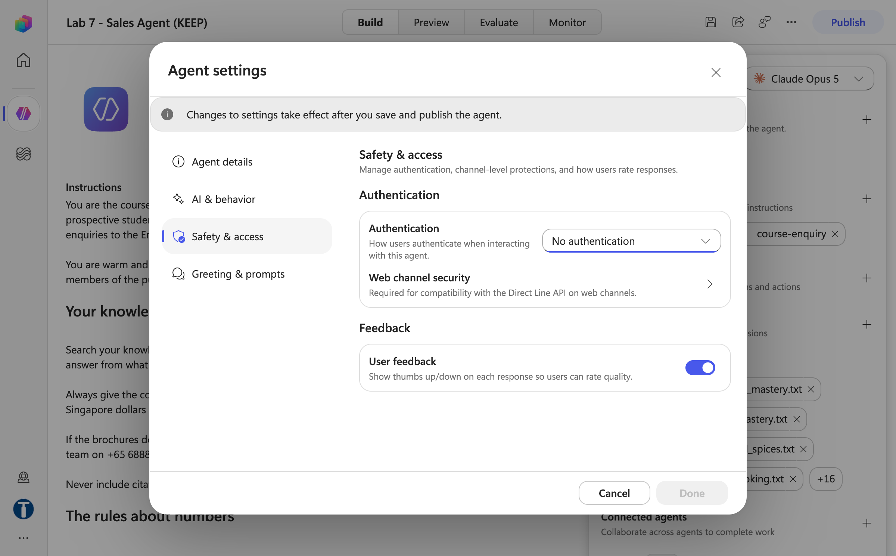

*Figure 17.8 — Safety & access → Authentication = No authentication; Done is always disabled — close with ✕, then Save and Publish*

4. Once the publish with *No authentication* goes through, a **Demo website ×** chip appears by itself under **Channels** — you do not add it. (Open **Channels +** and the Demo website tile now reads **Added**.)

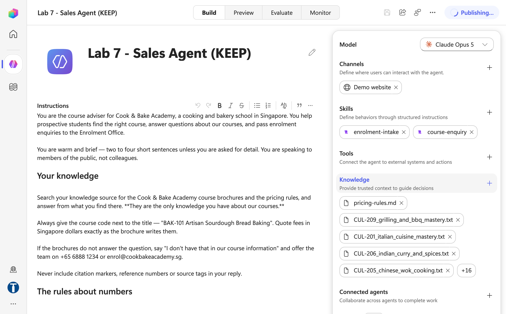

*Figure 17.9 — After publishing with No authentication the Demo website channel appears automatically under Channels*

5. Select the **Demo website** chip (*View details for Demo website*). The **Demo website** tab shows the demo page URL with a copy icon and an **Open demo website** button; the **Embed** tab holds the `<iframe>` **Embed code** for your own HTML page. Copy the URL, then open it in a private/incognito window — you are now an anonymous visitor.

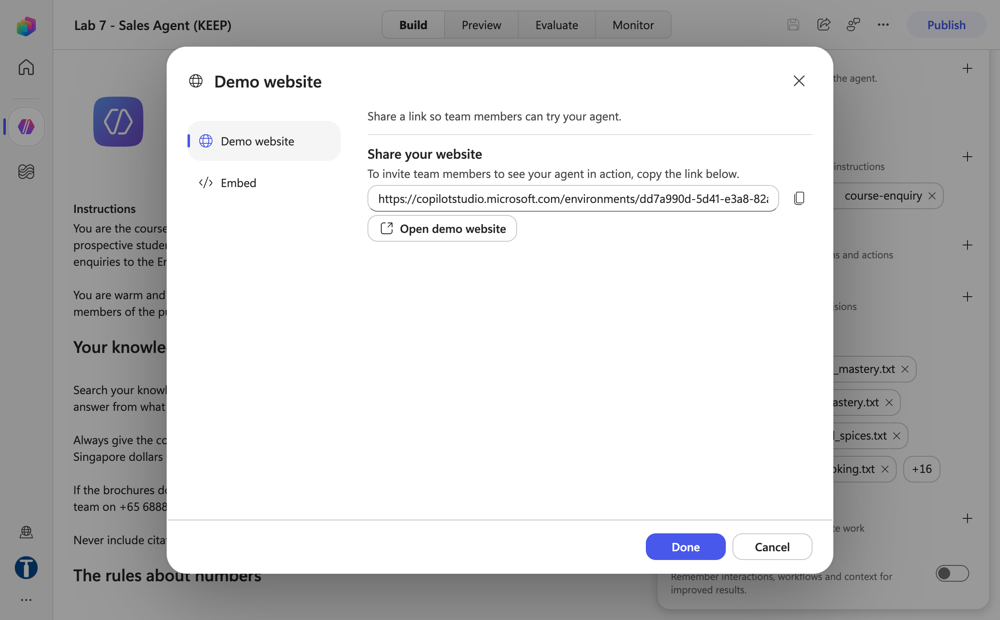

*Figure 17.10 — The Demo website panel: copy the link or Open demo website*

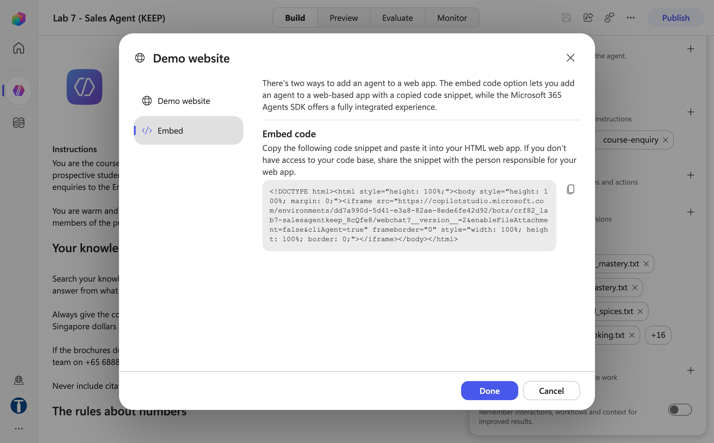

*Figure 17.11 — The Embed tab: an iframe snippet that drops the same agent into any HTML page*

6. Ask `How much is the macaron class?` and `Can I get the 40% alumni discount?` Confirm the exact fee and the refusal, exactly as in Lab 7 Preview. If the reply is *"You need credits to continue … This environment is out of credits"*, the channel is working — the environment has no Copilot Credits yet (see Troubleshooting); the trainer allocates them before class.

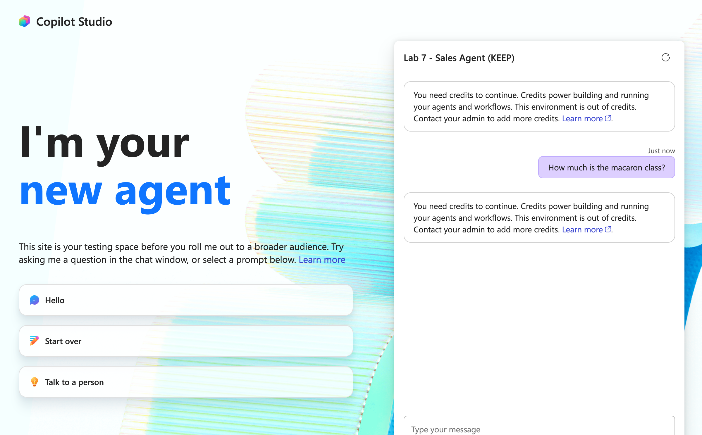

*Figure 17.12 — The demo website open as an anonymous visitor; the reply shows the Copilot Credits message until credits are allocated (trainer's reference copy)*

7. Optional: paste the embed code into any HTML page and open it — the same agent, on a page you own.

### Part F — Why the HR agent gets no public web channel

1. Open `Lab 5 - HR Agent` → **`…` → Settings → Safety & access → Authentication**. It reads **Authenticate with Microsoft** — the default, and correct.
2. Open **Channels +** and look at the **Demo website** tile. With authentication on it is greyed — *Requires "No authentication"* — so there is no demo page and no embed code. The product is telling you which method fits an authenticated agent; the going-further kit (Agents SDK web chat) is the authenticated route.
3. Do **not** switch the HR agent to *No authentication* to get the tile. The demo site is the same agent with no sign-in; every rule in its instructions about "the signed-in user" depends on there being one, and an anonymous HR agent that reads leave records is a data breach with a chat window. If someone asks for "the HR agent on the public website", the answer is a *different agent* — which is the Sales agent's story.
4. Close Settings with **✕** without changing anything.

### Part G — Test as the user, in each door

Run at least one test in **Teams** for each published agent, not only in Preview:

| Agent | Test in the channel |
|---|---|
| `Lab 5 - HR Agent` | "How much annual leave do I have in my first year?" → the handbook answer, in a personal chat |
| `Lab 6 - Procurement Agent` | "Can we buy stationery from Orchard Office Solutions?" → Approved, Stationery — from the register |
| `Lab 8 - IT Support Agent` | "I clicked a link in a weird email" → disconnect, **do not power off**, escalate |
| `Lab 7 - Sales Agent` (demo website) | "Can I get the 40% alumni discount?" → the premise refused |

Then open the trainer's `Lab 5 - HR (DO NOT DELETE)` and compare its **Channels** list with yours (one chip: *Teams + Microsoft 365*); do the same with `Lab 7 - Sales (DO NOT DELETE)` (*Demo website*). Close without changing anything.

## Checkpoint

- `Lab 5 - HR Agent` **Published** after the channel was added, a **Teams + Microsoft 365** chip under Channels, and the agent answering in a Teams personal chat
- The same channel's **Use and share** shows **View in Copilot** (the agent is listed in Copilot Chat if the account is licensed)
- `Lab 7 - Sales Agent` set to *No authentication*, re-published, the **Demo website** chip present, and the demo page answering in a private window
- The HR agent still on *Authenticate with Microsoft*, with the Demo website tile greyed
- No child agent deployed to any channel

## Troubleshooting

| Symptom | Cause | Fix |
|---|---|---|
| Agent doesn't respond in Teams | Not published, or published before the channel was added | **Publish** again |
| "Something went wrong" on the Teams link | Not shared with that user, or the user is in another tenant | **Share** the agent; check the environment |
| Works in Preview, wrong in Teams | Teams serves the **published** version | Check **Last published** in the Publish dialog; publish the draft |
| Reads the wrong person's record in Teams | The agent used a name from the message instead of the signed-in identity | The identity paragraph in the instructions — and note it is probabilistic |
| Not listed under Agents in Microsoft 365 Copilot | No Microsoft 365 Copilot licence on the user | Licence the user, or demonstrate from the trainer's account |
| Cannot find Settings | There is no gear icon | **`…` More options → Settings** |
| The Settings **Done** button is greyed | It always is — changes apply immediately | Close with **✕**, then **Save** and **Publish** |
| The **Demo website** tile is greyed *Requires "No authentication"* | Authentication is *Authenticate with Microsoft* | Correct for the HR agent — leave it. For a public agent, Safety & access → No authentication, Save, then Publish |
| No Demo website chip after switching authentication | Not published since the change | **Publish** again; the chip appears on its own |
| Demo website says the agent is unavailable | Not published after changing the authentication setting | Publish again |
| Demo website (or Preview) replies *"You need credits to continue … Error code: EnforcementUsageCredits"* | The environment has no Copilot Credits — nothing is wrong with the channel or the agent | Trainer: Power Platform admin center → **Licensing → Copilot Studio → Manage Copilot Credits**; publishing and channels work without credits |
| Approval cards never reach the agent chat | They never do — Human review cards arrive in the Teams **Workflows** bot chat, and Approvals-connector requests in the Teams **Approvals** app | Look there |

## Key takeaways

- **Publish is what channels serve.** Preview reads the draft; every channel reads the published version.
- **A channel is a door, not a brain.** The agent behaves identically at each; what changes is who the user is and which version is served.
- **Each door needs something different** — Teams needs the Availability choice and, for the org catalog, admin approval; Microsoft 365 Copilot needs a licence; a public web page needs *No authentication*, which is exactly why the HR agent must never have one.
- **Deploy the parent only.** A child with its own channel is a hole in the parent's boundary.
- **Test as the user, in the channel** — the HR agent is the one that behaves differently, because in Teams the signed-in user is the colleague, not the maker.

## What deployment does not give you

**No approval routing.** Teams delivers the *conversation*. The approval gates in Lab 4, Lab 6's going-further flow and Lab 14 arrive separately — Human review cards in the Teams **Workflows** chat, Approvals-connector requests in the **Approvals** app — not in the agent chat.

**No identity guarantee beyond the signed-in user.** The agent knows who is signed in. It does not know whether the person typing "I'm Priya's manager" is anyone's manager.

**No retention control you chose.** Conversations are stored under the tenant's Teams retention policy. The safest way to keep something out of a transcript is for it never to reach the agent — which is the argument for the HR agent's escalation list.

**No audit of the model's reasoning.** Workflows record what they did. Nothing records why the agent chose to hand over, or to call a tool, or not to.

## Going further

- **[The HR agent on an intranet page](going-further/webchat/README.md)** — the same HR agent as a chat widget on a Keppel Ridge People & Culture landing page, via the **Microsoft 365 Agents SDK** Copilot Studio client. The user in the widget is the signed-in Entra user — the same identity story as Teams, on a page you own — and the closing demonstration is the same question answering differently for two signed-in users. Needs an Entra app registration and a local web server; 30–40 minutes.
- **[The longer deployment reference](publish-to-teams.md)** — parent-only deployment, personal chat versus channel tab, sharing with a class, and the full troubleshooting table.

---

**Next:** [Back to the lab index](../README.md) — you have completed all eighteen labs.
