# Lab 2 — Log to Excel

*Log the enquiry, then send the email*

## Goal

Build a second workflow named `Lab 2 - Log to Excel` that reuses Lab 1's trigger and email, and writes every form submission to the `EnquiryLog` table in `Lab 2 - Enquiry Log.xlsx` **before** the confirmation email is sent.

## Duration

Approximately 30 minutes.

## Prerequisites

- Completed and tested Lab 1 (`Lab 1 - Trigger and Actions`)
- `Lab 1 - Course Enquiry Form` (the trainer's form, or your own copy from Lab 1)
- [Lab 2 - Enquiry Log.xlsx](assets/Lab%202%20-%20Enquiry%20Log.xlsx) from this lab's `assets` folder (the trainer's copy already sits in the OneDrive folder `Power Automate Lab Data` on the trainer's account — see Lab 0)
- OneDrive for Business access on the course account
- A finished reference copy named `Lab 2 - Log to Excel (DO NOT DELETE)` exists in the master reference environment `TGS-2022017524-Business Process Automation with Power Automate and Copilot Studio Agents` (a Sandbox environment, read-only for learners). Compare against it; never edit or delete it — you build your own copy in your **Training Class** environment

## Scenario

The training team needs a shared enquiry register for follow-up and reporting. A confirmation should be sent only after the enquiry has been recorded successfully — **commit before you confirm**.

## Workflow visual

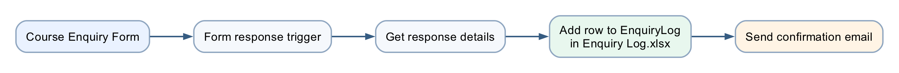

Lab 2 has the same trigger and email as Lab 1. The new Excel action sits between them.

## Workbook design

The supplied workbook has one sheet, `Enquiries`, containing the named table `EnquiryLog`:

| Timestamp | Name | Email | Tel | Message | Status | Source |
|---|---|---|---|---|---|---|

> The Excel Online (Business) connector writes only to a **named table**, never to a plain range. If you build your own workbook, select the header row, press **Ctrl+T** (*My table has headers*), then set **Table Design → Table Name** to `EnquiryLog`.

## Expected result

```text
One form submission
→ one run of "Lab 2 - Log to Excel"
→ one new row in EnquiryLog (Status = New, Source = Lab 1 - Course Enquiry Form)
→ then one confirmation email
```

## Detailed step-by-step

### Part A — Upload and verify the workbook

1. Download or locate `Lab 2 - Enquiry Log.xlsx` in this lab's `assets` folder.
2. Open **OneDrive for Business** (`https://www.office.com` → OneDrive → **My files**) for the course account.
3. Create a folder named `Power Automate Lab Data` if it does not exist. Every workbook in this course lives in that folder — the trainer's own OneDrive holds the same folder with the Lab 2, 3, 6 and 14 workbooks.
4. Open the folder and select **Create or upload → Files upload**.
5. Upload `Lab 2 - Enquiry Log.xlsx`.

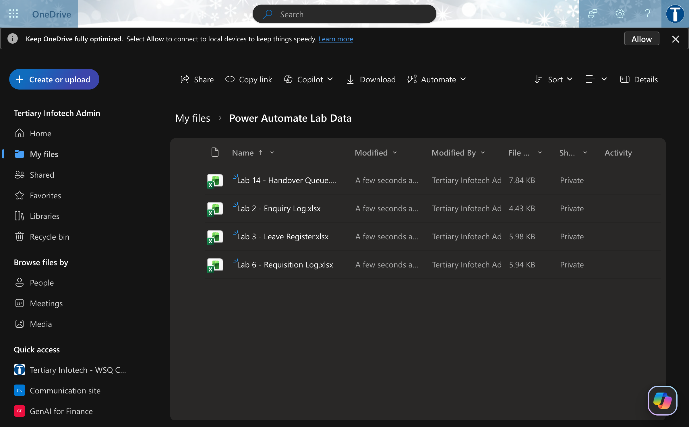

*Figure 2.1 — OneDrive for Business → My files → Power Automate Lab Data: Lab 2 - Enquiry Log.xlsx alongside the Lab 3, 6 and 14 workbooks (trainer's account)*

6. Open the uploaded workbook in Excel for the web.
7. Confirm the worksheet tab is named `Enquiries`.
8. Click any header cell.
9. Open the **Table Design** tab.
10. Confirm the **Table Name** box reads `EnquiryLog`.
11. Confirm all seven column headings are present.
12. Close the workbook tab.

> **⚠️ OneDrive for Business, not personal OneDrive.** The Excel connector cannot reach a personal (consumer) OneDrive. If the File picker in Part C shows folders you recognise but not this one, you are signed into two accounts and the workbook is in the other one's drive.

### Part B — Create the workflow and rebuild the Lab 1 trigger

The Copilot Studio workflow designer has no *Save As* and no *Export*, so the Lab 1 nodes are rebuilt here — two nodes now, the email later, about five minutes.

1. Open `https://copilotstudio.microsoft.com`, confirm your **Training Class** environment is showing bottom-left, and select **Workflows**.
2. Select **New workflow**.
3. Click the workflow name at the top (`Untitled workflow`), type exactly `Lab 2 - Log to Excel`, press **Enter**.
4. In the **Start** panel open **Trigger type** → **Connector**. In the **Select a trigger** dialog search `Microsoft Forms` → **When a new response is submitted**. Confirm the green tick on **Connection**. **Form ID** = `Lab 1 - Course Enquiry Form`.
5. Select **+** below the Start node → in the **Add** dialog search `Get response details` → Microsoft Forms **Get response details**. **Form ID** = `Lab 1 - Course Enquiry Form`; **Response ID** = the suggested **Response Id** chip (⚡ *When a new response is submitted → Response Id*).
6. Select **Save**.

### Part C — Insert Excel logging

1. Select the **+** below **Get response details**.
2. In the **Add** dialog open the **Connectors** tab (or choose **Connector** in the left Add panel — either way a **Select a connector** list opens with Office 365 Outlook, Microsoft Teams, SharePoint, OneDrive, **Excel Online (Business)**…). Select **Excel Online (Business)**, then the action **Add a row into a table**.

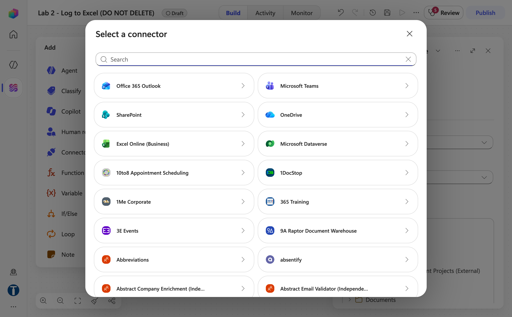

*Figure 2.2 — Select a connector: Excel Online (Business) is in the first rows of the list*

3. The node panel opens on **Configure**. If the **Connection** row has no green tick, open its dropdown, select **Create new connection** and sign in with the course Microsoft 365 account.
4. Fill the fields top to bottom, in this order — each one unlocks the next, and the **Review** badge in the top bar counts the ones still empty. **Location**: open the dropdown and choose `OneDrive for Business`.
5. **Document library**: the field may show `me` — open the dropdown and choose **OneDrive** (ignore *PersonalCacheLibrary* and *Enter custom value*).

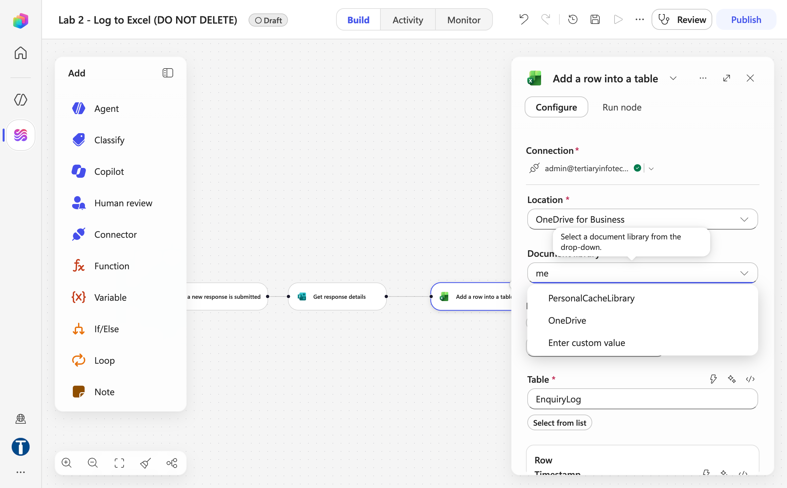

*Figure 2.3 — Add a row into a table: Location = OneDrive for Business, then the Document library dropdown — choose OneDrive*

6. **File**: the panel now shows your OneDrive folders as a tree (Applications, Apps, Attachments, Desktop, Documents…). Expand **Power Automate Lab Data** and click `Lab 2 - Enquiry Log.xlsx`. The field then reads `/Power Automate Lab Data/…` with **Change** and **Clear** buttons beside it.

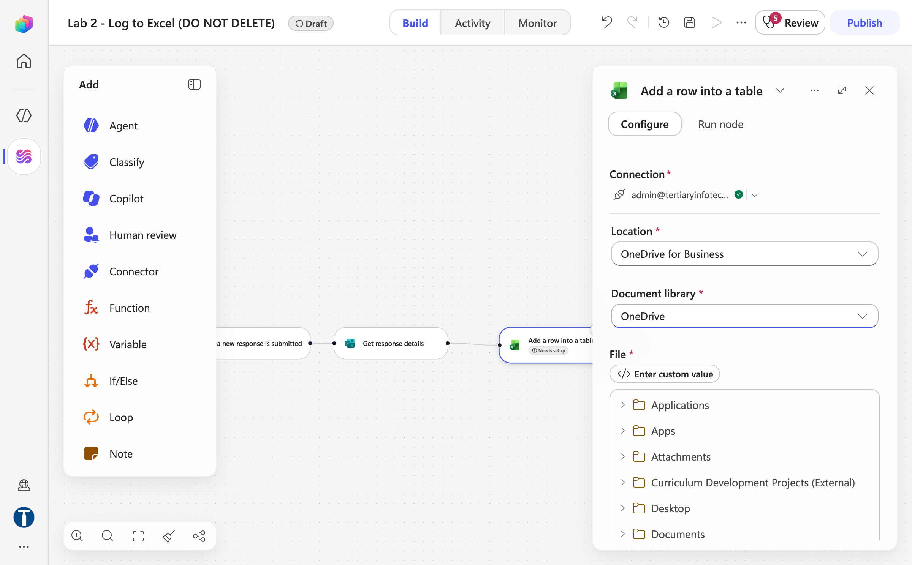

*Figure 2.4 — File: browse the OneDrive folder tree → Power Automate Lab Data → Lab 2 - Enquiry Log.xlsx*

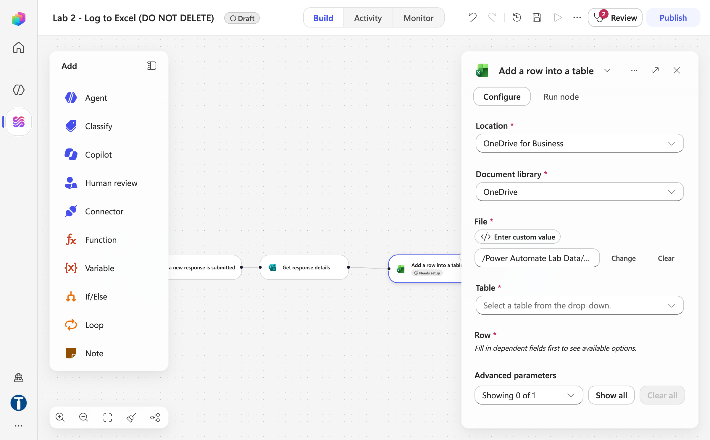

*Figure 2.5 — File picked (/Power Automate Lab Data/…); Table reads "Select a table from the drop-down" and Row says "Fill in dependent fields first"*

7. **Table**: open the dropdown and choose `EnquiryLog`.
8. Wait a moment — the **Row** section appears with the seven column fields (Timestamp, Name, Email, Tel, Message, Status, Source), each with its own ⚡ and `</>` icons.

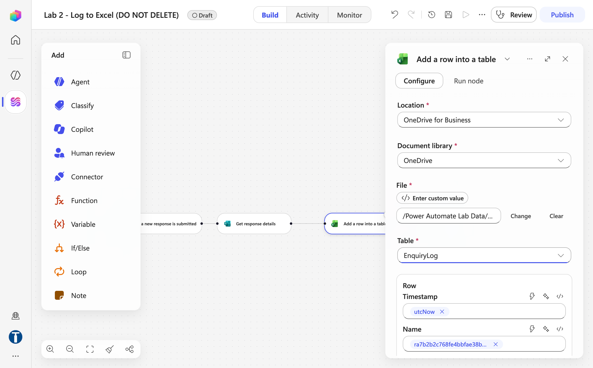

*Figure 2.6 — Table = EnquiryLog: the Row section lists the table's columns (Timestamp with a utcNow expression chip, Name with the form token — trainer's reference copy)*

> If **Location** shows *"Could not load options"*, the **Connection** above it is not set. Connect first and the rest cascade. If the folder tree does not show `Power Automate Lab Data`, the connection was made with a different account from the one that holds the workbook.

### Part D — Map the table columns

1. Click inside **Timestamp**.
2. Select the **`</>`** (expression) option next to the field and enter:

```text
utcNow()
```

3. Confirm it, so the field shows an expression chip.
4. Click inside **Name** and insert the form's **Name** token with **⚡** (from *Get response details*).
5. Map **Email** to the form's **Email** token.
6. Map **Tel** to the form's **Tel** token.
7. Map **Message** to the form's **Message** token.
8. In **Status**, type `New`.
9. In **Source**, type `Lab 1 - Course Enquiry Form`.
10. Confirm every form answer comes from **Get response details** (not from the trigger).
11. Select **Save**. A green banner confirms *Your workflow has been saved. After publishing, it'll be ready to test or run.*

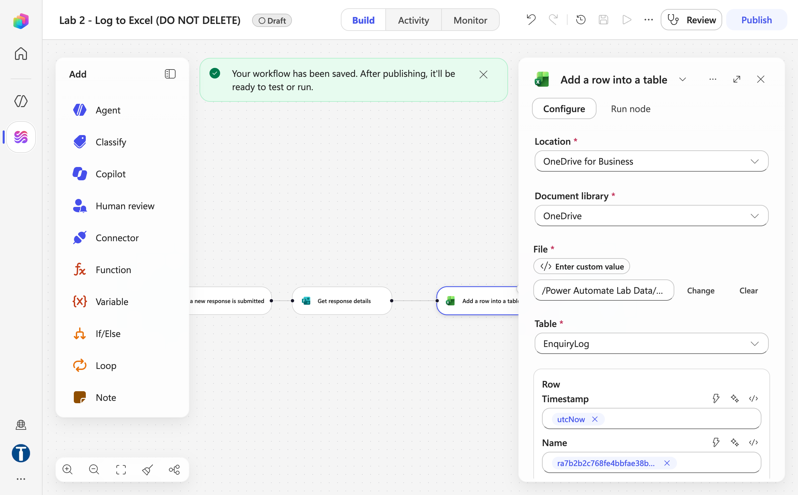

*Figure 2.7 — After Save: the workflow-saved banner; the Excel node keeps Location, Document library, File, Table and the mapped Row columns*

### Part E — Add the confirmation email after Excel

1. Select the **+** below **Add a row into a table**.
2. In the **Add** dialog search `Send an email` → Office 365 Outlook **Send an email** (the connector's *Send an email (V2)*).
3. **To** = ⚡ *Get response details → Email* (never a typed expression).
4. **Subject** = `Thank you for your enquiry`.
5. **Body** — `Hello ` + ⚡ **Name** + `,` then on new lines:

```text
Thank you for your enquiry. We received the following message:
```

   then the ⚡ **Message** token, then:

```text
Your enquiry has been logged and will be reviewed by our training team.
```

6. Confirm the Outlook node sits **after** the Excel node on the canvas: *When a new response is submitted → Get response details → Add a row into a table → Send an email*. Do not drag nodes to tidy up — moving a node clears its configuration.

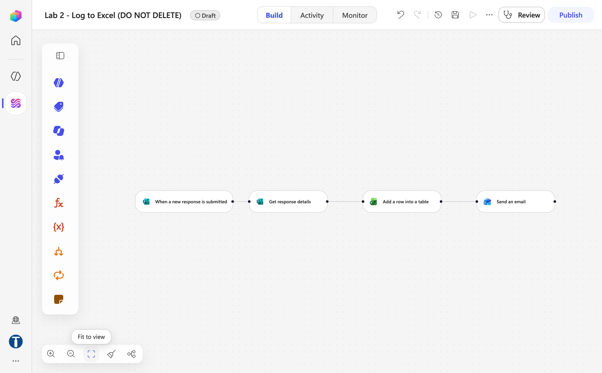

*Figure 2.8 — The finished canvas: the Excel node sits between Get response details and Send an email*

7. Select **Save**, then **Publish**. The pill next to the name changes to **Published** and a banner reads *Your flow is ready to go. We recommend you test it.*

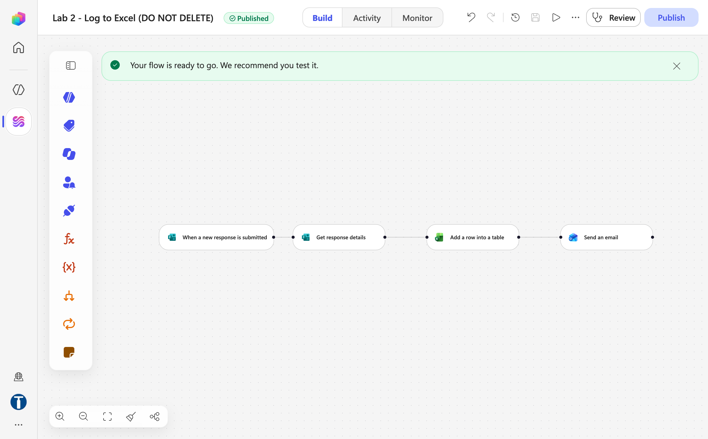

*Figure 2.9 — After Publish: Published pill and the "ready to go" banner (trainer's reference copy `Lab 2 - Log to Excel (DO NOT DELETE)`)*
8. In the **Workflows** list, switch the **Enabled** toggle of `Lab 1 - Trigger and Actions` **off** while you test Lab 2 — both workflows watch the same form, and two enabled workflows mean two emails. (Leave the trainer's `(DO NOT DELETE)` copies alone.)

### Part F — Test two submissions

1. Open `Lab 1 - Course Enquiry Form`.
2. Submit:
    - Name: `Aisha Lim`
    - Email: an address you can access
    - Tel: `62345678`
    - Message: `I would like the corporate course outline.`

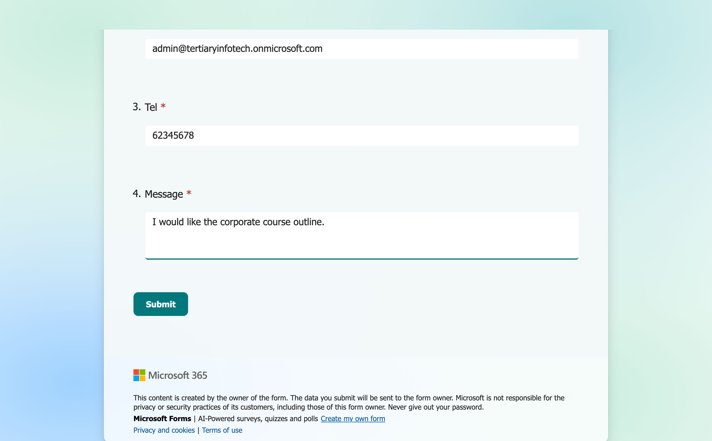

*Figure 2.10 — The enquiry form filled for the Lab 2 test: Tel 62345678, Message "I would like the corporate course outline."*

3. In Copilot Studio open `Lab 2 - Log to Excel` → **Activity** and open the newest run. The trainer's reference run **succeeded in 3 s**; yours should be similar.

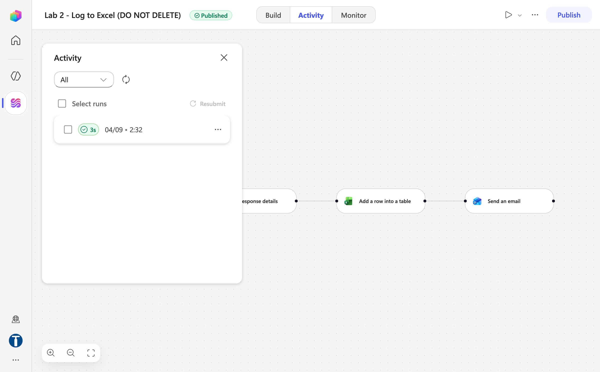

*Figure 2.11 — Activity tab: the run triggered by the form submission, succeeded in 3 s (trainer's reference copy)*

4. Confirm the Excel node completed before the Outlook node (both green).
5. Open `Lab 2 - Enquiry Log.xlsx` in Excel for the web.
6. Confirm a new row contains Aisha's complete details.
7. Confirm **Status** is `New`.
8. Confirm **Source** is `Lab 1 - Course Enquiry Form`.
9. Confirm the email arrived.
10. Submit a second response with a different name and message.
11. Confirm a second row is appended and the first row remains unchanged.
12. Re-enable `Lab 1 - Trigger and Actions` afterwards if the trainer asks you to.

## Checkpoint

- Two successful runs of `Lab 2 - Log to Excel` in Activity (each a few seconds long)
- Two separate rows in `EnquiryLog`
- Two confirmation emails sent to the submitted addresses

## Troubleshooting

| Symptom | Check |
|---|---|
| Workbook not listed | It must be in **OneDrive for Business** on the connector's account, not only on the local computer or a personal OneDrive |
| Table not listed | Select named table `EnquiryLog`; loose worksheet cells are not a table |
| Columns do not appear | Re-select the file and table, then wait for metadata to load |
| File locked | Close desktop Excel and retry |
| Wrong time format | `utcNow()` records UTC; apply workbook display formatting if required |
| Email sent but no row | Ensure Excel is before Outlook and open the Excel node's **Run details** for the error |
| Two emails per submission | `Lab 1 - Trigger and Actions` is still enabled. Turn it off in the Workflows list |
| No run at all | The workflow is saved but not **Published** |

## Key takeaways

- Lab 2 repeats a verified pattern and adds one node to it.
- A named Excel table provides a basic audit trail.
- Node order determines whether the email is sent after successful logging — **commit the record of the obligation before you create the obligation**.
- Test with multiple records to verify rows append correctly.

---

**Next:** [Lab 3 — Leave Application Approval](../Lab%203%20-%20Leave%20Application%20Approval/index.md)
