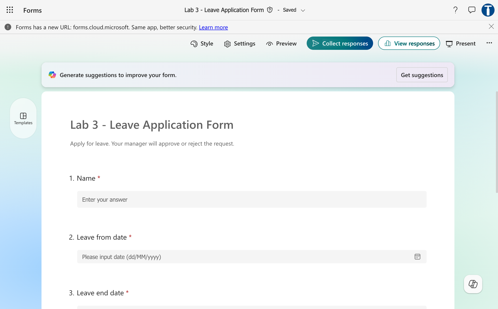
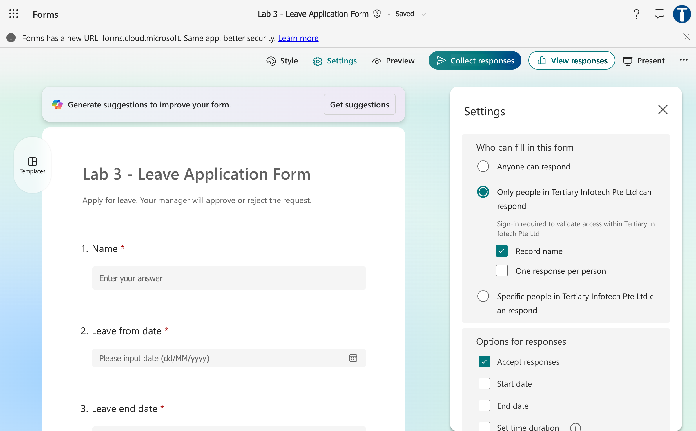
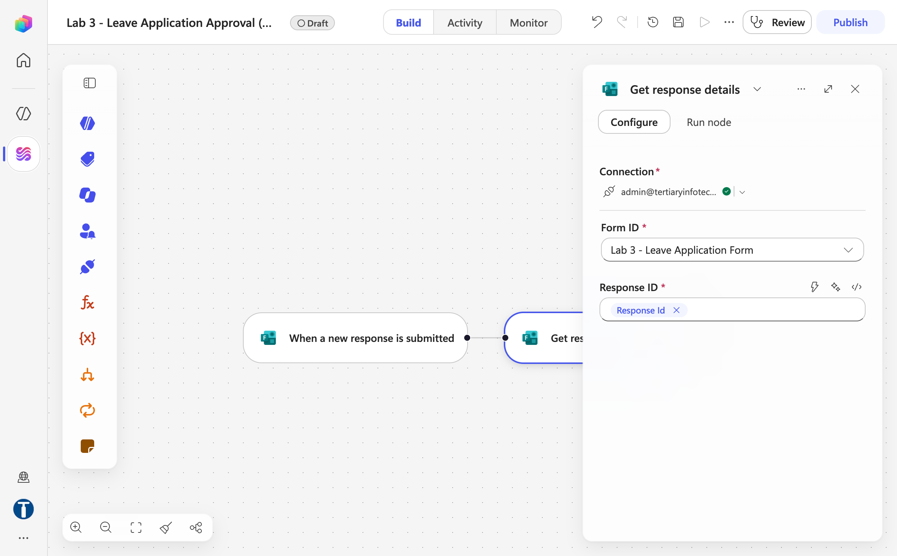
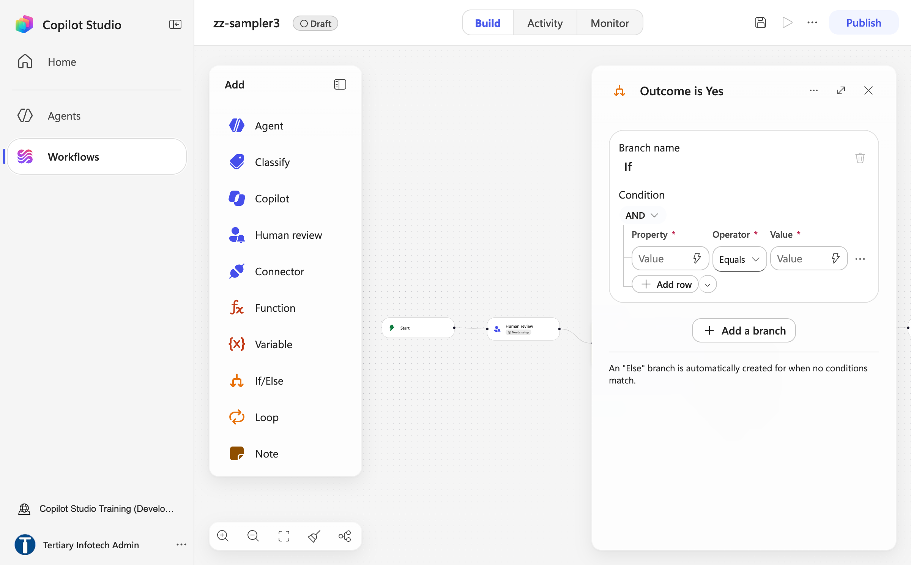
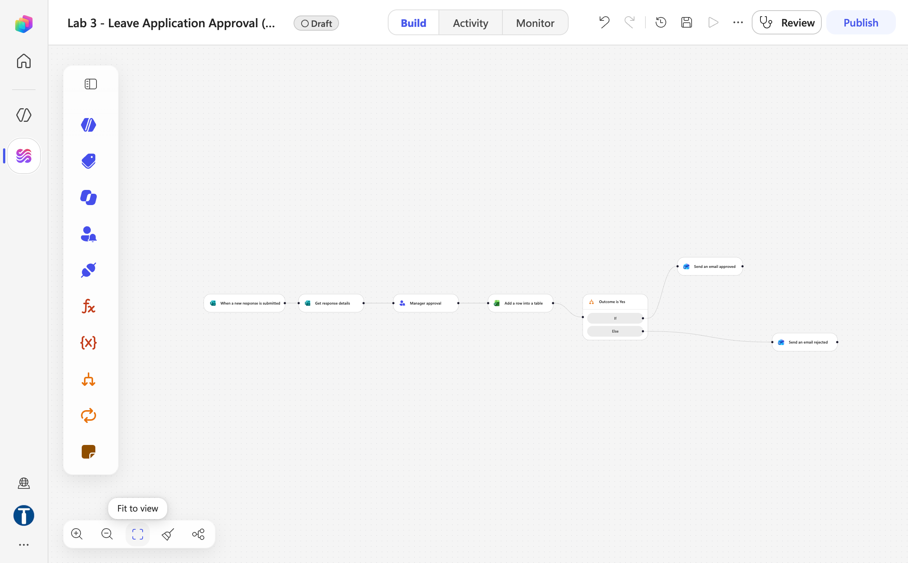
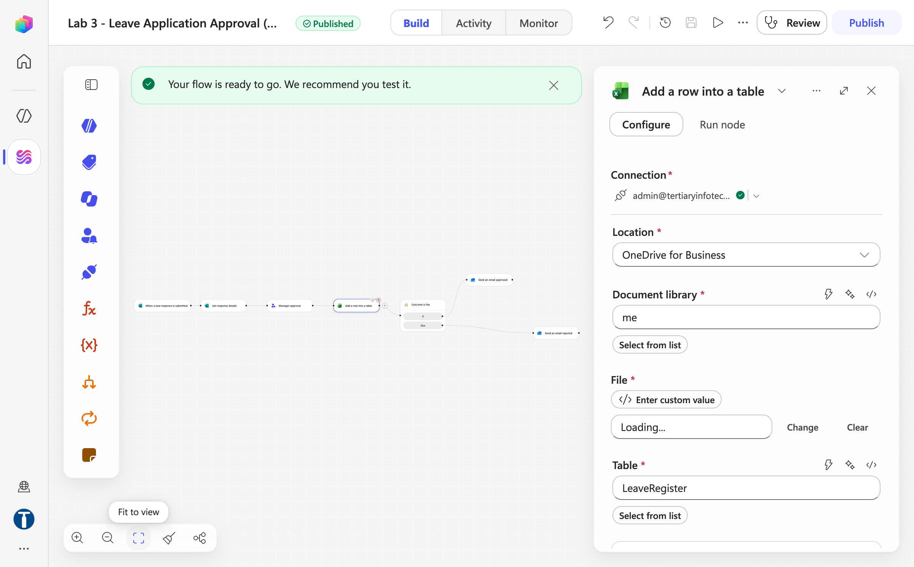
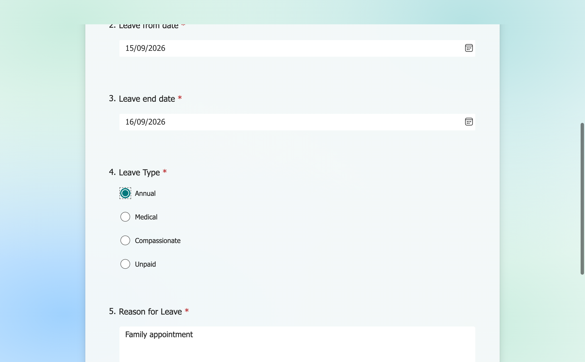
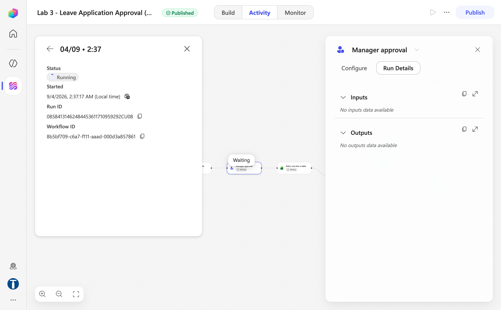
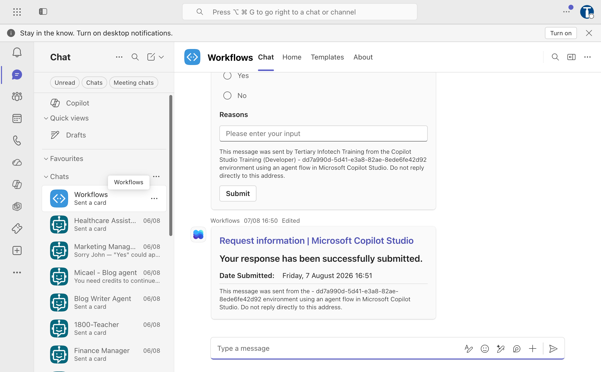
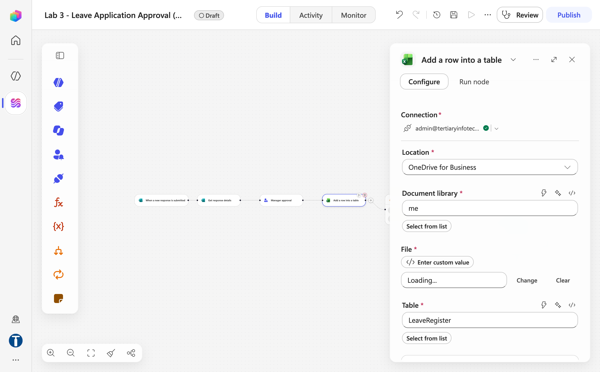

# Lab 3 — Leave Application Approval

*The workflow pauses for a manager*

## Goal

Build a workflow named `Lab 3 - Leave Application Approval` that pauses at a **Human review** node until a manager answers a card in Microsoft Teams, logs the decision to the `LeaveRegister` table in `Lab 3 - Leave Register.xlsx` (optional Part F), then branches with **If/Else** and emails the applicant the decision and comments.

## Duration

Approximately 35 minutes (Part F, the optional Excel log, adds about 10 minutes).

## Prerequisites

- Completed Labs 1–2 (Start node triggers, Connector actions, ⚡ tokens, Publish, Activity)
- Microsoft Forms, Outlook and Teams access on the course account
- A valid manager or classroom test user in the Microsoft 365 tenant (in class, your own account is the safest choice)
- For Part F: [Lab 3 - Leave Register.xlsx](assets/Lab%203%20-%20Leave%20Register.xlsx) — already uploaded by the trainer to the `Power Automate Lab Data` folder in OneDrive for Business
- A finished reference copy named `Lab 3 - Leave Application Approval (DO NOT DELETE)` exists in the master reference environment `TGS-2022017524-Business Process Automation with Power Automate and Copilot Studio Agents` (a Sandbox environment, read-only for learners). Compare against it; never edit or delete it — you build your own copy in your **Training Class** environment

## Scenario

An employee submits leave dates and a reason. The manager makes the decision; the workflow records the decision (in its run, and in Part F in a register) and sends the appropriate message. Nothing about the decision is automated — the workflow only moves the request to the person who is allowed to make it, and waits.

## Form design

The trainer has already created the form `Lab 3 - Leave Application Form` in Microsoft Forms (`https://forms.cloud.microsoft`). You use it as-is; the one-page rebuild sheet in [assets/Lab 3 - Leave Application Form.md](assets/Lab%203%20-%20Leave%20Application%20Form.md) is only for rebuilding it in your own tenant.

| Question | Type | Setting |
|---|---|---|
| Name | Text | Required |
| Leave from date | Date | Required |
| Leave end date | Date | Required |
| Leave Type | Choice: Annual · Medical · Compassionate · Unpaid | Required, single choice |
| Reason for Leave | Text | Required; Long answer enabled |

Settings: **Only people in Tertiary Infotech Pte Ltd can respond** and **Record name = On** (**One response per person** off), so Forms supplies the responder's email to the workflow.



*Figure 3.1 — Lab 3 - Leave Application Form in Microsoft Forms with the Name, Leave from date and Leave end date questions (trainer's copy)*



*Figure 3.2 — Form Settings panel: Only people in Tertiary Infotech Pte Ltd can respond, Record name ticked, One response per person off*

## Workflow visual


The workflow waits at the Human review node, resumes when the manager submits the Teams card, then the If/Else takes the approved or rejected branch.

## Expected result

```text
One form submission
→ one run of "Lab 3 - Leave Application Approval" that sits at "Running"
→ a "Request information | Microsoft Copilot Studio" card in the manager's Teams Workflows chat
→ the manager chooses Yes or No, types a comment and submits
→ (Part F) one row in LeaveRegister recording the decision
→ the If/Else takes the matching branch and emails the applicant with the comments
```

## Detailed step-by-step

### Part A — Check the leave form

1. Open `https://forms.cloud.microsoft` with the course account (the old `forms.office.com` address redirects here).
2. Open `Lab 3 - Leave Application Form` from **My forms** (or the **Shared with me** tab).
3. Confirm the five questions match the **Form design** table: Name, Leave from date, Leave end date, Leave Type (single choice) and Reason for Leave (long answer).
4. Select **Settings** (top right). Confirm **Only people in Tertiary Infotech Pte Ltd can respond** is selected, **Record name** is ticked and **One response per person** is not — the workflow needs the responder's email, and you will submit the form more than once.
5. Select **Preview** and confirm the date questions display date selectors and that only one leave type can be selected. Close the preview without changing anything.
6. If you are working in your own tenant and the form does not exist, build it from the rebuild sheet: **New Form**, name it `Lab 3 - Leave Application Form`, add the five questions in the order above (each **Required**; **Long answer** on for the reason; **Multiple answers** off for Leave Type), then apply the settings in step 4.

### Part B — Create the workflow and its trigger

1. Open `https://copilotstudio.microsoft.com`, confirm your **Training Class** environment is showing bottom-left, and select **Workflows** → **New workflow**.
2. Click the workflow name at the top, type exactly `Lab 3 - Leave Application Approval`, press **Enter**.
3. Click the **Start** node → **Trigger type** → **Connector** → search `Microsoft Forms` → **When a new response is submitted**. Confirm the green tick on **Connection**. **Form Id** = `Lab 3 - Leave Application Form`.
4. Select **+** below Start → **Connectors** tab → search `Microsoft Forms` → **Get response details**. **Form ID** = `Lab 3 - Leave Application Form`; **Response ID** = ⚡ *When a new response is submitted → Response Id*.



*Figure 3.3 — Get response details panel: Connection green tick, Form ID = Lab 3 - Leave Application Form, Response ID = the Response Id token*

5. Select **Save**.

### Part C — Configure the manager approval (Human review)

1. Select the **+** below **Get response details**.
2. From the **Featured** tab of the Add dialog choose **Human review** (it is also in the left **Add** panel). Confirm the **Connection** row shows *Human review* with a green tick.
3. Click the node title and rename it `Manager approval`.
4. In **Title**, type `Leave request - ` (with a trailing space) and insert the ⚡ **Name** token (from *Get response details*) after the hyphen.
5. In **Message**, create labelled lines, pressing Enter after each:
    - `Applicant name: `
    - `Leave from date: `
    - `Leave end date: `
    - `Leave type: `
    - `Reason: `
    - `Choose Yes to approve, No to reject, and add a comment for the applicant.`
6. Click after each label and insert the matching ⚡ token from *Get response details* (Name, Leave from date, Leave end date, Leave Type, Reason for Leave).
7. In **Assigned to (first to respond)**, type the manager's Microsoft 365 work address (in class: your own address).
8. Wait for the directory lookup, then **click the suggestion** so the address resolves to a person chip. An address that is typed and tabbed away from looks fine and fails at run time with *Required field 'assignedTo' is missing or empty*.
9. **Channel** = **Teams**. Never choose Outlook — on this tenant the Outlook channel creates the request and the mail never arrives.


*Figure 3.4 — Human review panel: Title, Message, Assigned to (first to respond) resolved to a person chip, Channel = Teams, Inputs → Add an input*

10. Under **Inputs**, select **Add an input** → **Yes/No** and label it `Outcome`. Select **Add an input** again → **Text** and label it `Comments`. The node will not save with no inputs; leave both defaults blank so the card arrives unanswered.


*Figure 3.5 — Human review Inputs after Add an input twice: a Yes/No input (Outcome) and a Text input (Comments)*

11. Do not place medical details in the Message beyond what the manager needs.
12. Select **Save**.

### Part D — Branch on the outcome with If/Else

1. Select the **+** below **Manager approval** and, from the **Add** dialog, choose **If/Else**. Rename the node `Outcome is Yes`.
2. In the condition row, click the **Property** box and, from **⚡** under *Manager approval*, choose the **Yes/No** output (this is the `Outcome` input the manager fills in).
3. Leave the **Operator** as **Equals**.
4. In the **Value** box, type `Yes` (exact spelling and capitalisation — the Yes/No input publishes the string `Yes`, not `true`).



*Figure 3.6 — If/Else node Outcome is Yes: Property = the Human review Yes/No output, Operator = Equals, Value = Yes; the Else branch is created automatically*

5. On the **If** (true) branch, select **+** → **Connectors** → `Office 365 Outlook` → **Send an email (V2)**. Rename it `Send an email approved`.
6. Click **To** and insert **Responders' Email** from *Get response details* with **⚡**.
7. Set **Subject** to `Leave request approved`.
8. In **Body**, type a short message and insert the applicant's **Name**, **Leave from date**, **Leave end date** and **Leave Type** tokens, then a line `Manager's comments: ` followed by the ⚡ **Text** output from *Manager approval*.
9. On the **Else** branch, select **+** → **Connectors** → `Office 365 Outlook` → **Send an email (V2)**. Rename it `Send an email rejected`.
10. **To** = ⚡ **Responders' Email** from *Get response details*.
11. **Subject** = `Leave request not approved`.
12. In **Body**, include the date range and the ⚡ **Text** output from *Manager approval*, and a sentence asking the applicant to contact the manager if clarification is needed.



*Figure 3.7 — The complete canvas: When a new response is submitted → Get response details → Manager approval → Add a row into a table (Part F) → Outcome is Yes → Send an email approved / Send an email rejected (trainer's reference copy)*

13. Select **Save**, then **Publish**. The pill next to the name changes to **Published** and the banner reads *Your flow is ready to go*. Confirm **Status = Published** in the Workflows list.



*Figure 3.8 — After Publish: the Published pill and the banner "Your flow is ready to go. We recommend you test it."*

### Part E — Test approval and rejection

**Approval:**

1. Submit the form with:
    - Name: `Ravi Kumar`
    - Leave from date: a future date
    - Leave end date: the following day
    - Leave Type: Annual
    - Reason: `Family appointment`



*Figure 3.9 — The leave form filled in: future from/end dates, Leave Type = Annual, Reason = Family appointment*

2. Open `Lab 3 - Leave Application Approval` → **Activity**. The newest run shows **Running** — open it and the **Manager approval** node shows **Waiting**. It stays parked until a person responds. That pause is the point of the lab.



*Figure 3.10 — Activity → run details: Status = Running, the Manager approval node shows Waiting and the Excel node has not run yet*

3. Open Teams → **Chat** → the **Workflows** bot chat (not the Approvals app). The card `Request information | Microsoft Copilot Studio` arrives within a minute or two; on this tenant it can be slow, and the run simply stays at Running until it does.



*Figure 3.11 — The Human review card in the Teams Workflows bot chat: Yes / No choice, a text box, Submit, and the "Your response has been successfully submitted" confirmation*

4. Confirm the card displays every submitted field.
5. Select **Yes**.
6. Type the comment `Approved for the stated dates.`
7. Select **Submit**.
8. Return to **Activity** and refresh. Confirm the run resumed, completed, and the **If** branch ran (green).
9. Confirm the responder's mailbox received the approval email containing the comment.

**Rejection:**

10. Submit a second leave request with different dates and Leave Type `Unpaid`.
11. Open the new card in the Workflows chat.
12. Select **No**.
13. Type `Please discuss alternative dates with your manager.`
14. Select **Submit**.
15. Confirm the **Else** branch ran.
16. Confirm the rejection email contains the comment.
17. Confirm both runs remain in **Activity** as evidence.

### Part F (optional) — Log the decision to Excel

Every decision — approved or rejected — is written to a register the moment the manager responds, so there is a record outside the run history.

1. Confirm `Lab 3 - Leave Register.xlsx` is in the `Power Automate Lab Data` folder in OneDrive for Business (the same folder as Lab 2). The trainer has uploaded it; only upload [the copy in this lab's assets](assets/Lab%203%20-%20Leave%20Register.xlsx) if it is missing.
2. Open it in Excel for the web and confirm the sheet `Leave` contains the table `LeaveRegister` with the columns: Timestamp · Name · Leave Type · From · To · Reason · Decision · Comments · Approver. Close the workbook.
3. Back in the designer, select the **+** on the connector line **between Manager approval and Outcome is Yes** — the decision is already known at that point, so one Excel node records both outcomes.
4. Choose **Connectors** → `Excel Online (Business)` → **Add a row into a table**.
5. Set **Location** = `OneDrive for Business`, **Document Library** = `OneDrive`, **File** = open the picker → `Power Automate Lab Data` → `Lab 3 - Leave Register.xlsx`, **Table** = `LeaveRegister`. The table's columns then appear as fields.



*Figure 3.12 — Excel Online (Business) → Add a row into a table: Location = OneDrive for Business, Document library, File picker, Table = LeaveRegister (trainer's reference copy)*

6. Map the columns:

| Column | What to put in it |
|---|---|
| Timestamp | `</>` expression `utcNow()` |
| Name | ⚡ *Get response details* → **Name** |
| Leave Type | ⚡ *Get response details* → **Leave Type** |
| From | ⚡ *Get response details* → **Leave from date** |
| To | ⚡ *Get response details* → **Leave end date** |
| Reason | ⚡ *Get response details* → **Reason for Leave** |
| Decision | ⚡ *Manager approval* → **Yes/No** output |
| Comments | ⚡ *Manager approval* → **Text** output |
| Approver | The manager's address typed as a literal (the Human review node only outputs what the reviewer typed) |

7. Select **Save**, then **Publish** again.
8. Submit one more leave request, answer the card in Teams, then open `Lab 3 - Leave Register.xlsx` and confirm a row appeared with the correct Decision, Comments and Approver.

## Checkpoint

- Two completed runs of `Lab 3 - Leave Application Approval`: one through **If**, one through **Else**
- Both applicant emails received, each containing the manager's comment
- (Part F) At least one row in `LeaveRegister` naming the approver

## Governance checkpoint

- Use only authorised approvers.
- Limit access to reasons and medical information.
- Never use an agent or workflow to make the manager's decision.
- A production leave process should use the organisation's approved HR record system.

## Troubleshooting

| Symptom | Check |
|---|---|
| The Teams card never arrives | **Channel** must be **Teams**; **Assigned to** must be a valid tenant user, **clicked** from the directory suggestion. Look in the **Workflows** bot chat, not the Approvals app. On this tenant the card can take several minutes |
| `Required field 'assignedTo' is missing or empty` | The address was typed and tabbed away from. Retype it and click the suggestion |
| Human review will not save | Zero inputs — add `Outcome` (Yes/No) and `Comments` (Text) with **Add an input** |
| Run remains Running | It is waiting for the manager; open and submit the card in the Workflows chat |
| Wrong branch | Compare the **Yes/No** output with the exact value `Yes` (not `true`) |
| Comments are blank | Insert the **Text** output of *Manager approval*, not the Message |
| External address rejected | Use a tenant account approved for classroom testing |
| Excel row not written (Part F) | The node must sit between Manager approval and the If/Else; the workbook must be in OneDrive for Business and the table named `LeaveRegister` |
| Nothing fires | Not **Published**, or disabled in the Workflows list |

## Key takeaways

- Human approval is a node inside a workflow, not a separate workflow type.
- The run pauses safely and resumes after the decision — the same **Human review** node returns in Lab 4 and Lab 14.
- **If/Else** needs both branches built; a silent Else branch is a request nobody answered.
- Logging the decision gives an audit trail that outlives the Activity list.

---

**Next:** [Lab 4 — Email Classification](../Lab%204%20-%20Email%20Classification/index.md)
