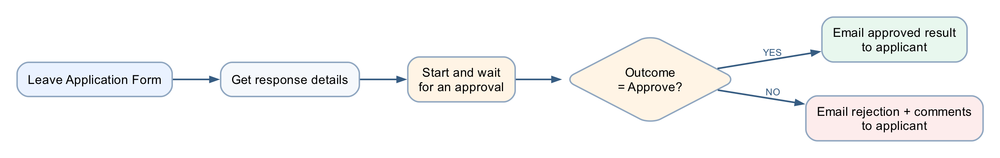

# Lab 3 — Leave Application Approval

## Goal

Create a leave application process that pauses for a manager to approve or reject the request and emails the applicant with the decision and comments.

## Duration

Approximately 45 minutes.

## Prerequisites

- Microsoft Forms, Approvals and Outlook access
- A valid manager or classroom test user in the Microsoft 365 tenant
- Completed understanding of triggers and actions from Labs 1–2

## Optional import accelerator

Import [Lab4-Leave-Application-Approval-NEW.zip](Lab4-Leave-Application-Approval-NEW.zip)
through **My flows → Import → Import Package (Legacy)** and choose **Create as
new**. Reconnect Forms, Approvals and Outlook; select the Leave Application
Form; map its answers; and verify the manager and responder email fields. The
imported flow name ends with **`(NEW)`**.

## Scenario

An employee submits leave dates and a reason. The manager makes the decision; the flow records the decision in its run history and sends the appropriate message.

## Workflow visual

The flow waits at the approval action, resumes when the manager responds, then follows the approved or rejected branch.

## Detailed step-by-step

### Part A — Create the leave form

1. Open Microsoft Forms.
2. Select **New Form**.
3. Name it `Leave Application Form`.
4. Add a required **Text** question named `Name`.
5. Add a required **Date** question named `Leave from date`.
6. Add a required **Date** question named `Leave end date`.
7. Add a required **Choice** question named `Leave Type`.
8. Add the choices:
    - Annual
    - Medical
    - Compassionate
    - Unpaid
9. Add a required **Text** question named `Reason for Leave`.
10. Enable **Long answer** for the reason.
11. Open **Settings**.
12. Select **Only people in my organisation can respond**.
13. Turn on **Record name** so Forms supplies the responder's identity and email without adding an Email question.
14. Preview the form.
15. Confirm the date questions display date selectors.
16. Confirm only one leave type can be selected.

### Part B — Create the automated flow

1. Open Power Automate.
2. Select **Create → Automated cloud flow**.
3. Name it `Lab 3 - Leave Application Approval`.
4. Select **When a new response is submitted**.
5. Select **Create**.
6. Set **Form Id** to `Leave Application Form`.
7. Add **Get response details**.
8. Select the same Form Id.
9. Insert the trigger's **Response Id** token.

### Part C — Configure the manager approval

1. Select **+ → Add an action** below Get response details.
2. Search for `Start and wait for an approval`.
3. Select **Approvals — Start and wait for an approval**.
4. In **Approval type**, select **Approve/Reject – First to respond**.
5. In **Title**, enter `Leave request - `.
6. Insert the submitted **Name** token after the hyphen.
7. In **Assigned to**, enter the manager's Microsoft 365 work address.
8. Press Enter so the address resolves.
9. In **Details**, create labelled lines for:
    - Applicant name
    - Leave from date
    - Leave end date
    - Leave type
    - Reason
10. Insert the matching dynamic-content token after each label.
11. In **Item link description**, enter `Leave Application Form response` if the field is available.
12. Do not place medical details in optional fields that expose them more broadly.

### Part D — Branch on the outcome

1. Add **Control — Condition** below the approval.
2. In the left field, choose **Outcome** from the approval action.
3. Select **is equal to**.
4. In the right field, enter `Approve`.
5. Under **If yes**, add **Office 365 Outlook — Send an email (V2)**.
6. Set **To** to **Responders' Email** from Get response details.
7. Set **Subject** to `Leave request approved`.
8. In the body, include the applicant's name, date range, leave type and **Responses Comments** from the approval.
9. Under **If no**, add another **Send an email (V2)**.
10. Set **To** to **Responders' Email** from Get response details.
11. Set **Subject** to `Leave request not approved`.
12. In the body, include the date range and **Responses Comments**.
13. Add a sentence asking the applicant to contact the manager if clarification is needed.
14. Select **Save**.

### Part E — Test approval

1. Submit the form with:
    - Name: `Ravi Kumar`
    - Leave from date: a future date
    - Leave end date: the following day
    - Leave Type: Annual
    - Reason: `Family appointment`
2. Open the approval from Teams, Outlook or **Power Automate → Approvals**.
3. Confirm the approval displays every submitted field.
4. Select **Approve**.
5. Enter comment `Approved for the stated dates.`
6. Submit the decision.
7. Open run history.
8. Confirm the flow resumed and the Yes branch ran.
9. Confirm the responder's test mailbox received the approval email and comment.

### Part F — Test rejection

1. Submit a second leave request with different dates.
2. Open the new approval.
3. Select **Reject**.
4. Enter `Please discuss alternative dates with your manager.`
5. Submit the decision.
6. Confirm the No branch ran.
7. Confirm the rejection email contains the comment.
8. Confirm the approval and rejection runs remain available as evidence.

## Governance checkpoint

- Use only authorised approvers.
- Limit access to reasons and medical information.
- Never use an agent or flow to make the manager's decision.
- A production leave process should use the organisation's approved HR record system.

## Troubleshooting

| Symptom | Check |
|---|---|
| Approval never arrives | Assigned-to address must be a valid tenant user with Approvals access |
| Flow remains running | It is waiting for the manager; open and complete the approval |
| Wrong branch | Compare Outcome with exact value `Approve` |
| Comments are blank | Insert **Responses Comments** from the approval action |
| External address rejected | Use a tenant account approved for classroom testing |

## Key takeaways

- Human approval is an action inside an automated flow, not a separate flow type.
- The flow pauses safely and resumes after the decision.
- Approved and rejected outcomes require separate tests and communication.

---

**Next:** [Lab 4 — Copilot Studio Agents](../Lab%204%20-%20Agents%20/README.md)
