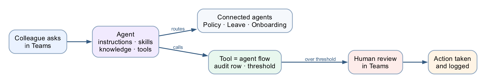

# Lab 4 — Agents

*Procurement, HR, Sales and IT Support*

**Platform:** Copilot Studio agents + agent flows + SharePoint + Human review + Microsoft Teams

**What this lab teaches:** how an agent is assembled from **instructions, skills, tools, knowledge
and connected agents** — and, at every step, which of those the model can ignore and which it
cannot.

## Workflow visual



An agent routes to its connected agents and calls governed flows as tools; consequential paths end
at a human review in Teams.

---

## The four agents

| # | Agent | Children | Teaches |
|---|---|---|---|
| 1 | [**Procurement Agent**](01%20-%20Procurement%20Agent/) | none | An agent calling a **governed flow** — audit row, threshold, human gate |
| 2 | [**HR Agent**](02%20-%20HR%20Agent/) | 4 | **Connected agents**, and why a split is a governance decision |
| 3 | [**Sales Agent**](03%20-%20Sales%20Agent/) | 3 | **Grounding** in 20 real brochures, and refusing to invent |
| 4 | [**IT Support Agent**](04%20-%20IT%20Support%20Agent/) | 3 | **Skills** as named procedures, and what a skill is *not* |

Plus [**`_deployment/`**](_deployment/) — publishing to Microsoft Teams.

Each agent folder has the same five parts:

```
NN - <Agent>/
├── agent/             instructions
├── skills/            named behaviours
├── tools/             flows the agent calls, and their descriptions
├── knowledge/         mock data and documents
└── connected-agents/  the sub-agents, one folder each
```

---

## Build order

**Build agent 1 first, all the way through, including its flow.** It is the only one that builds a
complete agent flow from scratch, and everything after it reuses that shape.

| | Agent | Time | Notes |
|---|---|---|---|
| 1 | [Procurement](01%20-%20Procurement%20Agent/) | 60–75 min | Includes [building the flow](01%20-%20Procurement%20Agent/BUILD-THE-FLOW.md) |
| 2 | [HR](02%20-%20HR%20Agent/) | 75–90 min | Parent + 4 children. **Or** parent + Policy & Benefits in 40 min |
| 3 | [Sales](03%20-%20Sales%20Agent/) | 50–60 min | Upload the [20 brochures](03%20-%20Sales%20Agent/knowledge/brochures/) first |
| 4 | [IT Support](04%20-%20IT%20Support%20Agent/) | 45–55 min | 5 skills, 3 children |
| — | [Deploy to Teams](_deployment/) | 20–25 min | Then ~5 min per agent |

Short on time: Procurement + HR (parent + Policy & Benefits) + deployment covers the whole idea.

> **One change per publish-test cycle.** Each cycle costs a publish plus ~25 seconds. Two
> simultaneous edits make a failure uninterpretable.

---

## The five parts, and which ones actually hold

This is the spine of the lab. Every agent is a variation on it.

| Part | What it is | Enforced? |
|---|---|---|
| **Instructions** | Who the agent is, always in force | **No** — probabilistic |
| **Skill** | A named procedure applied when the topic matches | **No** — the model decides it applies |
| **Knowledge** | Documents the agent may read | **Partly** — it genuinely cannot read what it was not given |
| **Tool** | A flow that acts outside the conversation | **The flow's own logic is enforced** |
| **Connected agent** | A separate agent with its own knowledge and audience | **The knowledge boundary is real** |

**A control the model cannot reach beats a rule you asked it to follow**, and neither is the same as
a name someone typed into a text box. Every agent in this lab has examples of all three, and the
teaching notes name which is which each time.

Two things follow that learners consistently miss:

- **A tool the agent does not have is a control.** The IT Support Agent has no `ResetPassword`, and
  that absence is the only unbreakable part of its password rules.
- **The schema beats the prompt.** A field that exists will eventually be filled. If card details
  must never reach the agent, the fix is to leave the field out of the tool contract, not to ask the
  model nicely.

---

## Four traps that recur across all four agents

Name these once, early. They reappear in every folder.

**1. The unnormalised lookup.** A SharePoint `Filter Query` without `toUpper(trim(...))` returns
nothing for a lowercase input. The agent then reports "not found" — **no error anywhere**, a green
run, a wrong answer that looks exactly like a right one. It appears as Procurement TC12, the HR
leave lookup, the Sales course code and the IT asset tag. Normalise **inside the filter**, where it
is structural, not in the instruction, where it is probabilistic.

**2. Never paste `@{...}` into an Instructions box.** It is a rich-text editor: it escapes
underscores in node names, and a reference to a node that does not exist **resolves to empty rather
than erroring**. The run goes green and the agent assesses a blank input. Build the prose with gaps
and insert every value with the **⚡ picker**.

**3. Approvals must go to Teams, not Outlook.** On a live tenant, Outlook created the request and
never delivered the mail. The run sits at *Running*, looking healthy. Four flows in this lab have a
Human review node; all four use Teams.

**4. Remove the "Search all websites" chip.** It is on by default. Every agent here answers in one
voice, and a fee, a policy or a registry fix from the open web is indistinguishable from one that
came from your own documents.

---

## What all four agents have in common

Every one of them:

- **Has something it must refuse**, and the refusal is the lesson, not the feature.
- **Ends consequential paths at a person** — an approver, a technician, the Enrolment Office, HR.
- **Can produce a confident wrong answer that raises no error.** In every case the wrong answer
  looks exactly like a right one, which is why the test tables include the probes they do.

The four differ in **who pays for the mistake**: a colleague, an employee, a member of the public, a
person locked out of their account. That is the axis worth closing the session on.

---

## Discussion questions

1. Three of the four agents split into children. Procurement did not. What made the difference —
   and what would have to change for Procurement to need children?

2. A boundary between agents is a boundary between what each is allowed to *know*. Knowledge is
   genuinely separated; conversation is not. Where does that gap bite hardest in these four?

3. The HR Onboarding Agent and the IT Asset Agent both end at the same procurement approval gate,
   from different trees, neither aware of the other. Who is watching that queue?

4. The public-facing Sales Agent has the least authority of the four. Is that right, and what does
   the answer tell you about how to size an agent's authority in general?

5. The Triage Agent's failure mode is not a wrong answer — it is a *different* answer for the same
   issue phrased more forcefully. How would you ever detect that, and what does it mean for testing
   agents generally?

6. Every audit row in this lab is written **before** the human gate. What question can you answer a
   year from now that you could not if it were written after?

---

**Next:** [Lab 5 — Invoke an Agent: HR Support Agent](../Lab%205%20-%20Invoke%20Agents/index.md)
