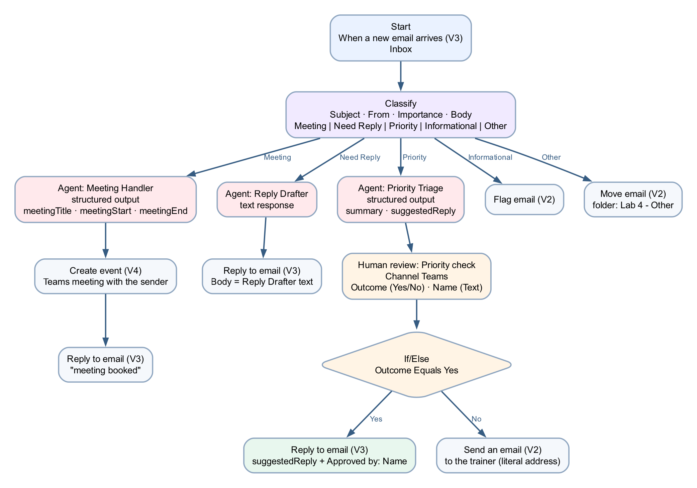
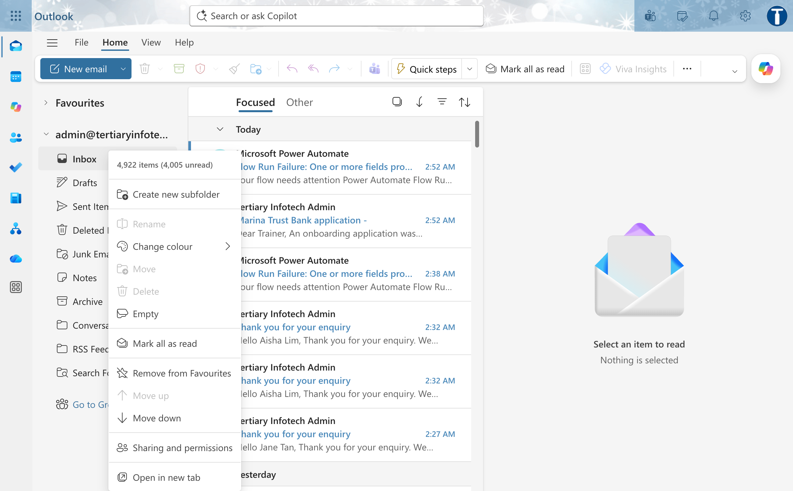
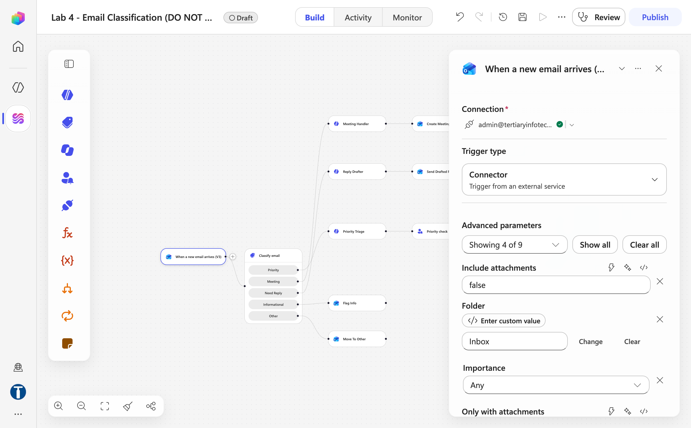
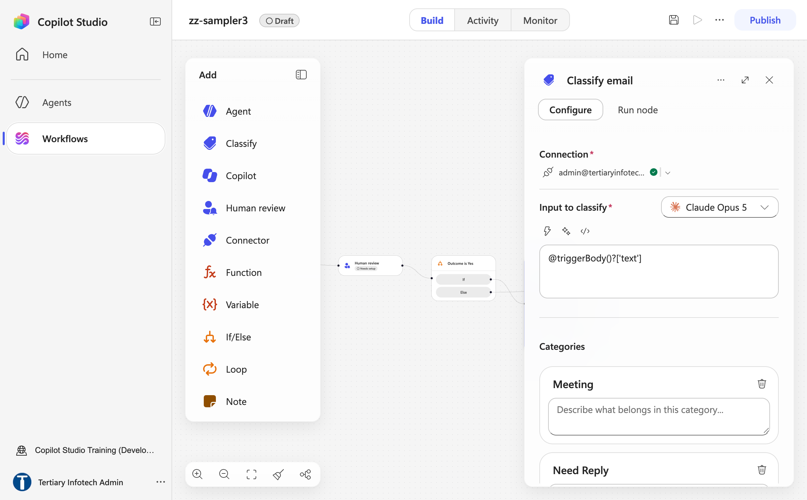
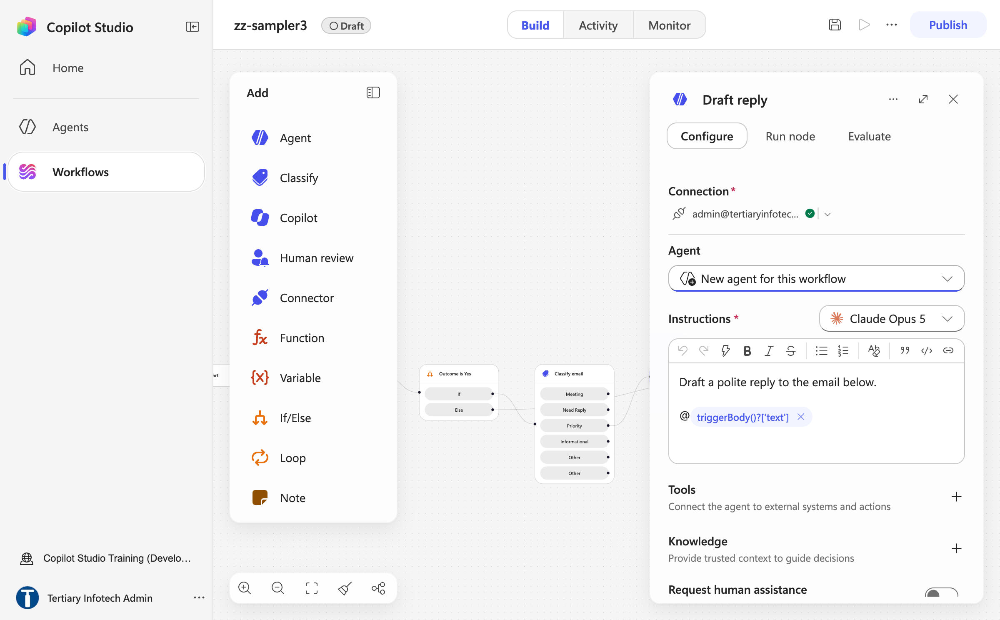
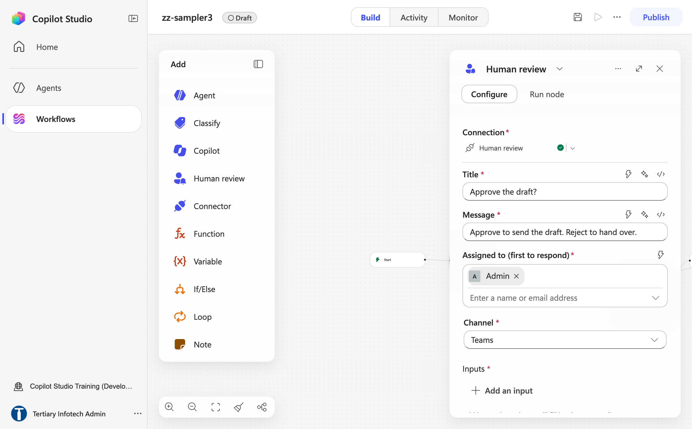
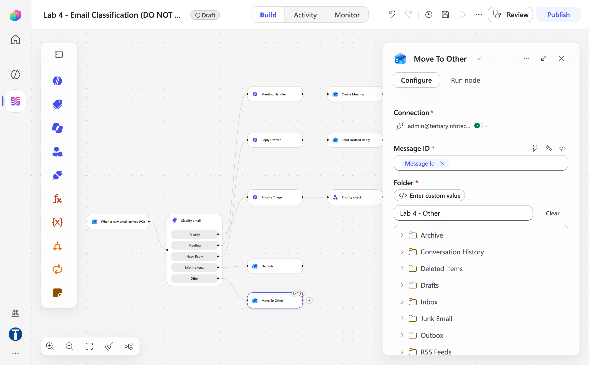
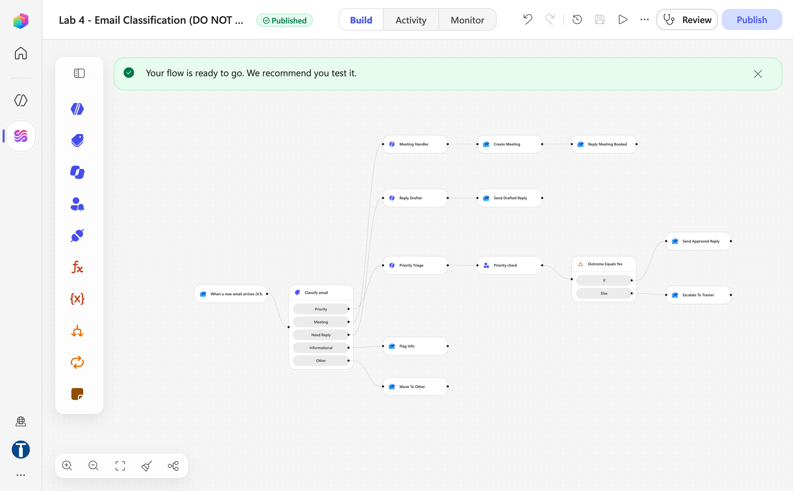
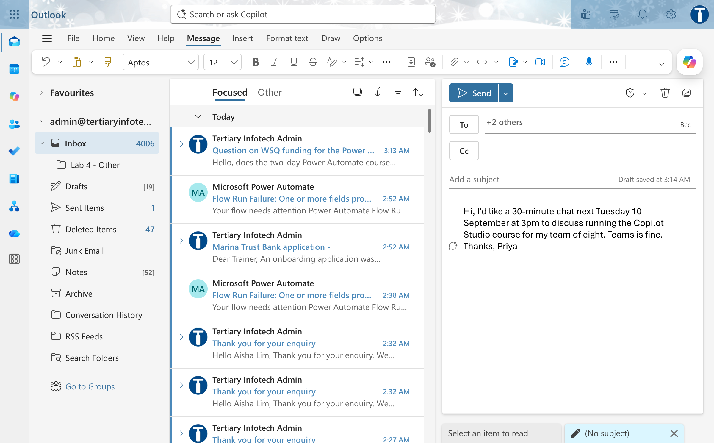
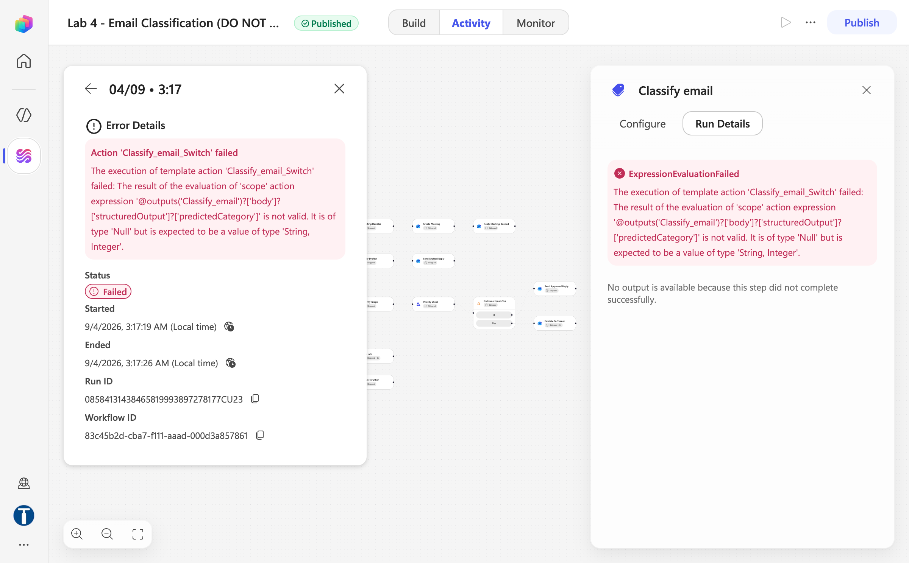

# Lab 4 — Email Classification

*An inbox workflow that sorts, replies, books and escalates — with a person in the loop for anything urgent*

## Goal

Build a Copilot Studio workflow named `Lab 4 - Email Classification` that fires when a new email arrives in the course mailbox, uses the native **Classify** node to sort it into exactly one of five categories — **Meeting, Need Reply, Priority, Informational, Other** — and routes each category to a deterministic handler: a booked meeting, a drafted reply, a **Human review** card in Teams, a flag, or a move to a folder.

## Duration

Approximately 45 minutes (build 32 · test 13).

## Prerequisites

- Completed Labs 1–3 — you know the workflow designer: the Start node trigger, **Connector** actions, ⚡ tokens, **If/Else**, **Publish**, **Activity**
- Read [Module 2 — Control Flow and Human in the Loop](../Module%202%20-%20Control%20Flow%20and%20Human%20in%20the%20Loop.md)
- The **Training Class** environment your trainer assigned (for example **Training Class 1**) showing bottom-left, **New experience** on, Copilot Credits in the environment (the Classify and Agent nodes consume them — see Troubleshooting if a run reports *EnforcementUsageCredits*)
- Outlook and Teams working for the course account, and ideally a **second mailbox** to send test emails from
- This lab's folder: `agent/classifier-instructions.md`, `agent/reply-drafter-instructions.md`, `assets/test-emails.md`
- A finished reference copy named `Lab 4 - Email Classification (DO NOT DELETE)` exists in the master reference environment `TGS-2022017524-Business Process Automation with Power Automate and Copilot Studio Agents` (a Sandbox environment, read-only for learners). Compare against it; never edit or delete it — you build your own copy in your **Training Class** environment

## Scenario

The Training Office at **Tertiary Infotech Academy** receives a hundred emails a day. Some ask for a meeting, some ask a question that deserves a reply, a few are genuinely urgent, many are newsletters, and the rest are noise. Today one person reads all of them. The office wants a workflow that reads each email as it arrives, decides which kind it is, and does the obvious next step — book the meeting, draft the reply, flag the newsletter, park the noise — while anything **urgent** stops and waits for a human to decide, in Teams, before a single word goes back to the sender.

| Workplace detail | Lab interpretation |
|---|---|
| Your role | Automation specialist for the Training Office |
| Stakeholders | Training manager (owns the mailbox), the trainer (receives escalations), IT (owns Teams) |
| Operational risk | The workflow replies to an angry client without anyone reading it, or books a meeting nobody asked for |
| Success measure | Five test emails, five different visible outcomes, and the Priority run parked at *Running* until a person answers |

## Workflow visual



The trigger fires on a new email. The **Classify** node sorts it into one of five ports. Meeting runs an Agent that extracts the meeting details for a **Create event** action; Need Reply runs an Agent that drafts the reply for a **Reply to email** action; Priority runs an Agent that summarises and drafts, then stops at **Human review** in Teams and branches on the answer; Informational is flagged; Other is moved to a folder.

## Expected result

```text
Five test emails sent to the course mailbox
→ five runs in Activity, each leaving the Classify node through a different port
→ Meeting: a calendar event with a Teams link + a "meeting booked" reply
→ Need Reply: a "Dear Marcus…" reply with no invented facts
→ Priority: a card in the Teams Workflows chat; run parked at Running until you answer
     Yes → approved reply sent, "Approved by: <Name>" · No → escalation email to the trainer
→ Informational: the email flagged · Other: the email moved to "Lab 4 - Other"
```

## Human in the loop, on the canvas

| Pattern | Where it appears in this lab | Can the workflow proceed alone? |
|---|---|---|
| **Human out of the loop** | Meeting, Need Reply, Informational, Other branches | Yes — the workflow acts, nobody checks |
| **Human in the loop** | The Priority branch: **Human review** in Teams | **No** — the run suspends until a person submits the card |

The Human review node is a **structural** control: it fires every time the Priority port is taken, whatever the model thinks. The "never invent facts" line in the agents' instructions is **probabilistic**. The `Name` the approver types is **self-declared**. Rank them that way in the debrief.

## Detailed step-by-step

### Part A — Prepare the mailbox

1. Open Outlook for the course account.
2. In Outlook on the web, right-click **Inbox** → **Create new subfolder** → type `Lab 4 - Other` and press **Enter**. The folder appears nested under Inbox. The *Other* branch moves emails here, and the picker in Part H must find the folder already existing.



*Figure 4.1 — Outlook on the web: right-click Inbox → Create new subfolder, then name it Lab 4 - Other*

3. Note the trainer's email address — the Priority branch escalates to it.
4. If you have a second mailbox (a personal account, or a classmate), keep it open in another tab for sending test emails.

### Part B — Create the workflow and the Outlook trigger

1. Open `https://copilotstudio.microsoft.com`, confirm your **Training Class** environment is showing bottom-left, and select **Workflows** → **New workflow**.
2. Click the workflow name at the top, type exactly `Lab 4 - Email Classification`, press **Enter**.
3. Click the **Start** node. **Trigger type** shows *Manual* — change it to **Connector**.
4. Search `Office 365 Outlook` and select the trigger **When a new email arrives (V3)**.
5. Confirm the connection shows a **green tick**; if not, **Create new connection** and sign in as the course account.
6. Under **Advanced parameters** the panel shows four of nine fields by default: **Include attachments** = `false`, **Folder** = `Inbox`, **Importance** = `Any`, **Only with attachments** = `false`. Leave them at those values.
7. Select **Show all** only if you need the remaining fields; leave **From**, **To** and **Subject Filter** blank.



*Figure 4.2 — Start node with the Office 365 Outlook trigger When a new email arrives (V3): Trigger type = Connector, Include attachments = false, Folder = Inbox, Importance = Any, Only with attachments = false (trainer's reference copy)*

8. Select **Save**.

### Part C — Add the Classify node

1. Select the **+** below **Start**, and from the **Featured** tab of the Add dialog choose **Classify** (it is also in the left **Add** panel). Click the node title and rename it `Classify email`.
2. Confirm the node's **Connection** row has a green tick.
3. The model dropdown sits to the right of **Input to classify** and defaults to **Claude Opus 5**. Leave it, or pick a smaller Claude model if one is listed — classification does not need the largest model.
4. Click into **Input to classify**. **Type** the prose below, leaving a gap after each label. Then click into each gap, press **⚡** (or type `/`), and pick the token. Never paste text containing `@{…}` — a pasted reference resolves to empty.

```text
Classify the email below into exactly one category. Read the subject, the sender, the
importance flag and the body. Pick the FIRST category that applies, in the order the
categories are listed.

Subject:
From:
Importance flag:
Body:
```

| Gap after | Insert with ⚡ |
|---|---|
| `Subject:` | When a new email arrives (V3) → **Subject** |
| `From:` | When a new email arrives (V3) → **From** |
| `Importance flag:` | When a new email arrives (V3) → **Importance** |
| `Body:` | When a new email arrives (V3) → **Body** |

5. Scroll to **Categories**. Each category is a card with a **name** and a *Describe what belongs in this category…* box; use **Add category** until you have four, typing the **name** and the **description** exactly:

| # | Category name | Description |
|---|---|---|
| 1 | `Priority` | An email that is time-sensitive and needs action within 24 hours: a deadline, an outage, a complaint, a payment or contract at risk, the words urgent or ASAP, or a high-importance flag with a request for action. |
| 2 | `Meeting` | An email asking to schedule, reschedule or confirm a meeting, call or visit. |
| 3 | `Need Reply` | An email that asks a question or makes a request that expects an answer, but is not urgent and is not about scheduling a meeting. |
| 4 | `Informational` | Newsletters, notifications, receipts, announcements, FYI messages and thank-you notes that need no action. |



*Figure 4.3 — Classify node panel: Connection tick, Input to classify (model dropdown beside it), and the Categories cards with a name and description each*

6. Notice the node now shows **five output ports** on the canvas — your four categories plus the built-in **Other**, the fail-safe for anything that fits nowhere. You do not create *Other*; the node provides it.
7. Optional: select **Add example**, pick **Priority**, and paste `URGENT: the trainer for tomorrow's 9am class has cancelled. Please call me today.` Examples sharpen a category that is being confused with another.
8. Select **Save**.

> **Why Priority is listed first.** The categories are evaluated in order and the first match wins. An urgent email that also asks for a meeting must be *Priority*, not *Meeting* — a person, not a calendar action, should see it. Listing Priority first is the whole safety design of this node.

### Part D — The Meeting port: extract, book, acknowledge

1. Select the **+** on the **Meeting** port → **Add** panel → **Agent**.
2. Click the node title and rename it `Meeting Handler`.
3. Connection green tick; **Agent** = *New agent for this workflow*; the model dropdown beside **Instructions** defaults to **Claude Opus 5** — leave it.
4. In **Instructions** (a rich-text editor with a ⚡ button in its toolbar), type the prose from `agent/reply-drafter-instructions.md` §2, filling the gaps with ⚡ (the token appears in the picker only because this node is connected to the trigger — an unconnected node shows nothing):

```text
The email below asks for a meeting. Work out the meeting the sender wants and fill every
output field. Do not explain your reasoning.

From:
Subject:
Received at:
Body:

Field rules:
- meetingTitle: a short calendar subject in the form "Discussion: <topic> with <sender's
  first name>".
- meetingStart and meetingEnd: Singapore local time in the format YYYY-MM-DDTHH:MM:SS with
  no time-zone suffix. If the sender proposes a date and time, use it. If the sender
  proposes only a day, use 10:00 on that day. If no time is given, use 10:00 on the next
  working day after the received date. Default duration is 30 minutes unless the email
  states another duration.
- agenda: one or two plain sentences saying what the meeting is about, taken from the
  email. Never invent facts that are not in the email.
```

| Gap after | Insert with ⚡ |
|---|---|
| `From:` | trigger → **From** |
| `Subject:` | trigger → **Subject** |
| `Received at:` | trigger → **Received Time** |
| `Body:` | trigger → **Body** |



*Figure 4.4 — Agent node panel: Agent = New agent for this workflow, Instructions with the model dropdown and one inserted ⚡ token chip, then Tools, Knowledge and Request human assistance*

5. Leave **Tools** and **Knowledge** empty and **Request human assistance** off.
6. Set **Output** (the last field) to **Custom structured output** and paste this schema (a JSON field — pasting is fine here):

```json
{
  "type": "object",
  "properties": {
    "meetingTitle": { "type": "string" },
    "meetingStart": { "type": "string", "description": "YYYY-MM-DDTHH:MM:SS, Singapore local time, no suffix" },
    "meetingEnd":   { "type": "string", "description": "YYYY-MM-DDTHH:MM:SS, Singapore local time, no suffix" },
    "agenda":       { "type": "string" }
  },
  "required": ["meetingTitle", "meetingStart", "meetingEnd", "agenda"]
}
```

7. Select **+** after Meeting Handler → **Connector** → `Office 365 Outlook` → **Create event (V4)**. Rename it `Create Meeting`.
8. Fill in:

| Field | Value |
|---|---|
| Calendar id | `Calendar` |
| Subject | ⚡ Meeting Handler → **meetingTitle** |
| Start time | ⚡ Meeting Handler → **meetingStart** |
| End time | ⚡ Meeting Handler → **meetingEnd** |
| Time zone | `(UTC+08:00) Kuala Lumpur, Singapore` |
| Required attendees | ⚡ trigger → **From** |
| Body | ⚡ Meeting Handler → **agenda** |
| Is online meeting (under Show all) | `Yes` |

9. Select **+** after Create Meeting → **Connector** → `Office 365 Outlook` → **Reply to email (V3)**. Rename it `Reply Meeting Booked`.
10. **Message Id** = ⚡ trigger → **Message Id**. **Body** — type `Thanks — I have placed a meeting on our calendars: ` then ⚡ **meetingTitle**, then ` starting ` then ⚡ **meetingStart**, then `. Please let me know if the slot does not work.` **Reply All** = `No`.
11. Select **Save**.

> **The agent never touches the calendar.** It produces three fields; a connector action books the event. If the fields are wrong, the run details show exactly which field, and the model cannot "helpfully" book two meetings.

### Part E — The Need Reply port: draft and reply

1. Select the **+** on the **Need Reply** port → **Agent**. Rename it `Reply Drafter`.
2. Leave the model at its default. In **Instructions**, type the prose from `agent/reply-drafter-instructions.md` §1, filling the gaps with ⚡:

```text
You write email replies on behalf of the Training Office at Tertiary Infotech Academy,
Singapore. Produce ONLY the body of the reply, as plain text with normal paragraphs. No
subject line, no markdown, no bullet symbols, no preamble such as "Here is the reply".

Original email
From:
Subject:
Body:

Instructions
- Start with "Dear" followed by the sender's first name taken from the From line; if no
  name is visible, use "Dear Sir or Madam".
- Answer the sender's actual question or request. If the answer requires information you
  do not have (prices, dates, availability, policies), say that a colleague will confirm
  within one working day — do not invent the detail.
- Keep it to three to six sentences, warm and professional, Singapore English.
- End with "Kind regards," on its own line followed by "Training Office" on the next line.
- Never include citation markers, reference numbers or source tags.
```

| Gap after | Insert with ⚡ |
|---|---|
| `From:` | trigger → **From** |
| `Subject:` | trigger → **Subject** |
| `Body:` | trigger → **Body** |

3. **Output** = **Text** (the default).
4. Select **+** after Reply Drafter → **Connector** → `Office 365 Outlook` → **Reply to email (V3)**. Rename it `Send Drafted Reply`.
5. **Message Id** = ⚡ trigger → **Message Id**. **Body** = ⚡ Reply Drafter → its text output token. **Reply All** = `No`.
6. Select **Save**.

### Part F — The Priority port: triage, stop for a human, branch

1. Select the **+** on the **Priority** port → **Agent**. Rename it `Priority Triage`.
2. Leave the model at its default. **Instructions** — type the prose from `agent/reply-drafter-instructions.md` §3, filling the gaps with ⚡:

```text
The email below has been classified as priority. Summarise it for a busy manager and draft
the reply that should go back to the sender once a person has approved it. Do not explain
your reasoning.

From:
Subject:
Importance flag:
Body:

Field rules:
- summary: one or two plain sentences saying who needs what, and by when.
- suggestedReply: a complete reply of three to six sentences addressed to the sender by
  first name, acknowledging the urgency, saying what will happen next, and signed
  "Kind regards, Training Office". Never promise a specific outcome, refund or time you
  cannot know. Never invent facts that are not in the email.
- Never include citation markers, reference numbers or source tags.
```

| Gap after | Insert with ⚡ |
|---|---|
| `From:` | trigger → **From** |
| `Subject:` | trigger → **Subject** |
| `Importance flag:` | trigger → **Importance** |
| `Body:` | trigger → **Body** |

3. **Output** = **Custom structured output**; paste:

```json
{
  "type": "object",
  "properties": {
    "summary":        { "type": "string" },
    "suggestedReply": { "type": "string" }
  },
  "required": ["summary", "suggestedReply"]
}
```

4. Select **+** after Priority Triage → **Featured** → **Human review**. Rename the node `Priority check` and confirm its **Connection** row (*Human review*) has a green tick. Set **Title** to `Priority check`.
5. **Message** — type the prose and fill the gaps with ⚡:

```text
A priority email needs your decision.
From:
Subject:
Summary:
Proposed reply:

Choose Yes to send the proposed reply now. Choose No to hand it to the trainer.
Type your name so the reply records who approved it.
```

| Gap after | Insert with ⚡ |
|---|---|
| `From:` | trigger → **From** |
| `Subject:` | trigger → **Subject** |
| `Summary:` | Priority Triage → **summary** |
| `Proposed reply:` | Priority Triage → **suggestedReply** |

6. **Assigned to** — type the course account's full address, wait for the directory lookup, and **click the suggestion** so it becomes a person chip. A typed-and-tabbed address, an external address, or a display-name-only chip all fail at run time with *Required field 'assignedTo' is missing or empty*.
7. **Channel** = **Teams**. (Outlook is offered; on a live tenant it created the request and never delivered the mail. Teams works.)



*Figure 4.5 — Human review panel: Title, Message, Assigned to (first to respond) resolved to a person chip, Channel = Teams, Inputs → Add an input*

8. **Inputs** — the node will not save with none. Select **Add an input** → **Yes/No**, then **Add an input** → **Text** (the type chooser offers Text, Yes/No, Email, Number and Date):

| Name | Type | Default |
|---|---|---|
| `Outcome` | **Yes/No** | leave blank |
| `Name` | Text | leave blank |

   Leave both defaults blank. A pre-filled `Outcome` arrives at the approver already answered — confirming takes no thought, rejecting takes noticing — and the gate becomes a rubber stamp through a setting invisible on the canvas.


*Figure 4.6 — Human review Inputs after Add an input twice: a Yes/No input (Outcome) and a Text input (Name)*

9. Select **+** after Priority check → **Featured** → **If/Else**. Rename the node `Outcome Equals Yes`.
10. Condition: **Property** = ⚡ Priority check → the **Yes/No** output (your `Outcome` input); **Operator** = **Equals**; **Value** = the literal text `Yes`. Not `true` — the Yes/No input publishes the string `Yes`, and a comparison against `true` never matches.


*Figure 4.7 — If/Else node Outcome Equals Yes: Property = the Human review Yes/No output, Operator = Equals, Value = Yes; the Else branch is created automatically*

11. On the **If** branch: **+** → **Connector** → `Office 365 Outlook` → **Reply to email (V3)**. Rename it `Send Approved Reply`. **Message Id** = ⚡ trigger → **Message Id**. **Body** = ⚡ Priority Triage → **suggestedReply**, then on a new line type `Approved by: ` and insert ⚡ Priority check → the **Text** output (your `Name` input). **Reply All** = `No`.
12. On the **Else** branch: **+** → **Connector** → `Office 365 Outlook` → **Send an email (V2)**. Rename it `Escalate To Trainer`. **To** = the trainer's address **typed as a literal** (never an expression — a typed expression in this field fails with a trailing-newline error). **Subject** — type `Escalation: ` then ⚡ trigger → **Subject**. **Body** — type `Rejected by ` ⚡ Priority check **Text** output `. Original sender: ` ⚡ **From** `. Summary: ` ⚡ **summary**.
13. Select **Save**.

> **The pause is the deliverable.** Everything before Priority check is the model's territory — summarise, draft. Everything after it is a consequence. The node between does nothing except wait for a person, and it will wait for days.

### Part G — The Informational port: flag it

1. Select the **+** on the **Informational** port → **Connector** → `Office 365 Outlook` → **Flag email (V2)**. Rename it `Flag Info`.
2. **Message Id** = ⚡ trigger → **Message Id**.
3. Select **Save**. (If your tenant lacks *Flag email*, use **Mark as read or unread (V3)** with **Is Read** = `Yes` instead.)

> Never *delete* in a shared training mailbox. A flag is visible, reversible, and proves which port the run took.

### Part H — The Other port: move it

1. Select the **+** on the **Other** port → **Connector** → `Office 365 Outlook` → **Move email (V2)**. Rename it `Move To Other`.
2. **Message Id** = ⚡ trigger → **Message Id**.
3. **Folder** — open the folder picker (the tree lists Archive, Conversation History, Deleted Items, Drafts, Inbox …) and select `Lab 4 - Other` under **Inbox** (created in Part A). Do not type a path; a typed path returns *folder not found*.



*Figure 4.8 — Move email (V2) node Move To Other: Message ID = the Message Id token, Folder picked from the tree as Lab 4 - Other (trainer's reference copy)*

4. Select **Save**.

### Part I — Tidy, publish, test

1. Use the canvas **Fit to view** / **Tidy up** buttons to see the whole workflow. Do **not** drag individual nodes — moving a node clears its configuration and the node is then skipped silently.
2. Select **Publish**. Confirm the status pill reads **Published** and, in **⋯ → Version history**, `LIVE` = `CURRENT DRAFT`.



*Figure 4.9 — After Publish: the pill reads Published and the designer shows "Your flow is ready to go. We recommend you test it." above the finished canvas*

3. Open `assets/test-emails.md`. Send **test 1** (Meeting) from your second mailbox to the course mailbox.



*Figure 4.10 — Test 1 (Meeting) being composed in Outlook on the web; the `Lab 4 - Other` folder is already visible under Inbox*

4. Open **Activity**. Within a minute a run appears; open it and follow the green ticks: trigger → Classify → *Meeting* port → Meeting Handler → Create Meeting → Reply Meeting Booked. Select **Meeting Handler** and read **Run details → Outputs** — the three fields it produced.
5. Check the course calendar for the event and the sender's inbox for the "meeting booked" reply.
6. Send **test 2** (Need Reply). Confirm the run leaves through *Need Reply* and the sender receives a "Dear Marcus…" reply. Read it: no fee, no policy invented.
7. Send **test 3** (Priority) with **Importance = High**. Open Activity: the run reaches **Priority check** and shows **Running**. Leave it there for a moment — this is the screen to show the class.
8. Open Teams → **Chat** → the **Workflows** bot. The card `Request information | Microsoft Copilot Studio` arrives within a minute or two (on this tenant it can be slow — the run simply stays at Running). Read the summary and proposed reply, type your **Name**, set **Outcome = Yes**, **Submit**.


*Figure 4.11 — The Human review card in the Teams Workflows bot chat: Yes / No choice, a text box, Submit, and the "Your response has been successfully submitted" confirmation*

9. Back in Activity, watch the run flip to **Succeeded** (response processing takes a minute). Confirm the sender received the reply ending `Approved by: <your name>`.
10. Send test 3 **again**, and this time answer **No**. Confirm the trainer receives the `Escalation: …` email and the sender receives nothing.
11. Send **test 4** (Informational) — the email is flagged, no reply. Send **test 5** (Other) — the email moves to `Lab 4 - Other`.
12. Open the trainer's `Lab 4 - Email Classification (DO NOT DELETE)` and compare the canvas with yours. Close without changing anything.


*Figure 4.12 — Lab 4 - Email Classification (DO NOT DELETE): the Classify email node's five ports fan out to Meeting Handler → Create Meeting → Reply Meeting Booked, Reply Drafter → Send Drafted Reply, Priority Triage → Priority check → Outcome Equals Yes, Flag Info and Move To Other (trainer's reference copy)*

## Checkpoint

- Workflow `Lab 4 - Email Classification`, **Published**, Outlook trigger on Inbox
- Classify node with four named categories in the order Priority · Meeting · Need Reply · Informational, plus the built-in Other — five ports on the canvas
- Meeting → Meeting Handler (structured output) → Create Meeting → Reply Meeting Booked
- Need Reply → Reply Drafter (text) → Send Drafted Reply
- Priority → Priority Triage (structured output) → Priority check (Teams, `Outcome` Yes/No + `Name`) → If/Else `Outcome Equals Yes` → Send Approved Reply / Escalate To Trainer
- Informational → Flag Info; Other → Move To Other (`Lab 4 - Other`)
- Five test emails, five ports, the Priority run seen at **Running** before the card was answered

## Troubleshooting

| Symptom | Cause | Fix |
|---|---|---|
| Nothing fires when an email arrives | Saved but not **Published**, or disabled in the Workflows list, or the trigger folder is not Inbox | Publish; check the **Enabled** toggle; check the Folder field |
| Every email goes to *Other* | The Classify instruction's ⚡ slots are empty (pasted, not picked) — the node is classifying nothing | Delete the slot text, click into each gap and insert Subject / From / Importance / Body with ⚡ |
| An urgent email went to *Meeting* | Priority is not the first category | Reorder so Priority is category 1 |
| Meeting Handler fields empty, Create Meeting fails on Start time | The Instructions' ⚡ slots were pasted, or `meetingStart` carries a `Z`/offset while Time zone is set | Re-pick the tokens; the prompt demands `YYYY-MM-DDTHH:MM:SS` with no suffix. Read Meeting Handler → Run details → Outputs first |
| Red banner *This input references action "Meeting\_Handler"* | A pasted reference; the editor escaped the underscore | Re-pick with ⚡; if it persists, rename the node without spaces or underscores (`MeetingHandler`) and re-point |
| If/Else always takes Else — approving "does nothing" | Compared `Outcome` to `true`, or the input was deleted and re-created so the token is stale | Right value must be the literal `Yes`; remove and re-pick the `Outcome` token after any input rebuild |
| The Teams card never arrives | Channel is Outlook, or **Assigned to** is a display-name-only chip / external address | Channel = **Teams**; retype the full tenant address and **click** the suggestion. Look in the **Workflows** bot chat, not the Approvals app |
| `Required field 'assignedTo' is missing or empty` | The address never resolved | Click the directory suggestion, or use the connection's own account |
| Human review will not save | Zero inputs | Add `Outcome` (Yes/No) and `Name` (Text) |
| Escalate To Trainer fails with `…\n` in the error | An expression was typed into **To** | Type the trainer's address as a literal |
| Move To Other: *folder not found* | Folder path typed | Create `Lab 4 - Other` in Outlook first and pick it from the picker |
| A node shows **Needs setup** and the run is green but nothing happened | The node was dragged, which clears its configuration | Reopen and refill every field, connection included |
| The reply contains "Here is the reply" or markdown | Reply Drafter output set to structured, or the "only the body" line lost | Output = Text; restore the line |
| The trigger fires on the workflow's own replies | Testing from the course account to itself | Test from a second mailbox, or add a **From** filter on the trigger during testing |
| A Classify or Agent node fails with *You need credits to continue … Error code: EnforcementUsageCredits* | The environment has no Copilot Credits — the Classify and Agent nodes each consume them | Nothing is wrong with your build. The trainer allocates credits in the Power Platform admin center → **Licensing → Copilot Studio → Manage Copilot Credits**. Publishing works without credits |



*Figure 4.13 — What an environment without Copilot Credits looks like in Activity: the Classify node returns no category (`predictedCategory` is Null) and the run fails at the Switch — a credits problem, not a build problem*

## Key takeaways

- **Classify** is a native node: categories become ports, and the first matching category wins — which is why *Priority* sits first.
- **The model decides what kind of email it is; connector actions do the work.** Create event, Reply to email, Flag and Move are deterministic, and the agents only supply fields.
- **Human review is a structural gate.** The Priority run cannot proceed until a person submits the card in Teams — and `Outcome` is compared to the literal `Yes`.
- **Every branch does something visible**, so a wrong classification is caught by what happened, not by reading a log.
- **Tokens are picked, never pasted.** An empty slot classifies nothing, and the run stays green while it does.

---

**Next:** read [Module 3 — Copilot Studio Agents](../Module%203%20-%20Copilot%20Studio%20Agents.md), then go to [Lab 5 — Your First Agent](../Lab%205%20-%20Your%20First%20Agent/index.md).
