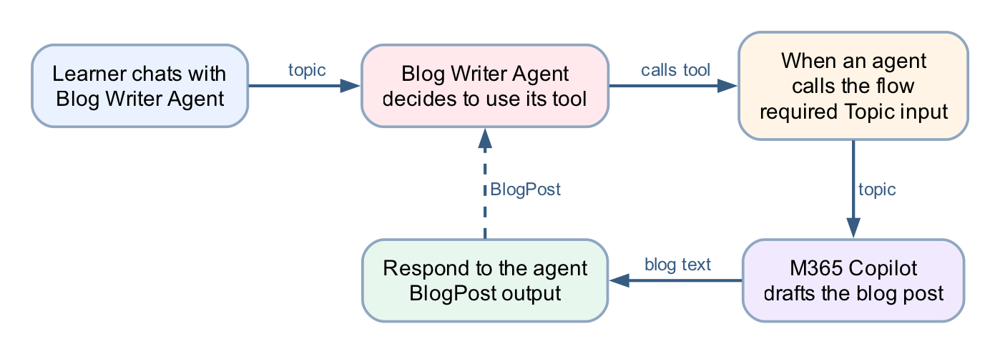

# Lab 5b — Calling Workflow from Agent

*A blog-writer agent that calls a workflow as its tool*

## Goal

Build an agent flow named **Blog Writer Workflow** whose trigger is **When an agent calls the flow**, have M365 Copilot draft the blog post inside the flow, and return the draft with **Respond to the agent**. Then build a **Blog Writer Agent** in Copilot Studio and attach the published flow as a **tool**, so the agent — not a person — runs the workflow.

## Duration

Approximately 30 minutes.

## Prerequisites

- Lab 5 completed (you know the workflow designer, the ⚡ picker and the M365 Copilot node)
- Copilot Studio access in the course environment (Copilot Studio Training), with Copilot credits

## Scenario

Lab 5 ended with a person running the flow and typing a topic. The Learning & Development team now wants the same blog writer available in conversation: a colleague chats with an agent, mentions a topic, and the agent hands the topic to the workflow, which drafts the post and returns it. The direction of control is the mirror image of Lab 5 — there the **workflow called the model** at a fixed step; here the **agent decides to call the workflow**, and the workflow is the deterministic part it cannot improvise around.

## Workflow visual

Three nodes in the flow: **When an agent calls the flow** (with a Topic input) → **M365 Copilot** (draft the blog post) → **Respond to the agent** (a BlogPost output). The loop back to the agent is the point of the lab: the flow's inputs and outputs are the **contract** the agent programs against.

## Detailed step-by-step

### Part A — Create the agent flow

1. [Open Copilot Studio](https://copilotstudio.microsoft.com).
2. Confirm the environment selector (top right) shows the course environment — **Copilot Studio Training**. The agent and the flow must live in the **same environment**, or the flow will never appear in the agent's tool list.
3. In the left navigation, select **Flows**.
4. Select **New agent flow** (or **+ Create → Agent flow**).
5. Rename the flow to `Blog Writer Workflow`: select the flow name at the top left, type the new name, and confirm.
6. Select **Save** so the flow exists before you configure it.

### Part B — Configure the trigger: When an agent calls the flow

1. Select the trigger node (the first node on the canvas) to open its configuration panel.
2. If the designer asks how the flow starts, choose **When an agent calls the flow**. This trigger is what makes the flow *callable as a tool* — a flow with a manual trigger (Lab 5) does not appear in an agent's tool list.
3. In the trigger's inputs section, select **Add an input**.
4. Choose **Text**.
5. Name the input `Topic`.
6. In the description, enter `The subject of the blog post`. Do not skip the description — the **agent reads it** to work out which part of the conversation belongs in this input. A blank description leaves the model guessing.
7. Leave the input required, with no default value.
8. Select **Save**.

### Part C — Add the M365 Copilot node to draft the blog

1. On the canvas, select **+** on the connector after the trigger.
2. In the Add panel, select the **M365 Copilot** node. Be precise — selecting an item in the Add panel *creates* a node, and an accidental extra node must be deleted (undo does not remove it).
3. Select the new **M365 Copilot** node to open its configuration.
4. If a **Connection** field is shown, confirm it is signed in as your course account.
5. In the instructions/prompt area, **type** the following as plain text, leaving a gap where the topic goes:

   > Write a short, engaging blog post of about 300 words on the topic below. Give it a title line, a two-sentence introduction, three short paragraphs with one key point each, and a one-sentence conclusion. Write in plain professional English for a general business audience.
   >
   > Topic:

6. Place the cursor after `Topic:` and insert the **Topic** trigger input using the **⚡ dynamic content picker** — select the lightning-bolt icon and pick **Topic** from the trigger's outputs.
   - **Never paste an expression** such as `@{...}` into this editor. It is a rich-text editor and silently mangles pasted references; the flow then runs green while the model receives an empty topic.
7. If an **Output** option is shown, leave it as the default **Text response** — the response node needs plain text, not structured fields.
8. Select **Save**.

### Part D — Return the draft with Respond to the agent

1. Select **+** on the connector after the **M365 Copilot** node.
2. In the Add panel, select **Respond to the agent**.
3. Select the new node to open its configuration.
4. Select **Add an output**.
5. Choose **Text**.
6. Name the output `BlogPost`.
7. Click into the value field and insert the M365 Copilot node's text output with the **⚡ dynamic content picker** — pick the token; do not type an expression.
8. Select **Save**.
9. Do not drag nodes to rearrange them afterwards — **moving a node clears its configuration** and the unconfigured node is then skipped silently at run time. If a node is ever moved, reopen it and refill every field.

### Part E — Publish the flow

1. Select **Publish**. A tool must be the **published** version — an agent cannot call a draft, and after any later edit the flow must be published again before the agent sees the change.
2. If a version history is shown (**⋯ → Version history**), confirm `LIVE` matches `CURRENT DRAFT`.

### Part F — Create the Blog Writer Agent

1. In the left navigation, select **Agents**, then **New agent** (skip the describe-it-in-chat option and choose **Configure**/**Skip to configure** if offered).
2. Name the agent `Blog Writer Agent`.
3. In **Description**, enter `Writes blog posts for the Learning & Development team using the Blog Writer Workflow.`
4. In **Instructions**, type:

   > You help colleagues create blog posts. When someone asks for a blog post, identify the topic from the conversation — ask for it if it is not stated. Always use the Blog Writer Workflow tool to write the post; never write the post yourself. Return the tool's blog post to the user unchanged, and offer to run it again with a revised topic if they want changes.

   The *"never write the post yourself"* line is load-bearing. The model is perfectly capable of drafting a blog post without the tool, and if the instruction leaves it a choice, it will sometimes take it — the reply looks right and the workflow never ran.
5. Select **Create** and wait for the agent's overview page.
6. If a **Knowledge** section shows a *Search all websites* chip on by default, remove it (**✕** on the chip) — this agent's only source should be its tool.

### Part G — Attach the flow as a tool

1. On the agent's page, open the **Tools** section (top tab or **+ Add** on the overview).
2. Select **+ Add a tool**.
3. In the picker, choose the **Flow** (agent flow) category and find `Blog Writer Workflow`. Only **published** flows in the **same environment** are listed — if it is missing, check those two things in that order.
4. Select it, then **Add to agent** (or **Add and configure**).
5. Open the tool's configuration and check its **description** says what the tool does and when to use it, e.g. `Writes a blog post on a given topic. Use whenever the user wants a blog post drafted.` The orchestrator picks tools by their descriptions, so this sentence is part of the contract, not documentation.
6. Confirm the tool's **Topic** input is set to be filled **dynamically by the agent** (the default), not with a fixed custom value.
7. **Publish** the agent if the designer offers a publish step — like flows, agents serve their published version to channels (the built-in Test pane tracks your latest saved changes).

### Part H — Test end to end

1. Open the **Test** pane (Test button, top right of the agent page).
2. Type: `Write a blog post about how AI agents are changing business process automation.`
3. Watch the activity indicators — the agent should show it is calling **Blog Writer Workflow**. A tool call adds a model hop and a flow run, so expect 15–30 seconds.
4. Confirm the reply is a blog post with a title, introduction, three paragraphs and a conclusion, on your topic.
5. **Verify the flow actually ran** — this is the checkpoint that matters. In **Flows → Blog Writer Workflow → Activity**, confirm a new run exists with today's timestamp. A fluent blog post with **no run in Activity** means the model wrote it itself and ignored the tool — tighten the *always use the tool* instruction and test again.
6. In that run, select the **M365 Copilot** node and read its **Run Details → Outputs** to see what the model produced inside the flow, and the **Respond to the agent** node to see what went back. When anything misbehaves, read these before theorising.
7. Test the missing-topic path: start a new conversation and type `I need a blog post.` The agent should **ask for the topic**, then call the flow once you answer.
8. Run one more topic, e.g. `Five tips for running effective hybrid meetings`, and confirm a second run appears in Activity.

## Checkpoint

- The flow has exactly three configured nodes: **When an agent calls the flow** (required `Topic` text input, with a description) → **M365 Copilot** → **Respond to the agent** (a `BlogPost` text output)
- The Topic token and the blog-text token were both inserted with the ⚡ picker, not typed
- The flow is **published**, and `Blog Writer Workflow` appears in the agent's **Tools** list
- A test chat produces a topic-specific blog post **and** a matching run in the flow's Activity
- Asked for a blog post with no topic, the agent asks for the topic before calling the flow

## Troubleshooting

| Symptom | Check |
|---|---|
| The flow does not appear in **+ Add a tool** | It is not published, it is in a different environment, or its trigger is not **When an agent calls the flow** — check in that order |
| The agent replies with a blog post but Activity shows no run | The model wrote it itself — make the instruction explicit: *Always use the Blog Writer Workflow tool; never write the post yourself* |
| The blog ignores the topic, or is generic | The Topic reference inside the M365 Copilot node was pasted or typed, not picked — reopen it, delete the reference, re-insert with the ⚡ picker |
| The agent calls the tool but the reply is empty | Open the run in Activity and read the **Respond to the agent** node — its `BlogPost` output was probably not set with the ⚡ picker |
| The agent never asks for a topic and invents one | The trigger input has no description, so the model fills the slot however it can — add `The subject of the blog post` to the Topic input and republish the flow |
| Run fails with `InsufficientMcsCredits` | Wrong environment — switch to the course environment (Copilot Studio Training); credits are per-environment |
| A node shows "Needs setup" | It was moved or duplicated — reopen it and refill every field, including the connection |
| The agent runs an old version of the flow | The published version is stale — publish the flow again and confirm `LIVE` matches `CURRENT DRAFT` |

## Key takeaways

- **Lab 5 and Lab 5b are the two directions of the same boundary.** In Lab 5 the workflow called the model at a fixed step; here the agent decides *when* to call the workflow — but everything inside the workflow still runs deterministically, every time.
- **The trigger's inputs and the response's outputs are the tool's contract.** The agent fills `Topic` from the conversation, guided by the input's name and description, and receives exactly `BlogPost` back — nothing else crosses the boundary.
- **A tool call is a decision the model makes**, and instructions are the only lever over that decision. The *"never write the post yourself"* line, the tool's description, and the Activity check that proves the flow ran are all part of making a probabilistic caller behave.
- **Verify with the run history, not the reply.** A fluent answer proves nothing about what executed; a run in Activity does.

---

**Next:** [Lab 6 — HTTP and Application Approval Agent](../Lab%206%20-%20HTTP%20and%20Application%20Approval%20Agent/README.md)
