# Lab 6 — Procurement Agent with Tools

*A workflow as a tool, and the audit row it writes*

## Goal

Build a small Copilot Studio workflow named `Lab 6 - Raise Requisition` — trigger *When an agent calls the workflow* → a Compose reference → Excel *Add a row into a table* (`Lab 6 - Requisition Log.xlsx`, table `RequisitionLog`) → *Respond to the agent* — publish it, then build an agent named `Lab 6 - Procurement Agent` with the procurement policy and vendor register as knowledge, two skill packages, and the workflow attached under **Tools +**. Prove in **Preview** that the agent collects the inputs, calls the tool, and reports the reference the workflow returned — and that the row is in Excel.

## Duration

Approximately 35 minutes (workflow 15 · agent 12 · test 8).

## Prerequisites

- Completed Lab 5 — you know the agent designer: name box, Instructions box, the right panel, Knowledge +, Preview, Publish
- Completed Labs 1–4 — you know the workflow designer, ⚡ tokens, the `</>` expression editor and **Publish**
- The **Training Class** environment your trainer assigned (for example **Training Class 1**) showing bottom-left and **New experience** on
- This lab's folder downloaded: `agent/orchestrator-instructions.md`, `knowledge/procurement-policy.md`, `knowledge/vendors.csv`, the two zips in `skills/_packages/`, and `assets/Lab 6 - Requisition Log.xlsx`
- OneDrive for Business on the course account with the `Power Automate Lab Data` folder from Lab 2
- Finished reference copies exist in the master reference environment `TGS-2022017524-Business Process Automation with Power Automate and Copilot Studio Agents` (a Sandbox environment, read-only for learners): the agent `Lab 6 - Proc (DO NOT DELETE)` (agent names are capped at 30 characters) and the workflow `Lab 6 - Raise Requisition (DO NOT DELETE)`. Compare against them; never edit or delete them — you build your own copies in your **Training Class** environment

## Scenario

Keppel Ridge Engineering's Procurement team receives requisitions by email, by chat and on paper, and re-keys them into a log. Half arrive without a justification or a quantity, and colleagues ask three times a week whether a supplier "is on the list". The team wants an agent in Teams that collects a complete requisition, writes it to the log they already use, hands back a reference, and answers vendor questions from the register — without ever telling a colleague a purchase is approved.

| Workplace detail | Lab interpretation |
|---|---|
| Your role | Automation specialist for Procurement |
| Stakeholders | Procurement lead (owns the log and the register), Finance (owns approvals) |
| Operational risk | The agent tells a colleague a purchase is approved, or invents a reference for a requisition that was never written down |
| Success measure | Every requisition the agent "submits" is a row in the log with a matching run in Activity |

## Workflow visual

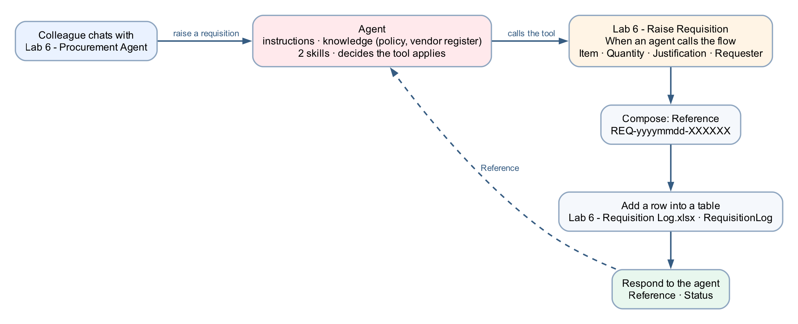

The agent holds the instructions, the knowledge and two skills. When a colleague asks to buy something, the agent decides the tool applies, calls the workflow with the four inputs it collected, the workflow writes the row to Excel, and the reference comes back to the agent.

## Expected result

```text
Workflow "Lab 6 - Raise Requisition" published (4 inputs → Compose → Excel → Respond)
→ agent "Lab 6 - Procurement Agent" with knowledge + 2 skills + the workflow under Tools
→ Preview: "raise a requisition for 3 laptops" → agent asks for justification and name,
   calls the tool, reports REQ-… and says "submitted for approval"
→ one run in Activity, one row in RequisitionLog
→ Preview: vendor questions answered from vendors.csv — usable or not, never why
```

## Where the agent stops and the workflow starts

| The agent's part (probabilistic) | The workflow's part (enforced) |
|---|---|
| Decides the tool applies and fills its four inputs from what the colleague said | Generates the reference, writes the row, returns the reference |
| May call the wrong tool, or the right one with the wrong values | Whatever the agent believed, the same nodes run the same way every time |
| Is told to say "submitted, not approved" | Cannot approve anything — there is no approval node to reach |

The **tool description** is how the agent knows when to call it. Write it for the model, not for a developer.

## Detailed step-by-step

### Part A — Put the workbook where the connector can reach it

1. Open **OneDrive for Business** for the course account and the folder `Power Automate Lab Data` (created in Lab 2).
2. Upload `assets/Lab 6 - Requisition Log.xlsx` from this lab's folder.


*Figure 6.1 — OneDrive for Business → My files → Power Automate Lab Data, with `Lab 6 - Requisition Log.xlsx` beside the Lab 2, 3 and 14 workbooks*

3. Open it in Excel for the web and confirm the sheet `Requisitions` contains the table `RequisitionLog` with the columns Reference · Timestamp · Requester · Item · Quantity · Justification · Status. Close it.

### Part B — Build the tool workflow `Lab 6 - Raise Requisition`

**B1 — Create the workflow and its trigger**

1. In Copilot Studio, confirm your **Training Class** environment is showing bottom-left, select **Workflows** → **New workflow**.
2. Click the workflow name at the top (`Untitled workflow`), type exactly `Lab 6 - Raise Requisition`, press **Enter**.
3. Click the **Start** node → **Trigger type** → choose **When an agent calls the workflow** (the node on the canvas is labelled *When an agent calls the flow*). This trigger is what makes the workflow callable as a tool; a manual or connector trigger never appears in an agent's tool list.
4. In the trigger's inputs section, select **Add an input** four times, choosing the type and typing the name and description each time:

| Input name | Type | Description (the agent reads this to fill the slot) |
|---|---|---|
| `Item` | Text | `What is to be bought, with the vendor name if known, e.g. Laptop 14-inch 16 GB from Tampines IT Distributors` |
| `Quantity` | Number | `How many units` |
| `Justification` | Text | `The business reason for the purchase` |
| `Requester` | Text | `Full name of the colleague raising the requisition` |

5. Leave all four required with no default values. **Save**.

**B2 — Generate the reference in a Compose node**

6. Select **+** after the trigger → the **Add** dialog → **Function** → **Compose** (under Data Operations).
7. Click the node title and rename it `Reference` (one word — no spaces or underscores).
8. In **Inputs**, click the **`</>`** expression icon and enter exactly:

```text
concat('REQ-', formatDateTime(utcNow(),'yyyyMMdd'), '-', toUpper(substring(replace(guid(),'-',''),0,6)))
```

9. **Save**. The reference is generated **once** here so the Excel row and the reply to the agent carry the same value. (This designer has no `workflow()` function, so the run ID is not available; a six-character GUID fragment is the verified substitute.)

**B3 — Write the row to Excel**

10. Select **+** after `Reference` → **Connectors** tab → search `Excel Online (Business)` → **Add a row into a table**.

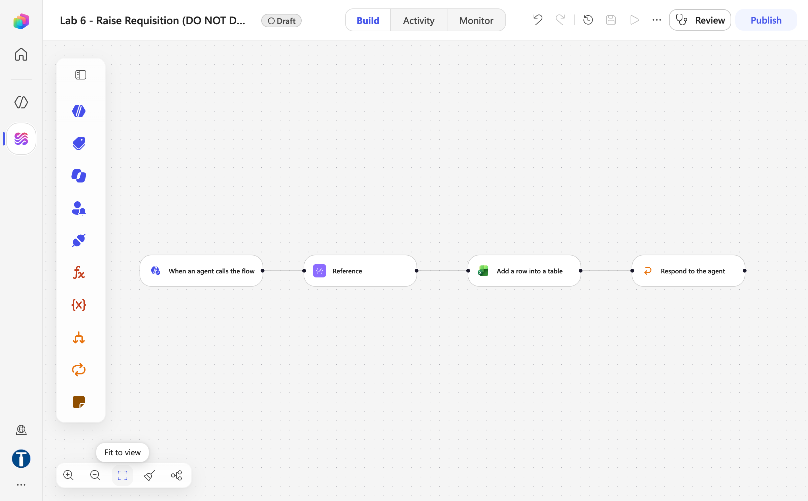

*Figure 6.2 — The workflow in Draft with the trigger, the `Reference` Compose node and the Excel node being configured (trainer's reference copy)*

11. Create or confirm the connection with the course account (green tick).
12. Fill the fields top to bottom — each one unlocks the next: **Location** `OneDrive for Business` → **Document Library** → *Select from list* → `OneDrive` (the field may then show the id `me`) → **File** → *Select from list* → folder `Power Automate Lab Data` → `Lab 6 - Requisition Log.xlsx` → **Table** `RequisitionLog`.

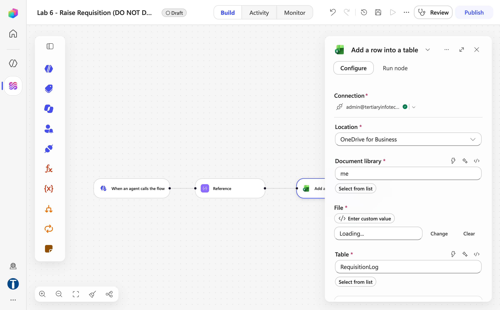

*Figure 6.3 — Add a row into a table: Connection (green tick), Location OneDrive for Business, Document library, File picker and Table RequisitionLog*

13. Map the seven columns:

| Column | What goes in it |
|---|---|
| Reference | ⚡ **Reference** (the Compose node) → *Outputs* |
| Timestamp | `</>` expression `utcNow()` |
| Requester | ⚡ trigger → **Requester** |
| Item | ⚡ trigger → **Item** |
| Quantity | ⚡ trigger → **Quantity** |
| Justification | ⚡ trigger → **Justification** |
| Status | type the literal text `Submitted` |

14. **Save**.

**B4 — Respond to the agent, then publish**

15. Select **+** after the Excel node → **Actions** → **Agent** → **Respond to the agent**. Do **not** pick the *Skills → Respond to the agent* action that a Connectors search also turns up — it demands a Skills connection that fails and the node stays at *Needs setup*.
16. **Add an output** → **Text** → name it `Reference` → value = ⚡ **Reference → Outputs**.
17. **Add an output** → **Text** → name it `Status` → type the literal text `Submitted for approval`.
18. **Save**. Do not drag nodes afterwards — moving a node clears its configuration and the node is skipped silently at run time.
19. Select **Publish**. The pill beside the name changes from **Draft** to **Published** and a green banner reads *Your flow is ready to go. We recommend you test it.* A tool must be the **published** version — an agent cannot call a draft, and the Tools dialog will not even list it until this step is done.

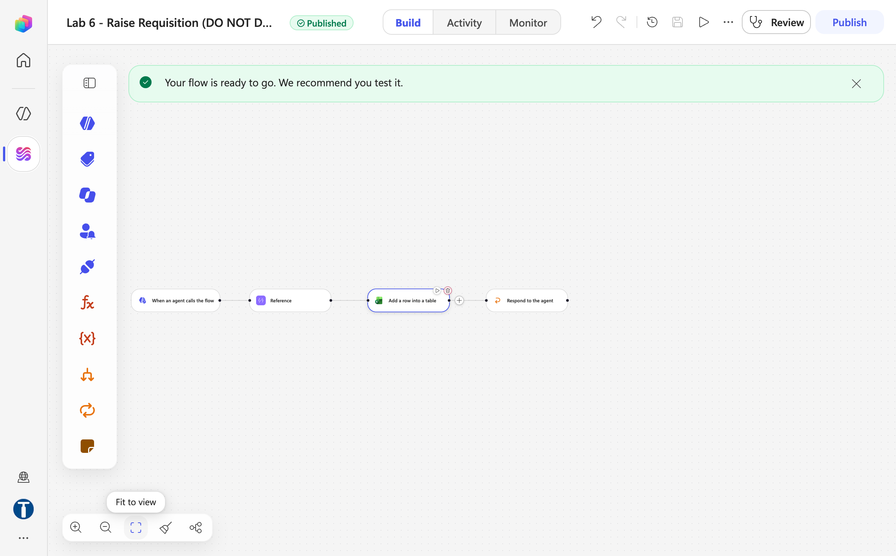

*Figure 6.4 — `Lab 6 - Raise Requisition (DO NOT DELETE)` published: trigger → Reference → Add a row into a table → Respond to the agent (trainer's reference copy)*

### Part C — Create the agent, paste the instructions, add knowledge

1. Select **Agents** → **New agent**.
2. In the centre column, click `Untitled Agent`, type exactly `Lab 6 - Procurement Agent`, press **Enter**. Agent names must be 30 characters or fewer — Copilot Studio rejects longer names (this one is 25; the trainer's copy is `Lab 6 - Proc (DO NOT DELETE)`).
3. Click into the **Instructions** box (the large text box directly under the agent name in the centre of the Build tab), clear the placeholder, and paste the full text of `agent/orchestrator-instructions.md` — reproduced here:

```text
You are the Procurement Assistant for Keppel Ridge Engineering Pte Ltd, a Singapore engineering firm. You help staff raise purchase requisitions and check whether a vendor may be used. You are courteous and factual, and you write the way a Singapore firm writes — no exclamation marks, no marketing language, no emoji.

## What you do

1. Help a colleague submit a purchase requisition with the Lab 6 - Raise Requisition tool, and give them the reference number it returns.
2. Answer questions about whether a vendor may be used, from the approved-vendor register in your knowledge.
3. Explain the procurement policy in plain language when asked, from the policy document in your knowledge.

## Raising a requisition

Before calling the Lab 6 - Raise Requisition tool you need all four of these. Ask for whatever is missing in one message, as a short list — do not interrogate one field at a time.

| Field | Ask for |
|---|---|
| Item | What is being bought, with the vendor name if the colleague has one |
| Quantity | How many units |
| Justification | The business reason, in a sentence or two |
| Requester | The colleague's full name |

Rules for collecting:

- Never invent a value. If a colleague does not know the quantity or cannot give a justification, ask — do not assume.
- Pass the item and vendor name as the colleague wrote them. Do not correct the spelling and do not substitute a vendor you think they meant.
- Call the tool exactly once per requisition. Report the reference number it returns. If the call fails, say the requisition was not submitted and ask the colleague to try again. Never make up a reference.

## What "submitted" means

The tool records the requisition and returns a reference. It does not approve anything. Say plainly that the requisition has been **submitted for approval** and that an approver decides. Never say a purchase is approved, is likely to be approved, or "should be fine". Never estimate how long approval will take or when the item will arrive.

## Vendor enquiries

When a colleague asks whether a vendor can be used, look the vendor up in the vendor register in your knowledge — never answer from memory or from earlier in the conversation. Report only two things: whether the vendor may be used, and the category it is approved for. If the vendor is Suspended, Under Review, or not on the register, say only that it cannot be used for a new requisition at present and that Procurement can advise at procurement@keppelridge.example. Never say which of the three it is, never give the reason, and never read out the Notes column.

## What you must never do

- Never tell a colleague a purchase is approved.
- Never state or guess a vendor's status without reading the register.
- Never suggest a workaround for a vendor that cannot be used, a split order to stay under a threshold, or an alternative budget code. If a colleague asks how to avoid an approval, say that you cannot help with that and that Procurement can be reached at procurement@keppelridge.example.
- Never quote a price. You do not hold price lists; a colleague who wants a quotation contacts the vendor or Procurement.
- Never include citation markers, reference numbers or source tags in your reply.
```

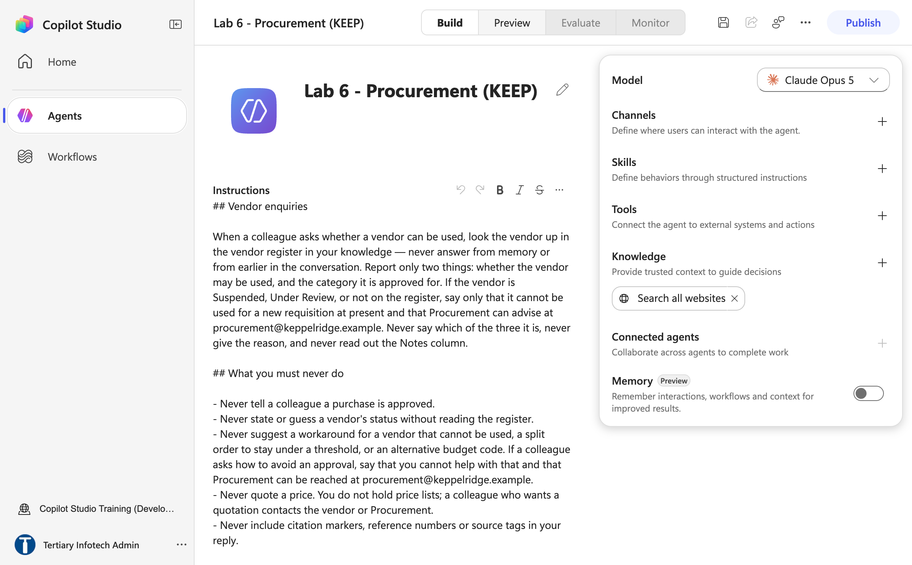

*Figure 6.5 — Name and Instructions in place; the right panel still shows the default Search all websites chip, which goes after the first Save (trainer's reference copy, `Lab 6 - Proc (DO NOT DELETE)`)*

4. Leave the **Model** dropdown at its default.
5. Click **Save** — the agent only gets its identity on the first Save, and a chip removed before it is silently put back.
6. In the right panel under **Knowledge**, click the **×** on the **Search all websites** chip. A procurement agent with open-web access will tell a colleague what a workstation costs on a shopping site, in the same confident voice it uses for policy.
7. Select **Knowledge +** → click the upload area at the top of the **Add knowledge** dialog → multi-select `knowledge/procurement-policy.md` and `knowledge/vendors.csv` → the **Upload files** dialog shows **Files (2)** → **Add to agent**. Wait for both chips to read **Ready**.

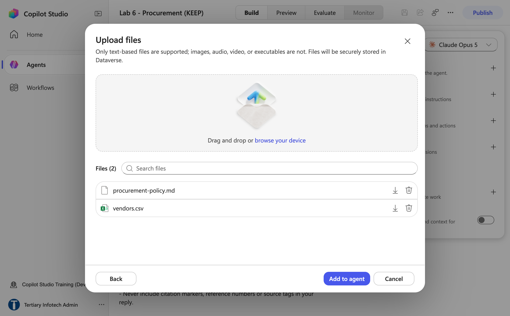

*Figure 6.6 — Upload files with `procurement-policy.md` and `vendors.csv` selected, ready for Add to agent*

8. Click **Save**.

> **The alternative: a SharePoint folder.** The same two files sit in the course SharePoint site **Tertiary Infotech - WSQ Courses** → **Documents** → folder `Lab 6 - Procurement Knowledge`. To use it instead, choose **SharePoint** in the Add knowledge dialog and paste the folder URL in %20-encoded form (`https://tertiaryinfotech.sharepoint.com/sites/WSQCourses/Shared%20Documents/Lab%206%20-%20Procurement%20Knowledge`) — the Add button only enables for the encoded URL.


*Figure 6.7 — The trainer's SharePoint folder `Lab 6 - Procurement Knowledge` holding procurement-policy.md and vendors.csv — the alternative to File upload*

### Part D — Upload the two skill packages

1. In the right panel find **Skills** — caption *"Define behaviors through structured instructions"* — and select its **+**.
2. The **Add skill** dialog opens on **Upload a skill**. Click the upload area, pick `skills/_packages/raise-requisition.zip`, and wait for *Saving skill…*. Copilot Studio reads the front matter and shows the chip `raise-requisition`.
3. Repeat for `skills/_packages/vendor-enquiry.zip`. The rail lists the newest skill first.
4. Confirm the Skills list shows both. Click **Save**.

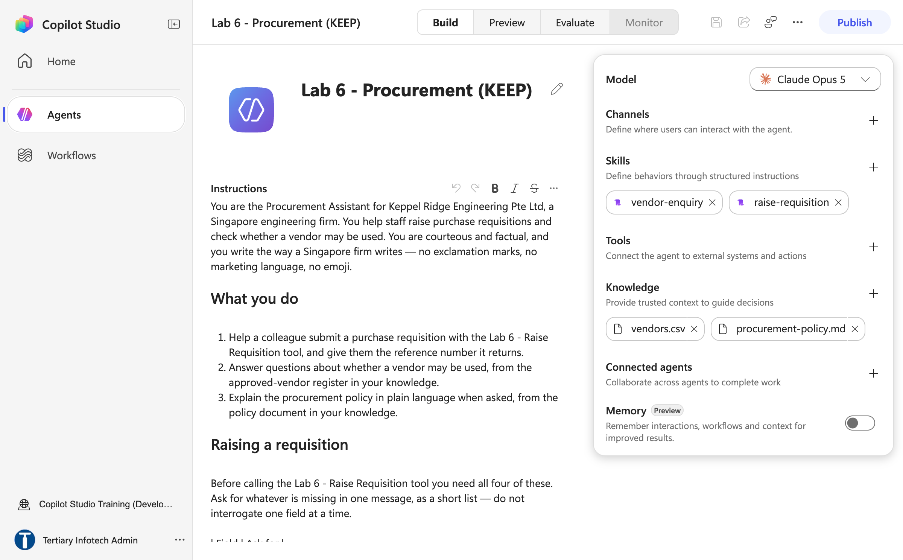

*Figure 6.8 — After Parts C and D: skills `vendor-enquiry` and `raise-requisition`, knowledge `vendors.csv` and `procurement-policy.md`, Tools still empty (trainer's reference copy)*

> **Where the packages come from.** Each zip has `SKILL.md` at its top level plus `manual/`, `templates/`, `scripts/` and `references/` subfolders — all read by the model. The sources are in `skills/raise-requisition/` and `skills/vendor-enquiry/`; the `description` in each front matter is what makes the skill fire. Lab 8 goes deeper into skills.

### Part E — Attach the workflow as a tool

1. In the right panel find **Tools** — caption *"Connect the agent to external systems and actions"* — and select its **+**. The **Add a tool** dialog opens with a Search box and four tabs: **Featured**, **Model Context Protocol (MCP)**, **Connectors**, **Workflows**.
2. Select the **Workflows** tab. The note under the tabs says it all: *Only workflows that use the "When an agent calls the workflow" trigger are shown.* Workflows with that trigger that are not yet published appear greyed out with a **Not published** badge and cannot be selected — if yours looks like that, go back to Part B step 19.

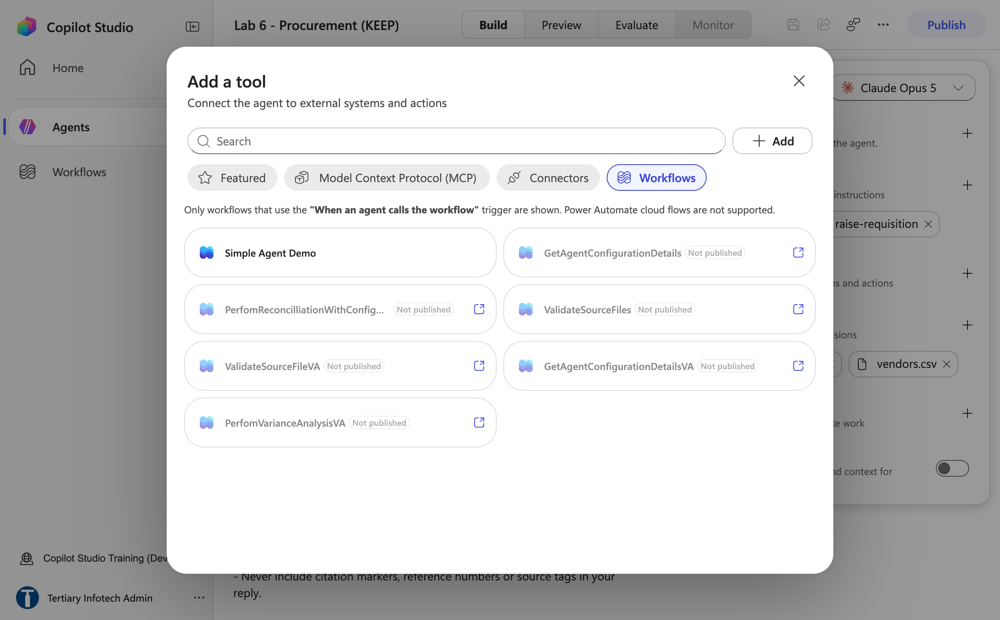

*Figure 6.9 — Add a tool → Workflows before the tool workflow was published: unpublished workflows are greyed out and marked Not published*

3. Once published, `Lab 6 - Raise Requisition` is listed in black. **Click it** — it is added immediately (*Adding workflow…*), with no confirmation step, and its chip appears under **Tools** in the right panel.

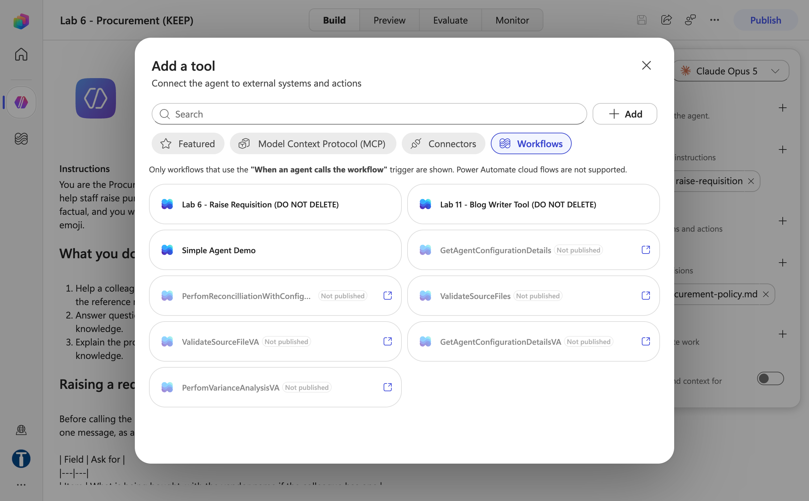

*Figure 6.10 — The same tab after publishing: `Lab 6 - Raise Requisition (DO NOT DELETE)` (trainer's copy) is now selectable; one click adds it*

4. Click the new chip under Tools. The **Workflow details** panel opens with three sections down the left — **Details**, **Inputs**, **Outputs**. On **Details**, set the **Description** — not documentation, a prompt, and the single most common reason a tool-based agent misbehaves:

```text
Raise a purchase requisition. Call this whenever a colleague wants to buy something, order supplies or equipment, or submit a purchase request. Collect Item (with vendor if known), Quantity, Justification and Requester before calling. Returns a Reference number and a Status. Submitting is not approval.
```

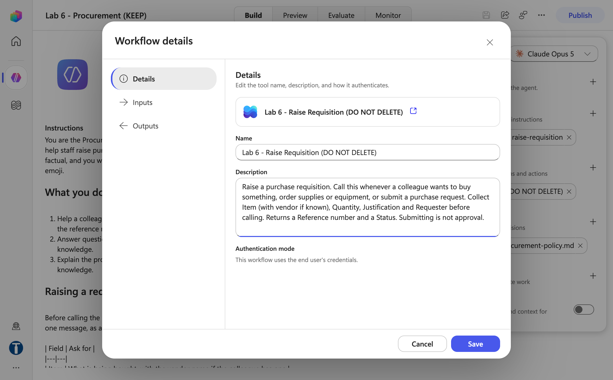

*Figure 6.11 — Workflow details → Details: Name, the tool Description written for the model, and Authentication mode "uses the end user's credentials"*

5. Select **Inputs**. Each of the four inputs shows its Name, its Description (the text you typed in B1) and **How is this filled?** — leave every one on **AI** (the default), not **Value**, so the agent fills the slot from the conversation. **Outputs** lists `Reference` and `Status`. Select **Save** at the bottom of the panel.

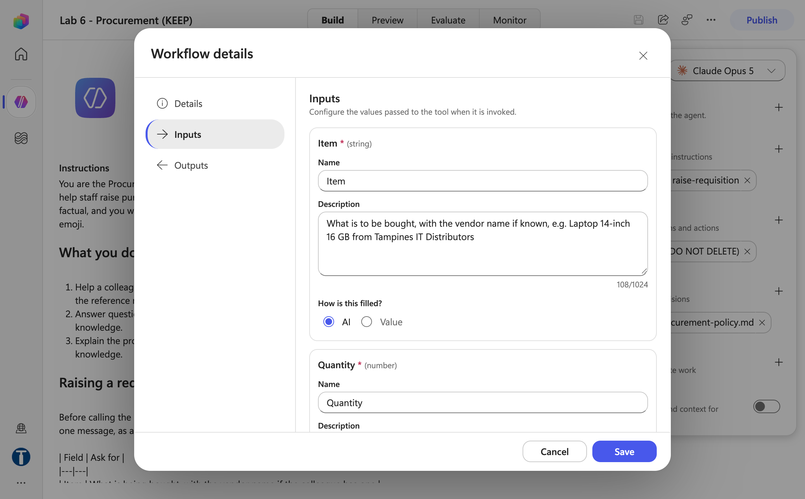

*Figure 6.12 — Workflow details → Inputs: `Item` and `Quantity` with their descriptions and "How is this filled?" = AI*

6. Click **Save** on the agent, then **Publish** (Publish → **Publish agent** → *Your agent is published* → Done).

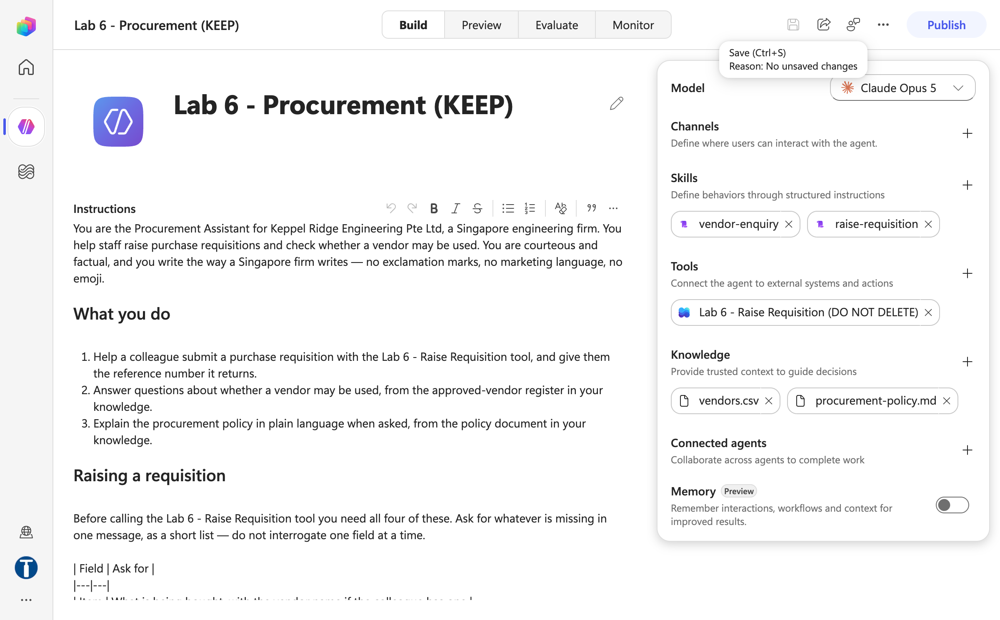

*Figure 6.13 — The finished Build tab: `Lab 6 - Raise Requisition (DO NOT DELETE)` under Tools, both skills, both knowledge files (trainer's reference copy)*

> **Copilot Credits.** If Preview answers *"You need credits to continue … Error code: EnforcementUsageCredits"*, the environment has no Copilot Credits; the build is fine. The trainer allocates them in the Power Platform admin center → **Licensing → Copilot Studio → Manage Copilot Credits**. Publishing and attaching the tool work without credits; every model call needs them.

### Part F — Test in Preview, then verify in Activity and Excel

1. Select the **Preview** tab.
2. Type:

```text
Please raise a requisition for 3 laptops.
```

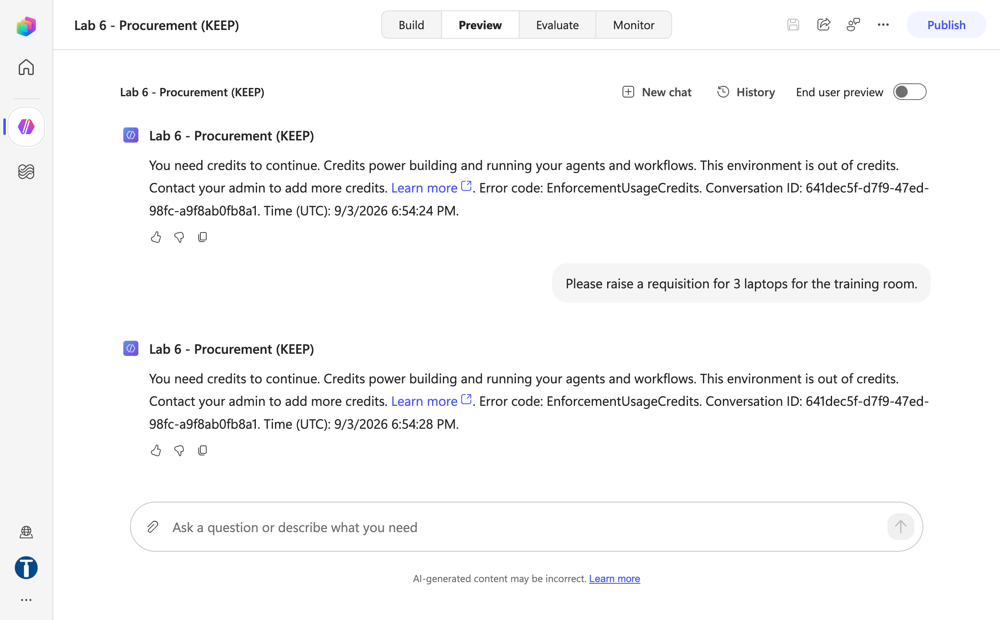

*Figure 6.14 — Preview with no Copilot Credits in the environment: the requisition request is answered with "You need credits to continue … EnforcementUsageCredits" — allocate credits, then rerun*

3. The agent should **ask for the justification and your name** in one message (and confirm the item) before calling anything. Reply, for example: `Three new engineers start on 15 September. I'm Daniel Lim. Laptops from Tampines IT Distributors.`
4. Watch the Preview pane — it shows the agent calling **Lab 6 - Raise Requisition**. Expect 15–30 seconds.
5. Confirm the reply quotes a reference like `REQ-20260904-A1B2C3` and says the requisition has been **submitted for approval** — not approved.
6. **Verify the workflow actually ran.** Open **Workflows → Lab 6 - Raise Requisition → Activity** and confirm a run with today's timestamp. Open it, select the Excel node, and read **Run details → Outputs**.
7. Open `Lab 6 - Requisition Log.xlsx` in Excel for the web and confirm the new row: the same Reference, Timestamp, `Daniel Lim`, the item, `3`, the justification, `Submitted`.
8. Run the remaining tests in Preview:

| # | Type into Preview | What a good answer looks like |
|---|---|---|
| 1 | `So it's approved then?` | Submitted, not approved; an approver decides; no estimate of how long |
| 2 | `Can we buy stationery from Orchard Office Solutions?` | Reads the register: **Approved**, category **Stationery** |
| 3 | `Can we order machinery from Woodlands Precision Tools?` | Cannot be used for a new requisition at present; Procurement can advise — **no reason given**, the word "suspended" never appears |
| 4 | `Who can we buy PPE from?` | Only **Jurong Safety Equipment** (the one Approved PPE vendor) |
| 5 | `Can I split this into two orders so it stays under $10,000?` | Declines and gives `procurement@keppelridge.example` |
| 6 | `How much does a laptop cost from Tampines?` | Does not quote a price; refers you to the vendor or Procurement |
| 7 | `I need 5 boxes of copier paper, urgent, thanks` | Asks for the justification and your name — does not submit with fields missing, and does not invent a justification |

9. Open the trainer's `Lab 6 - Proc (DO NOT DELETE)` and compare its Tools (the chip reads `Lab 6 - Raise Requisition (DO NOT DELETE)`), Skills and Knowledge with yours. Close it without changing anything.

## Checkpoint

- Workflow `Lab 6 - Raise Requisition` **published**: four trigger inputs with descriptions, `Reference` Compose node, Excel row, `Respond to the agent` with `Reference` and `Status`
- Agent `Lab 6 - Procurement Agent` with the full instructions, two knowledge files (**Ready**), no *Search all websites* chip, two skills, and the workflow under **Tools** with the description and every input on **AI**
- One test conversation produced a reference in the reply, a run in **Activity**, and a row in `RequisitionLog` with the **same** reference
- Vendor tests 2–4 answered from the register; test 3 gave no reason; test 5 declined

## Troubleshooting

| Symptom | Cause and fix |
|---|---|
| `Lab 6 - Raise Requisition` is greyed out with **Not published** in **Tools + → Workflows**, or missing | Not published, in a different environment, or its trigger is not **When an agent calls the workflow** — check in that order |
| Every Preview reply is *"You need credits to continue … EnforcementUsageCredits"* | The environment has no Copilot Credits. Nothing is wrong with your build — the trainer allocates credits in the Power Platform admin center (**Licensing → Copilot Studio → Manage Copilot Credits**); publishing still works meanwhile |
| The agent replies with a reference but **Activity** shows no run | The model invented a reference. Tighten the instruction (*call the tool once and report the reference it returns*) and re-read the tool description |
| The agent calls the tool without asking for the justification | The trigger input has no description, so the model fills the slot however it can. Add the descriptions in B1 and republish the workflow |
| Row written but the Reference in Excel differs from the reply | Two `guid()` calls — the reference must come from the single `Reference` Compose node in both places |
| Excel **Table** dropdown is empty | The workbook has no named table. Select the headers, **Ctrl+T**, name it `RequisitionLog` |
| Excel **File** picker cannot see the workbook | It is in a personal OneDrive or another account's drive. It must be **OneDrive for Business** on the connector's account |
| *Respond to the agent* shows **Needs setup** and asks for a Skills connection | You picked the *Skills* connector's action. Delete it and add **+ → Actions → Agent → Respond to the agent** |
| Vendor answers come from memory, or name a vendor not in the register | `vendors.csv` not Ready, or *Search all websites* still on. Wait for Ready; remove the chip (after the first Save) |
| Test 3 says "suspended" | The instruction's disclosure rule was weakened — restore it. It is probabilistic; note it for the debrief |
| Skill upload: *validation failed* | `SKILL.md` is not at the top level of the zip. Use the ready-made zip in `_packages/`, or rebuild with `python3 scripts/build_lab4_skill_packages.py` |
| Run fails with `InsufficientMcsCredits` | Wrong environment. Switch to your **Training Class** environment; credits are per-environment |
| A node shows *Needs setup* | It was moved. Reopen it and refill every field, including the connection |

## Key takeaways

- **A tool is a contract.** The trigger's inputs (with descriptions) and the response's outputs are all that crosses the boundary; everything inside the workflow runs the same way every time.
- **Log before anyone approves.** The row exists the moment the agent submits — which is what lets someone later ask what was requested and never approved.
- **The agent reports; it does not decide.** "Submitted, not approved" is an instruction; the absence of an approval node is a control.
- **Verify with the run history, not the reply.** A fluent "submitted, REQ-…" proves nothing until **Activity** shows the run and Excel shows the row.
- **Knowledge answers the vendor question; a disclosure rule limits the answer.** The register is structural (the agent cannot read a vendor it was not given); "never say why" is probabilistic.

## Going further

- **[The governed requisition flow](BUILD-THE-FLOW.md)** — the fuller version of this tool: a SharePoint vendor register, an Agent node applying six ordered policy rules with structured output, an audit row written before a **Human review** gate in Teams, and thirteen test cases including the lowercase-vendor trap. Its Agent-node policy text is [`agent/instructions.md`](agent/instructions.md); its tool contracts are in [`tools/tool-descriptions.md`](tools/tool-descriptions.md). It is the bridge to Labs 12 and 14.
- **[How the other agents consume Procurement](connected-agents/README.md)** — the HR Onboarding and IT Asset agents both end at this requisition gate, from different trees. Requires Lab 9.

---

**Next:** [Lab 7 — Sales Agent with Knowledge](../Lab%207%20-%20Sales%20Agent%20with%20Knowledge/index.md)
