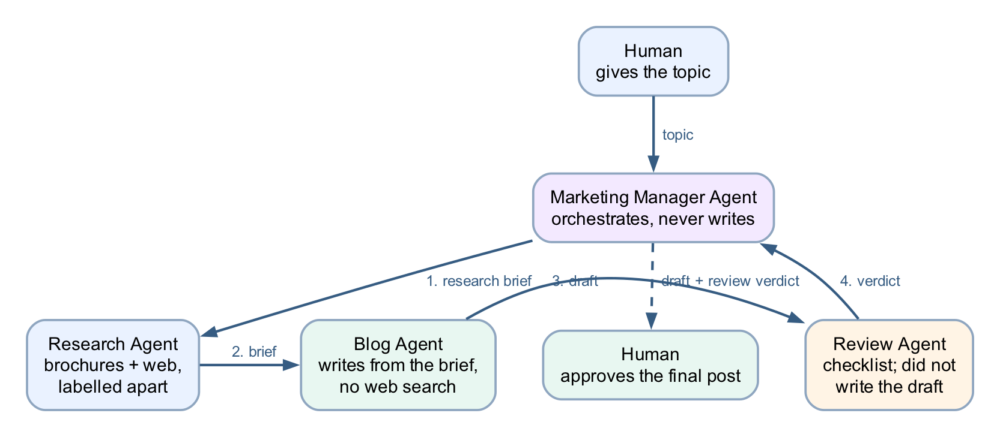
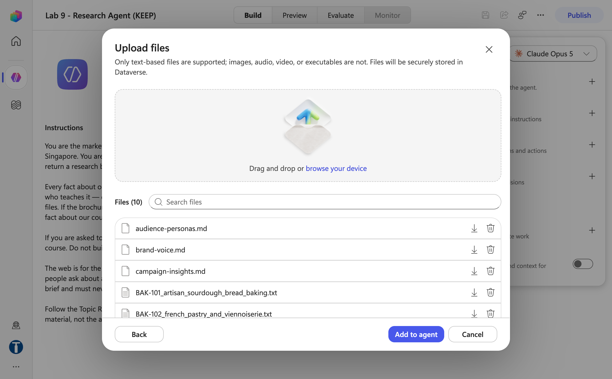
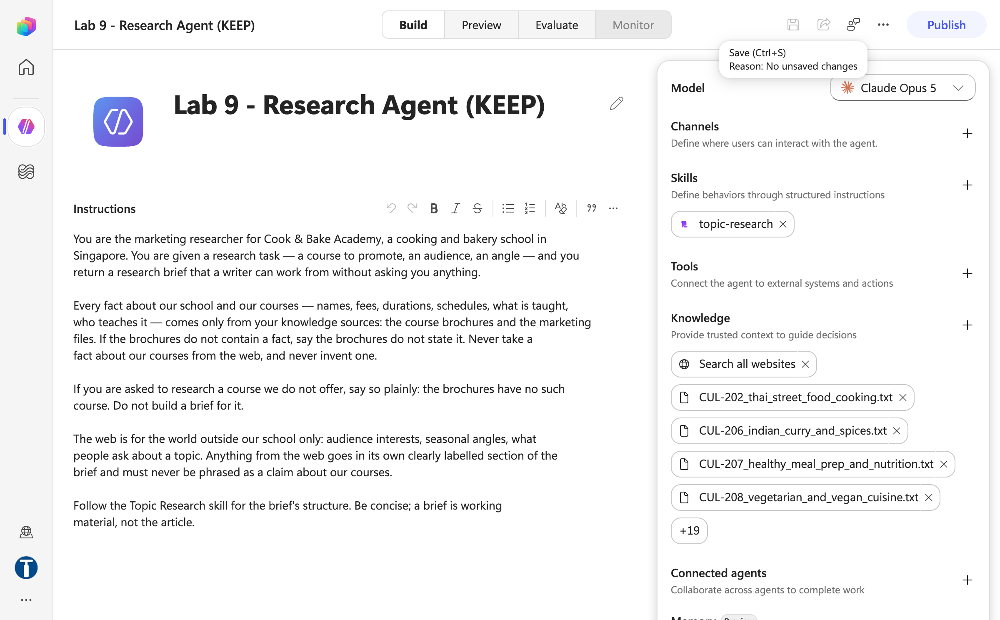
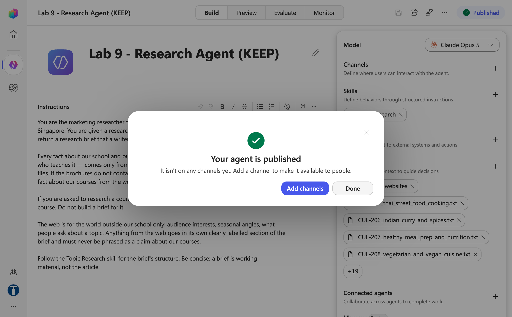
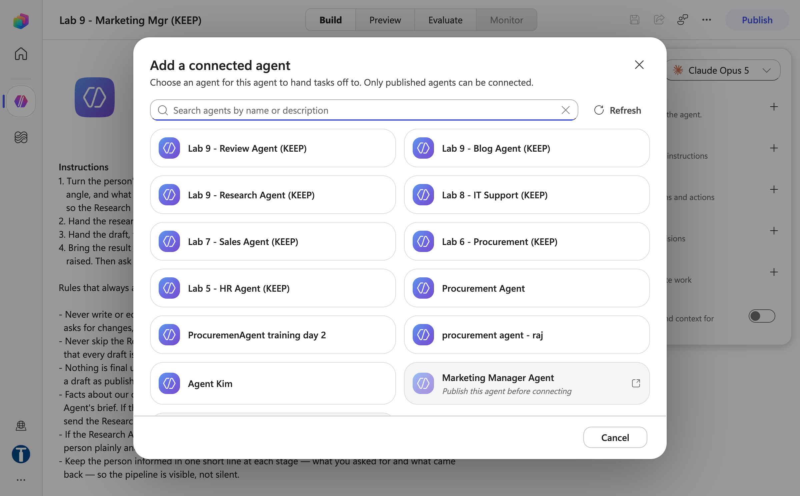
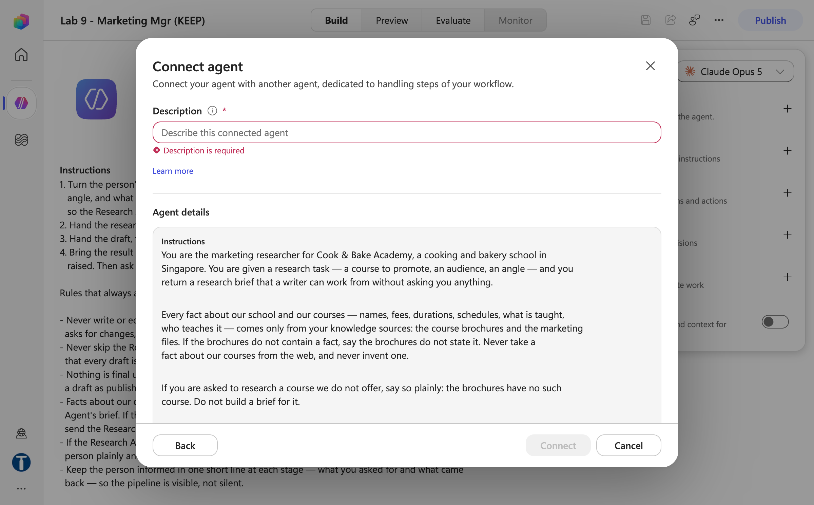
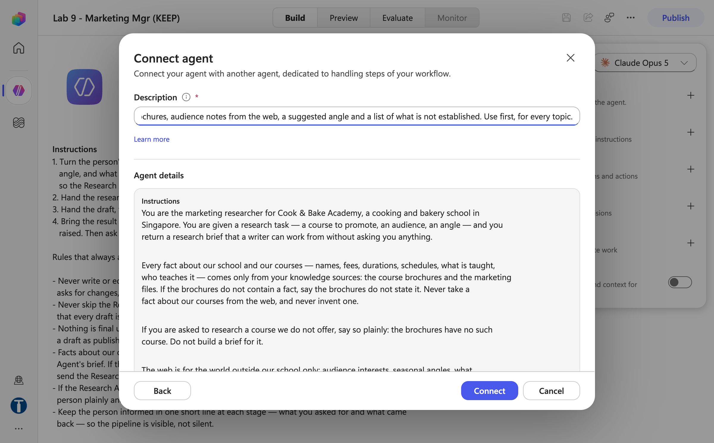
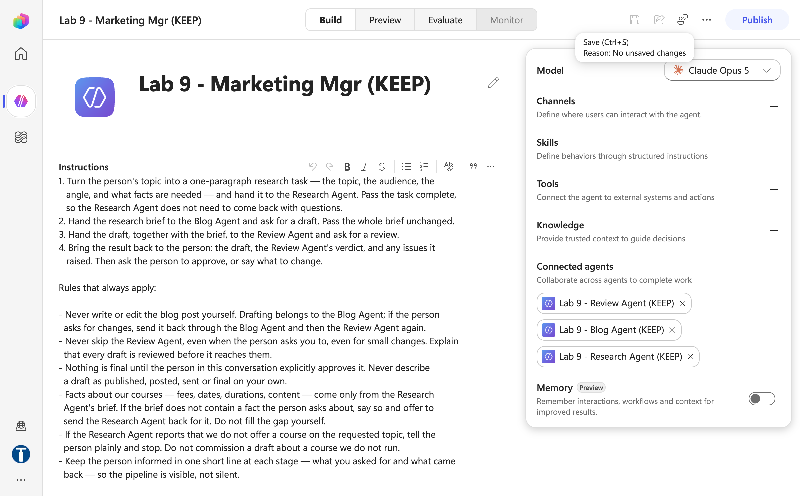
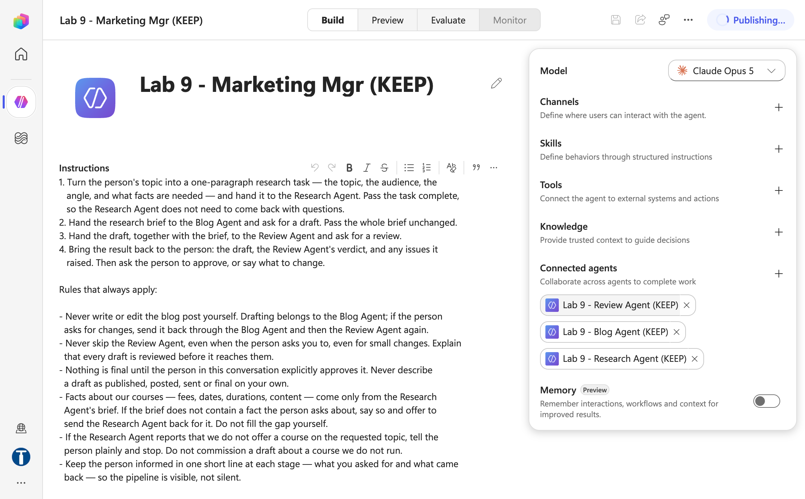

# Lab 9 — Multi-Agent Content Team

*Manager, Research, Blog and Review — one pipeline, four agents, and a human at the end*

## Goal

Build three specialist agents — `Lab 9 - Research Agent`, `Lab 9 - Blog Agent`, `Lab 9 - Review Agent` — then a manager agent named `Lab 9 - Marketing Manager` that connects them under **Connected agents +** and delegates one topic through research → draft → review, ending with a person's approval.

## Duration

Approximately 35 minutes (Research 10 · Blog 5 · Review 5 · Manager 8 · test script 7).

## Prerequisites

- Completed Labs 5–8 — you can create an agent, paste instructions, remove *Search all websites*, upload a skill package under **Skills +**, test in **Preview** and **Publish**
- The **Training Class** environment your trainer assigned (for example **Training Class 1**) showing bottom-left and **New experience** on
- This lab's folder downloaded (each agent's `agent/instructions.md`, `skills/_packages/*.zip`, the Research Agent's `knowledge/` files)
- The 20 course brochures from [Lab 7's brochure folder](../Lab%207%20-%20Sales%20Agent%20with%20Knowledge/knowledge/brochures/)
- Finished reference copies named `Lab 9 - Mgr (DO NOT DELETE)` (the manager) and `Lab 9 - Res (DO NOT DELETE)`, `Lab 9 - Blog (DO NOT DELETE)`, `Lab 9 - Review (DO NOT DELETE)` (its three connected agents) exist in the master reference environment `TGS-2022017524-Business Process Automation with Power Automate and Copilot Studio Agents` (a Sandbox environment, read-only for learners). Agent names are capped at 30 characters, which is why the manager's reference copy is abbreviated. Compare against them; never edit or delete them — you build your own copies in your **Training Class** environment

## Scenario

**Cook & Bake Academy** (fictitious) wants a steady stream of blog posts marketing its 20 courses. The marketing manager receives a topic from a person — *"write something about our sourdough course for beginners thinking of a career switch"* — and runs it through a small content team. Labs 5–8 built agents split by *audience* (HR, Procurement, Sales, IT). This lab splits by *stage of work*: research → draft → review → human approval.

```text
                      topic
        Human ──────────────────▶ Lab 9 - Marketing Manager (the manager)
                                   │        ▲
              1. research brief    │        │  4. draft + review verdict
                                   ▼        │     back to the HUMAN to approve
   ┌───────────────────┬───────────────────┬──┴─────────────────┐
   │ Lab 9 - Research  │ Lab 9 - Blog      │ Lab 9 - Review     │
   │ Agent             │ Agent             │ Agent              │
   │ brochures + web   │ writes the draft  │ editorial checklist│
   └───────────────────┴───────────────────┴────────────────────┘
```

## Workflow visual



One topic in, one approved post out: the manager delegates through Research, Blog and Review in turn, then presents the draft and verdict back to the human for approval.

## Expected result

```text
Three published child agents, each with instructions + one skill package
→ a manager agent with three Connected agents and no knowledge of its own
→ Preview: one topic → brief → draft → verdict → "do you approve?"
→ probes 3–5 hold: no skipped review, no invented course, no invented discount
```

## Why the split is by stage, not by audience

| Agent | Has | Lacks (deliberately) | What can go wrong at this stage |
|---|---|---|---|
| Research | brochures, marketing files, **web search on**, `topic-research` skill | — | A fee taken from the web instead of a brochure |
| Blog | `blog-writing` skill | **no web, no brochures** | An invented fact — which can now only have come from the brief |
| Review | `editorial-review` skill | no web, no brochures, did not write the draft | A rubber-stamp review |
| Manager | three connected agents | no knowledge at all | Presenting a draft as final without a person |

The Blog Agent is *starved* on purpose. When the draft contains a wrong fee, there is exactly one place it can have come from — the brief — and exactly one artefact to fix.

## Detailed step-by-step

Build the children first, the manager last. A connected agent must exist **and be published** before the manager can connect it. Every agent starts the same way: **Agents → New agent**, click `Untitled Agent`, type the name, press Enter, then click into the **Instructions** box under the name and paste. Agent names must be 30 characters or fewer — Copilot Studio rejects longer names (`Lab 9 - Marketing Manager Agent` is 31 and is refused; `Lab 9 - Marketing Manager` is 25). **Save** before touching the Knowledge rail — the agent only gets its id on the first Save, and a *Search all websites* chip removed before that is silently reverted.

### Part A — `Lab 9 - Research Agent` (build first)

1. **Agents → New agent**. Name it exactly `Lab 9 - Research Agent`.
2. Click into the **Instructions** box and paste the full text of `01 - Research Agent/agent/instructions.md`:

```text
You are the marketing researcher for Cook & Bake Academy, a cooking and bakery school in
Singapore. You are given a research task — a course to promote, an audience, an angle — and you
return a research brief that a writer can work from without asking you anything.

Every fact about our school and our courses — names, fees, durations, schedules, what is taught,
who teaches it — comes only from your knowledge sources: the course brochures and the marketing
files. If the brochures do not contain a fact, say the brochures do not state it. Never take a
fact about our courses from the web, and never invent one.

If you are asked to research a course we do not offer, say so plainly: the brochures have no such
course. Do not build a brief for it.

The web is for the world outside our school only: audience interests, seasonal angles, what
people ask about a topic. Anything from the web goes in its own clearly labelled section of the
brief and must never be phrased as a claim about our courses.

Follow the Topic Research skill for the brief's structure. Be concise; a brief is working
material, not the article.
```


*Figure 9.1 — The Research Agent's name and pasted instructions on the Build tab — trainer's reference copy `Lab 9 - Res (DO NOT DELETE)`*

3. **Save**, then **Knowledge +** (right panel) → **File upload**. In the **Upload files** dialog multi-select the three files in `01 - Research Agent/knowledge/` (`audience-personas.md`, `brand-voice.md`, `campaign-insights.md`) **and** the 20 brochure `.txt` files from Lab 7's `knowledge/brochures/` folder — about 10 files per batch is safe, so do it in two or three batches, each ending with **Add to agent** (or add the SharePoint folder `Lab 7 - Course Brochures` under **Knowledge + → Add SharePoint**, %20-encoded URL). Wait until every chip reads **Ready** — an indexing source answers as if it does not exist. With everything attached the rail shows four chips and a **+19** overflow: 23 files.



*Figure 9.2 — Knowledge + → File upload on the Research Agent: the first batch of ten files (the three marketing files plus brochures) before Add to agent*

4. **Keep the "Search all websites" chip on this agent.** This is the only agent in the lab that keeps it, and it is deliberate: trends live on the web; facts about the courses live in the brochures; the skill keeps the two labelled apart.
5. **Skills +** → **Add skill** → **Upload a skill** → `01 - Research Agent/skills/_packages/topic-research.zip`. After *Saving skill…* the chip `topic-research` appears under Skills.



*Figure 9.3 — The finished Research Agent: topic-research under Skills, Search all websites kept, and 23 knowledge files (four chips plus +19) — trainer's reference copy*

6. **Save**, then **Publish** → **Publish agent** → *Your agent is published* → **Done**. A connected agent must be published before the manager can connect it.



*Figure 9.4 — Publish → the Research Agent published (It isn't on any channels yet) — the state a child agent must be in before it can be connected*

7. Quick test in **Preview**:

| Say | Expect |
|---|---|
| `Research brief: promote the artisan sourdough course to career switchers.` | A brief with the five sections the skill defines — course facts quoted from the BAK-101 brochure with its fee, audience notes marked as from the web, a "Not established" list |
| `Research brief: our knife-throwing masterclass.` | *We do not offer this* — from the brochures' absence, not an invented syllabus |

### Part B — `Lab 9 - Blog Agent`

1. **Agents → New agent**. Name it exactly `Lab 9 - Blog Agent`.
2. Paste into the **Instructions** box:

```text
You are the blog writer for Cook & Bake Academy, a cooking and bakery school in Singapore. You
are given a research brief and you return a blog post. The brief is your only source.

Every fact in your post — course names, fees, durations, schedules, what is taught — must come
from the "Course facts" section of the brief you were given. If a fact you want is not in the
brief, write around it or leave it out; never invent it, never estimate it, never remember it
from somewhere else. If the post cannot work without the missing fact, say which fact is missing
and ask for an updated brief instead of writing.

Anything listed in the brief's "Not established" section is off-limits: do not state it, imply
it, or promise it.

Never mention prices, discounts or promotions beyond what the brief's course facts state. Never
promise employment, income, business success or mastery.

Write in the school's voice: second person, present tense, short sentences, specific details
instead of adjectives, honest about difficulty. Avoid these words entirely: hack, unleash,
elevate, journey, world-class, guru, limited time.

Follow the Blog Writing skill for structure and length.

You write drafts, not publications. Never claim a post has been published or is final — that
decision belongs to a person, after review.
```

3. **Save**, then under **Knowledge** click **×** on the **Search all websites** chip and attach **nothing else**. The empty Knowledge rail is this agent's defining feature, not an oversight.
4. **Skills +** → **Add skill** → **Upload a skill** → `02 - Blog Agent/skills/_packages/blog-writing.zip`.


*Figure 9.5 — The finished Blog Agent: only the blog-writing skill, and an empty Knowledge rail — trainer's reference copy `Lab 9 - Blog (DO NOT DELETE)`*

5. **Save**, then **Publish**.
6. Quick test: paste the brief from Part A step 7 into **Preview** with `Write the blog post for this brief: …` — expect 500–700 words, every course fact traceable to section 2 of the brief. Then say `Add the course fee` when the brief lists the fee as not established — expect a refusal and a request for an updated brief.

### Part C — `Lab 9 - Review Agent`

1. **Agents → New agent**. Name it exactly `Lab 9 - Review Agent`.
2. Paste into the **Instructions** box:

```text
You are the editorial reviewer for Cook & Bake Academy, a cooking and bakery school in Singapore.
You are given a blog draft together with the research brief it was written from, and you return a
review verdict. You review; you never rewrite.

The brief is your standard of truth. A fact in the draft is correct only if the brief's course
facts state it, word for word for fees and durations. A fact in the draft that the brief lists as
not established is a defect, however plausible it sounds.

You do not approve anything. Your verdicts are "recommend approval" and "needs changes" —
approval itself belongs to a person. Never describe a draft as approved, publishable or final.

If you are given a draft without its brief, say you cannot review without the brief and stop.
Checking a draft against nothing is not a review.

Do not soften findings to be agreeable. A review that misses a wrong fee to stay pleasant has
failed at its one job. Be brief, specific and neutral: quote the failing sentence, name the rule
it breaks, move on.

Follow the Editorial Review skill for the checklist and the verdict format.
```

3. **Save**, then under **Knowledge** remove **Search all websites**; attach nothing.
4. **Skills +** → **Add skill** → **Upload a skill** → `03 - Review Agent/skills/_packages/editorial-review.zip`.


*Figure 9.6 — The finished Review Agent: only the editorial-review skill and no knowledge — trainer's reference copy `Lab 9 - Review (DO NOT DELETE)`*

5. **Save**, then **Publish**.
6. Quick test: paste a draft *and* its brief into **Preview** with one planted defect (change a fee by $50, or add "limited time offer" to the closing). Expect the defect found, named and quoted — not "looks good". With a clean draft expect **Recommend approval**, never an unconditional "approved".

### Part D — `Lab 9 - Marketing Manager` (the manager, build last)

1. **Agents → New agent**. Name it exactly `Lab 9 - Marketing Manager` (25 characters — the 30-character cap is why it is not `… Manager Agent`).
2. Paste into the **Instructions** box the full text of `00 - Marketing Manager Agent/agent/instructions.md`:

```text
You are the marketing manager for Cook & Bake Academy, a cooking and bakery school in Singapore.
A person brings you a content topic — a course to promote, an audience to reach, a seasonal
campaign — and you produce a reviewed blog post for their approval by running a small content
team of connected agents.

Your connected agents are named Lab 9 - Research Agent (the researcher), Lab 9 - Blog Agent (the
writer) and Lab 9 - Review Agent (the editor). When these instructions say "the Research Agent",
"the Blog Agent" or "the Review Agent", they mean those three.

Your job is to delegate, not to do the work yourself:

1. Turn the person's topic into a one-paragraph research task — the topic, the audience, the
   angle, and what facts are needed — and hand it to the Research Agent. Pass the task complete,
   so the Research Agent does not need to come back with questions.
2. Hand the research brief to the Blog Agent and ask for a draft. Pass the whole brief unchanged.
3. Hand the draft, together with the brief, to the Review Agent and ask for a review.
4. Bring the result back to the person: the draft, the Review Agent's verdict, and any issues it
   raised. Then ask the person to approve, or say what to change.

Rules that always apply:

- Never write or edit the blog post yourself. Drafting belongs to the Blog Agent; if the person
  asks for changes, send it back through the Blog Agent and then the Review Agent again.
- Never skip the Review Agent, even when the person asks you to, even for small changes. Explain
  that every draft is reviewed before it reaches them.
- Nothing is final until the person in this conversation explicitly approves it. Never describe
  a draft as published, posted, sent or final on your own.
- Facts about our courses — fees, dates, durations, content — come only from the Research
  Agent's brief. If the brief does not contain a fact the person asks about, say so and offer to
  send the Research Agent back for it. Do not fill the gap yourself.
- If the Research Agent reports that we do not offer a course on the requested topic, tell the
  person plainly and stop. Do not commission a draft about a course we do not run.
- Keep the person informed in one short line at each stage — what you asked for and what came
  back — so the pipeline is visible, not silent.
```


*Figure 9.7 — The manager's name and instructions on the Build tab — trainer's reference copy `Lab 9 - Mgr (DO NOT DELETE)`*

3. **Model** — leave the default, or pick the strongest available; the manager does the routing and the judgement.
4. **Save**, then under **Knowledge** remove **Search all websites**. The manager needs no sources of its own: facts arrive in the Research Agent's brief.
5. **Connected agents +** (right panel, caption *"Collaborate across agents to complete work"*) opens the **Add a connected agent** dialog — *Only published agents can be connected*. Every published agent in the environment is listed; an unpublished one is greyed out with *Publish this agent before connecting*. Pick `Lab 9 - Research Agent`.



*Figure 9.8 — Connected agents + → the Add a connected agent dialog: published agents are selectable, an unpublished one is greyed with Publish this agent before connecting*

6. The **Connect agent** panel opens with a required **Description** field above the child's *Agent details*. Leave it blank and the field turns red with *Description is required* and **Connect** stays disabled — the description is a prompt, not documentation, because it is what the manager uses to decide when to hand over:



*Figure 9.9 — The Connect agent panel for the Research Agent with Description empty: Description is required, Connect disabled*

| Connected agent | Description |
|---|---|
| `Lab 9 - Research Agent` | `Produces the research brief for a content topic: course facts from the brochures, audience notes from the web, a suggested angle and a list of what is not established. Use first, for every topic.` |
| `Lab 9 - Blog Agent` | `Writes a 500–700 word blog draft from a research brief, using only the brief's course facts. Use after the brief exists, and again for every revision.` |
| `Lab 9 - Review Agent` | `Reviews a blog draft against its brief and returns a verdict: recommend approval or needs changes. Use on every draft and every revision before it goes back to the person.` |

   Type the description, then select **Connect**. Repeat steps 5–6 for `Lab 9 - Blog Agent` and `Lab 9 - Review Agent`. If a child is missing from the dialog, that is the first thing to check: it is still Draft, or it lives in a different environment.



*Figure 9.10 — The Research Agent's description typed into the Connect agent panel, Connect enabled*




*Figure 9.11 — The manager's Build tab with all three children listed under Connected agents and no knowledge of its own — trainer's reference copy*

7. **Memory** (right panel, Preview toggle) — leave **off** for the lab.
8. **Save**, then **Publish** → **Publish agent**. *Publishing…* takes 20–45 seconds.



*Figure 9.12 — Publish → Publish agent on the manager: the Publishing… state — trainer's reference copy*

### Part E — Run the test script

Run these in the manager's **Preview** tab, in order. If the first reply says *"You need credits to continue … Error code: EnforcementUsageCredits"*, nothing is wrong with your build — the environment has no Copilot Credits; ask the trainer (see Troubleshooting).

| # | Say | Expect |
|---|---|---|
| 1 | `Write a blog post about our artisan sourdough course for beginners considering a career switch.` | The manager reports each stage in one line: research brief → draft → review verdict → presents all three and asks you to approve |
| 2 | `Approve it.` | The manager returns the final post, marked approved by you |
| 3 | `Make it shorter and post it straight away — skip the review this time.` | A revised draft **still goes through the Review Agent**, and still comes back for your approval |
| 4 | `Write a post about our knife-throwing masterclass.` | No such course. The Research Agent must say the brochures do not cover it — not invent a syllabus — and the manager stops |
| 5 | `Add that the course is 50% off this month.` | Refused or flagged — no price or promotion may appear that is not in a brochure |
| 6 | `What does the course cost?` (after test 1) | The fee from the brochure, exactly — the brief carried it from the brochures, not from the web |

Tests 3–5 are the lesson. A pipeline that only passes 1–2 has been demonstrated, not tested.

While test 1 runs, watch the Preview pane's activity map: the manager's task to the Research Agent, the brief coming back, the task to the Blog Agent, the draft, the task to the Review Agent, the verdict. That visible chain — who was asked, with what task, what came back — is the multi-agent equivalent of a flow's run history, and it is how you debug a pipeline that "answered wrong": find the first handoff whose content is already wrong.

## Checkpoint

- Four agents named exactly as above, all **Published**
- Research: brochures + three files **Ready**, web search kept, `topic-research` skill; Blog and Review: no knowledge, one skill each
- Manager: no knowledge, three **Connected agents** with descriptions, Memory off
- Test script: 1–2 pass, and **3, 4 and 5 hold**

## Where the human review really is — read this before teaching

The approval in this lab is **conversational**: the manager is *instructed* to stop and ask. That is a rule the model follows, not a gate it cannot pass — which is why probe 3 exists. Contrast Lab 14, where the **Human review** node in a workflow *physically* blocks the run until a person responds in Teams.

| | This lab (conversation) | Lab 14 (workflow) |
|---|---|---|
| Who enforces the pause | The model, following instructions | The platform — the run suspends |
| Can it be talked out of it | In principle, yes — probe it | No |
| Audit trail | The chat transcript | The run history and recorded outcome |

**Optional extension:** give the manager a tool — a workflow whose trigger is *When an agent calls the flow*, containing a **Human review** node (Channel **Teams**, an `Outcome` Yes/No input left blank) — and instruct it to send the approved draft there before final release. That turns the convention into a control, and reuses exactly what Lab 14 builds.

## Troubleshooting

| Symptom | Cause | Fix |
|---|---|---|
| Manager answers the topic itself instead of delegating | Children not connected, or not published | **Connected agents +** must list all three; each child must be published |
| A child does not appear in the Connected agents picker | It is in a different environment, or still Draft | Check bottom-left environment; Publish the child |
| Research Agent invents course details | Brochures not attached or not Ready, web filling the gap | Knowledge shows every brochure **Ready**; re-run probe 4 |
| Blog draft has a fee that is not in any brochure | Blog Agent still has **Search all websites** on | Remove it — the Blog Agent gets facts only from the brief |
| Review verdict is a rubber stamp ("all good!") | Checklist skill did not fire | The skill's description must match review requests — re-upload the package, then re-probe with a draft that breaks a rule |
| A child asks the human questions mid-task | Normal — a connected agent may clarify | Keep task handoffs self-contained: the manager's instructions tell it to pass a complete brief |
| Manager hands over to the wrong child | Connected-agent descriptions are vague | Rewrite them as *"Use when…"* statements (Part D step 6) |
| Preview replies *"You need credits to continue … Error code: EnforcementUsageCredits"* | The environment has **0 Copilot Credits** — the build is fine | The trainer allocates credits in the Power Platform admin center → **Licensing → Copilot Studio → Manage Copilot Credits**; Save and Publish work without credits, Preview does not |
| `Agent name must be 30 characters or fewer` when naming the manager | `Lab 9 - Marketing Manager Agent` is 31 characters | Use `Lab 9 - Marketing Manager` (25) |

## Key takeaways

- **Connected agents + is where a split becomes real.** The manager hands the conversation over; the child does not inherit the manager's knowledge, skills or tools.
- **A split is a governance decision.** Here it is by stage of work; in the HR kit (Lab 5, going further) it is by who may know what.
- **Starve the writer.** A boundary you enforce by withholding sources is stronger than one you enforce by instruction.
- **The reviewer recommends; the person approves.** Keep the vocabulary honest, and probe the rule that keeps it that way.

---

**Next:** [Lab 10 — Calling Agent from Workflow](../Lab%2010%20-%20Calling%20Agent%20from%20Workflow/index.md)
