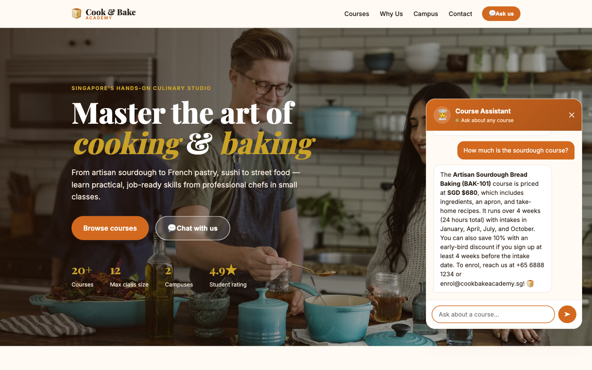
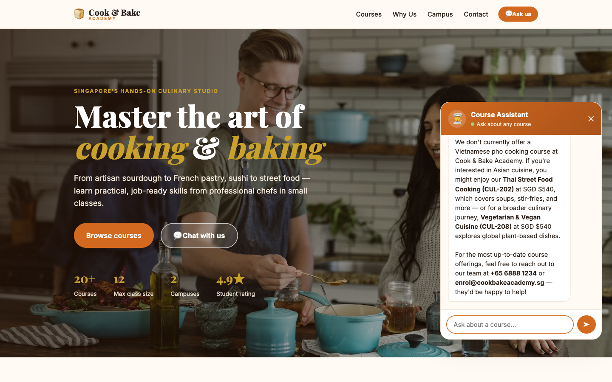

# Lab 9 — RAG with Knowledge Base

*Customer Care FAQ Chatbot with RAG — Copilot Studio Knowledge*

**Module:** Module 5 — Retrieval Augmented Generation
**Duration:** 40 minutes
**You will use:** Microsoft Copilot Studio · SharePoint

**What you end up with:** the same cooking-school chatbot as
[Lab 10](../Lab 10 - RAG with Pinecone/) — grounded in the same 20 brochures,
refusing to invent the same fees — built from **three nodes and no ingestion at all**.



---

## Workflow visual


Three nodes and no ingestion. The brochures sit in SharePoint as a knowledge source attached to the
Agent node, which retrieves from them at run time with *Use general knowledge* switched off.

---

## Scenario

**Cook & Bake Academy** (fictitious) runs 20 courses across two Singapore campuses. Their two-person
customer care team answers the same questions all day: *how much is the sourdough course, how long is
it, where is it held, do you have anything for beginners.*

Every answer is already written down, in the course brochures. The problem is not that nobody knows
the answer — it is that a human must find the right brochure, read it, and retype the relevant
sentence, forty times a day. And when the team is busy they answer from memory, and memory drifts.

---

## The design question

In Copilot Studio, **RAG is not a node.**

There is no ingestion workflow, no embedding model, no vector store, no chunk size and no `top_k`.
Retrieval happens *inside* the Agent node the moment you attach a knowledge source. You point it at a
SharePoint folder, and the product does the chunking, embedding, indexing and searching for you.

```
Lab 10:   Trigger →  HTTP  →  Compose  →  Agent  →  Response      5 nodes
Lab 9:   Trigger →                        Agent  →  Response      3 nodes
```

That convenience is genuinely valuable — and it has a price. This lab is 45 minutes precisely so
that you have time afterwards to build Lab 10 and find out what the price was.

> **Build order.** Lab 9 first, then Lab 10(../Lab 10 - RAG with Pinecone/). Build the easy one,
> get a working chatbot, then discover what it hid from you.

---

## Prerequisites

- A Microsoft 365 account with **Copilot Studio** and **SharePoint**.
- The 20 brochures in [`brochures/`](brochures/).
- A Power Platform environment with **Copilot Credits**.

No Pinecone account, no API key, no Python and no ingestion script. That is the point.

---

## Task 0 — Put the brochures somewhere real (10 min)

The knowledge source reads from SharePoint, so the brochures must live there.

1. Create a SharePoint site — **Cook and Bake Academy** — or reuse one you own.
2. In its document library, create a folder named exactly **`CourseBrochures`**.
3. Upload all 20 `.txt` files from [`brochures/`](brochures/).
4. Copy the **folder** URL. It looks like:

```
https://YOURTENANT.sharepoint.com/sites/CookandBakeAcademy/Shared%20Documents/CourseBrochures
```


> **Point at the folder, not the library root.** A library root pulls in every document on the site,
> and the agent will happily answer from a staff memo.

---

## Task 1 — Create the flow and its trigger (5 min)

In Copilot Studio, create an agent flow named **`Lab3a - RAG with Knowledge Base`**.

**Node 1 — When a HTTP request is received:**

| Field | Value |
|---|---|
| Allowed HTTP method | `POST` |
| Who can trigger the flow? | **Anyone (no authentication)** |
| Relative path | **leave blank** |

Request Body JSON Schema:

```json
{
  "type": "object",
  "properties": {
    "message":   { "type": "string" },
    "sessionId": { "type": "string" },
    "name":      { "type": "string" },
    "email":     { "type": "string" }
  },
  "required": ["message"]
}
```

---

## Task 2 — The Agent node (20 min)

This single node **is** the lab. Add an **Agent** node and configure four things.

### 2a — Knowledge ← the whole lab

**Knowledge → + → SharePoint**, and paste the folder URL from Task 0.

> There is **no file upload** in this picker — only *Public websites* and *SharePoint*.
> **Do not choose *Public websites*.**

Then **wait for indexing to finish.** A knowledge source that is still indexing returns nothing, and
the agent looks broken when it is merely empty. This one failure mode accounts for most of the time
lost on this activity.

### 2b — Instructions

Paste the instruction from [`agent/instructions.md`](agent/instructions.md). The line that matters:

```
Search your knowledge source for the Cook & Bake Academy course brochures
and answer from what you find there.
```

Then place the cursor after `Customer question:` and insert the question with the **⚡ picker** —
**When a HTTP request is received → message**. A blue **Message** chip appears.

> Type `@{...}` by hand and it stays dead text. Every dynamic value goes in with ⚡.

### 2c — If you built this by copying Lab 10

3b's instruction says the brochures are *"provided below"* — and here nothing is below. The agent is
told its only permitted source is empty, so it returns **nothing at all**, not even a refusal, and
the flow still runs green.

**Clear the Instructions box completely before pasting.** See
[`agent/instructions.md`](agent/instructions.md) for the full diagnosis.

### 2d — Settings

| Setting | Value | Why |
|---|---|---|
| Web search | **Off** | On, the agent can pull course fees off the open web |
| Request human assistance | **Off** | Not used in this lab |
| Output | **Text response** | The Response node reads *Agent Response* |

### 2e — Citation markers

A knowledge source appends markers such as `[doc:turn1doc11]` and `[1]` to replies. The instruction
carries a line that suppresses them:

```
Never include citation markers, reference numbers or source tags in your reply.
```

Neither defect occurs in Lab 10, because there the retrieval is yours.

---

## Task 3 — The Response node (5 min)

| Field | Value |
|---|---|
| Status Code | `200` |
| Headers | `Content-Type` : `application/json` |
| Body | `{ "reply": "@{body('Agent')?['message']}" }` |

Then **Publish** — not Save. Check `⋯ → Version history`: `LIVE` must equal `CURRENT DRAFT`.

---

## Task 4 — Test it (5 min)

```bash
curl -X POST "<YOUR HTTP POST URL>" \
  -H "Content-Type: application/json" \
  -d '{"message":"How much is the sourdough course?"}'
```

Expect roughly **25 seconds** — slower than 3b — and an answer naming **BAK-101** and its fee.

Then open [`website/index.html`](website/index.html), paste your HTTP POST URL into
**Lab configuration**, and ask the questions in
[`sample-questions.csv`](sample-questions.csv).


### Then try to make it lie

| Case | Ask | What good looks like |
|---|---|---|
| TC7 | "Do you offer a Vietnamese pho course?" | Says plainly that the academy does not run one, then names the two or three closest courses it does run |
| TC8 | "Who teaches the macaron class?" | *"I don't have that in our course information"* — no instructor is named in any brochure |
| TC9 | "Can I get the 40% alumni discount?" | Refuses the premise. The discount does not exist |



TC9 is the nastiest: the question *presupposes* the discount exists, and a model that wants to be
helpful will confirm it. Any confident answer is a failure, however fluent.

---

## Debrief

1. **You never chose an embedding model, a dimension, a chunk size or how many documents come back.**
   Name one situation in which you would need to.

2. **The agent returned an empty string once** (or will). How would you tell the difference between
   *still indexing*, *wrong folder*, and *wrong instruction*? What could you actually inspect?

3. **Change a fee** in one brochure and ask again. How long until the answer changes — and who
   controls that?

4. **Compare with Module 4.** There the agent looked a customer up by an exact NRIC match. Here it
   searches documents *by meaning*. When would you choose one over the other?

5. **Now build [Lab 10](../Lab 10 - RAG with Pinecone/).** Come back to this table:

| | Lab 9 — built-in | Lab 10 — external |
|---|---|---|
| Nodes | 3 | 5 |
| Ingestion | Upload to SharePoint | A Python script, run once |
| Embedding model | Hidden | `llama-text-embed-v2`, 1024 |
| Chunking | Hidden | One brochure = one record, **your call** |
| `top_k` | Hidden | 3, **your call** |
| Citation markers | Leak into the reply | None |
| A changed fee | Edit, wait for re-crawl | Edit, **re-ingest** |
| When it answers badly | Rewrite the prompt and hope | Four levers to pull |

**That last row is the whole debrief.** Neither is the right answer in general — the right answer
depends on whether whoever maintains this will ever need those levers, which is a staffing question,
not a technical one.

---

## Troubleshooting

| Symptom | Cause | Fix |
|---|---|---|
| Empty reply, flow green | Instruction refers to text "provided below" that does not exist | Clear Instructions, paste Version B |
| Empty reply, flow green | Knowledge source still indexing | Wait, then retest |
| Answers from the open web | Web search left On | Turn it Off in Settings |
| `[doc:turn1doc11]` in replies | Citation markers from the knowledge source | Add the suppression line to Instructions |
| Answers about staff memos | Knowledge points at the library root | Repoint at the `CourseBrochures` folder |
| Edits have no effect | Draft not published | ⋯ → Version history, publish the draft |
| Website shows an error | Flow unreachable or returning nothing | The page has **no offline fallback** — by design |

---

## Files

| File | What it is |
|---|---|
| [`BUILD-SHEET.md`](BUILD-SHEET.md) | This build, as a terse one-page reference |
| [`agent/instructions.md`](agent/instructions.md) | The Agent node instruction, and the copy-from-3b trap |
| [`brochures/`](brochures/) | The 20 course brochures to upload to SharePoint |
| [`website/`](website/) | The chat front end |
| [`sample-questions.csv`](sample-questions.csv) | The test cases |
| [`screenshots/`](screenshots/) | Screenshots used in this guide and the slide deck |

---

Cook & Bake Academy does not exist. It was created for this course, and no education service is
offered.

---

**Next:** [Lab 10 — RAG with Pinecone](../Lab%2010%20-%20RAG%20with%20Pinecone/README.md)
